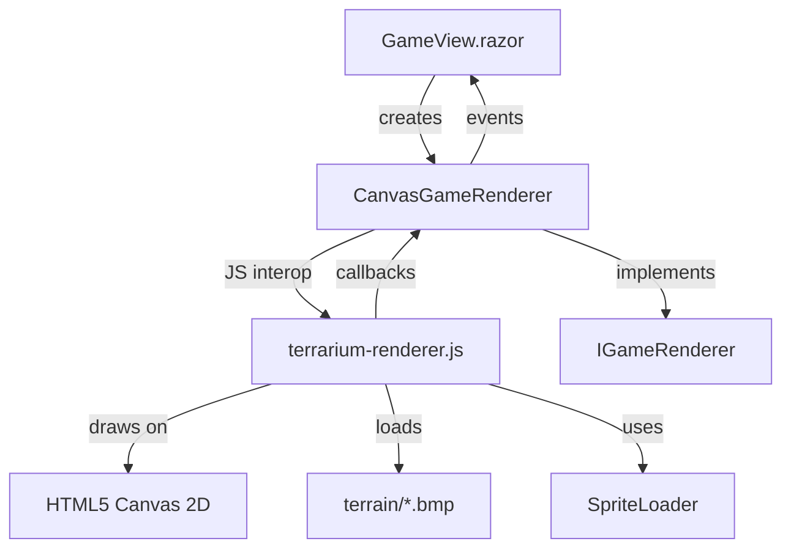

# Decisions

> Team decisions that all agents must respect. Append-only — never edit existing entries.

### 2026-02-10: User directive
**By:** bradygaster (via Copilot)
**What:** This codebase is large — no single agent should try to scan it all at once. Document incrementally, piece by piece, until the whole codebase is documented.
**Why:** User request — captured for team memory

### 2026-02-10: MVC Server Is a Scaffold — All Game Logic Lives in Legacy ASMX
**By:** Gus (Server Dev)
**Status:** Observation (not a change proposal)

**What:** The MVC server (`ServerMVC/TerrariumServer/`) contains only ASP.NET MVC 2 template code — Account management and a placeholder Home controller. Zero game-related endpoints exist. All ecosystem functionality — peer discovery, species registration, population reporting, crash logging, messaging — lives in the legacy `Server/Website/` as ASMX web services backed by direct ADO.NET calls to SQL Server stored procedures.

**Why:**
1. Client devs: clients talk to the legacy ASMX endpoints. Any API contract changes must account for the legacy service signatures (SOAP/DataSet-based).
2. Don't assume the MVC project has any game functionality. It doesn't.
3. Modernization means migrating 7+ ASMX services (with stored procedure dependencies) to MVC controllers or Web API. The `BugService` is a stub (`TODO` in code).
4. Database: Schema is `TerrariumWhidbey` in SQL Server. ~14 tables, ~17 stored procs. All data access is inline ADO.NET — no ORM.

### 2026-02-10: Build Must Be Green Before New Tests
**By:** Hank (Tester/QA)
**Status:** Proposed

**What:**
1. No new tests should be written against the current MSTest/MVC2 test project. The 15 existing tests are stock MVC template tests and test nothing Terrarium-specific.
2. The build infrastructure must be modernized first. Before any test strategy can execute, the team needs to decide: retarget to a buildable framework, or provide the .NET Framework 4.0 Developer Pack.
3. CI/CD must be established. There is zero build automation.
4. When a new test project is created, prefer xUnit over MSTest.

**Why:** Nothing builds, nothing runs, nothing is tested. Any code changes are flying blind until this is resolved.

### 2026-02-10: ClientWPF is empty scaffolding — Client/ is the source of truth (consolidated)
**By:** Heisenberg, Jesse, Mike
**Status:** Observation / Proposed

**What:** The `ClientWPF/` directory contains 13 projects, all of which are empty .NET 4.0 shells containing only `Properties/AssemblyInfo.cs` (and for TerrariumClient, empty `App.xaml`/`MainWindow.xaml`). No business logic has been ported. The WPF rewrite was abandoned before any meaningful code was migrated.

Any modernization work must use `Client/` as the source of truth:
- `Client/Renderer/`, `Client/Glass/`, `Client/Controls/` — full WinForms implementations
- `Client/TerrariumWPF/` and `Client/ControlsWPF/` — partial earlier WPF port with real XAML (closest starting point for WPF migration)
- `Client/Game/`, `Client/OrganismBase/`, `Client/HttpListener/`, `Client/Services/`, `Client/AsmCheck/`, `Client/Configuration/` — all real engine/networking/infrastructure code

Similarly for the server: `Server/Website/` is the functional server; `ServerMVC/TerrariumServer/` is boilerplate.

**Why:**
- Do not invest time fixing or extending `ClientWPF/` projects
- When modernizing, port code from `Client/` to new project structure
- The `Terrraium2010.sln` is useful for server work but misleading for client work
- The WPF stubs will need to either be populated (if migration proceeds) or removed

### 2025-07-15: .NET 10 Modernization Sprint Plan
**By:** Heisenberg
**What:** Created a 14-sprint (~7 month) plan to modernize Terrarium from .NET Framework 3.5 to .NET 10. Key decisions: new SDK-style solution structure, WPF on .NET 10 for UI, Silk.NET OpenGL for rendering (replacing DirectX 7 DirectDraw), ASP.NET Core Minimal APIs for server (replacing ASMX), Dapper with existing stored procedures (not EF Core), gRPC for P2P networking (replacing custom TCP), System.Text.Json replacing BinaryFormatter, process isolation replacing CAS sandboxing, System.Reflection.Metadata replacing native C++ AsmCheck. Plan follows leaf-to-root dependency order with server and client work parallelized. Six decisions flagged for Brady: SQL hosting, deployment target, VB.NET SDK support, legacy code disposition, sprite assets, and cross-platform aspirations.
**Why:** Brady requested a concrete sprint plan to bring Terrarium to .NET 10. The codebase spans three generations (.NET 2.0/3.5/4.0) with deeply legacy dependencies (DirectX 7 COM interop, ASMX SOAP services, BinaryFormatter serialization, Code Access Security, custom TCP networking). An incremental, sprint-by-sprint plan with clear ownership and dependency tracking is essential to manage the risk of a migration this large. Each sprint produces buildable, testable output so progress is always demonstrable.

### 2026-02-11: Blog-everything directive
**By:** bradygaster (via Copilot)
**What:** Every decision, change, and highlight must be blogged. We are writing THE blog post that announces someone finally upgraded .NET Terrarium to use the latest .NET and AI technology. Think Hanselman-ready — hand him the blog and the end-state of Terrarium updated to .NET 10, and he publishes it. This is a 30-year .NET community story. Document everything.
**Why:** User request — this is a historically significant project for the .NET community. People who've been doing .NET for 30 years will care about this. The blog IS a deliverable, not an afterthought. Beth (Technical Writer / Blogger) hired to own this. Blog issues tracked as #93-#100. Blog content lives in `docs/blog/`.

### 2026-02-10: Brady's modernization decisions
**By:** bradygaster (via Copilot)
**What:**
1. SQL hosting: Docker for dev, Azure SQL for prod — approved
2. Deployment target: Azure Container Apps — confirmed
3. C# only going forward
4. Delete legacy code — no need to archive Client/, Server/, ClientWPF/, ServerMVC/ after migration
5. Use ALL original imagery — people who know .NET Terrarium should recognize it immediately
6. Cross-platform — change frontend to a web app instead of WPF desktop. Use .NET Aspire for orchestration. Staff up with new agents as needed. Use GitHub Issues and PRs to track all work items. Use labels for squad members and progress. Keep issues updated with status for GitHub project board tracking.
**Why:** Product owner decisions — these override Heisenberg's recommendations where they differ (especially #4 delete vs archive, #6 web app vs WPF)

### 2026-02-11: Beth's inspiration
**By:** bradygaster (via Copilot)
**What:** Beth is inspired by someone who was the voice of .NET's marketing program for years, then moved into the product team. She's done it all. Beth is the fearless voice of the .NET developer toiling away. Beth is our voice.
**Why:** User request — establishes Beth's identity and tone. She writes from the trenches, not the press box. Advocacy-to-engineering energy. Community-first.

### 2025-07-16: Diagram Standards & Audit Results
**By:** Badger (Diagram Designer)
**Status:** Implemented

**What:** Full audit and upgrade of every diagram across the repository. 3 converted from ASCII/plain to Mermaid, 6 improved with arrow labels and fixes, 3 new diagrams added. Standards established: no ASCII art ever, every arrow labeled, PascalCase node IDs, subgraphs for boundaries, type selection guidelines (graph for dependencies, sequenceDiagram for protocols, stateDiagram for lifecycles, classDiagram for hierarchies, gantt for scheduling). Directory tree listings (├── └──) are acceptable as file structure displays.
**Why:** Brady directive — "never use ASCII art, use Mermaid, fix it, make a rule, never break it." Ensures all diagrams render properly on GitHub and maintain consistent quality.

### 2026-02-11: Never use ASCII art — use Mermaid diagrams instead
**By:** bradygaster (via Copilot)
**What:** All diagrams in docs, blog posts, and markdown files must use Mermaid syntax. ASCII art (box drawing characters, block elements, ASCII Gantt charts) is banned.
**Why:** User request — captured for team memory. Brady was emphatic: "sweet lord the blog has ascii art in it. never use ascii art. use mermaid. fix it, make a rule, never break it."

### 2026-02-11: VB.NET language — respectful framing only
**By:** bradygaster (via Copilot)
**What:** Never refer to VB.NET as "dead weight", "debt", or in any negative/dismissive way. The decision is C# only going forward, but VB.NET is a respected part of .NET's history. Frame it simply: "we're C# now" — not as dropping something bad.
**Why:** User request — captured for team memory. Brady said: "i would never refer to vb.net as dead weight or debt. we just do C# now. it doesn't have to be like that."

### 2025-07-16: Orleans + SignalR for Terrarium Networking Layer
**By:** Heisenberg (Lead / Architect)
**Status:** Recommendation
**Requested by:** bradygaster
**Impact:** Sprint 7, Sprint 11, Sprint 12

**What:** Recommends Orleans + SignalR hybrid architecture. Orleans owns stateful domain logic (EcosystemGrain, PeerGrain, SpeciesRegistryGrain, PopulationGrain); SignalR remains browser push channel only. Tick loop runs via Orleans grain timer on EcosystemGrain. Teleportation mediated by grain-to-grain calls. Per-organism grains rejected — per-ecosystem is the right granularity. SignalR.Orleans provides backplane without Redis. Aspire integration via AddOrleans() is first-class. Sprint 7 gets heavier (grain implementation), Sprint 11 gets lighter (Orleans handles scaling).
**Why:** The legacy codebase already implements actor patterns manually (static Hashtables, lease timeouts, state serialization). Orleans formalizes these patterns. SignalR-only would require hand-rolling ConcurrentDictionary state management, BackgroundService timer multiplexing, manual crash recovery, and a separate Redis backplane. Orleans is a net-neutral or slight reduction in complexity.

### 2025-07-16: Solution uses classic .sln format, not .slnx; CS1591 suppressed
**By:** Heisenberg
**Status:** Decided
**What:**
1. `src/Terrarium.sln` uses classic Visual Studio solution format (Format Version 12.00), not `.slnx`. Classic format has universal tooling support; `.slnx` is too new.
2. CS1591 (missing XML doc comments) suppressed via `<NoWarn>` in `Directory.Build.props` during initial port phase.
3. EngineSettings fully ported with all 50+ original game constants — single source of truth for game balance.
**Why:** `.slnx` tooling is immature. `dotnet sln add` was broken by workload manifest issue, requiring manual `.sln` authoring (simpler in classic format). CS1591 suppression is temporary until APIs stabilize.

### 2025-07-15: CSS token naming convention for Glass theme
**By:** Jesse (Client Dev)
**Status:** Implemented (PR #102)
**What:** All CSS design tokens follow `--glass-{category}-{element}-{modifier}`. Categories: color, gradient, border, shadow, font, spacing, size, radius. Component classes use BEM: `.glass-panel`, `.glass-panel--sunk`, `.glass-titlebar__controls`. Tokens in `glass-theme.css` are the single source of truth for Terrarium's visual identity.
**Why:** Predictable, discoverable naming that maps directly to legacy C# code (e.g., `GlassStyle.ButtonHover.Top` → `--glass-gradient-button-hover-top`). All UI agents must use tokens, not hard-coded values.

### 2026-02-11: Aspire package versions for .NET 10
**By:** Saul (DevOps / Aspire)
**Status:** Implemented
**What:** Aspire AppHost and ServiceDefaults use Aspire.Hosting.AppHost/Aspire.AppHost.Sdk `13.1.0`, Microsoft.Extensions.ServiceDiscovery/Http.Resilience `10.3.0`, OpenTelemetry `1.15.0`. Aspire workload is deprecated in .NET 10 — everything is NuGet-based. All projects should reference ServiceDefaults and call `builder.AddServiceDefaults()` + `app.MapDefaultEndpoints()`.
**Why:** These are the latest stable versions as of 2026-02-11. When Server and Web projects are created, uncomment the ProjectReference and AddProject lines in AppHost.

### 2026-02-11: Terrarium.Web Blazor project structure established
**By:** Skyler (Frontend Web Dev)
**Status:** Implemented (PR #118)

**What:** Created the complete Terrarium.Web Blazor Interactive Server project and component library. The project follows Aspire conventions (AddServiceDefaults, MapDefaultEndpoints), uses SignalR for real-time UI, and all components are built on Jesse's Glass CSS token system. The AppHost now references and serves the Web project with external HTTP endpoints.

**Key architectural decisions:**
1. Blazor Interactive Server mode (not WebAssembly) — enables real-time SignalR push from game engine without WASM download penalty
2. Components use parameter binding (not JS interop) for creature/ecosystem data — ready for SignalR hub integration
3. Canvas element exposed via ElementReference in TerrariumViewport — ready for JS interop rendering pipeline
4. Layout follows original Terrarium chrome structure: titlebar → body (viewport + sidebar) → statusbar

**Why:** The web frontend is the primary user-facing surface for the modernized Terrarium. Interactive Server mode aligns with the Orleans + SignalR architecture (server-side state, push to browser). All components are placeholder-ready for Sprint 4+ when game engine integration begins.

### 2026-02-11: SignalR Hub as Pure Contract Layer
**By:** Mike (Networking / Engine Dev)
**Date:** 2025-07-16
**Status:** Implemented (PR #113)
**Issue:** #16

**What:** `Terrarium.Net` is a contract-only library. It defines interfaces (`ITerrariumHub`, `ITerrariumClient`), message types, and a thin `TerrariumHub` implementation. No business logic.

**Key Technical Decisions:**
1. **FrameworkReference, not NuGet** — `Microsoft.AspNetCore.App` FrameworkReference gives us SignalR for free on net10.0. No version pinning needed.
2. **Single-message teleport** — The legacy 4-step HTTP teleport protocol (version check → assembly check → assembly transfer → state transfer) is collapsed into a single `CreatureTeleport` message. The optional `AssemblyPayload` field carries base64-encoded assembly bytes only when the target peer doesn't have the species assembly. Assembly presence tracking will be handled by `PeerGrain` in Sprint 7.
3. **SignalR groups = ecosystems** — Each ecosystem ID maps to a SignalR group. `JoinEcosystem`/`LeaveEcosystem` manage group membership. This replaces the SOAP-based peer discovery polling loop.
4. **No Terrarium project dependencies** — `Terrarium.Net` depends only on the ASP.NET Core shared framework. Message types use `string` for state payloads (JSON) rather than referencing `Terrarium.OrganismBase` types. This keeps the contract boundary clean and allows the web client to reference it without pulling in game engine dependencies.

**Sprint 7 Integration Points:** Every `// TODO: Sprint 7` comment in `TerrariumHub` marks where Orleans grain calls will be inserted: `JoinEcosystem` → `PeerGrain.RegisterPeer()`, `LeaveEcosystem` → `PeerGrain.RevokeLease()`, `TeleportCreature` → `PeerGrain` for routing, `EcosystemGrain` for validation, `AnnouncePeer` → `PeerGrain` for lease management, `RequestWorldState` → `EcosystemGrain.GetWorldState()`, `OnDisconnectedAsync` → `PeerGrain.RevokeLease()`.

**Why:** The legacy networking stack (`HttpWebListener`, `NetworkEngine`, `PeerManager`) is ~3000 lines of custom TCP socket code, HTTP parsing, and binary serialization. The replacement is ~250 lines of typed interfaces and a thin hub. SignalR handles transport, reconnection, and message serialization. Orleans will handle state, leasing, and routing.

### 2026-02-11: Terrarium.Services is a pure class library — no ServiceDefaults dependency
**By:** Mike (Networking / Engine Dev)
**Status:** Decided
**Issue:** #14
**PR:** #109

**What:** `Terrarium.Services` depends only on `Microsoft.Extensions.Http` and `Microsoft.Extensions.Options`. It does NOT reference `Terrarium.ServiceDefaults`. This keeps it usable by any consumer (Game client, tests, CLI tools) without pulling in ASP.NET Core or OpenTelemetry.

Consumers that want Aspire integration (resilience, service discovery) configure it at the DI level:
```csharp
services.AddTerrariumServices("terrarium-server"); // Aspire service discovery
services.AddTerrariumServices(new Uri("https://api.terrarium.dev")); // explicit URI
```

**Impact:** Gus (Server Dev) — the client-side contracts are defined. Server endpoints should return JSON matching the models in `Terrarium.Services.Models`. Hank (QA) — all services are interface-based, straightforward to mock for testing.

**Why:** Interface-first with minimal dependencies is the right call. The legacy proxies were auto-generated ASMX stubs tightly coupled to SOAP. The new layer is clean, testable, and works with or without Aspire.

### 2026-02-11: Keep ArrayList Scan() for Now
**By:** Mike (Networking / Engine Dev)
**Status:** Proposed
**Date:** 2026-02-10

**What:** The legacy `IAnimalWorldBoundary.Scan()` method returns `System.Collections.ArrayList`. This is a non-generic collection from .NET 1.0 days. I kept `ArrayList` as the return type for `Scan()` because: (1) The Game project (which implements this interface) hasn't been ported yet; (2) Changing it to `List<OrganismState>` now would create a compile-time dependency on the Game project's port; (3) It preserves source-level compatibility with existing creature code that casts from ArrayList.

**Action Required:** When the Game project is ported (whoever picks that up), `IAnimalWorldBoundary.Scan()` should be changed to return `List<OrganismState>` and the `using System.Collections` import can be removed from the interface file.

**Why:** This defers a breaking change until the Game project is ported, maintaining compile-time compatibility now.

### 2026-02-11: Glass CSS expanded with full component library; all 76 original assets cataloged
**By:** Jesse (Client Dev)
**Status:** Implemented (PR #123)
**Issues:** #23, #25

**What:**
1. Glass CSS expanded from base tokens to full component library. New components: sidebar panels with frosted glass (`backdrop-filter: blur()`), text inputs, select dropdowns, toolbar with image buttons, stat grid, minimap, modal dialogs, ticker bar, tabs, icon buttons, themed scrollbars. ~60 new `--glass-*` CSS custom properties added.
2. All 76 original image assets extracted from legacy codebase to `src/Terrarium.Web/wwwroot/assets/` organized by type (sprites, terrain, ui, cursors, icons, screenshots). Full manifest.json catalog created with original paths and purpose descriptions.

**Why:**
1. The web app needs complete Glass-themed components to recreate the original Terrarium look. These CSS classes give any UI developer the building blocks to assemble the game interface without touching raw color values.
2. Brady's #1 directive: "PRESERVE ALL original imagery. When people who know what .NET Terrarium was, they should recognize it immediately." Every image asset in the legacy codebase is now available in the web project.

### 2026-02-11: Organism Isolation Architecture
**By:** Heisenberg (Lead Architect)
**Date:** 2025-07-16
**Status:** Proposed
**Issue:** #43

**What:** Implemented a three-layer isolation architecture using **AssemblyLoadContext** as the primary isolation boundary:

**Layer 1: Static Validation (`CreatureValidator`)** — Before any assembly is loaded, perform metadata-level inspection using `System.Reflection.Metadata` to detect P/Invoke declarations, forbidden type references (file I/O, networking, process spawning, reflection emit), missing required base class (must inherit `Animal` or `Plant`), and missing required attributes (`AuthorInformationAttribute`).

**Layer 2: Load Isolation (`OrganismSandbox`)** — Each creature assembly type gets its own collectible `AssemblyLoadContext`: assemblies are loaded from `byte[]` (no file locks), contexts are collectible (`isCollectible: true`), enabling full unload, shared framework types (OrganismBase, BCL) resolve from the default context, and when a species is removed, its context is unloaded to reclaim memory.

**Layer 3: Execution Safety (`OrganismHost` + `OrganismScheduler`)** — `OrganismHost.ExecuteTurn()` wraps each creature's `InternalMain()` with `CancellationTokenSource` timeout, `Task.Run` + `Task.Wait` for wall-clock enforcement, full exception containment, and CPU time measurement via `Stopwatch`. `OrganismScheduler` provides fair round-robin scheduling with organisms divided into 5 batches and `OrganismQuanta` tracking per-creature CPU usage.

**Alternatives Considered:** Worker Process Isolation (too much serialization overhead for game loop), WebAssembly (not practical for .NET assemblies), Roslyn Scripting (wrong abstraction level).

**Implementation Files:** `src/Terrarium.Game/Hosting/CreatureValidator.cs`, `src/Terrarium.Game/Hosting/OrganismSandbox.cs`, `src/Terrarium.Game/Hosting/OrganismHost.cs`, `src/Terrarium.Game/Hosting/OrganismQuanta.cs`, `src/Terrarium.Game/Hosting/IOrganismScheduler.cs`, `src/Terrarium.Game/Hosting/OrganismScheduler.cs`

**Why:** .NET 10 removes AppDomains entirely. We need a modern replacement that provides assembly isolation, safe execution (timeout enforcement, exception containment, CPU fairness), memory management (ability to unload creature code), and static analysis (pre-load validation).

### 2026-02-11: Hub-and-spoke SignalR architecture — full design
**By:** Heisenberg
**Status:** Proposed
**Date:** 2026-02-11

**What:** Completed Sprint 7 foundation architecture for SignalR-based real-time communication. Key decisions:

1. **Hub contract expanded** — `ITerrariumHub` now has 8 methods (added `Heartbeat`, `RequestPeerList`, `ReportPopulation`). `ITerrariumClient` has 7 callbacks (added `ReceivePeerList`, `ReceivePopulationReport`, `ReceiveError`).

2. **Error handling via callbacks, not exceptions** — Hub methods never throw. All errors delivered via `ReceiveError` with structured `HubError` (code, transient flag, retry-after). Error codes: `UNKNOWN_SPECIES`, `SPECIES_BLACKLISTED`, `TELEPORT_FAILED`, `RATE_LIMITED`, `GRAIN_UNAVAILABLE`, `VERSION_MISMATCH`, `ECOSYSTEM_FULL`, `INVALID_PAYLOAD`.

3. **IEcosystemNotifier abstraction** — Grain-to-hub notifications go through `IEcosystemNotifier` interface in `Terrarium.Net`. Implementation using `IHubContext` lives in `Terrarium.Server`. This keeps `Terrarium.Orleans` decoupled from ASP.NET Core SignalR.

4. **Rate limiting per connection** — Teleport 10/min, population 2/min, world state 5/min, peer list 2/min, heartbeat 3/min.

5. **Heartbeat/lease model** — 30s client heartbeat, 90s server-side lease expiry. EcosystemGrain sweeps expired peers.

6. **Reconnect = rejoin** — SignalR reconnection produces a new connection ID. Clients must re-call `JoinEcosystem` + `AnnouncePeer` + `RequestWorldState` after reconnect.

7. **SignalR message size** — `MaximumReceiveMessageSize` = 512 KB for assembly transfers in `CreatureTeleport`.

**Why:** Sprint 7 is the networking foundation. Mike (TerrariumHub grain wiring) and Skyler (Blazor SignalR client) both depend on these contracts being locked down. The architecture doc at `docs/architecture/signalr-hub-spoke.md` is the single source of truth for the real-time communication layer.

### 2026-02-11: Terrarium.Server.Tests created with integration test suite
**By:** Hank (Tester/QA)
**Status:** Implemented
**Issue:** #13

**What:** Created `src/Terrarium.Server.Tests/` — xUnit integration test project using `WebApplicationFactory<Program>` pattern. 17 tests across 3 test classes: **ServerHealthTests** (server boot, root endpoint, /health, /alive), **MessagingEndpointTests** (GET /api/messaging/welcome, /motd, /version with JSON response validation), **ThrottleTests** (rate limiting: single request success, burst success, 429 enforcement, Retry-After header, body message). 4 tests pass now (bare scaffold), 13 await Gus's server bootstrap. Added `public partial class Program { }` to enable `WebApplicationFactory<Program>` access. Project added to `src/Terrarium.sln`.

**Why:** Tests are written against expected behavior derived from legacy code analysis (Messaging.asmx.cs, Throttle.cs, ServerSettings.cs). When Gus's implementation lands, these tests will validate the server endpoints immediately. Tests should not need major adjustment — the JSON shapes and endpoint paths match what was seen on squad/9-server-bootstrap.

### 2026-02-11: SDK Samples Structure and Conventions
**By:** Hank (Tester/QA)
**Status:** Implemented (PR #122)
**Date:** 2025-07-16

**What:**
1. SDK samples live in `src/Terrarium.Samples/{SampleName}/` — each sample is a standalone `.csproj` referencing `Terrarium.OrganismBase`.
2. Three samples ported: SimpleHerbivore, SimpleCarnivore, SimplePlant. Together they cover all key creature APIs.
3. Sample README at `src/Terrarium.Samples/README.md` documents attributes, APIs, build instructions, and how to create new creatures.
4. Samples follow the modern API conventions: nullable annotations, pattern matching, modern event handler syntax.

**Why:** These are how developers learn to write Terrarium creatures. They must compile, be correct, and demonstrate the full API surface. Each sample is a standalone project so developers can copy one as a starting point without pulling in the full solution. The README serves as the primary developer-facing documentation for creature authoring.

### 2026-02-11: Species & Reporting Endpoint Design
**By:** Gus (Server Dev)
**Date:** 2025-07-16
**PR:** #120
**Issues:** #26, #27

**What:**

**Decision 1: Assembly storage deferred** — The legacy `SpeciesService` stored creature assemblies to disk using `FileIOPermission` (Code Access Security). CAS doesn't exist in .NET 10. Assembly storage needs a separate design decision — likely Azure Blob Storage or a configurable filesystem path without CAS. The `GetSpeciesAssembly` endpoint and `SaveAssembly`/`LoadAssembly`/`RemoveAssembly` methods are not ported. The register endpoint inserts the DB record but does not persist the assembly binary.

**Decision 2: Word filter (PoliCheck) deferred** — The legacy register checked species names, author names, and emails against `invalidwordlist.txt` via `WordFilter.RunQuickWordFilter()`. This is not ported yet — it depends on a static file and the `WordFilter.cs` utility. When ported, it should be a service injected into the endpoint, not a static call.

**Decision 3: Charts consolidated under /api/reporting/stats/** — Rather than creating a separate `/api/charts/` route group, chart data endpoints live under `/api/reporting/stats/`. The legacy `ChartService.asmx` was a thin SOAP wrapper around `ChartBuilder.cs` which just ran stored procedures. The three chart endpoints (`species-list`, `latest`, `top-animals`) are data queries — they belong with reporting.

**Decision 4: ReportPopulation returns Success on server errors** — Matches legacy behavior documented in the original code: "Return success instead of ServerDown because, if the server is getting hammered, Success will tell clients to stop retrying, where ServerDown will tell them to keep doing it."

**Impact:** Mike/Jesse (client devs) — Species API contract is defined. When the client needs to register/list/reintroduce species, these are the endpoints. Hank (tester) — 9 new endpoints to cover. Integration tests will need a SQL Server container with the init script. Saul (DevOps) — No new infrastructure needed — endpoints use the existing `SpeciesDsn` connection string from `ServerSettings`.

**Why:** Defers assembly storage and word filter design to later sprints while establishing endpoint structure now.

### 2026-02-11: Terrarium.Server created — Minimal APIs, IOptions, IMemoryCache throttle
**By:** Gus (Server Dev)
**Status:** Implemented (PR #112)
**Date:** 2025-07-16

**What:**
1. `src/Terrarium.Server/` is now a functional ASP.NET Core Minimal API project targeting net10.0
2. ServerSettings uses `IOptions<ServerSettings>` bound to `"Terrarium"` config section (replaces static `ConfigurationManager.AppSettings` reads)
3. Messaging endpoints: `GET /api/messaging/welcome`, `/motd`, `/version` — return JSON, ported from SOAP `Messaging.asmx`
4. ThrottleMiddleware + ThrottleService replace legacy `Throttle.cs` — uses `IMemoryCache` for TTL expiration and `ConcurrentDictionary` + `Interlocked` for thread safety (replaces `Hashtable` + `lock(typeof(Throttle))` + `HttpContext.Current.Cache`)
5. Dapper + Microsoft.Data.SqlClient referenced but not yet invoked — ready for Sprint 2 discovery/species endpoints
6. Server registered in AppHost as Aspire resource

**Why:** Sprint 1 deliverable. The server is the first functional backend service in the modernized Terrarium stack. All three issues (#9, #10, #11) delivered in one PR.

**Impact:** Client devs can now target `/api/messaging/*` for welcome/MOTD/version instead of SOAP. Future sprints add discovery, species, and reporting endpoints.

### 2026-02-11: Road ahead blog post
**By:** Beth
**Date:** 2026-02-11

**What:** Wrote `docs/blog/journal/sprint-prep-the-road-ahead.md` — a sprint journal entry capturing the current state of Sprints 7–13 (48 open issues, ~230 agent-minutes total, ~89 minutes wall-clock with full parallelism). The post is structured as a narrative, not a project management report: scope overview, sprint-by-sprint descriptions (each with a one-sentence "story"), a per-agent workload table, and an emotional frame connecting Terrarium's 25-year history to the modernization task ahead.

**Key Narrative Decisions:**
1. Lead with the parallelism frame (48 issues, 89 minutes wall-clock) before explaining the work.
2. Each sprint gets a human "story" descriptor before the issue list.
3. The per-agent workload table makes it clear why parallelism matters.
4. Terrarium's 25-year history anchors the emotional frame.
5. Avoid project management language ("deliverables", "blockers", "velocity"). Use developer language: "the heartbeat", "the soul of the game", "the finish line."
6. Four future blog posts (#97, #98, #99, #100) are foreshadowed.

**Why:** Brady's directive is "blog everything." This is the "here's what's ahead" post, written before execution begins. It sets reader expectations (48 issues across 7 sprints), makes the parallelism tangible (8 agents, 89 minutes wall-clock), and establishes the emotional stakes: "an AI team is about to modernize a 25-year-old .NET app in under 2 hours of wall-clock time." It's the call-to-action post that invites the community to watch the migration unfold. Written for .NET veterans—people who remember Terrarium, remember PDC, remember when .NET was brand new.

### 2026-02-11: Renderer architecture — JS ES module + C# interface + Blazor component
**By:** Skyler (Frontend Web Dev)
**Status:** Implemented
**Sprint:** 8
**Issues:** #55, #57, #58, #59

**What:** Three-layer architecture for web game rendering:

1. **`terrarium-renderer.js`** — All Canvas 2D operations: terrain, sprites, text, viewport, interaction
2. **`IGameRenderer` / `CanvasGameRenderer`** — C# interface + JS interop implementation
3. **`GameView.razor`** — Blazor component that owns the renderer lifecycle

Architecture diagram:


**Key Decisions:**
- Rendering logic in JS where Canvas APIs live natively (no marshaling per-pixel)
- C# interface enables future swap to WebGL or off-screen rendering
- Component-scoped renderer (not DI singleton) — each viewport independent
- `IGameRenderer` lives in `Terrarium.Web.Rendering`, not `Terrarium.Game` (keeps Web layer separate)
- `TerrariumViewport.razor` preserved for backward compatibility
- Viewport interaction: Pan (mouse drag/WASD), Zoom (scroll/+- keys, 0.25x–4.0x), Select (click), Reset (0 key)

**Why:** Keeps rendering logic in JavaScript where Canvas APIs live; C# interface enables future abstraction swaps; component-scoped design prevents coupling.

### 2026-02-11: Web Sprite System Architecture (Issue #56)
**By:** Jesse (Client Dev)
**Status:** Implemented
**Sprint:** 8

**What:** Three-layer JavaScript sprite system for HTML5 Canvas rendering:

1. **`terrarium-sprites.js`** — Core sprite primitives:
   - `SpriteSheet` class: wraps `ImageBitmap` with frame geometry (size, columns, rows, type)
   - `SpriteAnimation` class: time-based frame sequencing with update/draw
   - Direction mapping: 8 directions (E,SE,S,SW,W,NW,N,NE) → row offsets 0-7
   - Action mapping: 5 actions → base rows (attacked=0, defended=8, died=16, ate=24, moved=32)
   - Factory helpers: `createAnimalAnimation()`, `createPlantAnimation()`, `createTeleporterAnimation()`

2. **`sprite-manager.js`** — High-level manager (IIFE singleton):
   - Loads/caches `SpriteSheet` instances from `animations.json` manifest
   - `drawSprite(ctx, spriteId, action, direction, frameIndex, x, y, size)` — stateless draw
   - `drawAnimated(ctx, spriteId, action, direction, deltaMs, x, y, size)` — time-based animated draw
   - `preloadAll()` / `loadSpriteSheet(id)` — on-demand or batch loading

3. **Blazor integration** — `terrarium-interop.js` (ES module):
   - `loadSprites(ids?, useLarge?)` — preload from Blazor
   - `drawSprite(spriteId, action, direction, frameIndex, x, y, size?)` — per-entity draw
   - `drawFrame(worldState)` — batch render with entity array support
   - `getSpriteStatus()` — query loaded state

4. **Renderer integration** — `terrarium-renderer.js`:
   - `loadSprites()` / `drawCreatureSprite()` exports for viewport-aware sprite drawing
   - `renderFrame()` prefers `SpriteManager` when available

5. **TerrariumViewport.razor** — Added `LoadSpritesAsync()` and `DrawSpriteAsync()` C# interop methods

**Script loading order** in `App.razor`: `terrarium-sprites.js` → `sprite-loader.js` → `sprite-manager.js` → `blazor.web.js`

**Why:** Preserves exact original sprite sheet layout (10×40 animal, single-frame plant, 16-frame teleporter); provides both stateless and stateful animation APIs; integrates with existing `SpriteLoader` without breaking; exposes clean Blazor interop for C# game loop control.

### 2026-02-11: Web Renderer Test Strategy
**By:** Hank (Tester/QA)
**Status:** Implemented
**Sprint:** 8
**Issue:** #60

**What:** 142 passing tests covering C#-side renderer contracts.

**Test Strategy Decisions:**
1. **Compile-include Game sources instead of project reference** — `Terrarium.Game` has pre-existing build error (duplicate `ValidationResult`). Test project compiles `SpriteMetadata.cs` and `TerrariumSprite.cs` directly via `<Compile Include>`. When Game build is fixed, switch back to `<ProjectReference>`.

2. **Test the math, not the JS** — Renderer's JS layer can't be unit-tested in xUnit. Instead, test **C# contracts and math**:
   - Frame rect pixel coordinates: `(startFrame + frameIndex % frameCount) * frameSize`
   - Direction-to-row mapping: 5 actions × 8 directions = 40 rows
   - Viewport world↔screen coordinate transforms
   - Terrain grid tile index calculations

3. **animations.json as integration test data** — Real `animations.json` copied to test output and validated: correct frame sizes, all directional animations present, frames fit within sheet, no row overlaps.

4. **CreatureInfo tested via reflection** — `Terrarium.Web` is Web SDK project. Accept ASP.NET dependency and test CreatureInfo shape via reflection + energy-percent calculation logic.

**Impact:** 142 tests, 0 failures; tests BUILD and PASS despite `Terrarium.Game` build errors; stable against parallel renderer work.

**Open Items:**
- TODO: When Skyler finalizes interop service, add tests for CreatureInfo ↔ TerrariumSprite mapping
- TODO: When Jesse's sprite system lands, add tests for animation metadata loading
- TODO: bUnit tests for TerrariumViewport.razor if component gets more complex C# logic

**Why:** Achieves renderer verification without blocking on unrelated Game build issues.

### 2026-02-11: Blog — Sprint 7–8 Journal Entries
**By:** Beth (Technical Writer)
**Status:** Complete
**Sprint:** 7–8
**Issues:** #97, #98

**What:** Two journal entry blog posts:

1. **Sprint 7: TCP Sockets to SignalR** (`docs/blog/journal/07-tcp-to-signalr.md`)
   - 25-year-old custom TCP networking → hub-and-spoke SignalR + Orleans
   - Coverage: Legacy architecture, modern architecture, why it matters, peer discovery flow, heartbeat/lease, assembly caching

2. **Sprint 8: DirectDraw to Canvas** (`docs/blog/journal/08-directdraw-to-canvas.md`)
   - DirectX 7 COM interop → HTML5 Canvas 2D
   - Coverage: Legacy rendering, Canvas 2D pipeline, sprite sheet format, animation.json metadata, accessibility revolution

**Key Narrative Decisions:**
- Lead with human respect for legacy before pivoting to modern design
- Side-by-side comparison tables (Legacy vs. Modern) for architectural clarity
- All diagrams in Mermaid (graphs, sequence diagrams, state machines, flowcharts)
- Explain design philosophy, not code snippets
- Lead with visceral metrics ("four HTTP calls becomes one")
- 25-year-old code as emotional anchor ("Rest easy, TCP socket. Your job is done.")
- Accessibility as victory metric (Canvas as "accessible everywhere")
- Roadmap honesty (particle effects, WebGL optional, multiplayer rendering)

**Alignment with Brady's Vision:**
- ✅ Hanselman-ready: developer-to-developer, credible, narrative-driven
- ✅ Respectful to legacy systems while explaining modern choices
- ✅ Technical depth paired with human emotion
- ✅ No jargon without explanation
- ✅ Mermaid diagrams throughout

**Alignment with Beth's Voice:**
- ✅ Developer-to-developer, not marketing
- ✅ Community-first stewardship frame
- ✅ Technically credible with emotional throughline
- ✅ Compelling narratives ("It's 2001..." → closing payoff)

**Files:**
- `docs/blog/journal/07-tcp-to-signalr.md` (17.4 KB)
- `docs/blog/journal/08-directdraw-to-canvas.md` (20.7 KB)

**Why:** Brady's directive is "blog everything." These posts are the historical record of Sprint 7–8 work. They establish that modernization respects the past while embracing the future. They are Hanselman-ready and set the tone for future documentation.

### 2026-02-11: Sprint 9 Blog Post — "It Lives!"
**By:** Beth (Technical Writer)
**Status:** Complete
**Blog Location:** `docs/blog/journal/09-it-lives.md`

**What:** Sprint 9 blog post capturing the integration moment when Terrarium runs for the first time as a complete, connected system in a browser.

**Rationale:** Sprint 9 represents the critical inflection point: parts becoming system. Integration of game engine (30 Hz), SignalR hub (dispatcher), Blazor Interactive Server (renderer host), TerrariumHubClient (event bridge), CanvasGameRenderer (60 FPS), and .NET Aspire orchestration. This is where the narrative shifts from "look what we built" to "look what we built *work*." Emotional core—"It Lives"—reflects the 25-year arc: DirectX 7 → HTML5 Canvas, Windows → web, museum piece → living application.

**Structure:**
1. Opening beat — "The moment when all pieces talk to each other"
2. Sprint 8 scorecard — What was missing (integration)
3. Integration story (6 steps): Aspire orchestration, Blazor DI wiring, component hierarchy, game engine heartbeat, SignalR hub dispatcher, render loop
4. Full DI chain (Mermaid diagram) — From Aspire through GameEngine, Hub, Blazor components to Canvas
5. User experience — Creatures moving, selection, population statistics live
6. Emotional core — "It Lives": 25 years, legacy → modern, DirectX → Canvas, Windows → web
7. Technical checklist — Sprint 9 deliverables (14 items)
8. Epilogue — The inflection point; next steps (Sprints 10-13)

**Key Narrative Choices:**
- **DI as First-Class Story** — Dependency injection chain shown in code + Mermaid diagram (teaches pattern without preaching)
- **"It Lives" vs "It Works"** — Chosen for emotional resonance and 25-year historical context
- **.NET Aspire as a Story** — "Distributed systems made simple": infrastructure as dependency injection
- **Hub as Thin Dispatcher** — Emphasizes design principle: never throws, never holds state, never does business logic
- **30 Hz Server, 60 FPS Canvas** — Explains tick/frame mismatch: pragmatic game engine design with interpolation

**Technical Content:**
- Mermaid DI integration chain: Aspire orchestration → server registration → web registration → data flow
- Code examples: AppHost/Program.cs, Web/Program.cs, GameView.razor, GameService.cs, TerrariumHub.cs, CanvasGameRenderer.js
- GameEngine heartbeat (10-phase turn processor ticking at 30 Hz)
- TerrariumHubClient event-driven integration
- CanvasGameRenderer requestAnimationFrame loop at 60 FPS

**Acceptance Criteria:**
✅ Blog saved to `docs/blog/journal/09-it-lives.md`
✅ Covers .NET Aspire orchestration with code examples
✅ Explains DI chain from Aspire through Blazor components to Canvas
✅ Includes full Mermaid DI diagram
✅ Explains GameEngine heartbeat (30 Hz)
✅ Explains SignalR hub philosophy (thin dispatcher)
✅ Explains CanvasGameRenderer (60 FPS, requestAnimationFrame)
✅ User experience section (creatures moving, selection, population stats)
✅ Emotional core ("It Lives") with 25-year arc
✅ Technical checklist (14 Sprint 9 deliverables)
✅ Developer-first tone (Hanselman-ready)
✅ Mermaid diagrams only (no ASCII art)

**Word Count:** ~4,500

**Why:** Brady's "blog everything" directive. Sprint 9 is the integration moment—the emotional peak of the modernization story. This post proves that pieces work together and sets up the final three sprints (10-12 feature work, 13 announcement).

### 2025-07-16: DI + Service Registration (Sprint 9) — Issue #62
**By:** Heisenberg (Lead / Architect)
**Status:** Implemented

The Terrarium stack had no dependency injection wiring. GameEngine, NetworkEngine, and the renderer were either constructed manually or registered ad-hoc. This blocked testability and Aspire integration.

**Resolution:**
1. Created interface abstractions: `IGameEngine`, `INetworkEngine` (IGameRenderer already existed)
2. Three registration methods following the established pattern:
   - `AddTerrariumGameEngine()` in Terrarium.Game: registers `IGameEngine`→`GameEngine` (singleton), `PopulationData`, `AssemblyValidator`, `CreatureValidator`
   - `AddTerrariumNetworking()` in Terrarium.Game: registers `INetworkEngine`→`NetworkEngine` (singleton), `NetworkEngineOptions`
   - `AddTerrariumRenderer()` in Terrarium.Web: registers `IGameRenderer`→`CanvasGameRenderer` (scoped — per Blazor circuit)
3. Service lifetimes: singleton for game engine and networking (long-lived, stateful), scoped for renderer (JS interop per circuit)
4. Program.cs now calls all four registration methods in sequence

**Alternatives Considered:**
- Single `AddTerrarium()` method rejected (couples all subsystems)
- Transient game engine rejected (holds mutable world state)
- Singleton renderer rejected (holds JS interop refs tied to Blazor circuit)

**Impact:** All key services injectable and mockable for unit testing. Terrarium.Web now references Terrarium.Game. Future sprints can inject services directly.

---

### 2025-07-16: Engine Wiring (Sprint 9) — Issues #63, #64, #65
**By:** Mike (Networking / Engine Dev)
**Status:** Implemented

**Decisions:**

1. **IEngineRenderer abstraction:** Created in Terrarium.Game.Rendering, separate from IGameRenderer. Engine produces WorldRenderData (pure data), consumers implement IEngineRenderer. Keeps dependency clean: Game → IEngineRenderer ← Web.Rendering.

2. **Fire-and-forget for render and service dispatches:** Both _renderBridge.RenderTickAsync() and _serviceBridge.ReportPopulationAsync() are fire-and-forget from game loop. Renders and reports are best-effort; game continues on failure.

3. **TeleportStatePayload as serialization boundary:** Created dedicated record instead of serializing OrganismState directly. Carries only: organism ID, species name, position, radius, generation, energy. Avoids leaking internal state over wire.

4. **Bridge pattern over direct coupling:** GameRenderBridge, GameNetworkBridge, GameServiceBridge mediate between GameEngine and external systems. Keeps engine focused on simulation (700+ lines, 10-phase loop). Bridges independently testable and swappable via DI.

5. **IGameEngine interface extended with bridge properties:** RenderBridge, NetworkBridge, ServiceBridge properties allow wiring after DI construction. ServiceBridge setter propagates to PopulationData for automatic reporting.

**Impact:** All external integration goes through bridges. New integrations follow same pattern. UI may skip render frames under heavy load (acceptable, legacy behavior). Population reports may be lost if server unreachable (acceptable).

---

### 2025-07-16: Smoke Test Architecture (Sprint 9) — Issue #66
**By:** Hank (Tester/QA)
**Status:** Implemented

**Test Coverage:** 20 tests across 4 test classes, all passing.

| Test Class | Tests | Status |
|---|---|---|
| ServerStartupSmokeTests | 4 | ✅ All passing |
| SignalRHubSmokeTests | 6 | ✅ All passing |
| GameEngineSmokeTests | 6 | ✅ All passing |
| DiContainerSmokeTests | 4 | ✅ All passing |

**Decisions:**

1. **Self-contained TestServer:** Used Microsoft.AspNetCore.TestHost with TerrariumServerFactory fixture instead of WebApplicationFactory<Program>. Reason: Terrarium.Server has pre-existing CS0103 errors in SpeciesEndpoints.cs. Same decoupling pattern used by Terrarium.SignalR.Tests.

2. **Shared test fixture:** TerrariumServerFactory shared via IClassFixture across ServerStartupSmokeTests, SignalRHubSmokeTests, DiContainerSmokeTests. Avoids spinning up multiple servers.

3. **GameEngine tests standalone:** Tested without server — only needs logger and PopulationData. Uses NullLogger<GameEngine>.

4. **Project references:** References Terrarium.Net, Terrarium.Game, Terrarium.Configuration, Terrarium.ServiceDefaults directly. Does NOT reference Terrarium.Server (build errors) or Terrarium.Web (Blazor components not needed).

**Not Tested (deferred):**
- Renderer initialization (coupled to Blazor, sprite assets — deferred until testable interface)
- Server endpoint responses (requires Terrarium.Server reference, blocked by build errors)
- Terrarium.Web startup (requires Aspire TestHost integration)

**Consequences:** Smoke tests run in CI without database or external dependencies. When SpeciesEndpoints.cs fixed, tests can expand to full-fidelity server testing.

---

### 2025-07-17: GameView Wired into Main Layout (Sprint 9) — Issue #61
**By:** Skyler (Frontend Web Dev)
**Status:** Implemented

**What:** GameView component (Sprint 8 canvas renderer) is now primary game viewport in main application layout, replacing legacy TerrariumViewport placeholder.

**Layout Structure:**
- **Main area (left):** GameView canvas — full interactive game viewport with pan/zoom/creature selection
- **Right sidebar (260px):** Three collapsible glass-theme sections:
  1. Ecosystem metrics (running state, creature/peer counts, tick number)
  2. Creature panel (species list with selection and stats)
  3. Event log (timestamped game messages)
- **Bottom status bar:** Connection LED, population count, tick counter, peer count

**SignalR Integration:** Home.razor subscribes to 5 TerrariumHubClient events:
- OnEcosystemTick — tick count, peer count, running state
- OnPopulationReport — creature list from per-species data
- OnPeerAnnounce — peer join/leave log entries
- OnWorldStateUpdate — world state log entries
- OnError — hub error log entries

All subscriptions cleaned up via IDisposable.

**Responsive Design:** Sidebar stacks below viewport at ≤768px, further compresses at ≤480px. All styles use Glass theme CSS tokens.

**Impact:**
- Home.razor now owns game state and SignalR event wiring
- MainLayout.razor simplified to just chrome frame
- Status bar moved from layout to Home
- EcosystemStatus.TickCount changed from int to long (matches EcosystemTick.TickNumber)
- TerrariumViewport.razor preserved but unused (backward compatibility)

