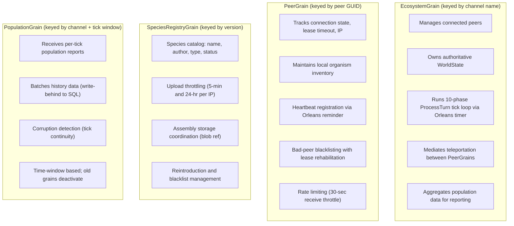
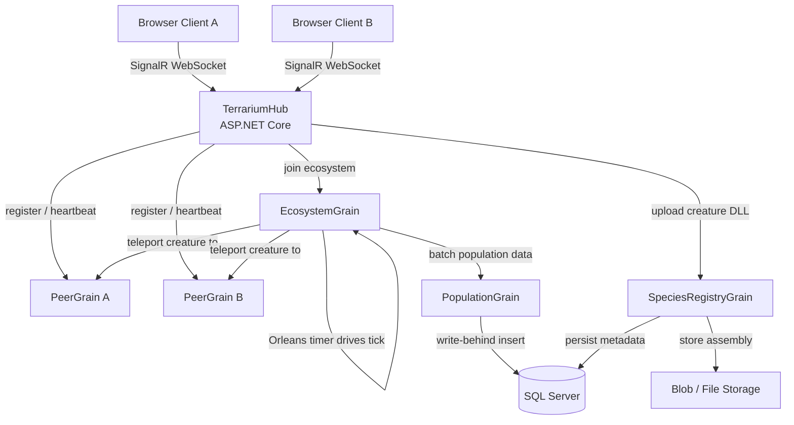

# Decision: Orleans + SignalR for Terrarium Networking Layer

**By:** Heisenberg (Lead / Architect)
**Date:** 2025-07-16
**Status:** Recommendation
**Requested by:** bradygaster
**Impact:** Sprint 7, Sprint 11, Sprint 12 — changes networking architecture

---

## Question

Should we use **Orleans + SignalR** instead of **SignalR alone** for the Terrarium networking layer?

## Recommendation: YES — Orleans + SignalR (Hybrid)

After evaluating the legacy codebase, the domain model, and the scaling characteristics of the game, I recommend **Orleans virtual actors + SignalR** with a clear boundary: **Orleans owns stateful domain logic; SignalR remains the browser push channel.**

This is not a "let's use Orleans because it's cool" recommendation. It's driven by three concrete problems that SignalR-only solves poorly.

---

## The Three Problems SignalR-Only Doesn't Solve Well

### 1. Server-Side State is Inherently Actor-Shaped

The current ASMX server is stateful in ways that `IMemoryCache` + SignalR hub methods can't cleanly express:

- **Peer registrations** have lease timeouts, heartbeat semantics, and IP+GUID identity. The `RegisterMyPeerGetCountAndPeerList` stored procedure is doing actor lifecycle management in SQL — registering, updating leases, returning neighbor lists. That's a grain with a timer.
- **Species uploads** have multi-level throttling (5-minute per IP, 24-hour per IP, blacklist checking, word filtering) and transactional assembly storage. That's a grain with state.
- **Population reporting** has GUID-based node identity, tick-based corruption detection (`TerrariumTimeoutReport`), and throttling. The `_lastGuid` static `Hashtable` in `ReportingService` is literally an in-memory actor state table — they just didn't have the abstraction.
- **Teleportation** is a multi-step handshake (version check → assembly check → assembly transfer → organism state transfer) between two identified peers. That's a grain-to-grain call pattern.

With SignalR-only, we'd be reimplementing actor patterns manually: `ConcurrentDictionary` keyed by peer ID, manual timer management for lease expiry, hand-rolled state persistence for crash recovery. Orleans gives us all of this as infrastructure.

### 2. The Tick Loop Needs Server-Side Authority

In the web model, the game engine runs server-side (creature execution is untrusted code — it can't run in the browser). Each connected client's ecosystem needs a tick loop running on the server. With SignalR alone, that means:

- A `BackgroundService` per ecosystem, or a single service multiplexing many ecosystems
- Manual state management for each ecosystem's `WorldVector`, organism collection, teleport zones
- Manual crash recovery — if the server restarts, all ecosystem state is gone

Orleans grains have activation/deactivation lifecycle, persistent state, and timers. An `EcosystemGrain` with an Orleans timer driving the 10-phase `ProcessTurn` loop is *exactly* the right abstraction.

### 3. Horizontal Scaling is a Day-1 Concern

The original MODERNIZATION.md already acknowledges this: Sprint 11 has "SignalR scaling" as a work item, and Sprint 7 includes "Server-to-server gRPC (future-proofing)" for multi-server deployments. With SignalR-only, we need:

- A SignalR backplane (Redis or Azure SignalR Service)
- A separate mechanism for distributing ecosystem state across servers
- Custom gRPC service definitions for server-to-server communication

Orleans provides transparent grain placement across a silo cluster. `SignalR.Orleans` provides a backplane without Redis. The Aspire integration (`AddOrleans()`) is first-class. We get horizontal scaling from the grain model itself, without any additional infrastructure.

---

## What Does NOT Belong in Grains

Not everything should be a grain. The rule: **if it's ephemeral, computed, or pure UI, keep it out of Orleans.**

| Concern | Where It Lives | Why |
|---------|---------------|-----|
| Rendering / Canvas drawing | Browser (Blazor JS interop) | UI only |
| Creature AI execution | Server-side process isolation sandbox | Security boundary — not an actor lifecycle concern |
| Throttle middleware | ASP.NET Core middleware / `IMemoryCache` | Request-scoped, not identity-scoped |
| Charts / aggregation queries | Dapper + stored procedures (read path) | SQL is better at aggregation than grains |
| Messaging (MOTD, welcome) | Minimal API endpoints | Stateless, cacheable |
| Word filtering (PoliCheck) | Service utility class | Pure function |

---

## The Grain Model

### Grain Types



### Grain Interactions



### Why NOT an OrganismGrain?

I considered making each organism a grain. It's tempting — organisms have identity, state, and lifecycle. But it's wrong for Terrarium:

1. **Scale mismatch.** Each ecosystem has up to ~300 organisms (the legacy `MaxAnimals` is `cpuThrottle * 4`, capped around 200-340). At that scale, individual grain overhead dominates. A single `EcosystemGrain` holding a `WorldState` with 300 organisms is the right granularity.
2. **Tick atomicity.** The 10-phase `ProcessTurn` loop processes all organisms in a single atomic tick — attacks resolve before movement, energy burns before growth. Splitting organisms across grains would require distributed transactions per tick. That's a nightmare.
3. **Spatial coupling.** Organisms interact based on grid proximity (attacks, bites, collisions). The `GridIndex` collision detection needs all organisms in memory simultaneously. Grain-per-organism breaks spatial locality.

The organism is not the actor. The ecosystem is.

---

## Teleportation Protocol: Grain-to-Grain

The legacy 4-step TCP handshake maps directly to grain calls:

| Legacy TCP Step | Orleans Equivalent |
|---|---|
| 1. Version check (`VersionNamespaceHandler`) | `EcosystemGrain.ValidateTeleport(version)` |
| 2. Assembly check (does peer have the DLL?) | `PeerGrain.HasAssembly(assemblyName)` |
| 3. Assembly transfer (send DLL bytes) | `SpeciesRegistryGrain.GetAssembly()` → push via SignalR to target client |
| 4. Organism state transfer (`TeleportState`) | `EcosystemGrain.CompleteTeleport(TeleportState)` — removes from source peer, adds to target |

The key difference: in the legacy model, teleportation was peer-to-peer (client A directly contacted client B over TCP port 50000). In the web model, the `EcosystemGrain` mediates — it knows both peers, validates the transfer, and ensures atomicity. No organism duplication, no lost creatures.

---

## Tick Loop: Orleans Timer vs BackgroundService

The current `ProcessTurn` is driven by a WinForms paint loop — 10 phases per tick, 2 ticks per second, 20fps frame rate. In the web model:

**With `BackgroundService`:** We'd need a singleton service multiplexing N ecosystems, each with their own tick state, managed in a `ConcurrentDictionary`. Crash recovery requires manual state serialization. Timer jitter across ecosystems needs manual coordination.

**With Orleans timer:** Each `EcosystemGrain` registers an Orleans timer (grain timer, not a reminder — we want sub-second resolution). The timer fires every 50ms (matching the legacy 20fps cadence), advancing `_turnPhase` through the 10 phases. State is grain state — Orleans handles activation, deactivation, and persistence. Multiple ecosystems are multiple grain activations, naturally distributed across silos.

**Recommendation:** Orleans timer. It's simpler, crash-safe, and scales with the grain model.

The rendering cadence (sending world state to browser clients) is decoupled from the tick loop. The grain pushes state snapshots to connected clients via SignalR at a configurable rate (e.g., every 2nd tick to reduce bandwidth).

---

## Aspire Integration

Orleans has first-class Aspire support:

```csharp
// In AppHost Program.cs
var storage = builder.AddAzureStorage("storage");
var clustering = builder.AddAzureStorage("clustering");

var orleans = builder.AddOrleans("terrarium-orleans")
    .WithClustering(clustering)
    .WithGrainStorage("ecosystem", storage)
    .WithGrainStorage("peers", storage)
    .WithGrainStorage("species", storage);

var server = builder.AddProject<Projects.Terrarium_Server>("server")
    .WithReference(orleans)
    .WithReference(sqlServer);
```

For local dev, Orleans can use in-memory clustering and file-based grain storage. For production on Azure Container Apps, Azure Table Storage or Azure Blob Storage for clustering and state. No Redis dependency.

`SignalR.Orleans` provides the SignalR backplane directly through the Orleans cluster — no Azure SignalR Service needed unless we hit extreme scale (thousands of concurrent connections per server instance).

---

## Complexity Cost — Is This Overkill?

Fair question. Here's my honest assessment:

**What Orleans adds:**
- NuGet packages: `Microsoft.Orleans.Server`, `Microsoft.Orleans.Client`, `SignalR.Orleans`, `Microsoft.Orleans.Persistence.AzureBlobStorage`
- Concepts: grains, silos, grain state, grain timers, reminders, silo clustering
- One more thing to learn for the team

**What Orleans removes:**
- `ConcurrentDictionary<string, EcosystemState>` with manual locking
- `BackgroundService` with manual timer management per ecosystem
- Manual crash recovery / state serialization (the legacy code already does this — see `serializeState`/`deserializeState` in `GameEngine.cs`)
- Redis or Azure SignalR Service for backplane
- Custom gRPC service for server-to-server communication
- Manual implementation of lease timeout, heartbeat, and activation patterns that Orleans gives us for free

**Net complexity:** Orleans is a wash or slight reduction. The concepts have a learning curve, but the alternative is hand-rolling the same patterns — and the legacy code proves these patterns are necessary (the original team built a custom actor system without knowing it).

The legacy `ReportingService._lastGuid` static `Hashtable`, the `PeerManager` with its `KnownPeers` / `_knownBadPeers` / lease timeouts, the `GameEngine` with its state serialization — these are all actor patterns implemented manually. Orleans just gives them a name and a framework.

---

## Sprint Plan Impact

### Sprint 7 (Real-Time Communication & Teleportation Protocol) — MODIFIED

Add Orleans setup alongside SignalR hub work. Sprint 7 becomes the sprint where we stand up the Orleans silo and define grain interfaces.

**New/changed work items:**

| Work Item | Owner | Change |
|-----------|-------|--------|
| Add Orleans to Aspire AppHost | Saul | New: `AddOrleans()` in AppHost, configure clustering and grain storage for local dev |
| Define grain interfaces | Heisenberg | New: `IEcosystemGrain`, `IPeerGrain`, `ISpeciesRegistryGrain`, `IPopulationGrain` interfaces with methods mapped from legacy ASMX |
| Implement `EcosystemGrain` (tick loop) | Mike | Changed: tick loop lives in grain timer, not BackgroundService. `TerrariumHub` delegates to `EcosystemGrain` |
| Implement `PeerGrain` | Mike | Changed: peer state in grain, not `IMemoryCache`. Lease timeout via grain timer |
| `TerrariumHub` as thin SignalR layer | Mike | Changed: hub methods call grains, not service classes. Hub is stateless |
| `SignalR.Orleans` backplane | Saul | New: replaces need for Redis or Azure SignalR Service |

### Sprint 2 (Server Core) — MODIFIED (minor)

When porting Discovery and Species endpoints, design the Dapper data access as repository classes that grains will call. No grain implementation yet, but the interfaces should anticipate grain callers.

### Sprint 11 (Multi-Peer Ecosystem) — SIMPLIFIED

Most of the "SignalR scaling" work disappears — Orleans handles grain distribution across silos, and `SignalR.Orleans` handles the backplane. Sprint 11 becomes focused on multi-peer UX and testing, not infrastructure.

| Work Item | Change |
|-----------|--------|
| SignalR scaling | Removed — `SignalR.Orleans` provides backplane |
| Server-to-server gRPC | Removed — Orleans silo clustering replaces this |
| Multi-client testing | Kept — still need Playwright-based testing |
| Load and stress testing | Kept — but now testing grain activation throughput, not manual state management |

### Sprint 12 (Polish & Hardening) — UNCHANGED

Error handling, reconnection logic, and performance profiling still apply. Orleans adds grain lifecycle events (`OnActivateAsync`, `OnDeactivateAsync`) as natural hooks for cleanup.

### New Issues Needed

1. **Orleans infrastructure setup** (Sprint 7) — Saul: Aspire integration, clustering, grain storage
2. **Grain interface design** (Sprint 7) — Heisenberg: define `IEcosystemGrain`, `IPeerGrain`, `ISpeciesRegistryGrain`, `IPopulationGrain`
3. **EcosystemGrain implementation** (Sprint 7) — Mike: tick loop, world state, teleportation mediation
4. **PeerGrain implementation** (Sprint 7) — Mike: lease management, heartbeat, bad-peer tracking
5. **SpeciesRegistryGrain implementation** (Sprint 7) — Gus: species CRUD, throttling, assembly storage
6. **PopulationGrain implementation** (Sprint 7) — Gus: write-behind population reporting
7. **SignalR.Orleans backplane** (Sprint 7) — Saul: replaces Redis/Azure SignalR Service
8. **Orleans unit tests** (Sprint 7) — Hank: `TestCluster`-based grain tests
9. **Orleans Aspire dashboard integration** (Sprint 7) — Saul: grain activation metrics in Aspire dashboard

---

## Decision Summary

| Aspect | Choice |
|--------|--------|
| Architecture | **Orleans + SignalR (hybrid)** |
| SignalR role | Browser push channel only — thin `TerrariumHub` |
| Orleans role | Stateful domain logic — ecosystems, peers, species, population |
| Tick loop | Orleans grain timer on `EcosystemGrain` |
| Teleportation | Grain-to-grain calls mediated by `EcosystemGrain` |
| Organism granularity | Per-ecosystem, NOT per-organism |
| Backplane | `SignalR.Orleans` (no Redis) |
| Aspire integration | `AddOrleans()` in AppHost, first-class |
| Complexity tradeoff | Net neutral — Orleans replaces hand-rolled actor patterns |
| Sprint impact | Sprint 7 gets heavier, Sprint 11 gets lighter |

---

*The legacy Terrarium team built an actor system without having the word "actor." They had peer identity, lease timeouts, heartbeat registration, state serialization on crash, throttle windows per identity, and a multi-phase tick loop driving world state transitions. They just did it with static Hashtables and ASMX endpoints. Orleans gives us the same semantics with proper infrastructure. This isn't adding complexity — it's naming the complexity that already exists.*
