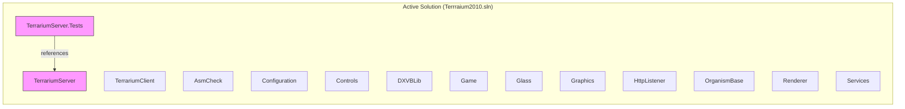
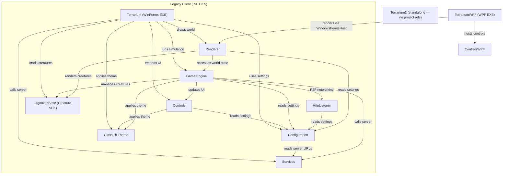

# Terrarium 2.0 — Solution Architecture

> Authored by Heisenberg (Lead / Architect) — initial scan of solution-level structure.
> Last updated: 2025-07-15

## Overview

.NET Terrarium 2.0 is a peer-to-peer networked creature ecosystem game originally built for .NET 1.x/2.0, progressively upgraded through .NET 3.5, with a partial rewrite attempt targeting .NET 4.0 (Visual Studio 2010). The codebase contains **three generations of code** coexisting in the same repo, which is the single most important architectural fact about this project.

---

## Solution Files

| Solution | Path | Era | Purpose |
|----------|------|-----|---------|
| `Terrraium2010.sln` | Root | VS 2010 | **Active solution** — contains the WPF client rewrite + MVC server |
| `client.sln` | `Client\` | VS 2008 | Legacy WinForms client (original, feature-complete) |
| `server.sln` | `Server\` | VS 2008 | Legacy ASP.NET WebForms server (original) |

The active solution (`Terrraium2010.sln`) is the VS 2010 rewrite attempt. It contains 15 projects organized into two solution folders.

---

## Projects in Active Solution (`Terrraium2010.sln`)

### Server (Solution Folder)

| Project | Path | Target | Output | References |
|---------|------|--------|--------|------------|
| **TerrariumServer** | `ServerMVC\TerrariumServer\` | .NET 4.0 | Library (Web App) | — |
| **TerrariumServer.Tests** | `ServerMVC\TerrariumServer.Tests\` | .NET 4.0 | Library (Test) | → TerrariumServer |

### Client (Solution Folder)

| Project | Path | Target | Output | References |
|---------|------|--------|--------|------------|
| **TerrariumClient** | `ClientWPF\TerrariumClient\` | .NET 4.0 Client Profile | WinExe (WPF) | — |
| **AsmCheck** | `ClientWPF\AsmCheck\` | .NET 4.0 | Library | — |
| **Configuration** | `ClientWPF\Configuration\` | .NET 4.0 | Library | — |
| **Controls** | `ClientWPF\Controls\` | .NET 4.0 | Library | — |
| **DXVBLib** | `ClientWPF\DXVBLib\` | .NET 4.0 | Library | — |
| **Game** | `ClientWPF\Game\` | .NET 4.0 | Library | — |
| **Glass** | `ClientWPF\Glass\` | .NET 4.0 | Library | — |
| **Graphics** | `ClientWPF\Graphics\` | .NET 4.0 | Library | — |
| **HttpListener** | `ClientWPF\HttpListener\` | .NET 4.0 | Library | — |
| **OrganismBase** | `ClientWPF\OrganismBase\` | .NET 4.0 | Library | — |
| **Renderer** | `ClientWPF\Renderer\` | .NET 4.0 | Library | — |
| **Services** | `ClientWPF\Services\` | .NET 4.0 | Library | — |

### Active Solution Dependency Graph

> **⚠ All ClientWPF projects are standalone** — no project references exist between them. They are empty shells containing only `AssemblyInfo.cs`.

**⚠ Critical observation:** The ClientWPF projects are almost entirely **empty shells**. Most contain only `AssemblyInfo.cs` and no actual source code. The only project with real code in the active solution is TerrariumServer (ASP.NET MVC 2) and TerrariumClient (WPF shell with `MainWindow.xaml`). The VS 2010 rewrite was started but never completed.

---

## Legacy Client Projects (`Client\` folder — NOT in active solution)

These are the **real, feature-complete** implementations. All target **.NET Framework 3.5** (upgraded from 2.0). All legacy client assemblies are **strong-named** using `development.snk`.

| Project | Path | Target | Output | References |
|---------|------|--------|--------|------------|
| **Terrarium** | `Client\Terrarium\` | .NET 3.5 | WinExe | → Configuration, Controls, Game, Glass, OrganismBase, Renderer, Services |
| **Terrarium2** | `Client\Terrarium2\` | .NET 3.5 | WinExe | — |
| **TerrariumWPF** | `Client\TerrariumWPF\` | .NET 3.5 | WinExe (WPF) | → ControlsWPF, Renderer |
| **Game** | `Client\Game\` | .NET 3.5 | Library | → Configuration, Controls, Glass, OrganismBase, Services, HttpListener |
| **Renderer** | `Client\Renderer\` | .NET 3.5 | Library | → Configuration, Game, OrganismBase; DXVBLib.dll (file ref) |
| **Configuration** | `Client\Configuration\` | .NET 3.5 | Library | → Services |
| **Controls** | `Client\Controls\` | .NET 3.5 | Library | → Configuration, Glass |
| **ControlsWPF** | `Client\ControlsWPF\` | .NET 3.5 | Library (WPF) | — |
| **Controls2** | `Client\Controls2\` | .NET 3.5 | Library | — |
| **Glass** | `Client\Glass\` | .NET 3.5 | Library | — |
| **OrganismBase** | `Client\OrganismBase\` | .NET 3.5 | Library | — |
| **Services** | `Client\Services\` | .NET 3.5 | Library | — |
| **HttpListener** | `Client\HttpListener\` | .NET 3.5 | Library | → Configuration |

### Legacy Client Dependency Graph

**The leaf nodes (no dependencies):** OrganismBase, Glass, Services, ControlsWPF, Controls2

**The root (most dependencies):** `Client\Terrarium\terrarium.csproj` — this is the main client application.

---

## Legacy Server (`Server\` folder — NOT in active solution)

| Component | Path | Technology |
|-----------|------|-----------|
| **Website** | `Server\Website\` | ASP.NET WebForms / ASMX Web Services |
| **SQL Setup** | `Server\1_CreateDatabase.sql`, `Server\2_CreateDatabaseTables.sql` | SQL Server |

The server exposes ASMX web services consumed by the client's `Services` project via auto-generated Web References (BugReporting, Charts, Discovery, Messaging, Reporting, Species, Usage, Watson).

---

## Out-of-Solution Projects

### Samples (organism examples for the SDK)

| Project | Path | Target | Output |
|---------|------|--------|--------|
| Carnivore | `Samples\Carnivore\` | .NET 2.0 (default) | Library |
| Herbivore | `Samples\Herbivore\` | .NET 2.0 (default) | Library |
| Plant | `Samples\Plant\` | .NET 2.0 (default) | Library |

### SDK (tutorial exercises)

| Project | Path | Target | Output |
|---------|------|--------|--------|
| Exercise1 | `SDK\Solutions\CS\Exercise1\` | .NET 2.0 (default) | Library |
| Exercise2 | `SDK\Solutions\CS\Exercise2\` | .NET 2.0 (default) | Library |
| Exercise3 | `SDK\Solutions\CS\Exercise3\` | .NET 2.0 (default) | Library |

### Tools

| Project | Path | Target | Output |
|---------|------|--------|--------|
| ServerConfig | `Tools\ServerConfig\ServerConfig\` | .NET 2.0 (default) | WinExe |
| InstallerItems | `Tools\ServerConfig\InstallerItems\` | .NET 2.0 (default) | Library |

---

## Global Build Configuration

- **No `Directory.Build.props`** — each project manages its own settings
- **No `global.json`** — no SDK version pinning
- **No `nuget.config`** — no NuGet feeds configured
- **No `packages.config`** — no NuGet packages used anywhere
- **No NuGet PackageReferences** — all dependencies are framework assemblies or direct DLL references
- **Strong naming** via `Keys\development.snk` (legacy client projects only)
- **Shared version info** via linked `VersionInfo.cs` file in `Client\` folder

---

## Key Observations & Modernization Concerns

### 1. Three Generations, One Repo
The codebase contains three distinct eras:
- **Gen 1 (.NET 2.0):** Samples, SDK, Tools — no TFM declared, using VS 2005 project format
- **Gen 2 (.NET 3.5):** `Client\` folder — the original working game, upgraded from .NET 2.0 to 3.5 via VS 2008
- **Gen 3 (.NET 4.0):** `ClientWPF\` and `ServerMVC\` — the VS 2010 rewrite attempt, mostly empty shells

### 2. The Rewrite Was Abandoned
The `ClientWPF\` projects are scaffolded but hollow. 11 of 13 client projects contain only `AssemblyInfo.cs`. The actual game logic, rendering, networking, and UI code lives in `Client\`. **Any modernization must start from the `Client\` codebase, not `ClientWPF\`.**

### 3. Server is Split Between Two Architectures
- `Server\Website\` — the original ASP.NET WebForms/ASMX server (functional)
- `ServerMVC\TerrariumServer\` — an ASP.NET MVC 2 scaffold with only AccountController and HomeController (non-functional for game purposes)

### 4. DirectX Dependency is a Blocker
`Client\Renderer\` references `DXVBLib.dll` (a COM interop wrapper for DirectX 7 VB libraries). This is the single hardest dependency to modernize. The Renderer project also has stubs for DirectX 9, DirectX 10, Managed DirectX, and XNA engine classes — evidence of prior modernization attempts.

### 5. Web References (ASMX proxies) are Legacy
`Client\Services\` uses auto-generated ASMX Web References pointing at hardcoded localhost URLs. These would need to be replaced with modern HTTP clients or gRPC.

### 6. No Package Management
Zero NuGet usage across the entire solution. All dependencies are framework assemblies. This is both a constraint (no third-party dependency debt) and an opportunity (clean slate for introducing modern packages).

### 7. No Dependency Injection
No DI container anywhere. Configuration and service resolution is done through static classes and singletons (see `GameConfig`, `Services` web reference proxies).

### 8. Platform Targeting
- The main client (`Client\Terrarium\`) targets **x86** explicitly — likely due to DirectX COM interop requirements
- The WPF client shell (`ClientWPF\TerrariumClient\`) also targets **x86** with .NET 4.0 Client Profile

---

## Recommended Modernization Order

If we modernize, the dependency graph tells us the order:

1. **OrganismBase** (leaf, no deps) — the organism SDK. Start here.
2. **Glass** (leaf, no deps) — UI primitives
3. **Services** (leaf, no deps) — server communication layer
4. **HttpListener** (depends on Configuration)
5. **Configuration** (depends on Services)
6. **Controls** (depends on Configuration, Glass)
7. **Game** (depends on most things) — the engine
8. **Renderer** (depends on Game, OrganismBase, Configuration + DirectX) — hardest
9. **Terrarium** (the main client) — last

The server (`Server\Website\`) can be modernized independently and in parallel.
