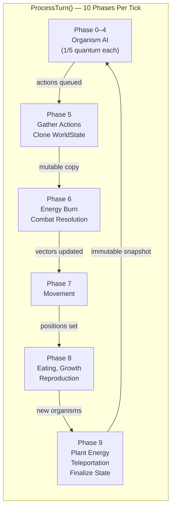
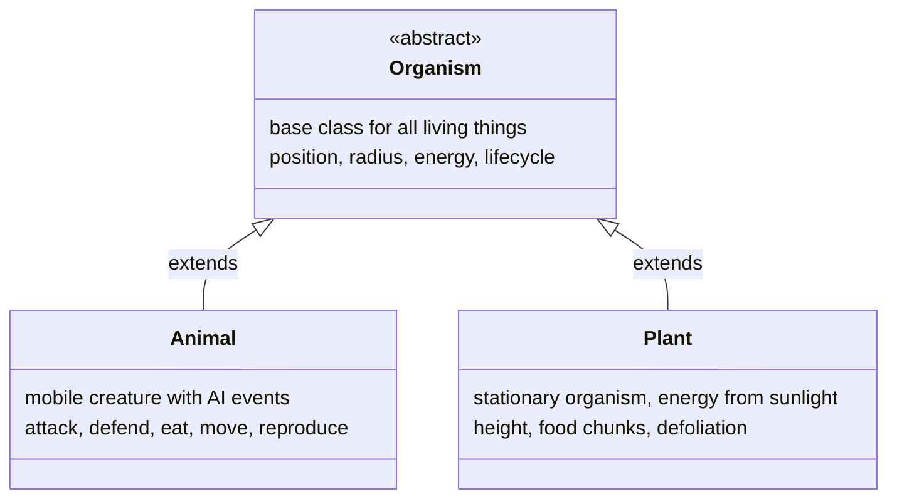
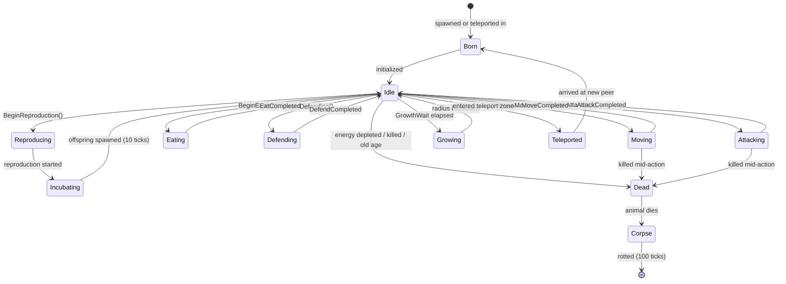
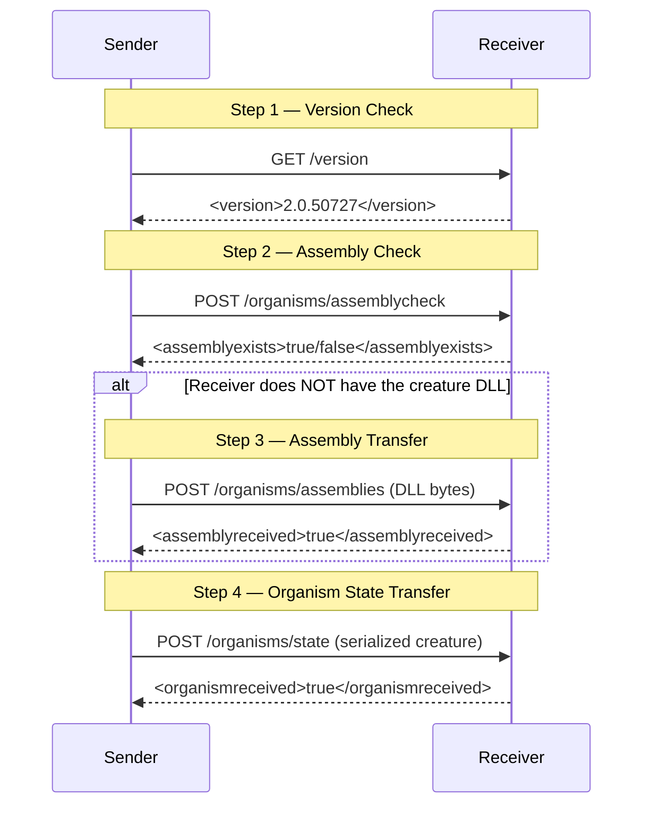

# Terrarium Engine Architecture

> Documented by Mike — Networking / Engine Dev
>
> **Note:** The ClientWPF/ projects (Game, OrganismBase, HttpListener, Services, AsmCheck, Configuration)
> are empty .NET 4.0 shell projects — stubs containing only `AssemblyInfo.cs`. All real source lives
> under `Client/` in the matching subdirectories. This document covers the actual implementation.

---

## Table of Contents

1. [Game Engine Architecture](#game-engine-architecture)
2. [Organism / Creature System](#organism--creature-system)
3. [P2P Networking Model](#p2p-networking-model)
4. [Security Model](#security-model)
5. [Configuration & Infrastructure](#configuration--infrastructure)
6. [Key Classes by Project](#key-classes-by-project)

---

## Game Engine Architecture

### Core: `GameEngine` (Singleton)

**File:** `Client/Game/Classes/Engine/GameEngine.cs`
**Namespace:** `Terrarium.Game`
**Access:** `GameEngine.Current` static singleton

The engine is a phase-based simulation loop. Each "turn" consists of **10 phases** (0–9),
executed incrementally via `ProcessTurn()`. The caller invokes `ProcessTurn()` 10 times to
complete one full tick. This design spreads CPU load evenly across frames for smooth rendering.

### Tick Phases

| Phase | What Happens |
|-------|-------------|
| 0–4 | `Scheduler.Tick()` — give organisms 1/5 of their processing quantum each |
| 5 | Gather actions from all organisms, duplicate world state (mutable copy), dequeue organism removals, kill diseased organisms |
| 6 | Burn base energy, resolve attacks and defenses, update movement vectors |
| 7 | Move all animals |
| 8 | Resolve bites/eating, growth, incubation, reproduction, healing |
| 9 | Distribute energy to plants, execute teleportation, insert queued new organisms, update antenna states, make world state immutable |

### World State (`WorldState`)

**File:** `Client/Game/Classes/Engine/WorldState.cs`

- Sealed, serializable, immutable-after-construction snapshot of the entire world
- Spatial grid index (`OrganismState[,] _cellOrganisms`) for O(1) neighbor lookups
- `DuplicateMutable()` creates a writable copy each tick; `MakeImmutable()` locks it down
- `FindOrganismsInCells()` and `FindOrganismsInView()` for spatial queries
- Full `BinaryFormatter` serialization for save/load

### World Vector (`WorldVector`)

**File:** `Client/Game/Classes/Engine/WorldVector.cs`

Pairs an immutable `WorldState` with its `TickActions` — the "state + direction" for the next tick.
Events: `WorldVectorChanged`, `EngineStateChanged` notify UI of updates.

### Tick Actions (`TickActions`)

**File:** `Client/Game/Classes/Engine/TickActions.cs`

Aggregates all organism actions per tick into `Hashtable` maps keyed by organism ID:
`MoveToActions`, `AttackActions`, `EatActions`, `ReproduceActions`, `DefendActions`.
`GatherActionsFromOrganisms()` pulls pending actions from the scheduler.

### Population Tracking (`PopulationData`)

**File:** `Client/Game/Classes/Engine/PopulationData.cs`

- Tracks population changes per species via DataSet tables
- Reports to remote web service every 600 ticks (~5 minutes)
- Async web service calls via `WebClientAsyncResult`

### Teleport Zones (`Teleporter`, `TeleportZone`)

**Files:** `Client/Game/Classes/Engine/Teleporter.cs`, `TeleportZone.cs`

- Multiple `TeleportZone` objects move around the world with kinematic `MovementVector`
- When an organism overlaps a zone, it gets teleported to a random peer
- Zones use immutable clone pattern — setters return new instances

### Organism Quanta Calibration (`OrganismQuanta`)

**File:** `Client/Game/Classes/Engine/OrganismQuanta.cs`

Performance calibration system. Runs emulated organism AI workload on current hardware to
determine time quantum. Excludes outlier samples (top/bottom 15%) for robust averaging.

---

## Organism / Creature System

### Class Hierarchy

**Files:**
- `Client/OrganismBase/Classes/Creature/Organism.cs` — base class
- `Client/OrganismBase/Classes/Creature/Animal.cs` — animal behavior
- `Client/OrganismBase/Classes/Engine/Plant.cs` — plant behavior

### Behavior API (Animal)

Users implement creature AI by subclassing `Animal` and handling events:

| Event | When It Fires |
|-------|--------------|
| `Born` | Creature is born into the world |
| `Load` | World is loaded from save |
| `Idle` | Each tick — main AI logic goes here |
| `MoveCompleted` | Movement action finished |
| `AttackCompleted` | Attack action resolved |
| `DefendCompleted` | Defense action resolved |
| `EatCompleted` | Eating action resolved |
| `ReproduceCompleted` | Reproduction finished |
| `Attacked` | This creature was attacked |
| `Teleported` | Creature arrived at new peer |

### Actions

**Files:** `Client/OrganismBase/Classes/Actions/`

All inherit from `Action` (base with `OrganismID`, `ActionID`):

| Action Class | Method | Effect |
|-------------|--------|--------|
| `MoveToAction` | `BeginMoving(MovementVector)` | Async multi-tick movement |
| `AttackAction` | `BeginAttacking(AnimalState)` | Attack another animal |
| `DefendAction` | `BeginDefending(AnimalState)` | Mitigate incoming attack |
| `EatAction` | `BeginEating(OrganismState)` | Consume plant or corpse |
| `ReproduceAction` | `BeginReproduction(byte[] dna)` | Spawn offspring (max 8KB DNA) |

Actions are queued via `PendingActions` and collected by the engine each tick via
`GetThenErasePendingActions()`.

### Organism State

**Files:** `Client/OrganismBase/Classes/State/`

| Class | Purpose |
|-------|---------|
| `OrganismState` | Abstract base — position, radius, energy, alive/mature/incubating status, generation |
| `AnimalState` | Adds injury tracking, rot ticks (corpse decay up to 100 ticks), antennas |
| `PlantState` | Adds height, food chunks, defoliation percentage |

States are **immutable snapshots** — one per tick per organism.

### Genetic Trait System (Attributes)

**Files:** `Client/OrganismBase/Classes/Creature/Attributes/`

Creature traits are declared via .NET attributes on the class definition. Point-based attributes
draw from a shared budget — you can't max everything.

| Attribute | Controls |
|-----------|---------|
| `CarnivoreAttribute` | Diet type (herbivore vs carnivore) |
| `MaximumSpeedPointsAttribute` | Movement speed (1–100 pts) |
| `EyesightPointsAttribute` | Scan radius (1–100 pts) |
| `AttackDamagePointsAttribute` | Damage dealt (1–100 pts) |
| `DefendDamagePointsAttribute` | Damage mitigation (1–100 pts) |
| `EatingSpeedPointsAttribute` | Consumption rate (1–100 pts) |
| `MaximumEnergyPointsAttribute` | Energy storage capacity |
| `CamouflagePointsAttribute` | Invisibility odds |
| `MatureSizeAttribute` | Adult radius target |
| `SeedSpreadDistanceAttribute` | Plant reproduction range |
| `AnimalSkinAttribute` / `PlantSkinAttribute` | Visual appearance |
| `AuthorInformationAttribute` | Creature metadata |

### Species Interfaces

**Files:** `Client/OrganismBase/Interfaces/`

| Interface | Purpose |
|-----------|---------|
| `ISpecies` | Base — MatureRadius, LifeSpan, GrowthWait, ReproductionWait, MaxEnergyPerUnitRadius |
| `IAnimalSpecies` | Adds IsCarnivore, MaxSpeed, EyesightRadius, AttackDamage, EatingSpeed, InvisibleOdds |
| `IPlantSpecies` | Adds SkinFamily |
| `IOrganismWorldBoundary` | World query interface for organisms |
| `IAnimalWorldBoundary` | Animal-specific world queries (extends IOrganismWorldBoundary) |
| `IPlantWorldBoundary` | Plant-specific world queries |

### Energy & Lifecycle Mechanics

- Energy scales with **radius** — larger creatures store more but burn more
- Growth: automatic every `GrowthWait` ticks until `MatureRadius` reached
- Reproduction requires: maturity + energy ≥ Normal + `ReproductionWait` elapsed
- Incubation: 10 ticks from `BeginReproduction()` to offspring spawn
- Corpses rot over 100 ticks, available as food (for carnivores)

---

## P2P Networking Model

### Architecture Overview

The networking stack has three layers:

1. **HttpListener** (`Terrarium.Net`) — raw async TCP socket server
2. **NetworkEngine** (`Terrarium.PeerToPeer`) — peer management and teleportation orchestration
3. **Namespace Handlers** — HTTP endpoint handlers for specific operations

### HTTP Listener Layer

**Files:** `Client/HttpListener/`

| File | Class | Role |
|------|-------|------|
| `HttpWebListener.cs` | `HttpWebListener` | Async TCP socket server on port 50000 |
| `HttpNamespaceManager.cs` | `HttpNamespaceManager` | Request dispatcher — routes by URI namespace |
| `HttpConnectionState.cs` | `HttpConnectionState` | Per-connection HTTP parser (state machine) |
| `HttpApplication.cs` | `HttpApplication` | Request/response container |
| `IHttpNamespaceHandler.cs` | `IHttpNamespaceHandler` | Handler interface (`ProcessRequest(HttpApplication)`) |
| `HttpListenerWebRequest.cs` | `HttpListenerWebRequest` | Outbound HTTP request helper |
| `HttpListenerWebResponse.cs` | `HttpListenerWebResponse` | Response wrapper |
| `HttpTraceHelper.cs` | `HttpTraceHelper` | Network trace/debug logging |
| `NativeSocketErrors.cs` | `NativeSocketErrors` | Socket error code definitions |

The listener is fully async — `AcceptCallback` → `ReceiveCallback` chain with queue-based
request buffering and `ManualResetEvent` signaling.

### Peer Discovery

**File:** `Client/Game/Classes/PeerToPeer/NetworkEngine.cs`

- `AnnounceAndRegisterPeer()` runs on a dedicated thread
- Calls SOAP `PeerDiscoveryService.RegisterMyPeerGetCountAndPeerList()` every 5 minutes
- Receives list of known peers, updates `PeerManager.KnownPeers`
- `PeerManager` maintains good/bad peer lists with 1-hour bad-peer timeout

### Creature Teleportation Protocol

**File:** `Client/Game/Classes/PeerToPeer/TeleportWorkItem.cs`

Multi-step HTTP protocol between peers:

### Network Endpoints (Namespace Handlers)

**Files:** `Client/Game/Classes/PeerToPeer/OrganismNamespaceHandler.cs`, `VersionNamespaceHandler.cs`

| Endpoint | Method | Handler | Purpose |
|----------|--------|---------|---------|
| `/version` | GET | `VersionNamespaceHandler` | Returns build/major/minor version + channel |
| `/organisms/stats` | GET | `OrganismsNamespaceHandler` | Network statistics XML |
| `/organisms/assemblycheck` | POST | `OrganismsNamespaceHandler` | Check if assembly exists in local PAC |
| `/organisms/assemblies` | POST | `OrganismsNamespaceHandler` | Receive creature DLL, validate, save to PAC |
| `/organisms/state` | POST | `OrganismsNamespaceHandler` | Receive teleported creature, validate, inject |

### Rate Limiting & Abuse Prevention

- `PeerManager.ShouldReceive()` — 30-second throttle per peer
- `PeerManager.BadPeer()` — blacklists peer on connection failure (1-hour timeout)
- Bad peer list capped at 30 entries via `TruncateBadPeerList()`
- Version mismatch → teleportation rejected

### Key P2P Classes

**Files:** `Client/Game/Classes/PeerToPeer/`

| File | Class | Role |
|------|-------|------|
| `NetworkEngine.cs` | `NetworkEngine` | Central hub — peer discovery + teleportation |
| `PeerManager.cs` | `PeerManager` | Good/bad peer lists, rate limiting |
| `Peer.cs` | `Peer` | Data: IP address, lease timeout, last receipt |
| `TeleportState.cs` | `TeleportState` | Serializable creature transport container |
| `TeleportWorkItem.cs` | `TeleportWorkItem` | Async multi-step teleport protocol execution |
| `TeleportDelegate.cs` | `TeleportDelegate` | Delegate for async `DoTeleport()` invocation |

---

## Security Model

Terrarium runs user-authored creature DLLs. The security model has three layers.

### Layer 1: Native IL Validation (AsmCheck)

**Files:** `Client/AsmCheck/asmcheck.cpp`, `asmcheck.h` (C++ / COM)

Before any managed code loads, a native C++ validator inspects the assembly:

- Decodes and validates every IL opcode and metadata token
- Checks method attributes, field types, class hierarchy
- Blocks: P/Invoke, unsafe IL, static constructors, static fields, internal class access,
  unmanaged code, security-sensitive methods, exception handler abuse
- `ValidateStrongName()` — cryptographic signature verification
- `CheckAssemblyWithReporting()` — outputs XML error report for diagnostics

**Error categories:** `InvalidCall`, `InvalidField`, `InvalidBaseClass`, `StaticMethod`,
`PinvokeMethod`, `HasSecurityMethod`, `ClassConstructor`, `StaticField`, `ExceptionHandlers`,
`BadInstruction`, `UnmanagedAssembly`, `InternalClass`, `MisalignedMethodHeader`

### Layer 2: Code Access Security (SecurityUtils)

**File:** `Client/Game/Classes/Hosting/SecurityUtils.cs`
**Namespace:** `Terrarium.Hosting`

- `MakePolicyLevel()` — creates restrictive CAS policy tree
- Organism assemblies get **Execution permission only** — no file I/O, no networking, no reflection
- Terrarium-signed assemblies get full trust
- `AssemblyHasTerrariumKey()` — validates assembly is signed with project key

### Layer 3: Runtime Sandboxing (GameScheduler)

**File:** `Client/Game/Classes/Hosting/GameScheduler.cs`
**Namespace:** `Terrarium.Hosting`

- Time-sliced execution with quantum limits per organism
- `RunAnimalWithDeadlockDetection()` — monitors kernel time, kills hangers
- 5-second kernel time threshold → permanent blacklist
- `OrganismWrapper` tracks per-organism timing, overage, activation counts

### Assembly Cache (PrivateAssemblyCache)

**File:** `Client/Game/Classes/Engine/PrivateAssemblyCache.cs`

- Obfuscated directory storage for creature DLLs
- Hooks `AppDomain.CurrentDomain.AssemblyResolve` for non-standard loading
- Blacklist mechanism: zero-length marker files prevent re-download
- Crash detection: `LastRun` tracks running organism; blacklists on process crash
- `PacAssembliesChanged` event for UI updates
- Version-specific cache directories (`.Major.Minor.Build` suffix)

### Strong Name Verification (`StrongNameVerificationState`)

**File:** `Client/Game/Classes/Hosting/StrongNameVerificationState.cs`

Checks Windows registry for strong name verification bypass entries —
detects if someone disabled verification to inject malicious assemblies.

---

## Configuration & Infrastructure

### Game Configuration

**File:** `Client/Configuration/Classes/Config/GameConfig.cs`
**Namespace:** `Terrarium.Configuration`

Static class managing all game settings via XML config:

- **Boolean flags:** backgroundGrid, boundingBoxes, demoMode, destinationLines, drawScreen,
  enableNat, largeGraphicsMode, screenSaverSpanMonitors, skipVersionCheck, startFullscreen,
  useSimpleScreenSaver
- **String settings:** applicationDirectory, mediaDirectory, webRoot, userEmail,
  userCountry, userState, localIPAddress, blockedVersionString, loggingMode, styleName

### Diagnostics & Tooling

**Files:** `Client/Configuration/Classes/Tools/`

| File | Class | Purpose |
|------|-------|---------|
| `ErrorLog.cs` | `ErrorLog` | Thread-safe error logging (Mutex), builds DataSet for Watson submission |
| `Profiler.cs` | `Profiler` | TRACE-mode function timing via `ProfilerNode` hashtable |
| `TimeMonitor.cs` | `TimeMonitor` | High-precision timing via `QueryPerformanceCounter` |
| `TerrariumTraceListener.cs` | `TerrariumTraceListener` | Custom trace output |

### Web Services (Client/Services/)

**Namespace:** `Terrarium.Services`

Eight SOAP web service proxies for server communication:

| Service | Purpose |
|---------|---------|
| `PeerDiscoveryService` | Peer registration, network join/leave |
| `Messaging` | Welcome messages, MOTD, version checks |
| `SpeciesService` | Upload new creature species (assembly as base64) |
| `ReportingService` | Submit population statistics |
| `ChartService` | Request population/vitality charts |
| `BugService` | Submit bug reports |
| `WatsonService` | Submit error diagnostics |
| `UsageService` | Submit gameplay usage metrics |

---

## Key Classes by Project

### Client/Game/ — Game Engine

| Path | Class | Role |
|------|-------|------|
| `Classes/Engine/GameEngine.cs` | `GameEngine` | Main simulation loop (10-phase tick) |
| `Classes/Engine/WorldState.cs` | `WorldState` | Immutable world snapshot with spatial grid |
| `Classes/Engine/WorldVector.cs` | `WorldVector` | State + actions pair |
| `Classes/Engine/TickActions.cs` | `TickActions` | Per-tick action aggregation |
| `Classes/Engine/Teleporter.cs` | `Teleporter` | Teleport zone management |
| `Classes/Engine/PopulationData.cs` | `PopulationData` | Population tracking & reporting |
| `Classes/Engine/PrivateAssemblyCache.cs` | `PrivateAssemblyCache` | Creature DLL storage |
| `Classes/Engine/OrganismQuanta.cs` | `OrganismQuanta` | Performance calibration |
| `Classes/Engine/Creature/Species.cs` | `Species` | Species trait container |
| `Classes/Engine/Creature/AnimalSpecies.cs` | `AnimalSpecies` | Animal species implementation |
| `Classes/Engine/Movement/GridIndex.cs` | `GridIndex` | Spatial indexing |
| `Classes/Hosting/GameScheduler.cs` | `GameScheduler` | Organism time-slicing & deadlock detection |
| `Classes/Hosting/SecurityUtils.cs` | `SecurityUtils` | CAS policy for sandboxing |
| `Classes/Hosting/AppMgr.cs` | `AppMgr` | Scheduler lifecycle |
| `Classes/Hosting/OrganismWrapper.cs` | `OrganismWrapper` | Per-organism timing wrapper |
| `Classes/PeerToPeer/NetworkEngine.cs` | `NetworkEngine` | P2P hub — discovery + teleportation |
| `Classes/PeerToPeer/PeerManager.cs` | `PeerManager` | Peer list management |
| `Classes/PeerToPeer/TeleportWorkItem.cs` | `TeleportWorkItem` | Async teleport protocol |
| `Classes/PeerToPeer/TeleportState.cs` | `TeleportState` | Serializable creature container |

### Client/OrganismBase/ — Creature API

| Path | Class | Role |
|------|-------|------|
| `Classes/Creature/Organism.cs` | `Organism` | Abstract base for all creatures |
| `Classes/Creature/Animal.cs` | `Animal` | Animal behavior + event model |
| `Classes/Engine/Plant.cs` | `Plant` | Plant behavior |
| `Classes/State/OrganismState.cs` | `OrganismState` | Immutable per-tick state snapshot |
| `Classes/State/AnimalState.cs` | `AnimalState` | Animal-specific state |
| `Classes/State/PlantState.cs` | `PlantState` | Plant-specific state |
| `Classes/Actions/Action.cs` | `Action` | Base action class |
| `Classes/Creature/Attributes/*.cs` | Various | Genetic trait declarations |
| `Interfaces/ISpecies.cs` | `ISpecies` | Species trait interface |
| `Interfaces/IAnimalSpecies.cs` | `IAnimalSpecies` | Animal species interface |

### Client/HttpListener/ — HTTP/TCP Layer

| Path | Class | Role |
|------|-------|------|
| `HttpWebListener.cs` | `HttpWebListener` | Async TCP server (port 50000) |
| `HttpNamespaceManager.cs` | `HttpNamespaceManager` | Request routing by URI |
| `HttpConnectionState.cs` | `HttpConnectionState` | HTTP parser state machine |
| `HttpApplication.cs` | `HttpApplication` | Request/response container |

### Client/AsmCheck/ — Native IL Validator (C++)

| Path | Role |
|------|------|
| `asmcheck.cpp` | IL opcode validation, metadata checking |
| `asmcheck.h` | Assembly error categories |

### Client/Configuration/ — Settings & Tools

| Path | Class | Role |
|------|-------|------|
| `Classes/Config/GameConfig.cs` | `GameConfig` | Static game configuration |
| `Classes/Tools/ErrorLog.cs` | `ErrorLog` | Thread-safe error logging |
| `Classes/Tools/TimeMonitor.cs` | `TimeMonitor` | High-precision timing |
| `Classes/Tools/Profiler.cs` | `Profiler` | Function-level profiling |
