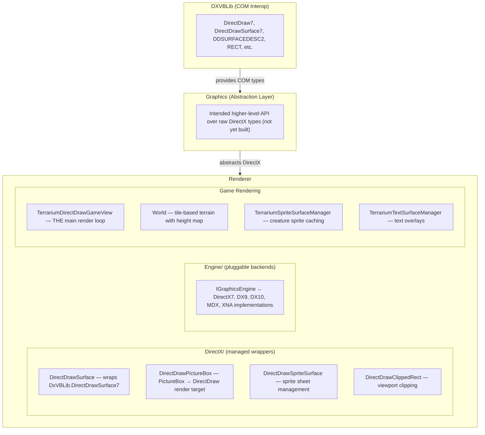
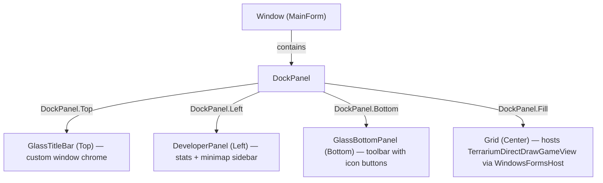

# ClientWPF — WPF Client Projects

> Documented by Jesse (Client Dev) — initial domain mapping.

## Status: Scaffolded / Not Yet Implemented

**Every project under `ClientWPF/` is a skeleton.** They were created as empty .NET 4.0 class library (or WinExe) projects with only `Properties/AssemblyInfo.cs` stubs. No business logic, no rendering code, no controls have been ported yet. The real implementation lives in the legacy `Client/` directory and serves as the porting reference.

---

## Projects

### TerrariumClient (WinExe — the main app)

The entry point. A WPF application targeting .NET 4.0 Client Profile, x86 only.

| File | Purpose |
|------|---------|
| `App.xaml` / `App.xaml.cs` | Application startup; `StartupUri` → `MainWindow.xaml` |
| `MainWindow.xaml` / `MainWindow.xaml.cs` | Empty `Window` with an empty `Grid`. No controls wired yet. |
| `Properties/` | Standard AssemblyInfo, Resources, Settings |

**What it needs to become:** The legacy `Client/TerrariumWPF/MainForm.xaml` shows the target layout — a `DockPanel` containing `GlassTitleBar` (top), `DeveloperPanel` (left), `GlassBottomPanel` (bottom), and the `TerrariumDirectDrawGameView` (center, hosted via `WindowsFormsHost`).

### Controls (Class Library)

Custom UI components — title bar, bottom toolbar, developer panel, ticker bar, status LEDs, resize bars.

**Current state:** Empty stub (AssemblyInfo.cs only).

**Legacy reference:** `Client/Controls/` (WinForms) and `Client/ControlsWPF/` (partial WPF port). The legacy WPF port has real XAML UserControls:

| Legacy File | Purpose |
|-------------|---------|
| `ControlsWPF/Controls/GlassTitleBar.xaml` | Title bar with icon, label, and window chrome buttons (minimize/maximize/close/bug) |
| `ControlsWPF/Controls/GlassBottomPanel.xaml` | Toolbar with TickerBar and icon buttons for settings, stats, ecosystem, organisms |
| `ControlsWPF/Controls/DeveloperPanel.xaml` | Side panel showing game status (animals, peers, teleportations), mini-map |
| `ControlsWPF/Controls/TickerBar.xaml` | Scrolling status ticker |
| `ControlsWPF/ResourceDictionary.xaml` | Shared styles: `GlassLabel`, `GlassButton`, `GlassGradient`, `GlassButtonTemplate` (ellipse-shaped icon buttons) |
| `ControlsWPF/Themes/Generic.xaml` | Default template for `CustomControl1` (placeholder) |
| `ControlsWPF/Images/` | 18 PNG button icons (titleBar, close, minimize, pause, settings, etc.) |

### Glass (Class Library)

Visual theming framework — gradient panels, styled buttons/labels, and a style manager that loads `.style` XML files.

**Current state:** Empty stub.

**Legacy reference:** `Client/Glass/` has the full WinForms implementation:

| Legacy File | Purpose |
|-------------|---------|
| `GlassStyleManager.cs` | Singleton that loads/manages serialized `.style` themes from disk |
| `GlassStyle.cs` | Serializable style definition |
| `GlassPanel.cs` | `Panel` subclass with gradient backgrounds, borders, "sunk" effect, double-buffered |
| `GlassButton.cs` | Custom styled button |
| `GlassLabel.cs` | Custom styled label |
| `GlassGradient.cs` | Gradient color definition (two-color linear) |
| `GlassBorders.cs` | Border configuration flags |
| `GlassHelper.cs` | Utility methods for glass rendering |
| `GradientEditor.cs` / `GradientConverter.cs` | Design-time support for editing gradients |

### Renderer (Class Library)

The rendering pipeline — draws the game world, sprites, text, heightmaps, and manages DirectDraw surfaces.

**Current state:** Empty stub.

**Legacy reference:** `Client/Renderer/` is the heaviest project:

| Legacy File | Purpose |
|-------------|---------|
| `Classes/TerrariumDirectDrawGameView.cs` | **The main game view.** A `DirectDrawPictureBox` that renders creatures, terrain, scrolling, minimap. Owns the game loop rendering. |
| `Classes/World.cs` | Tile-based world map with height data and minimap generation (1024×1024 tiles) |
| `Classes/TerrariumSpriteSurfaceManager.cs` | Manages creature sprite surfaces |
| `Classes/TerrariumSpriteSurface.cs` | Individual sprite surface for a creature type |
| `Classes/TerrariumTextSurfaceManager.cs` | Text overlay surface management |
| `Classes/TileInfo.cs` | Per-tile metadata |
| `Classes/HeightMap.cs` | Terrain height generation |
| `Classes/DirectX/DirectDrawSurface.cs` | Managed wrapper around DirectDraw7 surfaces (`DDSURFACEDESC2`, `RECT`) |
| `Classes/DirectX/DirectDrawPictureBox.cs` | `PictureBox` subclass that hosts a DirectDraw rendering surface |
| `Classes/DirectX/DirectDrawSpriteSurface.cs` | Sprite sheet surface with frame extraction |
| `Classes/DirectX/DirectDrawClippedRect.cs` | Clipping rectangle helper |
| `Classes/DirectX/ManagedDirectX.cs` | Managed DirectX initialization |
| `Classes/DirectX/DirectXException.cs` | Error handling |
| `Classes/Engine/IGraphicsEngine.cs` | Interface for graphics engine abstraction (empty) |
| `Classes/Engine/DirectX7GraphicsEngine.cs` | DX7 engine implementation (empty stub) |
| `Classes/Engine/DirectX9GraphicsEngine.cs` | DX9 engine (stub) |
| `Classes/Engine/DirectX10GraphicsEngine.cs` | DX10 engine (stub) |
| `Classes/Engine/ManagedDirectXGraphicsEngine.cs` | Managed DX engine (stub) |
| `Classes/Engine/XnaGraphicsEngine.cs` | XNA engine (stub) |

### Graphics (Class Library)

Intended to sit between DXVBLib and Renderer as a higher-level graphics abstraction.

**Current state:** Empty stub. The legacy `Client/Graphics/` directory also appears to be empty.

### DXVBLib (Class Library)

DirectX COM interop — the lowest-level layer. Provides managed wrappers for DirectX 7 VB-style COM interfaces (DirectDraw, surfaces, clippers, palettes).

**Current state:** Empty stub. The legacy `Client/DXVBLib/` directory also appears to be empty — the actual `DxVBLib` namespace is likely provided by an external COM interop assembly or generated from a type library.

---

## Additional Projects (Not in My Primary Domain)

These are also under `ClientWPF/` but are cross-cutting or owned by other team members:

| Project | Purpose | State |
|---------|---------|-------|
| `Game` | Game engine logic (simulation, creature lifecycle, world state) | Empty stub |
| `Configuration` | App settings and configuration management | Empty stub |
| `Services` | Network/P2P service layer | Empty stub |
| `HttpListener` | HTTP listener for peer communication | Empty stub |
| `OrganismBase` | Base classes for organisms (creatures/plants) | Empty stub |
| `AsmCheck` | Assembly validation (creature code sandboxing) | Empty stub |

---

## Rendering Pipeline Architecture

Based on the legacy code, the rendering pipeline flows:

The WPF host bridges WinForms → WPF via `WindowsFormsHost`, embedding `TerrariumDirectDrawGameView` (a `PictureBox` subclass) directly into the WPF layout.

---

## How the Main App Is Structured (Target State)

From the legacy `Client/TerrariumWPF/MainForm.xaml`:

On load, the `MainForm` creates a `TerrariumDirectDrawGameView`, wraps it in a `WindowsFormsHost`, and calls `InitializeDirectDraw(false)` to set up the rendering surface.

---

## Notable Patterns & WPF Concerns

1. **WinForms interop is required.** The DirectDraw game view is a `PictureBox` subclass. WPF cannot host DirectDraw natively — `WindowsFormsHost` is the bridge. This creates airspace issues (WPF content cannot overlay the hosted control).

2. **Glass styling system.** The legacy app has a full custom theming framework (`Glass` namespace) that predates WPF styles. The legacy WPF controls partially replicate this with a `ResourceDictionary` containing `GlassGradient` (linear gradient brush), `GlassLabel`/`GlassButton` styles, and a `GlassButtonTemplate` (elliptical icon buttons). A proper WPF port should replace the WinForms Glass classes with WPF resource dictionaries and styles.

3. **All projects target .NET Framework 4.0.** The TerrariumClient targets `v4.0 Client Profile`. Build tooling is MSBuild 4.0 (VS2010-era `.csproj` format).

4. **No project references exist yet.** None of the `ClientWPF/` projects reference each other. The legacy solution shows the dependency chain: `TerrariumClient` → `Controls` → `Glass`, and `TerrariumClient` → `Renderer` → `DXVBLib`.

5. **The `IGraphicsEngine` abstraction is aspirational.** The interface and all engine implementations (DX7, DX9, DX10, MDX, XNA) are empty stubs in the legacy code. The actual rendering goes directly through `DirectDrawSurface` / `TerrariumDirectDrawGameView` using DX7.

6. **x86 only.** The TerrariumClient targets x86 (32-bit) — necessary for the DirectX 7 COM interop.

---

## What Needs to Happen

The `ClientWPF/` folder is a restructured project layout ready for a WPF port, but all the actual code still needs to be migrated from `Client/`. The legacy `Client/TerrariumWPF/` and `Client/ControlsWPF/` represent a *partial* earlier attempt at this port and are the closest starting point. Priority work:

1. **Port Glass styles** → WPF ResourceDictionary (partially done in legacy `ControlsWPF`)
2. **Port Controls** → WPF UserControls (GlassTitleBar, GlassBottomPanel, DeveloperPanel)
3. **Port Renderer** → Keep DirectDraw + WindowsFormsHost bridge (or evaluate modern alternatives)
4. **Wire up MainWindow** → DockPanel layout matching legacy MainForm.xaml
5. **Add project references** between the libraries
