# Terrarium .NET 10 Modernization — Sprint Plan

> **Author:** Heisenberg (Lead / Architect)
> **Date:** 2025-07-15 (Revised: 2026-02-10)
> **Requested by:** bradygaster
> **Target:** .NET 10 (LTS, November 2025)

---

## Executive Summary

This plan takes Terrarium from .NET Framework 3.5 (with abandoned .NET 4.0 shells) to .NET 10 as a **cross-platform web application** using **Blazor**, **ASP.NET Core**, and **.NET Aspire**. It's a **14-sprint plan** (~7 months at 2-week sprints) that builds leaf-to-root, produces a compilable solution every sprint, and parallelizes server, engine, and frontend work.

The original Terrarium was a desktop app with DirectX rendering. The modernized version runs in a browser with Canvas/WebGL rendering, retaining all the original sprite imagery so that anyone who remembers .NET Terrarium will recognize it immediately.

**Key architectural decisions:**

| Decision | Choice | Rationale |
|----------|--------|-----------|
| Solution structure | New clean solution, fresh SDK-style `.csproj` files | In-place migration of legacy `.csproj` is more painful than starting fresh — these are VS 2008/2010 project files |
| UI framework | **Blazor Interactive Server** with Canvas/WebGL game view | Cross-platform, runs in any modern browser, C# everywhere, real-time via SignalR built-in |
| Graphics | **HTML5 Canvas / WebGL** via Blazor JS interop | Browser-native rendering. Sprite sheets loaded as web textures. No COM interop, no platform lock-in. |
| Orchestration | **.NET Aspire** (AppHost + ServiceDefaults) | Service discovery, health checks, telemetry, local dev orchestration, and Azure Container Apps deployment — all built-in |
| Server | **ASP.NET Core Minimal APIs** with controller fallback for complex endpoints | The ASMX services are simple request/response — minimal APIs are the right fit |
| Database | **Dapper + keep stored procedures** | The server has ~17 well-tested stored procs. Ripping them out for EF Core adds risk with zero value |
| Security sandboxing | **AssemblyLoadContext + process isolation** | CAS is gone in .NET Core+. AssemblyLoadContext for isolation, with a separate process for untrusted organism execution |
| Real-time communication | **SignalR** for browser↔server, server mediates all peer interactions | Browser clients can't do direct P2P. Server acts as hub — peers connect via SignalR, creature teleportation is server-mediated |
| Serialization | **System.Text.Json** (replace BinaryFormatter) | BinaryFormatter is removed in .NET 10. All state serialization uses JSON |
| Test framework | **xUnit** | Modern, extensible, good parallelization |
| Deployment | **Azure Container Apps** via Aspire | Stateless services, horizontal scaling, Docker-native, Aspire has first-class support |
| Language | **C# only** | Going forward, creature SDK and samples are C# |
| Legacy code | **Delete after migration** | No archive folder. Old code stays in git history. |
| Visual identity | **All original sprite assets preserved** | Visual recognition is critical — this is Terrarium, it should look like Terrarium |

---

## Team Roster

| Name | Role | Primary Responsibilities |
|------|------|------------------------|
| **Heisenberg** | Lead / Architect | Solution structure, DI, cross-cutting concerns, code review |
| **Jesse** | Sprite / Asset Pipeline | Original sprite extraction, asset pipeline, rendering logic support |
| **Skyler** | Frontend Web Dev | Blazor components, Glass CSS theming, Canvas/WebGL game view, SignalR client |
| **Gus** | Server Dev | ASP.NET Core APIs, database access, server infrastructure |
| **Mike** | Engine / Networking | Game engine, security sandboxing, teleportation protocol, SignalR hub |
| **Hank** | Tester / QA | CI/CD, test infrastructure, test coverage, SDK samples |
| **Saul** | DevOps / Aspire | .NET Aspire, GitHub Actions, Docker, Container Apps, GitHub Issues/Projects |

---

## Sprint Plan

### Sprint 0: Foundation
**Theme:** New solution, Aspire, CI/CD, and the first project that compiles

**Goal:** A new `Terrarium.sln` with SDK-style projects, .NET Aspire AppHost, `Directory.Build.props`, CI pipeline, GitHub Issues/Projects setup, and OrganismBase compiling on .NET 10 with green tests.

| Work Item | Owner | Details |
|-----------|-------|---------|
| Create new `Terrarium.sln` with SDK-style project structure | Heisenberg | Root: `src/` with projects organized by domain. `Directory.Build.props` sets `<TargetFramework>net10.0</TargetFramework>`, `<ImplicitUsings>enable</ImplicitUsings>`, `<Nullable>enable</Nullable>`. Project naming: `Terrarium.OrganismBase`, `Terrarium.Game`, `Terrarium.Web`, etc. |
| Create `Terrarium.AppHost` (.NET Aspire) | Saul | Aspire AppHost project that orchestrates all services. Initially just references `Terrarium.Server` (API) and `Terrarium.Web` (Blazor frontend). Add `Terrarium.ServiceDefaults` project with OpenTelemetry, health checks, service discovery. |
| Create `Terrarium.OrganismBase` project — port from `Client/OrganismBase/` | Mike | Leaf node (zero deps). Port all classes: `Organism`, `Animal`, `Plant`, state classes, action classes, attribute classes, interfaces. Replace `BinaryFormatter` with `System.Text.Json`. Fix `Hashtable` → `Dictionary<,>`, `ArrayList` → `List<>`. |
| Create `Terrarium.Glass` project — CSS design tokens | Jesse | Port Glass style system as CSS custom properties and design tokens. Extract color palette, gradients, border styles from `Client/Glass/`. Output: CSS files and a `glass-theme.css` that captures the original Terrarium look. |
| Create GitHub Actions CI workflow | Hank | `.github/workflows/build.yml` — build on push/PR, `dotnet build`, `dotnet test`. Ubuntu runner (cross-platform now). |
| Set up GitHub Issues/Projects with labels and workflow | Saul | Create labels for each team member (`agent:heisenberg`, `agent:jesse`, `agent:skyler`, `agent:gus`, `agent:mike`, `agent:hank`, `agent:saul`). Create sprint labels (`sprint:0` through `sprint:13`). Create status labels (`status:todo`, `status:in-progress`, `status:done`, `status:blocked`). Create GitHub Issues for Sprint 0 work items. |
| Create `Terrarium.OrganismBase.Tests` — unit tests for organism SDK | Hank | xUnit project. Test point allocation validation, creature lifecycle states, action creation, serialization round-trips, species interfaces. Target: 80%+ coverage of OrganismBase. |
| Set up `global.json` pinning .NET 10 SDK | Heisenberg | Pin SDK version to avoid drift. |

**Key Decisions:**
- ✅ SDK-style projects, new solution (not migrating old `.csproj` in-place)
- ✅ .NET Aspire from day one — all services orchestrated
- ✅ Nullable reference types enabled from day one
- ✅ GitHub Issues for all work tracking with labels per agent and sprint

**Definition of Done:**
- [ ] `dotnet build Terrarium.sln` succeeds
- [ ] `dotnet test` runs OrganismBase tests, all green
- [ ] Aspire AppHost starts and shows dashboard
- [ ] CI pipeline runs on GitHub Actions
- [ ] GitHub Issues created for Sprint 0, all labeled
- [ ] OrganismBase API surface matches legacy (same public types and methods)

---

### Sprint 1: Server Bootstrap
**Theme:** ASP.NET Core server with first API endpoint, wired into Aspire

**Goal:** A running ASP.NET Core server that serves the Messaging endpoints, registered as an Aspire resource, with Saul managing GitHub Issues workflow.

| Work Item | Owner | Details |
|-----------|-------|---------|
| Create `Terrarium.Server` ASP.NET Core project | Gus | Minimal API host with `Program.cs`. Configure Dapper + SQL Server connection via Aspire service discovery. Port `ServerSettings.cs` to `IOptions<ServerSettings>` pattern. Register as Aspire resource in AppHost. |
| Port Messaging endpoints | Gus | `/api/messaging/welcome`, `/api/messaging/motd`, `/api/messaging/version`. Map from `Messaging.asmx` methods. Return JSON instead of SOAP XML. |
| Port `Throttle.cs` to modern middleware | Gus | Replace ASP.NET Cache-based throttling with `IMemoryCache` + custom middleware. Same logic, modern primitives. |
| Add SQL Server as Aspire resource | Saul | Configure SQL Server container in AppHost with `AddSqlServer()`. Seed database with `1_CreateDatabase.sql` + `2_CreateDatabaseTables.sql`. Wire connection string via service discovery. |
| Create `Terrarium.Server.Tests` | Hank | xUnit + `WebApplicationFactory<>` integration tests. Test messaging endpoints, throttle behavior. |
| Port `Terrarium.Services` (client-side service layer) | Mike | Create `Terrarium.Services` project. Replace ASMX Web Reference proxies with `HttpClient`-based service clients. Start with `MessagingClient` only. Interface-first: `IMessagingService`, `IPeerDiscoveryService`, etc. |
| Create Sprint 1 GitHub Issues | Saul | Create issues for all work items, assign labels, link to Sprint 1 milestone. Update Sprint 0 issues to done. |

**Key Decisions:**
- ✅ Dapper over EF Core (stored procs stay)
- ✅ JSON API responses (not SOAP) — clients get new `HttpClient`-based service layer
- ✅ Docker for dev (SQL Server in Aspire), Azure SQL for prod
- ✅ Aspire service discovery for connection strings

**Dependencies:** None — server work is independent of client.

**Definition of Done:**
- [ ] Server starts via Aspire dashboard and serves `/api/messaging/*` endpoints
- [ ] SQL Server runs as Aspire resource with seeded database
- [ ] Integration tests pass
- [ ] `Terrarium.Services.MessagingClient` can call the new server

---

### Sprint 2: Configuration & Core Infrastructure
**Theme:** Port the shared infrastructure that everything depends on

**Goal:** `Terrarium.Configuration` and `Terrarium.Net` compile and have test coverage.

| Work Item | Owner | Details |
|-----------|-------|---------|
| Port `Terrarium.Configuration` from `Client/Configuration/` | Heisenberg | Replace static `GameConfig` with `IOptions<GameConfig>` pattern. Port `ErrorLog` → use `ILogger` abstraction (Microsoft.Extensions.Logging). Port `Profiler` and `TimeMonitor` — replace `QueryPerformanceCounter` P/Invoke with `Stopwatch`. Keep `TerrariumTraceListener` but wire to `ILogger`. |
| Port `Terrarium.Net` (networking layer) | Mike | **Do NOT port the custom `HttpWebListener`.** Replace with ASP.NET Core endpoints for the P2P/SignalR listener. The custom TCP socket server, HTTP parser, and connection state machine are solved problems. Create `Terrarium.Net` as SignalR hub definitions and service interfaces. |
| Server: Port PeerDiscovery endpoints | Gus | `/api/discovery/register`, `/api/discovery/peers`, `/api/discovery/validate`. The critical "heartbeat" endpoint. Port `TerrariumRegisterPeerCountAndList` sproc call via Dapper. |
| Server: Port Watson + BugService endpoints | Gus | `/api/watson/report`, `/api/bugs/report`. Simple insert-and-forget endpoints. |
| Expand CI with code coverage reporting | Hank | Add `coverlet.collector` to test projects, report coverage in CI. |
| Create `Terrarium.Configuration.Tests` | Hank | Test config loading, validation, defaults. |
| Aspire dashboard telemetry | Saul | Wire OpenTelemetry traces and metrics from `Terrarium.ServiceDefaults` into the Aspire dashboard. Structured logging visible in dashboard. |

**Key Decisions:**
- ✅ Kill the custom HTTP server. ASP.NET Core replaces `HttpWebListener` entirely.
- ✅ `IOptions<T>` pattern for configuration (DI-friendly)
- ✅ `Microsoft.Extensions.Logging` replaces custom trace/profiler infrastructure

**Dependencies:** `Terrarium.Configuration` depends on `Terrarium.Services` (from Sprint 1).

**Definition of Done:**
- [ ] Configuration loads from `appsettings.json` with `IOptions<GameConfig>`
- [ ] Peer discovery endpoints work end-to-end
- [ ] Custom HttpWebListener code is NOT ported (documented as replaced)
- [ ] Telemetry visible in Aspire dashboard
- [ ] All tests green, CI green

---

### Sprint 3: Web UI Foundation
**Theme:** Blazor project, component architecture, and Glass CSS theming

**Goal:** `Terrarium.Web` Blazor Interactive Server project compiles, renders the Glass-themed layout, and connects to the server via Aspire service discovery.

| Work Item | Owner | Details |
|-----------|-------|---------|
| Create `Terrarium.Web` Blazor Interactive Server project | Skyler | Blazor Interactive Server app. Register as Aspire resource in AppHost. Main layout with `GlassTitleBar`, `DeveloperPanel` (sidebar), `GlassBottomPanel` (status bar), and central game viewport placeholder. Use `Terrarium.Glass` CSS for theming. |
| Port Glass theming to CSS | Skyler + Jesse | Convert `GlassGradient`, `GlassLabel`, `GlassButton` styles to CSS. Jesse provides color values and gradient specs from legacy `Client/Glass/` and `Client/ControlsWPF/ResourceDictionary.xaml`. Skyler implements as CSS custom properties + component styles. The look must match the original Terrarium chrome. |
| Create Blazor component library | Skyler | `Terrarium.Web.Components`: `GlassTitleBar.razor`, `GlassBottomPanel.razor`, `DeveloperPanel.razor`, `TickerBar.razor`. Responsive layout — works on desktop and tablet browsers. |
| Extract and catalog all original sprite assets | Jesse | Scan `Client/` for all BMP, PNG, GIF sprite assets. Catalog dimensions, animation frames, purpose. Convert to web-friendly formats (PNG with transparency). Create `wwwroot/sprites/` asset directory. This is critical — Brady says visual recognition matters. |
| Server: Port Species endpoints | Gus | `/api/species/add`, `/api/species/list`, `/api/species/assembly`, `/api/species/reintroduce`, `/api/species/blacklist`. The most complex service — handles file upload (creature DLL as base64), word filtering, throttling. Port `WordFilter.cs`. |
| Server: Port Reporting endpoints | Gus | `/api/reporting/population`. Heavy validation logic — data bounds checking, throttle enforcement. |
| Port SDK samples to .NET 10 | Hank | Update `Samples/Herbivore`, `Samples/Carnivore`, `Samples/Plant` to SDK-style projects referencing `Terrarium.OrganismBase`. Verify they compile. These are the "hello world" for creature developers — they must always work. |

**Key Decisions:**
- ✅ Blazor Interactive Server (not WebAssembly) — server-side rendering with SignalR circuit, simplifies security model for creature execution
- ✅ CSS-based Glass theming (not XAML ResourceDictionary)
- ✅ All original sprite assets preserved and converted for web
- ✅ Port from `Client/ControlsWPF/` (the partial WPF port with real XAML) for style reference, implement as Blazor components

**Dependencies:** `Terrarium.Web` depends on `Terrarium.Glass` (Sprint 0).

**Definition of Done:**
- [ ] Blazor app starts via Aspire, renders Glass-themed layout
- [ ] All Glass components render with original Terrarium visual identity
- [ ] All original sprite assets cataloged and converted to web format
- [ ] Species upload/download works end-to-end
- [ ] SDK samples compile against new OrganismBase
- [ ] All tests green

---

### Sprint 4: Game Engine Core
**Theme:** Port the heart of Terrarium — the simulation engine

**Goal:** `Terrarium.Game` compiles with the 10-phase tick loop running headless (no rendering, no networking).

| Work Item | Owner | Details |
|-----------|-------|---------|
| Port `GameEngine` core loop | Mike | Port from `Client/Game/Classes/Engine/`. The 10-phase `ProcessTurn()` loop, `WorldState`, `WorldVector`, `TickActions`. Replace `Hashtable` with `Dictionary<string, T>`. Replace `BinaryFormatter` serialization of `WorldState` with `System.Text.Json`. Replace `ArrayList` with `List<>`. |
| Port creature management classes | Mike | `Species`, `AnimalSpecies`, `PlantSpecies`, `PrivateAssemblyCache`, `PopulationData`. Replace `DataSet`-based population tracking with typed models. |
| Port spatial indexing | Mike | `GridIndex`, `WorldState` cell-based spatial queries. `FindOrganismsInCells()`, `FindOrganismsInView()`. |
| Port movement and physics | Mike | `MovementVector`, `TeleportZone`, `Teleporter`. Immutable clone pattern should map cleanly to C# records or `readonly struct`. |
| Create `Terrarium.Game.Tests` | Hank | Test the tick loop: create a world with organisms, run 10 phases, verify state transitions. Test spatial indexing, movement, energy mechanics. This is the critical test suite. |
| Server: Port Charts + Usage endpoints | Gus | `/api/charts/*`, `/api/usage/report`. Port `ChartBuilder.cs`, `UsageReporting.cs`. |
| Server: Port `NonPageServices` background worker | Gus | Replace timer-based `NonPageServices` with `IHostedService` / `BackgroundService` for the `TerrariumAggregate` rollup. |
| Sprite animation mapping | Jesse | Map legacy sprite frame indices to web sprite sheet coordinates. Create sprite metadata JSON files describing animation sequences, frame dimensions, anchor points. Work with Skyler on the sprite rendering contract. |

**Key Decisions:**
- ✅ `System.Text.Json` replaces `BinaryFormatter` everywhere
- ✅ `DataSet` usage replaced with typed C# models
- ✅ `Hashtable` → `Dictionary<,>`, `ArrayList` → `List<>`

**Blockers:**
- `GameEngine` references `GameScheduler` (hosting/sandboxing) — stub the interface for now, implement in Sprint 6.
- `PopulationData` calls web services — wire to `Terrarium.Services` interfaces, not concrete implementations.

**Definition of Done:**
- [ ] Headless game loop: create world → add organisms → run 100 ticks → verify population changes
- [ ] WorldState serializes/deserializes via System.Text.Json
- [ ] Sprite metadata JSON files created for all original assets
- [ ] Server has all API endpoints ported (feature-complete server)
- [ ] All tests green

---

### Sprint 5: Server Completion & Integration
**Theme:** Complete the server, wire client services to it

**Goal:** Full server running via Aspire, all client service interfaces implemented and integration-tested.

| Work Item | Owner | Details |
|-----------|-------|---------|
| Complete all `Terrarium.Services` client implementations | Mike | `PeerDiscoveryClient`, `SpeciesClient`, `ReportingClient`, `ChartClient`, `WatsonClient`, `UsageClient`. All implement interfaces defined in Sprint 1. All use `HttpClient` + `System.Text.Json`. Wire via Aspire service discovery. |
| Server: Docker support + Aspire integration | Saul | Server `Dockerfile`. SQL Server as Aspire resource with volume persistence. Database seeding via migration on startup. Health check endpoints wired to Aspire. |
| Server: OpenAPI spec | Gus | Built-in .NET 10 OpenAPI support. Document all endpoints. This becomes the API contract. Scalar UI for API exploration. |
| End-to-end integration tests | Hank | Test full flows: register peer → get peer list → upload species → report population → query charts. Use `WebApplicationFactory` with test containers or Aspire test host. |
| Wire `Terrarium.Configuration` to use Aspire service discovery | Heisenberg | Replace hardcoded URLs with Aspire-resolved endpoints. `appsettings.json` for local overrides. DI registration for all service clients. |
| Container Apps deployment manifest | Saul | Aspire deployment manifest for Azure Container Apps. `azd` integration for `azd up` deployment. Document deployment process. |

**Key Decisions:**
- ✅ Azure Container Apps via Aspire deployment
- ✅ Docker for local development via Aspire
- ✅ `azd` CLI integration for deployment

**Definition of Done:**
- [ ] Aspire dashboard shows all services healthy
- [ ] All service clients work against running server via service discovery
- [ ] OpenAPI spec generated and accessible
- [ ] Integration tests pass in CI
- [ ] `azd up` deployment documented (even if not yet tested against Azure)

---

### Sprint 6: Security Sandboxing
**Theme:** Replace CAS + AppDomain sandboxing with modern isolation

**Goal:** Creature DLLs load and execute in an isolated context with resource limits.

| Work Item | Owner | Details |
|-----------|-------|---------|
| Design organism isolation architecture | Heisenberg | Document the security model: `AssemblyLoadContext` for assembly isolation, separate worker process for execution sandbox. The worker process runs with restricted permissions (no network, no file I/O beyond designated cache). Communication via anonymous pipes or stdin/stdout JSON. In a web architecture, creature execution always happens server-side — the browser never runs untrusted code. |
| Port `GameScheduler` with new sandbox model | Mike | Replace AppDomain-based scheduling with process-based isolation. `OrganismWorkerProcess` hosts a single organism type. `GameScheduler` manages worker processes, enforces time quantum, kills hung workers. Time-slicing via `CancellationTokenSource` with timeout. |
| Port `PrivateAssemblyCache` | Mike | Keep the obfuscated directory storage concept. Replace `AppDomain.AssemblyResolve` hook with `AssemblyLoadContext.Resolving`. Blacklist mechanism stays. |
| Replace native `AsmCheck` (C++ IL validator) | Mike | Port validation logic to C# using `System.Reflection.Metadata` to read IL opcodes. The validation rules are well-defined (no P/Invoke, no static fields, no static constructors, no unsafe IL). |
| Security model tests | Hank | Test that sandboxed organisms cannot: access file system, open network connections, use reflection to escape, exceed time quantum. Test that valid organisms execute correctly. |
| Blazor component refinement | Skyler | Iterate on component styling, animations, responsive layout. Build loading states, error boundaries, and accessibility features. |

**Key Decisions:**
- ✅ Process isolation for hard security boundary (not just AssemblyLoadContext)
- ✅ Port C++ AsmCheck to C# using `System.Reflection.Metadata`
- ✅ Worker process communicates via anonymous pipes
- ✅ Creature execution is always server-side in the web architecture

**Blockers:**
- This is the highest-risk sprint. The security model is the foundation of trust in a game running user code. Time-box the AsmCheck port — if it slips, organisms run in process with AssemblyLoadContext only (reduced security, acceptable for dev/preview).

**Definition of Done:**
- [ ] Organism DLL loads in isolated `AssemblyLoadContext`
- [ ] Worker process runs organism logic with time quantum enforcement
- [ ] IL validation catches banned patterns (P/Invoke, static fields, etc.)
- [ ] Malicious organism test suite passes (attempts to escape sandbox all fail)

---

### Sprint 7: Real-Time Communication & Teleportation Protocol
**Theme:** SignalR-based peer communication — the web-native P2P replacement

**Goal:** The server mediates creature teleportation between connected browser clients via SignalR.

| Work Item | Owner | Details |
|-----------|-------|---------|
| Design hub-and-spoke architecture | Heisenberg + Mike | In the web model, browser clients can't do direct P2P. The server acts as the hub: each Blazor client connects via SignalR, the server manages peer groups and mediates creature transfers. Define `TerrariumHub` with methods for peer registration, organism teleportation, and population sync. |
| Implement `TerrariumHub` SignalR hub | Mike | Server-side hub: `RegisterPeer`, `GetPeers`, `TeleportOrganism` (4-step protocol preserved: version check → assembly check → assembly send → organism send), `BroadcastPopulation`. Add to Aspire service. |
| Implement SignalR client in Blazor | Skyler | `TerrariumHubConnection` service: connect on app start, auto-reconnect, handle incoming teleportation events, update game state. Wire to `GameEngine` events. |
| Port `NetworkEngine` and `PeerManager` | Mike | Replace socket-based peer tracking with SignalR connection management. Keep rate limiting (30-sec throttle) and bad-peer blacklisting. Replace threading model with `async/await` + `Channel<T>` for work queue. Server tracks all connected peers in memory with `IMemoryCache`. |
| SignalR integration tests | Hank | In-process SignalR hub tests, test full teleportation flow. Test version mismatch rejection, rate limiting, disconnection handling. |
| Server-to-server gRPC (future-proofing) | Mike | For multi-server deployments (horizontal scaling), servers communicate via gRPC. Define `ServerPeerService.proto`. A single server instance handles SignalR clients; multiple server instances sync via gRPC. Not needed for v1 but design the interface. |

**Key Decisions:**
- ✅ SignalR for browser↔server (replaces custom TCP P2P)
- ✅ Server mediates all peer interactions (hub-and-spoke, not mesh)
- ✅ Keep the 4-step teleportation protocol structure (it's well-designed)
- ✅ `async/await` replaces manual thread management
- ✅ gRPC reserved for server-to-server in multi-instance deployments

**Definition of Done:**
- [ ] Two browser clients connect to server via SignalR
- [ ] Creature teleports from client A to client B via server
- [ ] Assembly transfer works (server caches assemblies)
- [ ] Rate limiting and version checking work
- [ ] All tests green

---

### Sprint 8: Web Game Renderer
**Theme:** Canvas/WebGL rendering — the game world comes alive in the browser

**Goal:** The game world renders in a browser — terrain, creatures (original sprites), text overlays — using HTML5 Canvas via Blazor JS interop.

| Work Item | Owner | Details |
|-----------|-------|---------|
| Create `Terrarium.Renderer` with Canvas/WebGL | Skyler | JavaScript rendering engine (`terrarium-renderer.js`) hosted in a Blazor component via JS interop. Use HTML5 Canvas 2D context (upgrade to WebGL if performance requires). Define `IGameRenderer` C# interface that maps to JS calls. Blazor component: `<GameView />`. |
| Port sprite system to web | Jesse + Skyler | Jesse provides sprite sheet metadata (frame indices, dimensions, animation sequences from Sprint 4). Skyler implements `SpriteSheet` JS class that loads sprite PNGs and renders frames via Canvas `drawImage` with source rect. Sprites must look identical to original Terrarium — use the EXACT original art. |
| Port world/terrain rendering | Skyler | Port `World.cs` (1024×1024 tile map), `HeightMap.cs`, `TileInfo.cs` rendering to Canvas. Render terrain as colored tiles matching the original green/brown Terrarium landscape. Minimap as a downsampled canvas element. |
| Port text overlays | Skyler | Creature names, energy bars, status text rendered on Canvas. Use Canvas `fillText` or overlay HTML elements for crisp text. |
| Port game view interactions | Skyler | Scrolling (click-drag and scroll wheel), viewport clipping, zoom. Touch support for tablet browsers. Coordinate system: Canvas pixels ↔ world coordinates ↔ game grid cells. |
| Renderer tests | Hank | Test sprite loading, world generation, coordinate transforms. Test that renderer contract matches game engine output format. |

**Key Decisions:**
- ✅ HTML5 Canvas 2D as primary renderer (simpler than WebGL, sufficient for 2D sprites)
- ✅ WebGL as performance fallback if Canvas 2D can't hit frame rate targets
- ✅ JS interop for rendering hot path — Blazor calls JS, JS owns the render loop
- ✅ Original sprite art is non-negotiable — every creature, plant, and terrain tile uses legacy assets

**Blockers:**
- This is the highest-risk sprint. 2D sprite rendering in Canvas should be straightforward, but frame rate with hundreds of organisms needs profiling.
- Sprite assets must be verified and complete. Jesse's Sprint 3-4 extraction work is prerequisite.

**Definition of Done:**
- [ ] Terrain renders with height map coloring matching original Terrarium look
- [ ] Creatures render as animated sprites at correct positions using original art
- [ ] Minimap renders
- [ ] Text overlays work
- [ ] 30fps minimum with 100 organisms on modest hardware
- [ ] Touch scrolling works on tablet

---

### Sprint 9: Blazor Application Shell
**Theme:** Wire it all together — the full Terrarium web experience

**Goal:** A Blazor application that starts via Aspire, connects to the server, and runs a local ecosystem with rendering in the browser.

| Work Item | Owner | Details |
|-----------|-------|---------|
| Wire `GameView` component into main layout | Skyler | `MainLayout.razor`: `GlassTitleBar` (top), `DeveloperPanel` (sidebar, collapsible on mobile), `GlassBottomPanel` (status bar), `<GameView />` (center, fills available space). Responsive: sidebar collapses to drawer on narrow screens. |
| DI + service registration | Heisenberg | `Microsoft.Extensions.DependencyInjection` in the Blazor host. Register all services: `IGameEngine`, `INetworkEngine`, `IPeerManager`, `IGameRenderer`, all service clients, configuration. Wire Aspire service discovery for server URL. |
| Wire game engine to renderer | Mike + Skyler | `GameEngine.ProcessTurn()` → `WorldVector` → `GameView.Render()`. The render loop runs on a `PeriodicTimer` (target 30fps), pulling from the latest `WorldState` and pushing to the Canvas via JS interop. |
| Wire game engine to SignalR networking | Mike | SignalR connection starts with the game, registers with server, begins peer discovery. Teleportation triggers organism insertion/removal in `GameEngine`. Handle reconnection gracefully. |
| Wire game engine to server services | Mike | Population reporting every 600 ticks, species registration, Watson error reporting. All via `HttpClient` with Aspire service discovery. |
| Smoke testing | Hank | Automated and manual: app starts in browser, ecosystem runs, creatures move, plants grow, energy flows. Cross-browser testing (Chrome, Firefox, Edge, Safari). |

**Definition of Done:**
- [ ] Application starts via Aspire, opens in browser with Glass-themed UI
- [ ] Local ecosystem runs with plants and herbivores
- [ ] Creatures render and animate with original sprites
- [ ] Status panels show population, peers, tick count
- [ ] SignalR connection to server works (peer registration, species listing)
- [ ] Works in Chrome, Firefox, and Edge

---

### Sprint 10: Creature Developer Experience
**Theme:** Make it easy for people to write and test creatures

**Goal:** A creature developer can write a new organism, compile it, upload it via the web UI, and watch it interact in their browser.

| Work Item | Owner | Details |
|-----------|-------|---------|
| Port and modernize SDK tutorials | Hank | Convert `SDK/Manuals/TUTORIAL_CS.doc` content to Markdown. Update exercises to use modern C# (records, pattern matching, file-scoped namespaces). C# only. |
| Creature upload UI | Skyler | Web file upload component — drag-and-drop DLL or browse. Server-side validation via AsmCheck, show validation errors inline. Progress indicator for upload + validation. |
| Creature introduction via server | Mike | Upload creature to server, download creatures from server. Wire `SpeciesService.Add` and `SpeciesService.GetSpeciesAssembly` through the web UI. Species listing page with search/filter. |
| Creature browser/gallery | Skyler | Web page showing all available species: name, author, type (herbivore/carnivore/plant), population stats. Click to introduce into local ecosystem. |
| OrganismBase API documentation | Hank | Generate XML docs → DocFX or similar. Host as a page in the Blazor app or as a separate static site. Replace the legacy `OrganismBase.chm`. |
| NuGet package for OrganismBase | Saul | Package `Terrarium.OrganismBase` as a NuGet package. `dotnet new` template for new creatures (`dotnet new terrarium-creature`). CI/CD publishes to GitHub Packages or NuGet.org. |

**Definition of Done:**
- [ ] Build a creature from tutorial → upload via web UI → watch it live in browser
- [ ] Upload creature to server → other clients can see and download it
- [ ] SDK documentation is current and accessible from the web app
- [ ] Sample creatures compile and run
- [ ] `dotnet new terrarium-creature` template works

---

### Sprint 11: Multi-Peer Ecosystem
**Theme:** Multiple browser clients form a connected ecosystem — the full Terrarium experience

**Goal:** Multiple browser clients connect to the server, creatures teleport between them, population is tracked globally.

| Work Item | Owner | Details |
|-----------|-------|---------|
| Multi-client testing infrastructure | Hank | Playwright-based automated testing: open N browser tabs, introduce creatures, verify teleportation occurs across clients. Docker Compose for CI: server + database + N simulated clients. |
| Teleportation UX | Skyler | Teleport zone visual effects on Canvas, arrival/departure animations. Notification toast when a creature arrives from another peer. Status in DeveloperPanel showing teleportation activity. |
| Global population tracking | Mike | Population data flows to server, aggregate stats visible to all clients via SignalR broadcast. Real-time population graphs in the web UI. |
| Peer list UI | Skyler | Show connected peers in the DeveloperPanel. Network health indicators (latency, connection status). Peer count in status bar. |
| Load and stress testing | Hank | How many organisms before frame rate drops? How many concurrent SignalR connections? Establish baselines. Profile SignalR message throughput. |
| SignalR scaling | Saul | If needed: Azure SignalR Service as Aspire resource for horizontal scaling. Backplane for multi-server deployment. Document scaling architecture. |

**Definition of Done:**
- [ ] 3+ browser clients form a connected ecosystem
- [ ] Creatures teleport and survive on the other side
- [ ] Population reporting works across the network in real-time
- [ ] No crashes under 30-minute sustained run with 3 clients
- [ ] Frame rate stays above 20fps with teleportation activity

---

### Sprint 12: Polish & Production Readiness
**Theme:** Ship-quality software

**Goal:** Handle errors gracefully, responsive design, cross-browser polish, performance optimization.

| Work Item | Owner | Details |
|-----------|-------|---------|
| Error handling sweep | Heisenberg | Global exception handler, graceful degradation when server is unreachable, SignalR reconnection with backoff, retry logic for network calls. Blazor error boundary components. |
| Settings UI | Skyler | Web settings panel — ecosystem mode, network config, display settings (zoom, minimap toggle), theme selection. Persisted in browser localStorage. |
| Ecosystem mode selection | Mike | Local-only mode (no server needed — engine runs in browser with no SignalR) vs. networked mode. The legacy client supported both. |
| Save/Load game state | Mike | Serialize `WorldState` to server-side storage or browser download. Restore on reconnection. System.Text.Json serialization. |
| Performance profiling | Hank | Profile tick loop, Canvas rendering, SignalR message throughput. Fix hotspots. Target: tick + render in <33ms (30fps). Memory leak detection in long-running sessions. |
| Server monitoring | Gus | Health check endpoints (Aspire-integrated), structured logging, metrics (peer count, species count, report rate, SignalR connection count). |
| Responsive design polish | Skyler | Mobile-friendly layout, touch controls, tablet optimization. Progressive Web App (PWA) manifest for installability. |
| Container Apps health probes | Saul | Liveness, readiness, and startup probes for Container Apps. Auto-scaling rules based on SignalR connection count. |

**Definition of Done:**
- [ ] App handles network failures gracefully with clear user feedback
- [ ] Settings persist and apply correctly
- [ ] Game saves and loads
- [ ] No memory leaks in 1-hour browser session
- [ ] Server health checks pass in Aspire dashboard
- [ ] Works on mobile browsers (read-only viewing at minimum)
- [ ] PWA installable

---

### Sprint 13: Documentation, Deployment & Launch
**Theme:** Ship it

**Goal:** Documentation complete, README updated, Container Apps deployed, legacy code removed.

| Work Item | Owner | Details |
|-----------|-------|---------|
| Update README.md | Heisenberg | Project overview, build instructions (`dotnet run --project src/Terrarium.AppHost`), architecture overview, getting started guide for creature developers. Screenshots of the running web app. |
| Deployment guide | Saul | Azure Container Apps deployment via `azd up`. Document: prerequisites, Azure subscription setup, `azd init`, `azd up`, custom domain configuration, SSL. GitHub Actions CD pipeline for automatic deployment on main branch push. |
| SDK packaging finalization | Hank | Verify NuGet package, `dotnet new` template, SDK documentation. Create a "Getting Started" guide that takes someone from zero to a deployed creature in 10 minutes. |
| Production deployment | Saul | Deploy to Azure Container Apps. Verify health checks, auto-scaling, telemetry in Azure Monitor. Configure custom domain if Brady provides one. |
| Final architecture review | Heisenberg | Verify dependency graph is clean, no circular references, DI registrations are correct, all interfaces have implementations. Update `ARCHITECTURE.md` for the new structure. |
| Delete legacy code | Everyone | Remove `Client/` (legacy WinForms), `Server/` (legacy ASMX), `ClientWPF/` (empty shells), `ServerMVC/` (scaffold), `Terrraium2010.sln`. All preserved in git history. Clean root directory — only `src/`, docs, and config remain. |

**Definition of Done:**
- [ ] New developer can clone, build, and run in <5 minutes via Aspire
- [ ] Server deployed to Container Apps and accessible
- [ ] NuGet package published (or ready to publish)
- [ ] Legacy code removed from working tree
- [ ] README is current, complete, and has screenshots
- [ ] Anyone who ever used .NET Terrarium looks at this and says "that's Terrarium"

---

## Decisions — All Resolved

All product decisions have been made by Brady:

| # | Decision | Brady's Answer | Impact |
|---|----------|---------------|--------|
| 1 | **SQL Server hosting** | Docker for dev, Azure SQL for prod | Aspire manages SQL container locally, Azure SQL in production |
| 2 | **Deployment target** | Azure Container Apps | Aspire has first-class support, `azd up` deployment |
| 3 | **Language** | C# only | Creature SDK and samples are C# going forward |
| 4 | **Legacy code disposition** | Delete after migration | No archive — git history preserves everything |
| 5 | **Sprite assets** | Use ALL original imagery | Visual recognition is critical — people should know this is Terrarium |
| 6 | **Cross-platform** | Web app with .NET Aspire | Blazor replaces WPF, runs in any browser, cross-platform by default |

---

## Risk Register

| Risk | Likelihood | Impact | Mitigation |
|------|-----------|--------|------------|
| Canvas 2D rendering performance with 200+ organisms | Medium | High | Profile early in Sprint 8. Fallback to WebGL if Canvas 2D can't sustain 30fps. Consider viewport culling — only render visible organisms. |
| SignalR connection limits under load | Medium | Medium | Azure SignalR Service as Aspire resource for production scaling. Design for graceful degradation when connection limit is reached. |
| Blazor Interactive Server latency for game rendering | Medium | High | Render loop runs in JS (not round-tripping through server). Blazor handles UI chrome; JS handles game Canvas. Keep the hot rendering path in JavaScript. |
| AsmCheck IL validation port is incomplete | Medium | High | Ship with AssemblyLoadContext-only isolation initially. Harden over time. |
| Original sprite assets missing or incomplete in repo | Medium | Medium | Jesse catalogs assets in Sprint 3. If assets are missing, create placeholder colored shapes. Game is playable without pretty sprites. |
| BinaryFormatter removal breaks more than expected | Low | High | System.Text.Json with custom converters. Identify all serialization points in Sprint 0. |
| Aspire maturity — breaking changes in preview | Low | Medium | Pin Aspire package versions. Monitor release notes. Aspire is GA as of .NET 8 — relatively stable. |
| Browser compatibility issues with Canvas rendering | Low | Medium | Target evergreen browsers only (Chrome, Firefox, Edge, Safari). Use feature detection. No IE support. |

---

## Parallel Work Streams

```mermaid
gantt
    title Parallel Work Streams
    dateFormat X
    axisFormat Sprint %s

    section Server
    Primary   :active, s1, 1, 5
    Support   :s2, 6, 11
    Primary   :active, s3, 12, 13

    section Engine
    Primary   :active, e0, 0, 0
    Support   :e1, 1, 1
    Primary   :active, e2, 2, 2
    Support   :e3, 3, 3
    Primary   :active, e4, 4, 7
    Support   :e5, 8, 8
    Primary   :active, e6, 9, 12

    section Frontend
    Support   :f0, 0, 2
    Primary   :active, f1, 3, 3
    Support   :f2, 4, 5
    Primary   :active, f3, 6, 13

    section Assets
    Primary   :active, a0, 0, 0
    Support   :a1, 1, 2
    Primary   :active, a2, 3, 4
    Support   :a3, 5, 7
    Primary   :active, a4, 8, 8

    section Aspire
    Primary   :active, ap0, 0, 2
    Support   :ap1, 3, 4
    Primary   :active, ap2, 5, 5
    Support   :ap3, 6, 10
    Primary   :active, ap4, 11, 13

    section Testing
    Primary   :active, t0, 0, 13
```

- **Gus** (Server) is mostly done by Sprint 5 — available for server maintenance and monitoring after that
- **Skyler** (Frontend) ramps up in Sprint 3 and is primary through Sprint 13 — the web UI is a massive effort
- **Jesse** (Assets) does critical sprite extraction in Sprints 3-4 and 8, supports Skyler with rendering logic
- **Mike** (Engine) is the busiest — engine, security, and networking are all his domain
- **Saul** (DevOps/Aspire) sets foundation in Sprint 0-1, deployment in Sprint 5, and production in Sprint 12-13
- **Hank** (Testing) runs continuous throughout — every sprint produces testable code
- **Heisenberg** (Lead) does architecture in Sprint 0/2, DI in Sprint 9, review throughout

---

## What We're NOT Doing

To be explicit about scope:

1. **Not rewriting stored procedures.** They work. Dapper wraps them cleanly.
2. **Not migrating to EF Core.** The database schema is stable and the sprocs handle all the logic.
3. **Not using WASM for sandboxing.** Process isolation is proven and simpler. Creature execution stays server-side.
4. **Not supporting .NET Framework side-by-side.** This is a clean break. Legacy code gets deleted after migration.
5. **Not building a native mobile app.** The web app is responsive and works on mobile browsers. PWA for installability.
6. **C# only.** The creature SDK, samples, and tutorials are all C# going forward.
7. **Not building direct peer-to-peer.** Browser clients connect to the server via SignalR. The server mediates all peer interactions. Direct P2P is a browser security limitation, not a design choice.

---

*This plan represents my best judgment on trade-offs between speed, risk, and quality. Every decision flagged for Brady has been answered. The shift from WPF to Blazor web is significant — it makes Terrarium cross-platform, more accessible, and deployable anywhere, but it means we need a JavaScript rendering layer and SignalR replaces direct P2P. The team is staffed for this: Skyler owns the web frontend, Saul owns Aspire and deployment, and the rest of the crew brings the engine and server forward. Let's cook.*
