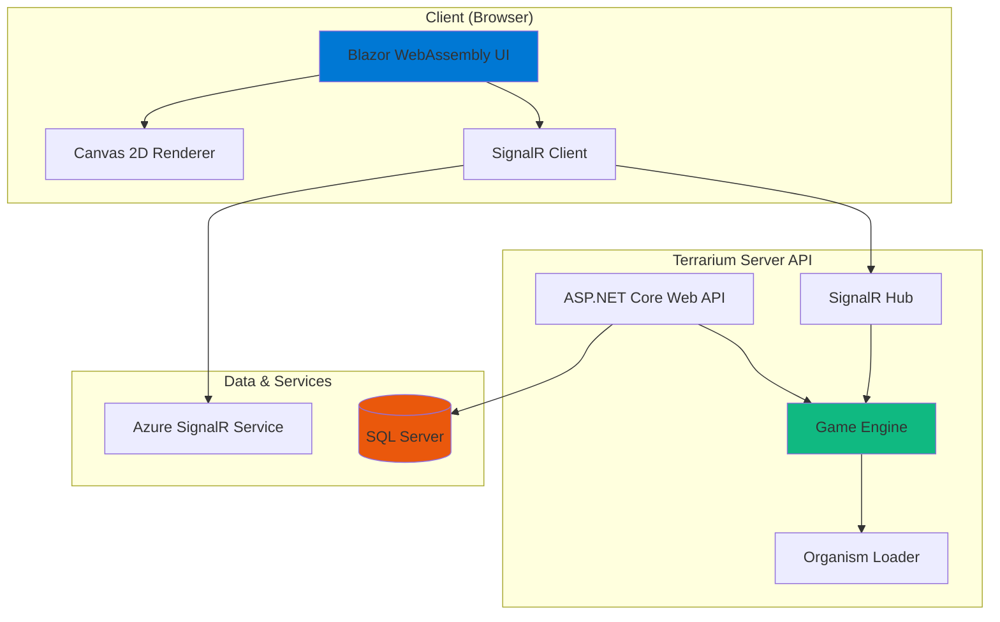

# .NET Terrarium

> **A 25-year-old peer-to-peer creature ecosystem — reborn on .NET 10**


.NET Terrarium is a multiplayer networked ecosystem simulation where you write C# code to create autonomous creatures that compete for survival. Originally built by the .NET Framework team in 2001 to showcase .NET 1.0, this project has been completely modernized from .NET Framework 3.5 to **.NET 10** with a **Blazor WebAssembly frontend**, **SignalR real-time networking**, **Canvas 2D rendering**, and **Azure Container Apps deployment**.

## 🚀 Quick Start

```bash
# Clone the repository
git clone https://github.com/terrarium-game/terrarium.git
cd terrarium

# Run with .NET Aspire (starts Server API + Web UI + Dashboard)
dotnet run --project src/Terrarium.AppHost

# Open the Terrarium Web UI
# https://localhost:5001 (or the URL shown in the Aspire dashboard)
```

The Aspire dashboard (`https://localhost:15001`) shows all running services, logs, and telemetry.

## 🧬 How Terrarium Works

In Terrarium, you create **creatures** (herbivores, carnivores, or plants) by writing C# classes that inherit from base organism types. Each creature has:

- **Genetic traits**: eyesight radius, speed, defensive power, attacking power, energy capacity
- **Autonomous behavior**: your code controls how the creature moves, hunts, eats, defends, and reproduces
- **Energy mechanics**: creatures consume energy with every action and must eat to survive

Creatures are compiled into **DLLs** and uploaded to the Terrarium server. The game engine instantiates your creature class and calls your `PerformIdleAction()` method every game tick (~100ms). Your creature must:

1. Scan the environment (using `LookFor()` to detect nearby organisms)
2. Decide on an action (move, attack, eat, reproduce, defend)
3. Execute the action (via `BeginMoving()`, `BeginAttacking()`, `BeginEating()`, etc.)
4. Manage energy (or starve and die)

### Game Modes

- **Ecosystem Mode**: Your creature competes in a global, distributed ecosystem shared across all connected clients. Creatures teleport between clients via SignalR.
- **Terrarium Mode**: Run a local, isolated ecosystem for testing. No networking, full control.

## 🏗️ Architecture



### Project Structure

| Project | Purpose |
|---------|---------|
| **Terrarium.Web** | Blazor WebAssembly frontend with Canvas 2D renderer |
| **Terrarium.Server** | ASP.NET Core Web API + SignalR hub |
| **Terrarium.Game** | Core game engine (organism lifecycle, physics, collision detection) |
| **Terrarium.OrganismBase** | SDK for creature developers — base classes and attributes |
| **Terrarium.Net** | SignalR networking and peer-to-peer teleportation |
| **Terrarium.Configuration** | Typed configuration with validation |
| **Terrarium.Services** | HTTP services (species registration, statistics, leaderboard) |
| **Terrarium.AppHost** | .NET Aspire orchestrator |
| **Terrarium.ServiceDefaults** | Aspire service defaults (telemetry, health checks) |

See [`ARCHITECTURE.md`](ARCHITECTURE.md) for the full dependency graph and component interactions.

## 📦 Creating Your First Creature

### Step 1: Install the SDK

```bash
dotnet add package Terrarium.OrganismBase
```

Or use the creature template:

```bash
# Install the template
dotnet new install Terrarium.Templates

# Create a new creature project
dotnet new terrarium-creature --name MyAwesomeBug --type Carnivore

# Build and pack
dotnet build
```

### Step 2: Inherit from a Base Class

```csharp
using OrganismBase;

[AnimalSkin(AnimalSkinFamily.Spider)]
[PointsValue(5)]
[MaximumEnergyPoints(100)]
[EatingSpeedPoints(3)]
[AttackDamagePoints(8)]
public class MyAwesomeBug : Carnivore
{
    public override void PerformIdleAction(IdleEventArgs e)
    {
        // 1. Scan for prey
        var prey = (Animal?)LookFor(LookForTargetType.Prey);
        
        if (prey != null)
        {
            // 2. Chase and attack
            if (WithinAttackingRange(prey))
                BeginAttacking(prey);
            else
                BeginMoving(new MovementVector(prey.Position, 2));
        }
        else
        {
            // 3. Wander
            BeginMoving(new MovementVector(GetRandomDirection(), 2));
        }
    }
}
```

### Step 3: Upload to Terrarium

1. Build your creature project → produces `MyAwesomeBug.dll`
2. Open the Terrarium Web UI
3. Go to **"Introduce Creature"**
4. Upload the DLL
5. Watch your creature spawn and compete!

## 📚 Documentation

- **[SDK Tutorials](docs/sdk/tutorials/)** — Step-by-step guides for building creatures
- **[API Reference](docs/sdk/api/)** — Full API docs for OrganismBase
- **[Deployment Guide](docs/deployment/)** — Deploy to Azure Container Apps
- **[Architecture Deep-Dive](ARCHITECTURE.md)** — Modernization design and dependency graphs
- **[Modernization Log](MODERNIZATION.md)** — 25-year migration journey from .NET 1.0 to .NET 10

## 🛠️ Technology Stack

| Layer | Technology |
|-------|-----------|
| **Frontend** | Blazor WebAssembly, HTML5 Canvas 2D |
| **Backend** | ASP.NET Core 10.0, SignalR (Azure SignalR Service) |
| **Game Engine** | Custom C# simulation engine with collision detection |
| **Creature SDK** | OrganismBase NuGet package (.NET 10) |
| **Data** | SQL Server (Dapper ORM) |
| **Orchestration** | .NET Aspire 13.1 |
| **Deployment** | Azure Container Apps, Azure SignalR, Azure SQL |
| **Build** | .NET 10 SDK, TreatWarningsAsErrors=true |

## 🌍 Contributing

We welcome contributions! Terrarium is a **living educational project** — perfect for learning modern .NET, distributed systems, game engines, and creature AI.

### Areas to Contribute

- **Creature examples**: Build interesting creatures and submit them as samples
- **Rendering**: Enhance the Canvas 2D renderer (particle effects, animations, shaders)
- **Game mechanics**: Balance energy systems, add new organism types, improve physics
- **Networking**: Scale SignalR for 1000+ concurrent clients
- **Creature AI**: Build ML-powered creatures using ML.NET
- **Mobile**: Blazor Hybrid app for iOS/Android

See [`CONTRIBUTING.md`](CONTRIBUTING.md) for guidelines.

## 📜 License

This project is licensed under the [MIT License](license.md).

## 🎮 Community

- **GitHub Issues**: Bug reports and feature requests
- **Discussions**: Share creatures, strategies, and ideas
- **Discord**: [Join the Terrarium Discord](#) _(coming soon)_

---

**Original Terrarium** was created by the .NET Framework team (2001-2005) as a showcase for .NET 1.0/2.0 technologies. This modernization preserves the game's spirit while bringing it into the modern .NET ecosystem.


