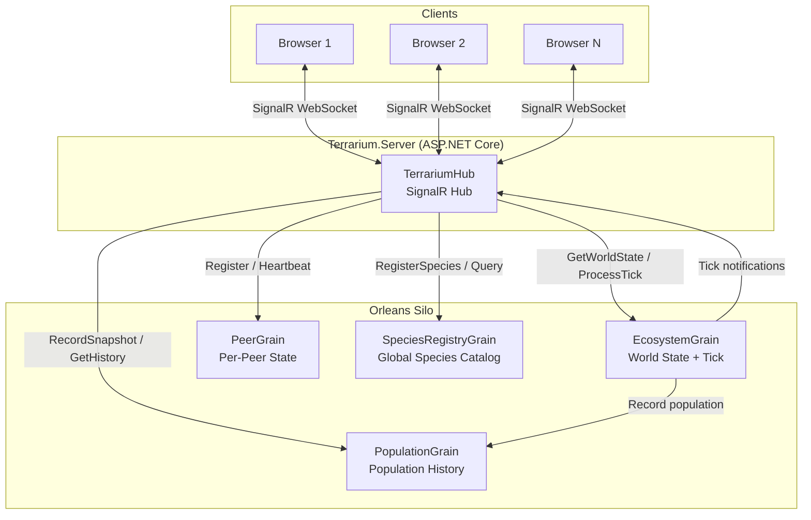
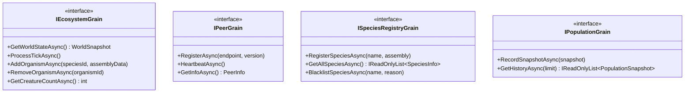
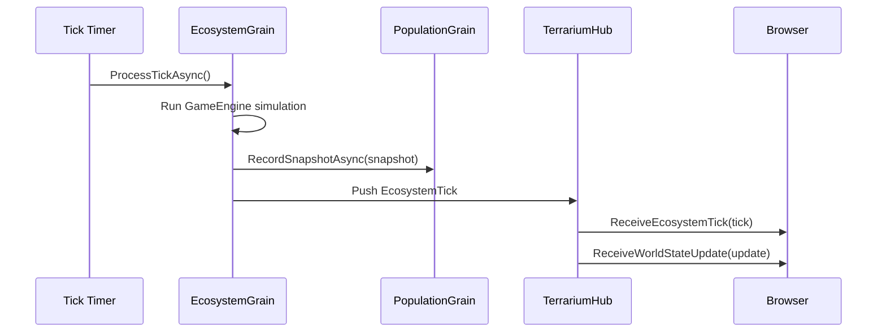
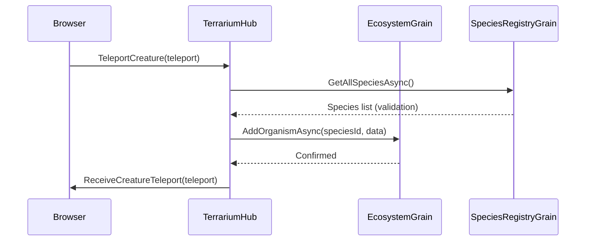
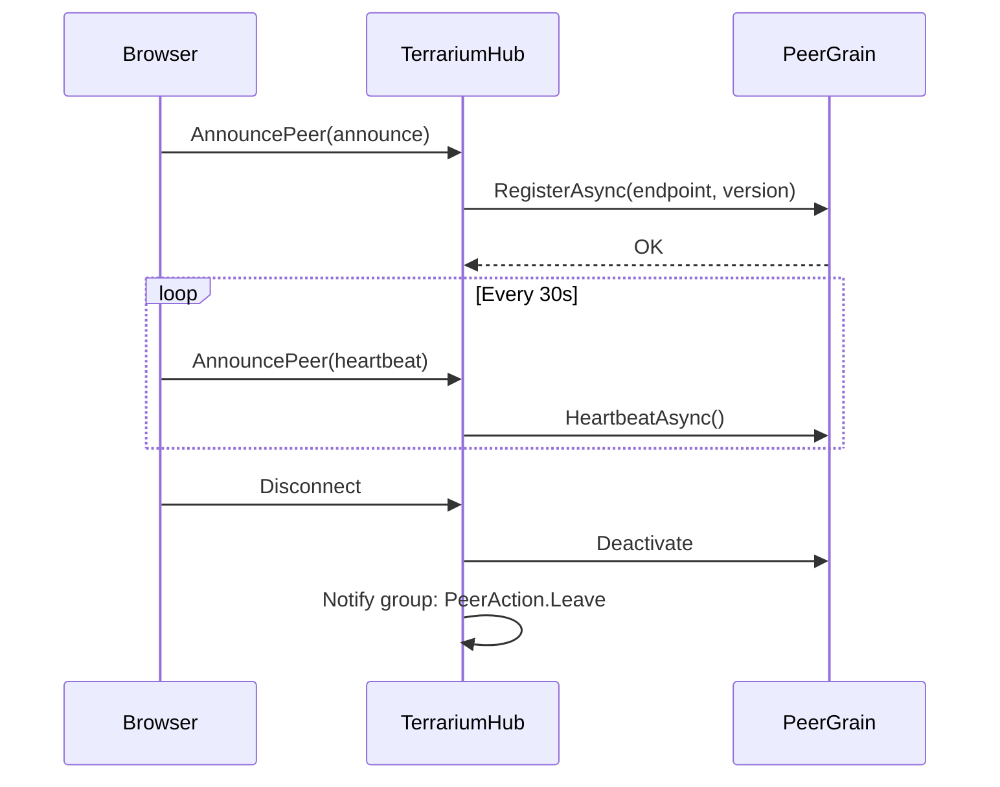
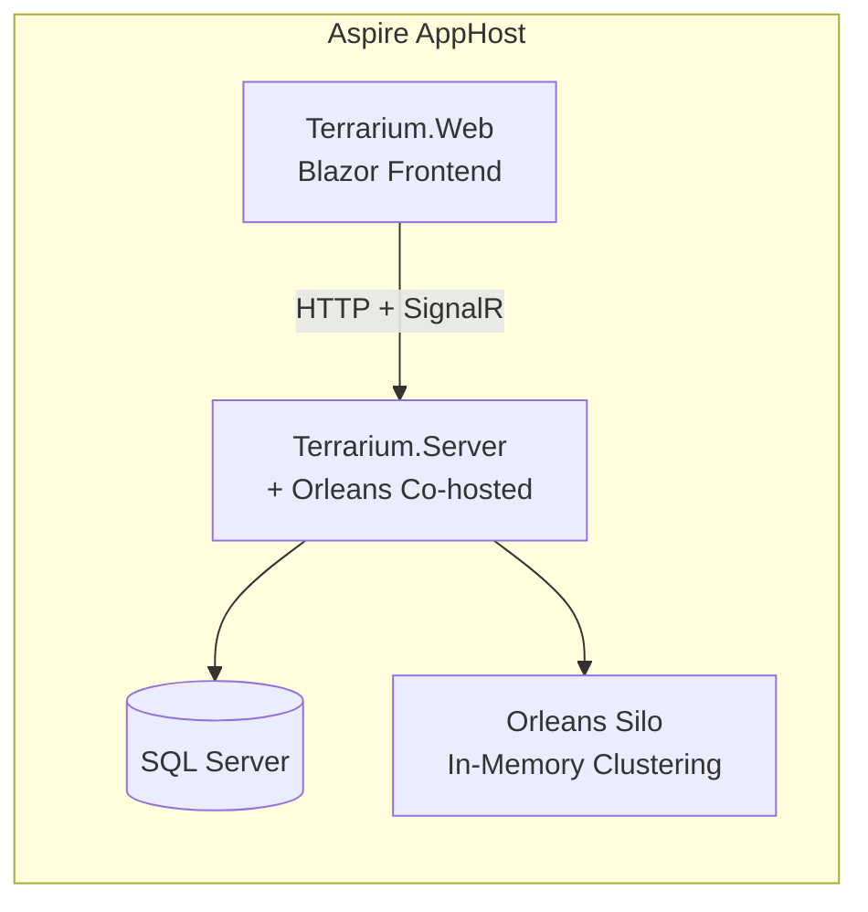

# Hub-and-Spoke Architecture

> Terrarium .NET 10 — Orleans grain architecture for real-time ecosystem simulation
>
> **See also:** [SignalR Hub-and-Spoke Detailed Design](signalr-hub-spoke.md) — full protocol specification, message contracts, error handling, and migration guide.

## Overview

The hub-and-spoke architecture places **Orleans virtual actors (grains)** at the center of all stateful game logic. **SignalR** serves as a thin browser push channel only — it relays messages between clients and grains but holds no domain state.

## Grain Responsibilities

| Grain | Key | Cardinality | Purpose |
|-------|-----|-------------|---------|
| **EcosystemGrain** | Ecosystem ID | One per ecosystem | Owns world state, processes ticks, manages organism lifecycle |
| **PeerGrain** | Peer/Connection ID | One per connected client | Tracks endpoint, version, heartbeat for peer discovery |
| **SpeciesRegistryGrain** | `"global"` | Singleton | Global catalog of registered species assemblies |
| **PopulationGrain** | Ecosystem ID | One per ecosystem | Records population snapshots for trend analysis |

## Message Flow: Ecosystem Tick

## Message Flow: Organism Actions

## Message Flow: Peer Discovery

## Deployment Topology

For local development, Orleans runs co-hosted in the server process with in-memory clustering and grain storage. In production, the silo can be scaled out with Azure Table clustering and Azure Blob grain storage.

## Key Design Decisions

1. **Orleans owns all stateful domain logic** — grains are the single source of truth for world state, species, peers, and population data.
2. **SignalR is browser push channel only** — the hub delegates all logic to grains and never holds domain state.
3. **SignalR.Orleans backplane** — will be wired in when the package supports .NET 10; in-memory is used for now.
4. **Four grain types** map directly to the four bounded contexts of the original Terrarium game: ecosystem simulation, peer networking, species management, and population analytics.
