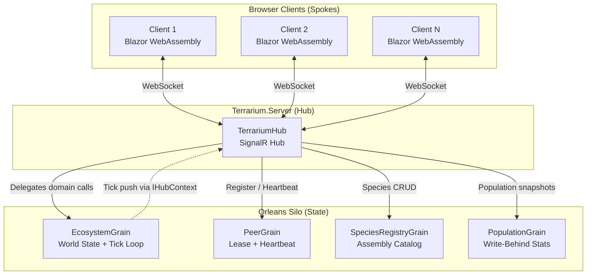
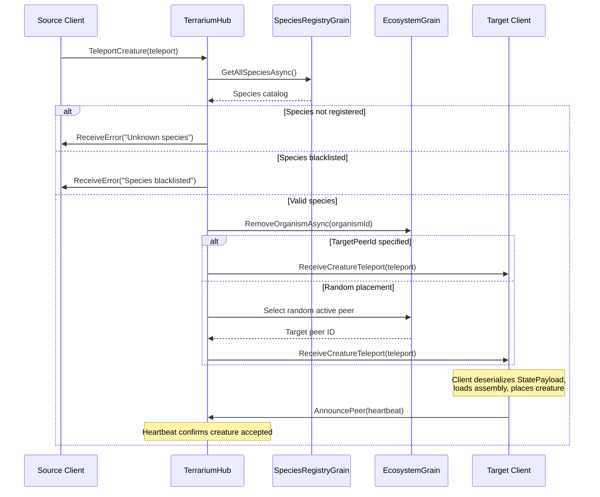
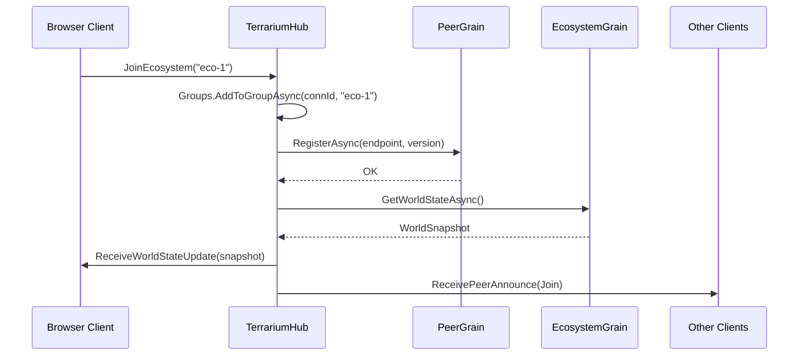
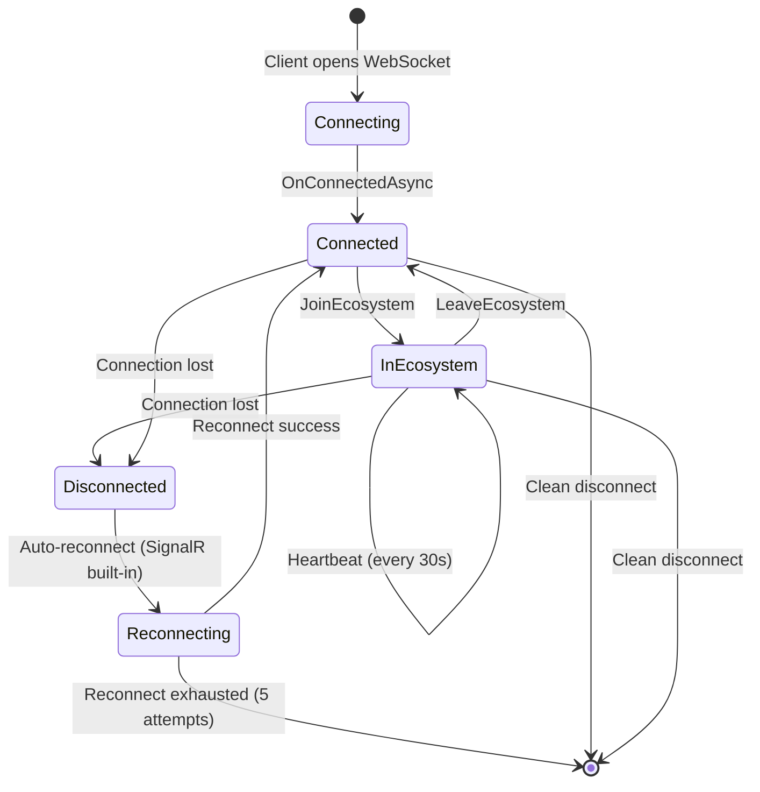
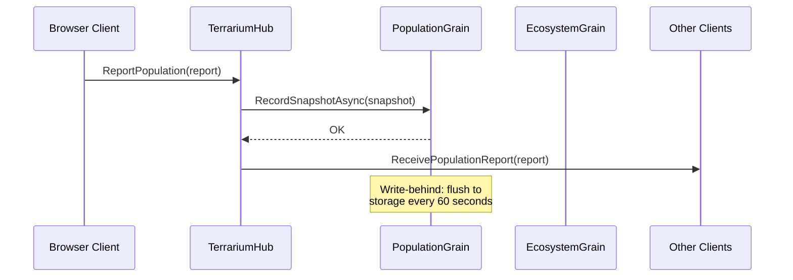
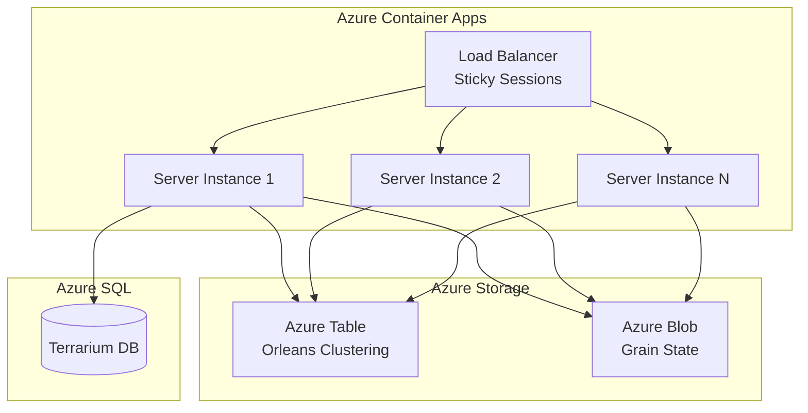
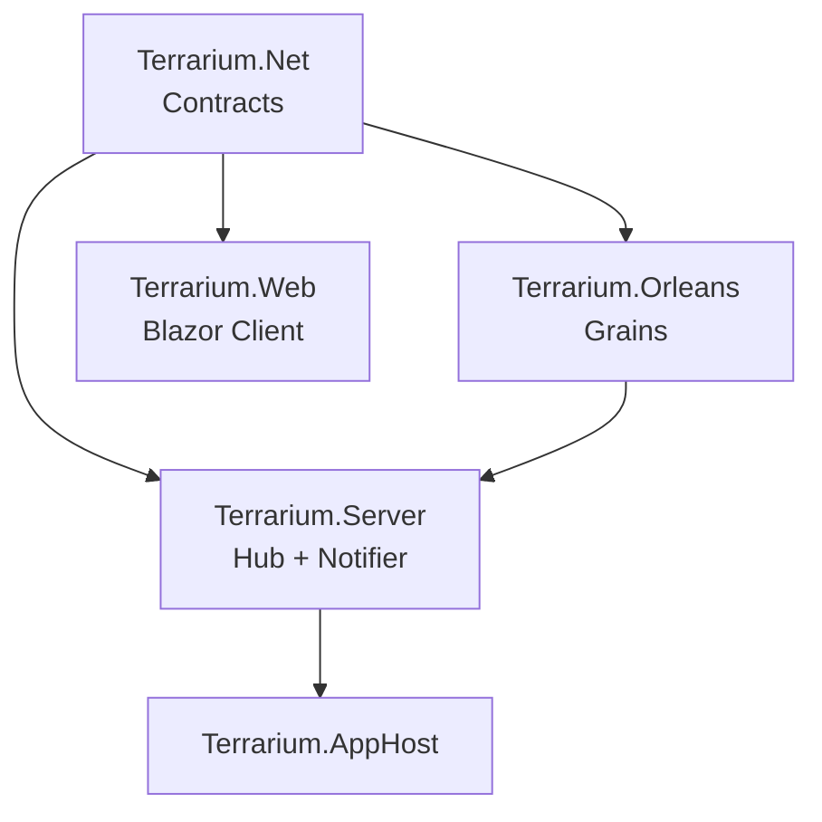

# SignalR Hub-and-Spoke Architecture

> Sprint 7 — Real-Time Communication & Teleportation  
> Terrarium .NET 10 — Replacing legacy TCP P2P with SignalR + Orleans

## 1. Overview

Terrarium's legacy networking used direct HTTP/TCP connections between peers: each client ran an HTTP listener on port 50000 and executed a 4-step teleportation handshake (version check → assembly check → assembly transfer → state transfer) against random peers discovered via a polling web service.

The modernized architecture replaces all of this with a **hub-and-spoke topology**:

- **Hub (center):** `TerrariumHub` — a SignalR strongly-typed hub running inside `Terrarium.Server`. The hub is a thin relay that delegates all stateful logic to Orleans grains.
- **Spokes (edges):** Browser clients connected via WebSocket. Each client maintains a single persistent SignalR connection to the hub.
- **State layer:** Orleans grains own all domain state. The hub never holds mutable game state — it's a pass-through.



### Why Hub-and-Spoke, Not Peer-to-Peer

| Concern | Legacy P2P | Hub-and-Spoke |
|---------|-----------|---------------|
| **Connectivity** | Each peer needs inbound port 50000 open | Single outbound WebSocket — works behind NAT, firewalls, proxies |
| **Discovery** | 5-minute polling loop to SOAP service | Server pushes peer list changes in real-time |
| **Teleportation** | 4-step HTTP handshake per creature | Single hub method call; hub routes to target |
| **State consistency** | Each peer has its own truth | Orleans grains are single source of truth |
| **Scaling** | O(N²) peer connections | O(N) spoke connections to central hub |
| **Security** | No auth on HTTP listener | ASP.NET Core auth pipeline on hub |

## 2. Hub Contract — `ITerrariumHub`

These are methods **clients invoke on the server**. The hub validates inputs, delegates to Orleans grains, and pushes results back through `ITerrariumClient` callbacks.

```csharp
public interface ITerrariumHub
{
    // Ecosystem lifecycle
    Task JoinEcosystem(string ecosystemId);
    Task LeaveEcosystem(string ecosystemId);
    Task<WorldStateUpdate> RequestWorldState(string ecosystemId);

    // Creature teleportation
    Task TeleportCreature(CreatureTeleport teleport);

    // Peer management
    Task AnnouncePeer(PeerAnnounce announce);
    Task Heartbeat(string ecosystemId);
    Task<PeerListResponse> RequestPeerList(string ecosystemId);

    // Population reporting
    Task ReportPopulation(PopulationReport report);
}
```

### Method Specifications

| Method | Orleans Grain | Group Broadcast | Notes |
|--------|--------------|-----------------|-------|
| `JoinEcosystem` | `PeerGrain.RegisterAsync` | `ReceivePeerAnnounce` to group | Adds connection to SignalR group; registers peer grain |
| `LeaveEcosystem` | `PeerGrain` deactivate | `ReceivePeerAnnounce` to group | Removes from group; revokes lease |
| `RequestWorldState` | `EcosystemGrain.GetWorldStateAsync` | — | Returns current snapshot to caller only |
| `TeleportCreature` | `EcosystemGrain` (validation) | `ReceiveCreatureTeleport` to target | Validates species, routes to target or random peer |
| `AnnouncePeer` | `PeerGrain.RegisterAsync` | `ReceivePeerAnnounce` to group | Version/channel info for compatibility gating |
| `Heartbeat` | `PeerGrain.HeartbeatAsync` | — | Renews lease; no broadcast |
| `RequestPeerList` | `EcosystemGrain` (peer enumeration) | — | Returns active peers in ecosystem |
| `ReportPopulation` | `PopulationGrain.RecordSnapshotAsync` | `ReceivePopulationReport` to group | Write-behind population stats |

## 3. Client Contract — `ITerrariumClient`

These are methods **the server invokes on connected clients**. Strongly typed via `Hub<ITerrariumClient>`.

```csharp
public interface ITerrariumClient
{
    // Ecosystem state
    Task ReceiveEcosystemTick(EcosystemTick tick);
    Task ReceiveWorldStateUpdate(WorldStateUpdate update);

    // Creature teleportation
    Task ReceiveCreatureTeleport(CreatureTeleport teleport);

    // Peer events
    Task ReceivePeerAnnounce(PeerAnnounce announce);
    Task ReceivePeerList(PeerListResponse peerList);

    // Population
    Task ReceivePopulationReport(PopulationReport report);

    // Errors
    Task ReceiveError(HubError error);
}
```

### Callback Specifications

| Callback | Delivery | Trigger |
|----------|----------|---------|
| `ReceiveEcosystemTick` | Group broadcast | Grain timer fires `ProcessTickAsync` |
| `ReceiveWorldStateUpdate` | Caller only (on request) or group (after tick) | `RequestWorldState` or post-tick push |
| `ReceiveCreatureTeleport` | Targeted client | `TeleportCreature` routed by hub |
| `ReceivePeerAnnounce` | Group broadcast (excluding sender) | Peer joins, leaves, or disconnects |
| `ReceivePeerList` | Caller only | `RequestPeerList` response |
| `ReceivePopulationReport` | Group broadcast | Population snapshot recorded |
| `ReceiveError` | Caller only | Validation failure, grain error, or rate limit |

## 4. Orleans Grain Integration

The hub **never** holds domain state. Every hub method follows the same pattern:

```
Client → Hub method → Grain call → (optional) Broadcast result
```

### Grain-to-Hub Communication

Orleans grains push state changes to SignalR clients via `IHubContext<TerrariumHub, ITerrariumClient>` injected into grain services. The grain does **not** reference SignalR directly — a `IEcosystemNotifier` abstraction mediates the boundary:

```mermaid
graph LR
    EG[EcosystemGrain] -->|Calls| EN[IEcosystemNotifier]
    EN -->|Implements via| HC[IHubContext<br/>TerrariumHub]
    HC -->|Pushes to| CG[SignalR Group<br/>ecosystem-{id}]
```

```csharp
public interface IEcosystemNotifier
{
    Task NotifyTickAsync(string ecosystemId, EcosystemTick tick);
    Task NotifyWorldStateAsync(string ecosystemId, WorldStateUpdate update);
    Task NotifyTeleportAsync(string targetConnectionId, CreatureTeleport teleport);
    Task NotifyPopulationAsync(string ecosystemId, PopulationReport report);
}
```

This keeps `Terrarium.Orleans` decoupled from `Microsoft.AspNetCore.SignalR` — the notifier implementation lives in `Terrarium.Server`.

### Grain Lifecycle and State

| Grain | Activation | Deactivation | Persistence |
|-------|-----------|--------------|-------------|
| `EcosystemGrain` | First `JoinEcosystem` call | Idle timeout (no peers for 10 min) | Grain state storage (world snapshot) |
| `PeerGrain` | `RegisterAsync` on join | `OnDisconnectedAsync` or lease expiry | In-memory only (transient by nature) |
| `SpeciesRegistryGrain` | First species registration | Never (singleton) | Grain state storage (species catalog) |
| `PopulationGrain` | First snapshot recorded | Idle timeout | Grain state storage (rolling history) |

## 5. Creature Teleportation Flow

The legacy 4-step TCP handshake is collapsed into a single SignalR call. Assembly caching is handled server-side by `SpeciesRegistryGrain`.



### Teleport Message Structure

The `CreatureTeleport` message carries everything needed in a single payload — no multi-round-trip handshake:

| Field | Purpose | Legacy Equivalent |
|-------|---------|-------------------|
| `TeleportId` | Idempotency key | New (legacy had no dedup) |
| `OrganismId` | Creature identity | `TeleportState.Organism` |
| `SpeciesAssemblyName` | Type resolution | Assembly name from `TeleportWorkItem` |
| `StatePayload` | JSON-serialized organism state | `BinaryFormatter` serialized `TeleportState` |
| `AssemblyPayload` | Base64 assembly bytes (if needed) | Binary POST to `/organisms/assemblies` |
| `SourcePeerId` | Originating connection | Source IP address |
| `TargetPeerId` | Destination (null = random) | `PeerManager.GetRandomPeer()` |

### Assembly Caching Strategy

The legacy system checked each peer individually for assembly presence. The modernized flow uses `SpeciesRegistryGrain` as a central cache:

1. First teleport of a species includes `AssemblyPayload`.
2. Hub registers assembly with `SpeciesRegistryGrain`.
3. Subsequent teleports omit `AssemblyPayload` — target client fetches from the registry if missing.
4. Clients maintain a local assembly cache and only request assemblies they don't have.

## 6. Peer Discovery and Registration

### Legacy vs. Modern

| Step | Legacy | Modern |
|------|--------|--------|
| Register | HTTP POST to discovery SOAP service every 5 min | `JoinEcosystem` → `PeerGrain.RegisterAsync` (once) |
| Discover | Parse `DataSet` of IPs from SOAP response | `RequestPeerList` → grain-enumerated active peers |
| Validate | `GET /version` to each peer | Version in `PeerAnnounce.Version` at join time |
| Heartbeat | Implicit via re-registration polling | Explicit `Heartbeat` call every 30 seconds |
| Leave | Thread abort / process exit | `LeaveEcosystem` or `OnDisconnectedAsync` |

### Registration Sequence



## 7. Connection Lifecycle

### State Machine



### Connection Events

| Event | Hub Handler | Grain Impact | Client Notification |
|-------|------------|--------------|---------------------|
| **Connect** | `OnConnectedAsync` | None (no ecosystem yet) | — |
| **Join Ecosystem** | `JoinEcosystem` | `PeerGrain.RegisterAsync` | `ReceivePeerAnnounce(Join)` to group |
| **Heartbeat** | `Heartbeat` | `PeerGrain.HeartbeatAsync` | — |
| **Leave Ecosystem** | `LeaveEcosystem` | Grain deactivation | `ReceivePeerAnnounce(Leave)` to group |
| **Disconnect** | `OnDisconnectedAsync` | `PeerGrain` lease revoked | `ReceivePeerAnnounce(Leave)` to group |
| **Reconnect** | `OnConnectedAsync` (new connection) | Client must re-join ecosystem | — |

### Heartbeat and Lease Expiry

- Clients send `Heartbeat` every **30 seconds** (configurable).
- `PeerGrain` tracks `LastHeartbeat`. If no heartbeat for **90 seconds** (3× interval), the grain marks the peer as expired.
- `EcosystemGrain` periodically sweeps expired peers and broadcasts `PeerAction.Leave` for each.
- This replaces the legacy 5-minute polling interval with real-time presence detection.

### Reconnection Strategy

SignalR's built-in automatic reconnect handles transient disconnects:

```
Attempt 1: immediate
Attempt 2: 2 seconds
Attempt 3: 10 seconds
Attempt 4: 30 seconds
Attempt 5: 60 seconds
(then give up — client shows reconnect UI)
```

On successful reconnect, the client receives a **new connection ID**. It must:
1. Re-call `JoinEcosystem` to rejoin the SignalR group.
2. Re-call `AnnouncePeer` to register the new connection ID with `PeerGrain`.
3. Call `RequestWorldState` to resync (it may have missed ticks during disconnection).

## 8. Population Reporting Flow

The legacy system reported population via SOAP every 600 ticks. The modernized flow uses real-time SignalR push with Orleans write-behind persistence.



### Population Report Structure

```csharp
public sealed class PopulationReport
{
    public required string EcosystemId { get; init; }
    public required long TickNumber { get; init; }
    public required IReadOnlyList<SpeciesPopulation> Species { get; init; }
    public int TotalOrganisms { get; init; }
    public DateTimeOffset Timestamp { get; init; } = DateTimeOffset.UtcNow;
}

public sealed class SpeciesPopulation
{
    public required string SpeciesName { get; init; }
    public int Population { get; init; }
    public int Births { get; init; }
    public int Deaths { get; init; }
}
```

## 9. Error Handling Strategy

### Principles

1. **Never throw from hub methods.** Return error information via `ReceiveError` callback — SignalR exceptions kill the connection.
2. **Idempotent operations.** Teleport IDs, tick numbers, and timestamps enable safe retries.
3. **Fail open for non-critical paths.** Population reporting failures don't block gameplay.
4. **Fail closed for critical paths.** Invalid teleports are rejected; species validation is mandatory.

### Error Categories

| Category | Example | Hub Behavior | Client Behavior |
|----------|---------|-------------|-----------------|
| **Validation** | Unknown species, malformed payload | `ReceiveError` with details | Show error, no retry |
| **Rate Limit** | Too many teleports/sec | `ReceiveError` with retry-after | Back off, retry after delay |
| **Grain Failure** | Orleans grain timeout | `ReceiveError` with transient flag | Auto-retry with backoff |
| **Connection** | WebSocket dropped | SignalR auto-reconnect | Reconnect + rejoin ecosystem |
| **Version Mismatch** | Client too old | `ReceiveError` on `JoinEcosystem` | Show "update required" UI |

### `HubError` Message

```csharp
public sealed class HubError
{
    public required string Code { get; init; }
    public required string Message { get; init; }
    public bool IsTransient { get; init; }
    public int? RetryAfterMs { get; init; }
    public string? CorrelationId { get; init; }
}
```

### Error Codes

| Code | Meaning | Transient |
|------|---------|-----------|
| `UNKNOWN_SPECIES` | Species assembly not registered | No |
| `SPECIES_BLACKLISTED` | Species has been banned | No |
| `TELEPORT_FAILED` | Creature transfer failed | Yes |
| `RATE_LIMITED` | Too many requests | Yes |
| `GRAIN_UNAVAILABLE` | Orleans grain timed out | Yes |
| `VERSION_MISMATCH` | Client version incompatible | No |
| `ECOSYSTEM_FULL` | Ecosystem at max peer capacity | No |
| `INVALID_PAYLOAD` | Malformed message data | No |

### Rate Limiting

Hub methods are rate-limited per connection:

| Method | Limit | Window |
|--------|-------|--------|
| `TeleportCreature` | 10 calls | 60 seconds |
| `ReportPopulation` | 2 calls | 60 seconds |
| `RequestWorldState` | 5 calls | 60 seconds |
| `RequestPeerList` | 2 calls | 60 seconds |
| `Heartbeat` | 3 calls | 60 seconds |

Exceeding the limit returns `ReceiveError` with code `RATE_LIMITED` and `RetryAfterMs`.

## 10. SignalR Groups and Routing

### Group Strategy

Each ecosystem maps to one SignalR group named `ecosystem-{ecosystemId}`. All broadcast operations target this group.

| Routing Target | SignalR Method | Use Case |
|---------------|---------------|----------|
| All in ecosystem | `Clients.Group(ecosystemId)` | Tick updates, population reports |
| All except sender | `Clients.OthersInGroup(ecosystemId)` | Peer announcements |
| Specific client | `Clients.Client(connectionId)` | Teleport delivery, error responses |
| Caller only | `Clients.Caller` | `RequestWorldState`, `RequestPeerList` responses |

### Message Size Limits

SignalR default max message size is 32 KB. Relevant constraints:

| Message | Typical Size | Notes |
|---------|-------------|-------|
| `EcosystemTick` | ~200 bytes | Well within limits |
| `WorldStateUpdate` | ~500 bytes | Metadata only; no organism detail |
| `PeerAnnounce` | ~300 bytes | Lightweight |
| `CreatureTeleport` (without assembly) | ~2 KB | JSON state payload |
| `CreatureTeleport` (with assembly) | Up to 256 KB | Requires increased `MaximumReceiveMessageSize` |
| `PopulationReport` | ~1-5 KB | Depends on species count |

Configure `MaximumReceiveMessageSize` to **512 KB** to accommodate assembly transfers:

```csharp
builder.Services.AddSignalR(options =>
{
    options.MaximumReceiveMessageSize = 512 * 1024;
    options.KeepAliveInterval = TimeSpan.FromSeconds(15);
    options.ClientTimeoutInterval = TimeSpan.FromSeconds(60);
});
```

## 11. Deployment and Scaling

### Local Development (Aspire)

```mermaid
graph LR
    subgraph AppHost [".NET Aspire AppHost"]
        Web[Terrarium.Web<br/>Blazor Server]
        Server[Terrarium.Server<br/>SignalR + Orleans]
        SQL[(SQL Server<br/>Docker)]
    end

    Web -->|HTTP + WebSocket| Server
    Server -->|ADO.NET| SQL
    
    Note right of Server: Orleans: in-memory clustering<br/>SignalR: in-process backplane
```

### Production (Azure Container Apps)



**Sticky sessions** are required for SignalR WebSocket connections. Azure Container Apps supports session affinity via `Affinity` ingress setting.

**Orleans clustering** via Azure Table Storage enables multi-instance silos. `SignalR.Orleans` backplane routes cross-silo messages — no Redis needed.

## 12. Project Structure

| Project | Responsibility |
|---------|---------------|
| `Terrarium.Net` | Contracts: `ITerrariumHub`, `ITerrariumClient`, message types |
| `Terrarium.Orleans` | Grain interfaces, grain implementations, Orleans models |
| `Terrarium.Server` | `TerrariumHub` implementation, `IEcosystemNotifier`, SignalR configuration |
| `Terrarium.Web` | Blazor client, SignalR JavaScript/C# client setup |
| `Terrarium.AppHost` | Aspire orchestration, Orleans + SignalR wiring |

### Dependency Flow



## 13. Migration from Legacy

| Legacy Component | Replaced By | Sprint |
|-----------------|-------------|--------|
| `NetworkEngine` (HTTP listener, port 50000) | `TerrariumHub` (SignalR WebSocket) | 7 |
| `PeerManager` (Hashtable of peers) | `PeerGrain` (Orleans) | 7 |
| `TeleportWorkItem` (4-step TCP handshake) | `TeleportCreature` (single hub call) | 7 |
| `VersionNamespaceHandler` (XML version check) | `PeerAnnounce.Version` field | 7 |
| `OrganismsNamespaceHandler` (assembly/state endpoints) | `CreatureTeleport` message + `SpeciesRegistryGrain` | 7 |
| `PeerDiscoveryService` (SOAP polling) | `RequestPeerList` + server push | 7 |
| `ReportingService` (SOAP population reports) | `ReportPopulation` + `PopulationGrain` | 7 |
| `PopulationData` (600-tick batching) | Real-time `PopulationReport` + grain write-behind | 7 |
