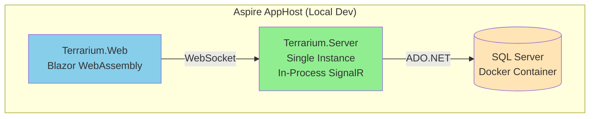
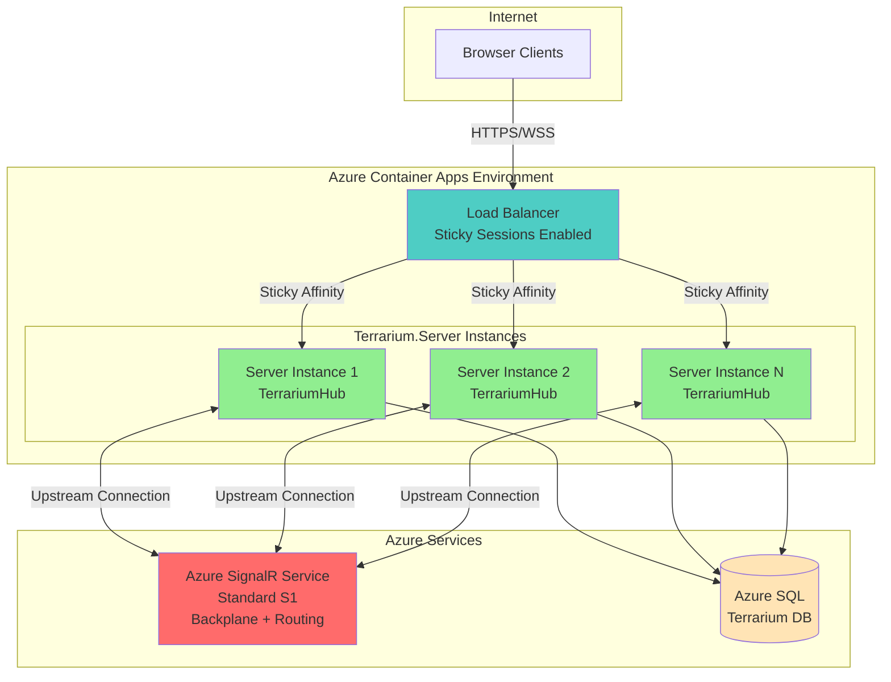
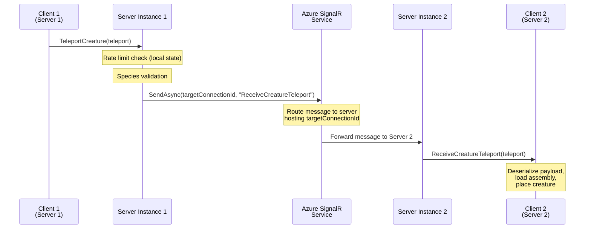
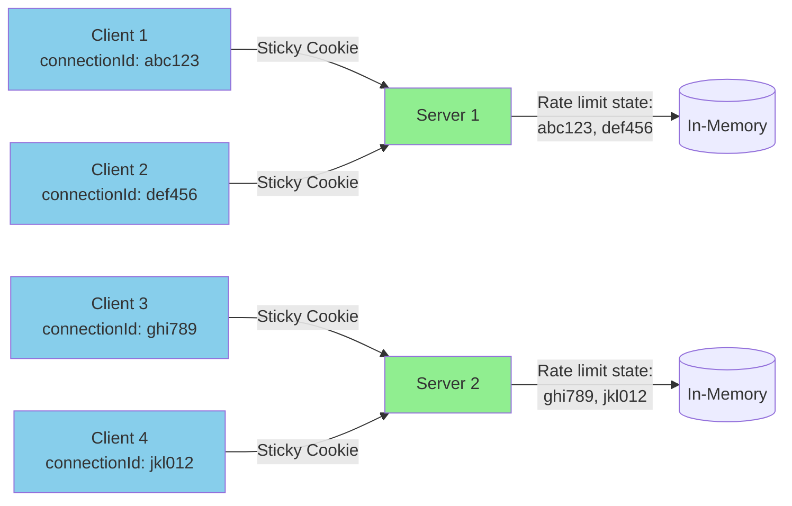
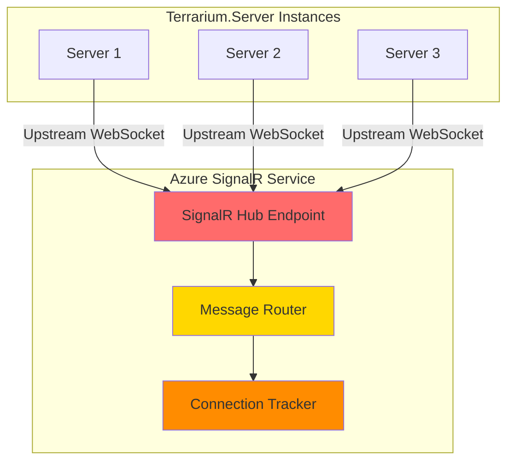
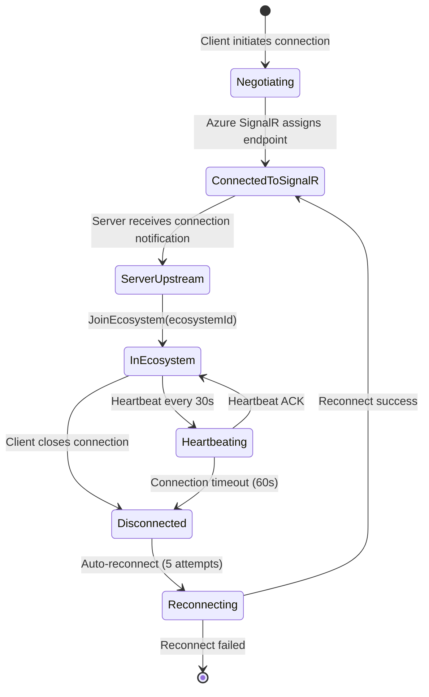

# SignalR Scaling Architecture

> Sprint 11 — Azure SignalR Service Integration  
> Terrarium .NET 10 — Horizontal scaling for multi-server deployment

## 1. Overview

Terrarium's SignalR hub operates in two modes:

1. **Local Development:** In-process SignalR with single-server architecture (default for Aspire local runs)
2. **Production:** Azure SignalR Service backplane for horizontal scaling across multiple Container App instances

This document describes the scaling architecture, deployment topology, configuration, and operational characteristics of the production setup.

### Key Scaling Decisions

| Concern | Decision | Rationale |
|---------|----------|-----------|
| **Backplane** | Azure SignalR Service | Managed service eliminates need for Redis; native integration with ASP.NET Core SignalR |
| **Sticky Sessions** | Required (`ServerStickyMode.Required`) | TerrariumHub maintains per-connection rate limit state in-memory; sticky sessions keep clients pinned to same server instance |
| **SKU** | Standard S1 (1 unit) | Supports 1,000 concurrent connections; 1M messages/day; scales to S10 for 100K connections |
| **Service Mode** | Default | Allows server-to-client AND client-to-server messages (required for `TerrariumHub` RPC calls) |
| **Message Routing** | Hub-and-spoke topology preserved | Azure SignalR routes messages between server instances; clients still connect via hub pattern |

## 2. Architecture Diagrams

### Local Development (In-Process SignalR)



**Characteristics:**
- Single `Terrarium.Server` instance
- SignalR backplane: in-memory (no cross-server routing)
- All clients connect to the same process
- Rate limiting state is local to the process
- No sticky session complexity

### Production (Azure SignalR Service)



**Characteristics:**
- Multiple `Terrarium.Server` instances (1-3 replicas, auto-scaling)
- Azure SignalR Service acts as central backplane
- Sticky sessions pin clients to same server instance
- Cross-server message routing via Azure SignalR upstream connections
- Rate limiting state is server-local (sticky sessions ensure consistency)

### Message Flow — Cross-Server Teleportation

When a creature teleports from a client on Server Instance 1 to a client on Server Instance 2:



**Key Points:**
- Server Instance 1 never directly connects to Server Instance 2
- Azure SignalR tracks which server instance hosts which `connectionId`
- `SendAsync` with a specific `connectionId` is routed by Azure SignalR to the correct upstream server
- Group broadcasts (`Clients.Group(...)`) are fan-out to all servers with group members

### Sticky Session Routing

Azure Container Apps load balancer uses **session affinity** to keep clients pinned to the same server instance:



**Why Sticky Sessions Are Required:**

`TerrariumHub` maintains per-connection rate limit state in-memory (see `s_rateLimits` in `TerrariumHub.cs`). If a client's requests are load-balanced across multiple server instances, rate limit state would be inconsistent:

- Request 1 → Server A: 1 teleport recorded
- Request 2 → Server B: 0 teleports recorded (different memory space)
- Client could bypass rate limits by spreading requests across servers

Sticky sessions solve this by ensuring all requests from a given `connectionId` hit the same server instance, so rate limit state is always consistent.

### Azure SignalR Service Upstream Connections

Each `Terrarium.Server` instance establishes a persistent **upstream connection** to Azure SignalR Service:



**Upstream Connection Characteristics:**
- **Protocol:** WebSocket with SignalR protocol
- **Lifetime:** Persistent for the lifetime of the server process
- **Authentication:** Connection string with access key
- **Health Checks:** Azure SignalR pings server; server responds or connection is dropped
- **Reconnection:** Automatic reconnect on transient failures (exponential backoff)

When a server instance calls `Clients.Client(connectionId).ReceiveCreatureTeleport(...)`, the message flow is:
1. Server → Azure SignalR (via upstream connection)
2. Azure SignalR routes message to the server hosting `connectionId`
3. That server → Client (via downstream WebSocket)

## 3. Configuration

### Aspire AppHost Configuration

The `Terrarium.AppHost` configures Azure SignalR as an Aspire resource:

```csharp
// src/Terrarium.AppHost/Program.cs
var signalR = builder.AddAzureSignalR("signalr")
    .RunAsEmulator(emulator => emulator.WithLifetime(ContainerLifetime.Session));

var server = builder.AddProject<Projects.Terrarium_Server>("server")
    .WithReference(signalR)  // Injects ConnectionStrings__signalr
    // ...
```

**Local Dev Behavior:**
- `RunAsEmulator()` starts the Azure SignalR emulator (Docker container)
- `ContainerLifetime.Session` keeps the emulator alive only while Aspire is running
- Connection string is auto-injected as `ConnectionStrings__signalr`

**Production Deployment:**
- Aspire generates Bicep with `Microsoft.SignalRService/signalR` resource
- Connection string is stored as a Container App secret
- Server reads `ConnectionStrings__signalr` from environment

### Server Configuration

The `Terrarium.Server` conditionally enables Azure SignalR based on configuration:

```csharp
// src/Terrarium.Server/Program.cs
var signalRBuilder = builder.Services.AddSignalR(options =>
{
    options.MaximumReceiveMessageSize = 512 * 1024; // 512 KB
    options.KeepAliveInterval = TimeSpan.FromSeconds(15);
    options.ClientTimeoutInterval = TimeSpan.FromSeconds(60);
});

var signalRConnectionString = builder.Configuration.GetConnectionString("signalr");
if (!string.IsNullOrEmpty(signalRConnectionString))
{
    signalRBuilder.AddAzureSignalR(options =>
    {
        options.ServerStickyMode = Microsoft.Azure.SignalR.ServerStickyMode.Required;
    });
    builder.Services.AddSingleton<IHostedService>(sp =>
        new SignalRScalingService(sp.GetRequiredService<ILogger<SignalRScalingService>>()));
}
```

**Logic:**
- If `ConnectionStrings__signalr` is **present** → Azure SignalR mode (production)
- If `ConnectionStrings__signalr` is **absent** → In-process mode (local dev)
- `ServerStickyMode.Required` enforces sticky session requirement
- `SignalRScalingService` logs startup message for observability

### Bicep Infrastructure

Azure SignalR Service is provisioned via Bicep:

```bicep
// infra/main.bicep
resource signalR 'Microsoft.SignalRService/signalR@2024-03-01' = {
  name: 'signalr-${environmentName}'
  location: location
  sku: {
    name: 'Standard_S1'
    tier: 'Standard'
    capacity: 1
  }
  properties: {
    features: [
      {
        flag: 'ServiceMode'
        value: 'Default'
      }
      {
        flag: 'EnableConnectivityLogs'
        value: 'true'
      }
    ]
    cors: {
      allowedOrigins: ['*']
    }
    serverless: {
      connectionTimeoutInSeconds: 60
    }
  }
}
```

**SKU Selection:**

| SKU | Max Connections | Messages/Day | Use Case |
|-----|----------------|--------------|----------|
| Free | 20 | 20,000 | Dev/test only |
| Standard_S1 | 1,000 | 1M | Small-scale production (current choice) |
| Standard_S10 | 10,000 | 10M | Medium-scale |
| Standard_S100 | 100,000 | 100M | Large-scale |

**Feature Flags:**
- `ServiceMode: Default` — Allows bidirectional communication (client→server and server→client)
- `EnableConnectivityLogs` — Logs connection events to Azure Monitor for diagnostics

**Connection String Injection:**

```bicep
// infra/main.bicep — Server Container App secrets
secrets: [
  {
    name: 'signalr-connection'
    value: listKeys(signalR.id, signalR.apiVersion).primaryConnectionString
  }
]

// Environment variable mapping
env: [
  {
    name: 'ConnectionStrings__signalr'
    secretRef: 'signalr-connection'
  }
]
```

### Container Apps Sticky Sessions

```bicep
// infra/main.bicep — Server Container App ingress
configuration: {
  ingress: {
    external: false
    targetPort: 8080
    transport: 'http'
    stickySessions: {
      affinity: 'sticky'
    }
  }
}
```

**Sticky Session Behavior:**
- Azure Container Apps load balancer sets a `StatefulSet` cookie
- Cookie value identifies the target server instance
- All subsequent requests with that cookie are routed to the same instance
- Cookie lifetime: 24 hours (default)

## 4. Scaling Characteristics

### Auto-Scaling Rules

Container Apps auto-scaling is based on concurrent requests:

```bicep
// infra/main.bicep
scale: {
  minReplicas: 1
  maxReplicas: 3
}
```

**Scaling Triggers:**
- HTTP concurrent request count (default threshold: 10 requests/instance)
- CPU or memory thresholds (can be configured via `rules`)
- Custom metrics (Azure SignalR connection count, message rate)

**Scaling Timeline:**
- Scale-out: ~30-60 seconds (new instance starts, connects to Azure SignalR, becomes healthy)
- Scale-in: ~5 minutes idle grace period before instance termination

### Connection Capacity Planning

| Component | Limit | Current Setting | Notes |
|-----------|-------|-----------------|-------|
| Azure SignalR S1 | 1,000 connections | 1 unit | Increase to S10 for 10K connections |
| Server instance (0.5 CPU, 1 GB) | ~500 connections | No hard limit set | ASP.NET Core default: 100K concurrent connections |
| Container Apps max replicas | 3 instances | Configurable | Total capacity: 1,500 connections (500 × 3) |

**Current Bottleneck:** Azure SignalR S1 (1,000 connections). Server instances can handle more load if SignalR SKU is upgraded.

**Scaling Strategy:**
1. **0-1,000 connections:** 1 server instance, SignalR S1
2. **1,000-10,000 connections:** 3-5 server instances, SignalR S10
3. **10,000+ connections:** 10+ server instances, SignalR S100 or multiple SignalR services with geo-distribution

### Message Throughput

| Operation | Size | Rate Limit (per connection) | Max Throughput (1,000 connections) |
|-----------|------|----------------------------|-----------------------------------|
| `TeleportCreature` | ~2 KB (no assembly), ~256 KB (with assembly) | 10/60s | 10,000 teleports/min |
| `Heartbeat` | ~200 bytes | 3/60s | 3,000 heartbeats/min |
| `ReportPopulation` | ~1-5 KB | 2/60s | 2,000 reports/min |
| `EcosystemTick` (broadcast) | ~200 bytes | Server-initiated | ~1,000 messages/sec (1 per connection) |

**Azure SignalR S1 Throughput:**
- **Inbound:** 1,000 messages/sec (client → server)
- **Outbound:** 2,000 messages/sec (server → client)
- **Broadcast:** 2,000 messages/sec (group broadcasts)

**Current overhead:** Well within limits. `EcosystemTick` broadcasts at 1 tick/sec consume 1,000 messages/sec of outbound capacity (50% of S1 broadcast limit).

## 5. Operational Characteristics

### Connection Lifecycle with Azure SignalR



**Connection Establishment:**
1. Client calls `HubConnectionBuilder.WithUrl("/hubs/terrarium").Build().StartAsync()`
2. SignalR negotiate: `POST /hubs/terrarium/negotiate` → Azure SignalR endpoint returned
3. Client opens WebSocket to Azure SignalR endpoint
4. Azure SignalR routes connection to least-loaded server instance (respects sticky sessions if cookie present)
5. Server's `OnConnectedAsync` fires → connection is ready

**Reconnection Behavior:**
- SignalR client auto-reconnects on transient failures (network blip, server restart)
- Reconnect attempts: immediate, 2s, 10s, 30s, 60s (5 total)
- On reconnect success, client gets a **new `connectionId`** → must re-join ecosystem

### Health Checks

Azure SignalR Service monitors server health via upstream connection pings:

| Check | Interval | Timeout | Action on Failure |
|-------|----------|---------|-------------------|
| SignalR Ping | 5 seconds | 30 seconds | Drop upstream connection |
| Container Apps Health | `/health` endpoint | 30 seconds | 3 consecutive failures → restart instance |
| Liveness | `/alive` endpoint | 10 seconds | 1 failure → restart instance |

**Server Health Endpoint:** Defined in `Terrarium.ServiceDefaults`:

```csharp
// src/Terrarium.ServiceDefaults/Extensions.cs
app.MapHealthChecks("/health");  // Readiness
app.MapHealthChecks("/alive", new HealthCheckOptions
{
    Predicate = r => r.Tags.Contains("live")
});  // Liveness
```

**Custom SignalR Health Check (Future):**
Add a health check that verifies the server's upstream connection to Azure SignalR is active:

```csharp
builder.Services.AddHealthChecks()
    .AddCheck("signalr-upstream", () =>
    {
        // Check if Azure SignalR upstream connection is established
        return HealthCheckResult.Healthy();
    }, ["live"]);
```

### Monitoring and Observability

**Azure SignalR Service Metrics:**
- Connection count (current)
- Inbound/outbound message rate
- Connection errors (per server instance)
- Upstream connection health

**Server Metrics (via Terrarium.ServiceDefaults OpenTelemetry):**
- SignalR connection duration (histogram)
- Hub method invocation rate (counter)
- Rate limit rejections (counter)
- Teleportation latency (histogram)

**Logs to Watch:**
```
Azure SignalR Service enabled — multi-server deployment with sticky sessions.
```
→ Logged on startup when Azure SignalR connection string is detected.

```
Rate limited {ConnectionId} on {Method}
```
→ Logged when per-connection rate limit is exceeded (in-memory state check).

**Tracing:**
All SignalR hub method calls are traced via OpenTelemetry:
- Activity source: `Terrarium.Server`
- Span name: `TerrariumHub/{method}`
- Tags: `connectionId`, `ecosystemId`, `method`

## 6. Failure Modes and Resilience

### Failure Scenario: Azure SignalR Service Outage

**Impact:**
- All client connections are dropped
- Server upstream connections fail
- No SignalR traffic can flow

**Mitigation:**
- Azure SignalR Service SLA: 99.9% uptime (Standard tier)
- Multi-region deployment: Use Azure SignalR replica feature (Premium tier) for geo-redundancy
- Fallback to in-process SignalR: NOT recommended — would require reconfiguration and loses cross-server routing

**Recovery:**
- Azure SignalR auto-recovers (service restart)
- Clients auto-reconnect via SignalR built-in reconnect logic
- Servers re-establish upstream connections automatically

### Failure Scenario: Server Instance Crash

**Impact:**
- All clients connected to that instance are disconnected
- Azure SignalR detects upstream connection loss
- Load balancer stops routing traffic to failed instance

**Mitigation:**
- Container Apps auto-restarts failed instances
- Clients auto-reconnect (routed to healthy instance by load balancer)
- Sticky session cookie becomes invalid → new instance assignment

**Recovery Timeline:**
1. Instance crashes (T+0s)
2. Container Apps detects failure (T+10s)
3. New instance starts (T+30s)
4. New instance connects to Azure SignalR (T+40s)
5. Clients reconnect to new instance (T+40-60s)

### Failure Scenario: Sticky Session Loss

**Impact:**
- Client is routed to a different server instance mid-session
- Rate limit state is on the old instance → client appears to have clean rate limit slate

**Mitigation:**
- Sticky sessions are cookie-based → cookie persists for 24 hours
- Cookie loss is rare (client clears cookies, cookie expires)
- Rate limits are per-connection, not per-user → new connection resets rate limits anyway

**Severity:** Low. Rate limits are a soft defense; species validation and grain-level logic are hard defenses.

## 7. Cost Estimation

| Resource | SKU | Monthly Cost (US East) |
|----------|-----|------------------------|
| Azure SignalR S1 | 1 unit | $49.18/month |
| Container Apps (1-3 instances) | 0.5 vCPU, 1 GB × 3 | ~$30-90/month (depends on usage) |
| Azure SQL Basic | 5 DTU | $4.99/month |
| Container Apps Environment | Included | $0 |

**Total Estimated Cost:** $85-145/month (highly variable based on active hours)

**Cost Optimization:**
- Scale-to-zero for dev/staging environments (Container Apps supports scale-to-zero)
- Use Free tier Azure SignalR for dev/test (20 connections max)
- Auto-scale server instances to minReplicas: 1 during off-peak hours

## 8. Migration Path

### Current State (Sprint 11)

- Local dev: In-process SignalR (no backplane)
- Production: **Not yet deployed** — Azure SignalR infra is ready, pending first production deployment

### Rollout Plan

1. **Sprint 11:** Merge Azure SignalR infrastructure code (this document)
2. **Sprint 12:** Deploy to dev environment (Azure SignalR Free tier + 1 server instance)
3. **Sprint 13:** Load test with 100-500 concurrent clients
4. **Sprint 14:** Deploy to production (Azure SignalR Standard S1 + 1-3 instances)
5. **Sprint 15+:** Monitor and scale SKU as user base grows

### Rollback Plan

If Azure SignalR causes issues in production:

1. Remove `ConnectionStrings__signalr` from Container App environment variables
2. Redeploy server instances → falls back to in-process SignalR
3. Scale to **1 replica only** (multi-instance without backplane = broken cross-server routing)

**Rollback Duration:** ~5 minutes (environment variable change + rolling deployment)

## 9. Testing Strategy

### Load Testing Scenarios

| Scenario | Clients | Action | Success Criteria |
|----------|---------|--------|------------------|
| Connection storm | 1,000 | All connect within 60s | <5% connection failures |
| Steady state | 500 | Join ecosystems, idle | Stable connections for 1 hour |
| Teleportation burst | 100 | 10 teleports/min each | <1% message loss, <500ms p99 latency |
| Cross-server routing | 100 on Server 1, 100 on Server 2 | Teleport between servers | 100% delivery success |
| Scale-out | 500 → 1,000 | Gradual ramp | New instance joins cluster; no connection drops |
| Instance failure | 500 (pinned to 2 instances) | Kill 1 instance | Clients on failed instance reconnect; others unaffected |

### Unit Testing

Azure SignalR integration is tested via `WebApplicationFactory<Program>`:

```csharp
// Test with in-process SignalR (no Azure SignalR connection string)
var factory = new WebApplicationFactory<Program>()
    .WithWebHostBuilder(builder =>
    {
        builder.ConfigureAppConfiguration((context, config) =>
        {
            config.AddInMemoryCollection(new Dictionary<string, string>
            {
                ["ConnectionStrings:signalr"] = null  // Force in-process mode
            });
        });
    });
```

**Future:** Mock `IHubContext` to test Azure SignalR-specific routing logic without actual Azure SignalR connection.

## 10. Related Documentation

- [SignalR Hub-and-Spoke Architecture](./signalr-hub-spoke.md) — Base hub design (pre-scaling)
- [Aspire Orchestration](../src/Terrarium.AppHost/Program.cs) — AppHost configuration
- [Azure Container Apps Ingress](https://learn.microsoft.com/azure/container-apps/ingress-overview) — Sticky sessions, load balancing
- [Azure SignalR Service](https://learn.microsoft.com/azure/azure-signalr/signalr-overview) — Service documentation
- [SignalR Scale-Out](https://learn.microsoft.com/aspnet/core/signalr/scale) — ASP.NET Core SignalR backplane patterns

## 11. Decision Log

### 2025-02-11: Azure SignalR Service over Redis backplane

**Decision:** Use Azure SignalR Service as the SignalR backplane instead of Redis.

**Rationale:**
- Azure SignalR is a managed service (no Redis infrastructure to maintain)
- Native ASP.NET Core SignalR integration (`AddAzureSignalR()`)
- Built-in health checks and monitoring via Azure Monitor
- Sticky session support via `ServerStickyMode`
- Cost: $49/month (S1) vs. $70/month (Azure Cache for Redis Basic C1)

**Alternatives Considered:**
- Redis backplane: More flexible, but requires infrastructure management
- SignalR Orleans backplane: Tightly couples SignalR to Orleans (Sprint 12); deferred until Orleans integration is complete

### 2025-02-11: Sticky sessions required for rate limiting

**Decision:** Enforce sticky sessions via `ServerStickyMode.Required` and Container Apps `stickySessions.affinity: sticky`.

**Rationale:**
- `TerrariumHub` maintains per-connection rate limit state in-memory
- Without sticky sessions, clients could bypass rate limits by spreading requests across instances
- Sticky sessions keep all requests from a `connectionId` on the same server instance

**Alternatives Considered:**
- Distributed rate limiting (Redis): Adds latency to hub method calls; deferred to Sprint 12 (Orleans grain-based rate limiting)
- Remove rate limiting: Unacceptable — rate limits protect against abuse

### 2025-02-11: Standard S1 SKU for initial production

**Decision:** Start with Azure SignalR Standard S1 (1 unit, 1,000 connections).

**Rationale:**
- Current user base: <100 concurrent clients expected in first 6 months
- S1 provides 10× headroom (1,000 connections)
- Can scale to S10 (10,000 connections) or S100 (100,000 connections) without code changes

**Alternatives Considered:**
- Free tier: 20 connections max (too small for even dev/test)
- S10 from day 1: Over-provisioned; unnecessary cost ($490/month vs. $49/month)
