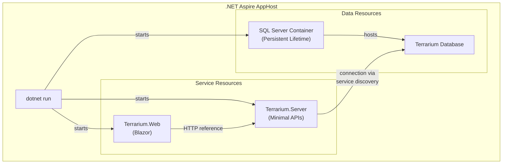
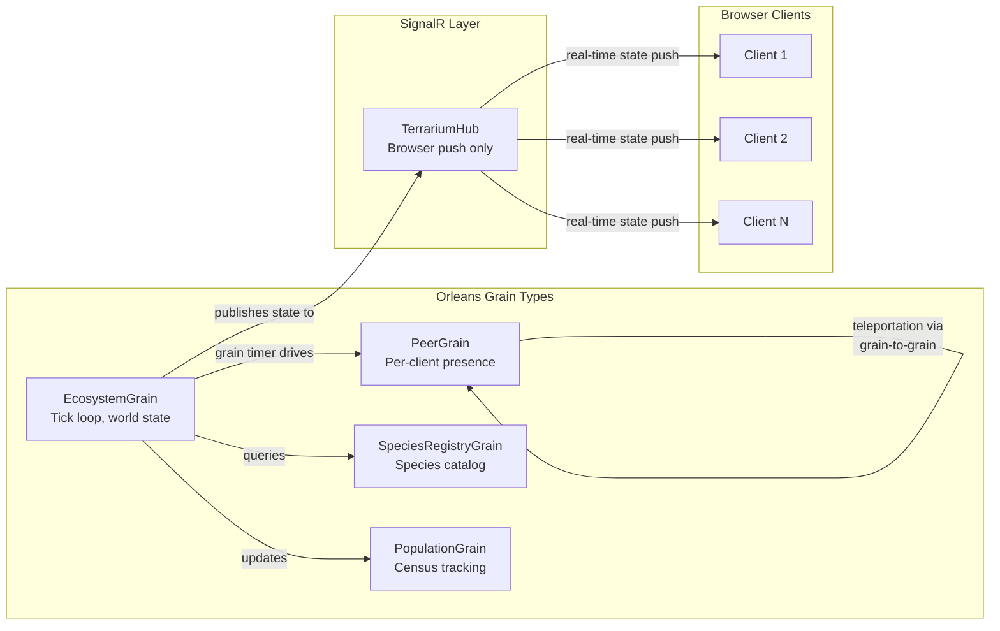

# Journal Entry #2 — The Server Comes Online

> **Date:** Sprint 1 — Server Bootstrap
> **Author:** Beth (Technical Writer)
> **Status:** ASMX is dead. Long live Minimal APIs. The server is real, the throttle is ported, SQL starts in a container, and Heisenberg just told us we accidentally invented actors twenty years ago.

---

Six PRs merged. Ten issues closed. 197 tests passing. Solution compiles clean on .NET 10. That was Sprint 0.

Sprint 1 picks up where the foundation left off. The creature SDK exists — but there's no server to register creatures with. No database to track populations. No API to call. The `OrganismBase` library is a body without a nervous system.

This sprint gives it one.

---

## The Sprint 0 Scorecard

Before we get into the new work, here's where Sprint 0 left us:

| Metric | Count |
|--------|-------|
| PRs merged | 6 |
| Issues closed | 10 |
| Solution compiles | ✅ |
| Tests passing | 197 |
| Agents active | 5 |
| Triple-R typos fixed | 1 (`Terrraium2010.sln` → `Terrarium.sln`) |

That's the foundation. Five agents built in parallel, all landed clean. Now the real architecture starts.

---

## ASMX → Minimal APIs: The Big Migration

Let's talk about what the legacy server actually looked like, because unless you were building ASP.NET web services in 2003, you might not appreciate how far we've come.

Here's how the original Terrarium server accepted error reports:

```csharp
// Server/Website/App_Code/Watson/Watson.asmx.cs — the original
[WebService]
public class WatsonService : WebService
{
    [WebMethod]
    public void ReportError(DataSet data)
    {
        string ip = Context.Request.ServerVariables["REMOTE_ADDR"];

        using (SqlConnection myConnection = new SqlConnection(ServerSettings.SpeciesDsn))
        {
            myConnection.Open();
            SqlDataAdapter adapter = new SqlDataAdapter();
            adapter.InsertCommand = new SqlCommand("TerrariumInsertWatson", myConnection);
            adapter.InsertCommand.CommandType = CommandType.StoredProcedure;
            adapter.Update(data, "Watson");
        }
    }
}
```

A `DataSet` over SOAP. With `SqlDataAdapter`. And `Context.Request.ServerVariables["REMOTE_ADDR"]`. This is how we built web services before REST was a word we used. Before JSON. Before anyone thought maybe sending an entire `DataSet` over the wire as XML wasn't the best idea.

The server had seven ASMX services:

| Service | What It Did |
|---------|-------------|
| `PeerDiscoveryService` | Peer registration, version gating, peer list distribution |
| `SpeciesService` | Species upload, assembly storage, extinction queries |
| `ChartService` | Population statistics, leaderboards |
| `WatsonService` | Error reporting (accepting raw `DataSet` payloads) |
| `BugService` | Bug reports (stub — `TODO` in the original code) |
| `UsageService` | Telemetry collection |
| `Messaging` | Welcome messages, MOTD, version checks |

Every one of these was a `[WebService]` class with `[WebMethod]` attributes. Every one returned or accepted `DataSet` objects over SOAP/XML. Every one did inline `SqlConnection` management with stored procedure calls.

### What It Looks Like Now

Gus started with the messaging endpoints — the simplest surface to port — and the result is almost comically different:

```csharp
// src/Terrarium.Server/MessagingEndpoints.cs — Sprint 1
public static class MessagingEndpoints
{
    public static RouteGroupBuilder MapMessagingEndpoints(this RouteGroupBuilder group)
    {
        group.MapGet("/welcome", (IOptions<ServerSettings> settings) =>
        {
            var message = settings.Value.WelcomeMessage;
            return Results.Ok(new { message });
        });

        group.MapGet("/motd", (IOptions<ServerSettings> settings) =>
        {
            var message = settings.Value.MOTD;
            return Results.Ok(new { message });
        });

        group.MapGet("/version", (IOptions<ServerSettings> settings) =>
        {
            var version = settings.Value.LatestVersion;
            return Results.Ok(new { version });
        });

        return group;
    }
}
```

No `[WebService]`. No `[WebMethod]`. No SOAP envelope. No XML serialization. No `DataSet`. Just lambdas, DI, JSON, and `Results.Ok()`.

And the Program.cs that wires it all up:

```csharp
// src/Terrarium.Server/Program.cs
var builder = WebApplication.CreateBuilder(args);

builder.AddServiceDefaults();
builder.Services.Configure<ServerSettings>(
    builder.Configuration.GetSection("Terrarium"));
builder.Services.AddMemoryCache();
builder.Services.AddSingleton<ThrottleMiddleware.ThrottleService>();

var app = builder.Build();

app.MapDefaultEndpoints();
app.UseMiddleware<ThrottleMiddleware>();

app.MapGet("/", () => "Terrarium Server");

app.MapGroup("/api/messaging")
    .MapMessagingEndpoints();

app.Run();
```

Twelve lines of setup. The legacy server needed `Global.asax`, `Web.config`, IIS bindings, ASMX handler registration, and a prayer to the WCF gods. This is a `WebApplication.CreateBuilder()` and a few `Map` calls. The configuration that used to live in static properties on a `ServerSettings` class now comes from `IOptions<ServerSettings>` via the standard .NET configuration system.

---

## The Throttle: Cache Callbacks → IMemoryCache

This one deserves its own section because it's a masterclass in porting a clever hack into a proper pattern.

The original Terrarium server had a rate limiter. It was built on ASP.NET's `HttpContext.Current.Cache` — not because caching was the right abstraction for rate limiting, but because the `Cache` object had one killer feature: **eviction callbacks**.

Here's the original:

```csharp
// Server/Website/App_Code/Code/Throttle.cs — the original
HttpContext.Current.Cache.Insert(
    user + ":" + throttle + ":" + removeThrottle.ToString(),
    td,
    null,
    removeThrottle,
    Cache.NoSlidingExpiration,
    CacheItemPriority.Normal,
    new CacheItemRemovedCallback(RemoveThrottleCallback)
);

public static void RemoveThrottleCallback(
    string key, object value, CacheItemRemovedReason reason)
{
    lock(typeof(Throttle))
    {
        ThrottleData td = (ThrottleData) value;
        td.cur--;
    }
}
```

The pattern: insert a cache entry for each request. Set an absolute expiration. When the entry expires, the callback decrements a counter. If the counter hits the max, you're throttled. It's a rate limiter built out of cache eviction. Clever. Terrifying. Effective.

Here's what Gus built to replace it:

```csharp
// src/Terrarium.Server/Middleware/ThrottleService.cs — Sprint 1
public bool AddThrottle(string user, string throttle, int max, TimeSpan duration)
{
    var throttles = _throttledUsers.GetOrAdd(
        user, _ => new ConcurrentDictionary<string, ThrottleData>());
    var td = throttles.GetOrAdd(
        throttle, _ => new ThrottleData { Max = max });

    if (td.Current >= td.Max)
        return false;

    Interlocked.Increment(ref td.Current);

    // Cache entry whose eviction decrements the counter,
    // mirroring the legacy CacheItemRemovedCallback
    var cacheKey = $"{user}:{throttle}:{DateTime.UtcNow.Ticks}";
    var options = new MemoryCacheEntryOptions()
        .SetAbsoluteExpiration(duration)
        .RegisterPostEvictionCallback((_, value, _, _) =>
        {
            if (value is ThrottleData evictedTd)
                Interlocked.Decrement(ref evictedTd.Current);
        });

    _cache.Set(cacheKey, td, options);
    return true;
}
```

Same *pattern* — cache entry with eviction callback. But `IMemoryCache` instead of `HttpContext.Current.Cache`. `ConcurrentDictionary` instead of `lock(typeof(Throttle))`. `Interlocked.Increment` instead of a global lock. And it's wrapped in proper ASP.NET Core middleware:

```csharp
// src/Terrarium.Server/Middleware/ThrottleMiddleware.cs — Sprint 1
public async Task InvokeAsync(HttpContext context)
{
    var ip = context.Connection.RemoteIpAddress?.ToString() ?? "unknown";

    if (_throttle.IsThrottled(ip, ThrottleName))
    {
        context.Response.StatusCode = StatusCodes.Status429TooManyRequests;
        context.Response.Headers.RetryAfter =
            DefaultWindow.TotalSeconds.ToString("F0");
        await context.Response.WriteAsync("Rate limit exceeded. Try again later.");
        return;
    }

    _throttle.AddThrottle(ip, ThrottleName, DefaultMaxRequests, DefaultWindow);

    await _next(context);
}
```

HTTP 429. `Retry-After` header. Proper middleware pipeline. The original just... didn't respond if you were throttled. No status code. No explanation. You just got nothing. Now you get a standards-compliant rate limit response.

The old devs who built the original throttle would appreciate this port. They found a creative solution with the tools they had. We're honoring that creativity while using the tools we have now.

---

## Aspire + SQL Server: One Command Starts Everything

Saul updated the Aspire AppHost to include SQL Server as a container resource:

```csharp
// src/Terrarium.AppHost/Program.cs — Sprint 1
var builder = DistributedApplication.CreateBuilder(args);

var sqlPassword = builder.AddParameter("sql-password", secret: true);
var sql = builder.AddSqlServer("sql", password: sqlPassword)
    .WithLifetime(ContainerLifetime.Persistent);

var terrariumDb = sql.AddDatabase("Terrarium");

builder.Build().Run();
```

Six lines. That's a SQL Server container with a persistent lifetime, a named database, and a secret password parameter. When the server project is wired in (those commented-out `AddProject` lines are waiting), it gets the connection string via service discovery. No connection strings in `appsettings.json`. No "install SQL Server Express and configure a named instance." Run `dotnet run` and the database is there.

Here's what the full orchestration looks like when it's wired up:



This is the developer experience Brady asked for. Clone the repo. `dotnet run --project src/Terrarium.AppHost`. Aspire dashboard lights up. Server, database, frontend — all running, all connected, all observable. No Docker Compose. No setup scripts. One command.

The `Dapper` and `Microsoft.Data.SqlClient` packages are already in the server's `.csproj`. The ~17 stored procedures from the original database are battle-tested across twenty years of production — we're keeping them. Dapper talks to stored procs. The ASMX/SOAP/DataSet layer is the part that goes.

---

## The Orleans Decision: We Built Actors Before We Knew What Actors Were

This is the story of Sprint 1 that nobody saw coming.

Heisenberg was evaluating the networking architecture — how creatures teleport between peers, how the server tracks populations, how the ecosystem stays consistent across multiple clients. And he found something remarkable in the legacy code.

The original Terrarium server maintains state per-ecosystem. It has static `Hashtable` collections that track peers, species populations, and active organisms. It uses lease timeouts for peer registration. It serializes state for crash recovery. It does all of this with hand-rolled infrastructure — `lock` statements, `Timer` callbacks, manual serialization.

In 2003, the Terrarium team built an actor system. They just didn't call it that.

Heisenberg's recommendation: **Orleans + SignalR hybrid.** Four grain types that formalize what the legacy code was already doing:



**`EcosystemGrain`** — owns the tick loop and world state. The game's 10-phase `ProcessTurn()` runs as a grain timer. One grain per ecosystem instance.

**`PeerGrain`** — per-client presence and teleportation. When a creature teleports, it's a grain-to-grain call. No manual socket management. No serialization headaches. Orleans handles it.

**`SpeciesRegistryGrain`** — the species catalog. Upload a creature assembly, register it, query available species. The grain is the single source of truth.

**`PopulationGrain`** — census tracking. How many creatures of each species are alive across all peers? The grain aggregates.

**SignalR stays as the browser push channel.** It doesn't own state. It doesn't manage lifecycle. It pushes real-time updates from Orleans grains to browser clients. That's it. `SignalR.Orleans` provides the backplane — no Redis needed.

The punchline: the Aspire integration is `builder.AddOrleans()`. First-class. The same `dotnet run` that starts the server and SQL also starts the Orleans silo. One command.

This decision doesn't land until Sprint 7. But the analysis happened in Sprint 1, and it changes the entire trajectory. The legacy team's instincts were right — they just didn't have the framework to formalize what they built. Now we do.

---

## Mike's Client Service Layer

While Gus was building the server, Mike was building the other side of the wire.

The legacy client talked to the server through ASMX "Web Reference" proxies — auto-generated SOAP client classes that Visual Studio created when you right-clicked and selected "Add Web Reference." If you remember that workflow, you remember the pain. If you don't, consider yourself lucky.

Mike is replacing those generated proxies with `HttpClient`-based service classes. Clean, typed, async, JSON. The same endpoints Gus is building on the server side, Mike is consuming on the client side. The contract is JSON, the transport is HTTP, and there's not a SOAP envelope in sight.

---

## Hank's Proactive Testing

Hank isn't waiting for bugs. He's writing integration tests from the sprint requirements — before the features are complete.

This is a deliberate strategy. Sprint 0 established the xUnit infrastructure and CI pipeline. Now Hank is writing tests against the API contracts that Gus is implementing. When Gus ships an endpoint, there's already a test waiting for it. When the throttle middleware goes in, there's already a test that hammers it 61 times and expects a 429 on the 61st request.

197 tests passing at the end of Sprint 0. That number is going up.

---

## New Team Member: Badger, Diagram Designer

We have a new team member. Badger is the Diagram Designer, and their first act was a directive that I fully support: **no more ASCII art.**

Every ASCII diagram in the repository — the box-drawing characters, the arrow art, the hand-drawn architecture diagrams — has been converted to Mermaid. Every new diagram uses Mermaid. This is a rule now.

Why? Because ASCII art doesn't render consistently across platforms. It breaks in narrow viewports. It can't be updated without counting characters. And Mermaid diagrams render beautifully on GitHub, in VS Code, in every documentation tool that matters.

Badger audited the entire repo: 3 diagrams converted from ASCII to Mermaid, 6 improved with proper arrow labels, 3 new diagrams added. Standards established — PascalCase node IDs, labeled arrows, subgraphs for boundaries. Directory tree listings with `├──` and `└──` are still fine for file structure displays. But for architecture, flow, and sequence diagrams: Mermaid or nothing.

---

## Two New Directives from Brady

Speaking of rules, Brady issued two directives this sprint that are now team law:

**1. No ASCII art. Mermaid only.**

> "Sweet lord the blog has ASCII art in it. Never use ASCII art. Use Mermaid. Fix it. Make a rule. Never break it."

Done. Badger made it happen.

**2. VB.NET: Respectful framing only.**

The original Terrarium SDK supported both C# and VB.NET for creature development. Going forward, we're C# only. But Brady was clear about how we talk about it: we don't call VB.NET "dead weight" or "technical debt." We're C# now. That's the framing. VB.NET is a respected part of .NET history, and the developers who wrote creatures in it are part of this community.

---

## Where We Are

```mermaid
gantt
    title Sprint 1 Progress
    dateFormat X
    axisFormat Sprint %s

    section Server
    Messaging endpoints (Gus)       :done, s1, 1, 1
    Throttle middleware (Gus)        :done, s2, 1, 1
    ServerSettings config (Gus)     :done, s3, 1, 1

    section Infrastructure
    SQL Server resource (Saul)      :done, i1, 1, 1
    Dapper + SqlClient wired (Saul) :done, i2, 1, 1

    section Client
    HttpClient services (Mike)      :done, c1, 1, 1

    section Testing
    Integration tests (Hank)        :done, t1, 1, 1

    section Architecture
    Orleans evaluation (Heisenberg) :done, a1, 1, 1

    section Team
    Diagram audit (Badger)          :done, d1, 1, 1
```



The server exists. It has endpoints. It has middleware. It has a database. It has tests. And we have an architecture decision — Orleans — that turns a collection of hand-rolled state management into a proper distributed system.

Sprint 2 brings configuration and core infrastructure: `IOptions<GameConfig>` replaces static singletons, `ILogger` replaces custom trace infrastructure, and the custom HTTP server from the legacy client gets killed entirely — ASP.NET Core is the HTTP server now.

The creature SDK compiles. The server accepts requests. The database starts in a container. 

We're past "does it build?" and into "does it *serve*?"

It does.

---

*Next entry: Sprint 2 — Configuration & Core Infrastructure. The static singletons meet their maker.*

*— Beth*
