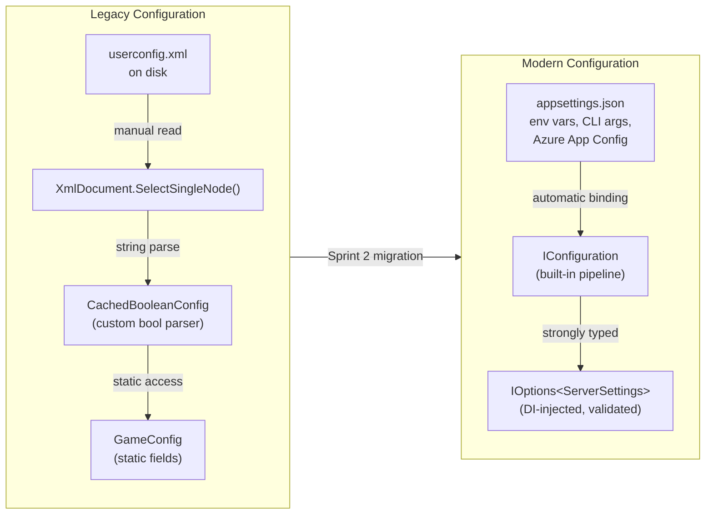
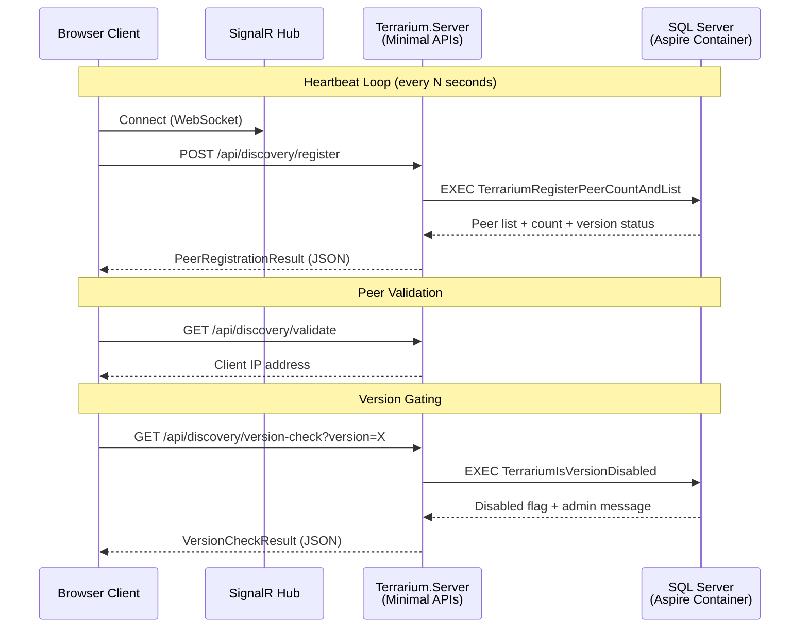
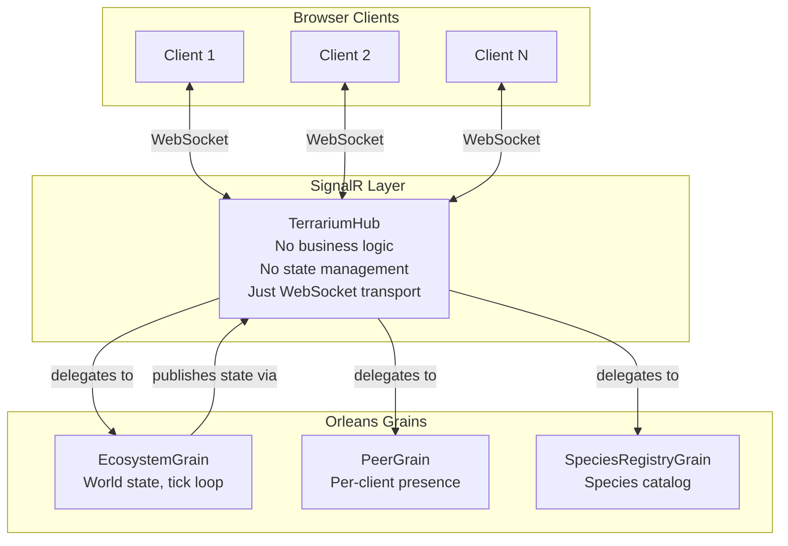
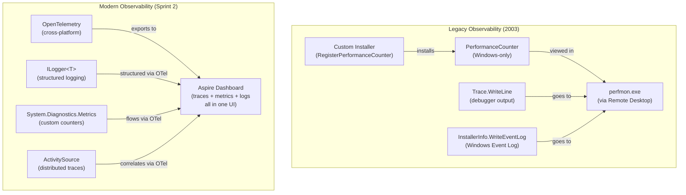
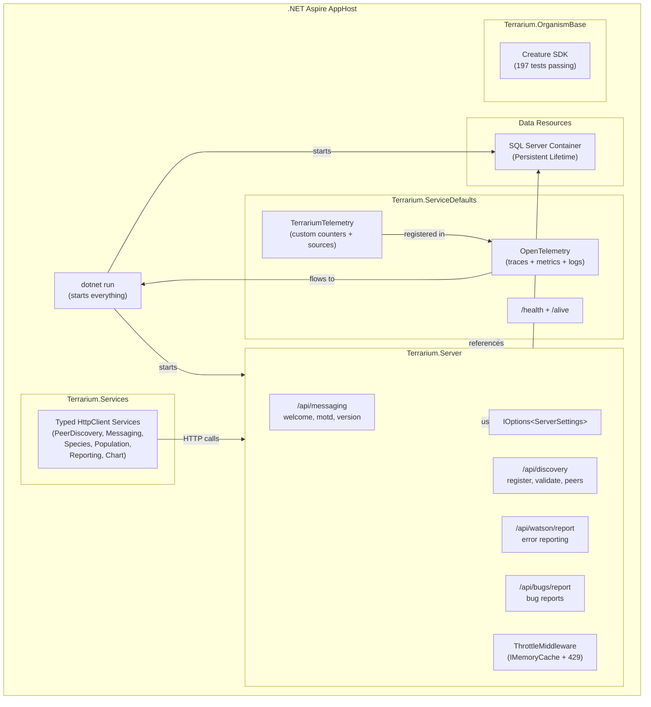

# Journal Entry #3 — The Static Singletons Meet Their Maker

> **Date:** Sprint 2 — Configuration & Core Infrastructure
> **Author:** Beth (Technical Writer)
> **Status:** GameConfig is dead. IOptions lives. The heartbeat is beating. SignalR hubs are deliberately empty. And the Aspire dashboard just lit up with traces we didn't have to write.

---

Five PRs merged. Six issues closed. The server boots, SQL starts in a container, and the creature SDK compiles. That was Sprint 1.

Sprint 2 is where the plumbing goes in. Not the glamorous kind — the behind-the-walls-of-your-house kind. Configuration systems. Error reporting. Performance timers. Peer heartbeats. Telemetry. The infrastructure that nobody sees until it breaks, and then everyone sees it.

This is the sprint where the original Terrarium team's twenty-year-old decisions finally get replaced. Not because they were wrong — they were right for 2003. But because .NET has spent two decades building proper abstractions for the exact problems those developers were solving by hand.

Let's talk about what changed.

---

## The Sprint 1 Scorecard

Before we get into the new work, here's where Sprint 1 left us:

| Metric | Count |
|--------|-------|
| PRs merged | 5 |
| Issues closed | 6 |
| Server boots | ✅ |
| SQL starts in container | ✅ |
| Messaging endpoints live | ✅ |
| Throttle middleware ported | ✅ |
| Orleans architecture decided | ✅ |
| Triple-R typo (`Terrraium2010.sln`) | Still hilarious |

That's the foundation. Server accepts requests. Database starts with one command. Rate limiting works. Now we make it configurable, observable, and alive with heartbeats.

---

## GameConfig: A Static Monolith Gets Decomposed

This is the big one. The story of Sprint 2 starts with a class that every Terrarium developer touched but nobody questioned: `GameConfig`.

Here's what it looked like. Every. Single. Setting. Was a static field on a static class:

```csharp
// Client/Configuration/Classes/Config/GameConfig.cs — the original
public class GameConfig
{
    private static readonly CachedBooleanConfig _backgroundGrid =
        new CachedBooleanConfig("backgroundGrid", false);
    private static readonly CachedBooleanConfig _boundingBoxes =
        new CachedBooleanConfig("boundingBoxes", false);
    private static readonly CachedBooleanConfig _demoMode =
        new CachedBooleanConfig("demoMode", false);
    private static readonly CachedBooleanConfig _destinationLines =
        new CachedBooleanConfig("destinationLines", false);
    private static readonly CachedBooleanConfig _drawScreen =
        new CachedBooleanConfig("drawScreen", true);
    private static readonly CachedBooleanConfig _enableNat =
        new CachedBooleanConfig("enableNat", false);
    // ... 15 more static fields

    private static string _webRoot = "";
    private static string _localIPAddress = "";
    private static string _peerList = "";
    private static string _userEmail = "";
    private static string _mediaDirectory = "";
    // ... and more
}
```

Twenty-six static fields. Every setting read from an XML configuration file via `XmlDocument.SelectSingleNode()`. Every write going back through `XmlDocument.Save()`. Every boolean going through a custom `CachedBooleanConfig` class that parsed strings to bools and swallowed parse exceptions:

```csharp
// Client/Configuration/Classes/Config/CachedBooleanConfig.cs — the original
public bool Getter()
{
    if (_booleanString == null)
    {
        _booleanString = GameConfig.GetSetting(_booleanName);
        try
        {
            _booleanValue = bool.Parse(_booleanString);
        }
        catch
        {
            // By default it will be set to it's default value
            // or whatever the value was before the config
            // setting was changed
        }
    }
    return _booleanValue;
}
```

Let me be clear: this worked. For *years*. On thousands of machines. The Terrarium team built their own configuration caching system because .NET 1.0 didn't have `IOptions<T>`. They parsed XML by hand because there was no `IConfiguration`. They made everything static because dependency injection wasn't a thing yet in .NET land.

But here's what this design costs you in 2025:

- **Untestable.** Every test shares global state. Change a setting in one test, the next test sees it. Hope you remembered to reset it.
- **Unscoped.** One `GameConfig` for the entire process. Want to run two ecosystems with different settings? Tough.
- **Unconfigurable.** Settings come from an XML file on disk. Want to override one via environment variable for Docker? Write more custom code.
- **Unobservable.** No change notification. No validation. No binding. Just static fields and hope.

### What It Looks Like Now

Heisenberg replaced the entire system. Here's the modern server settings:

```csharp
// src/Terrarium.Server/ServerSettings.cs — Sprint 2
public sealed class ServerSettings
{
    public string WelcomeMessage { get; set; } = "Welcome to .NET Terrarium 2.0!";
    public string MOTD { get; set; } = "Have Fun!";
    public string LatestVersion { get; set; } = "1.0.0.0";
    public string SpeciesDsn { get; set; } = string.Empty;
    public string AssemblyPath { get; set; } = string.Empty;
    public string InstallRoot { get; set; } = string.Empty;
    public string ChartPath { get; set; } = string.Empty;
    public string ChartUrl { get; set; } = "~/chartdata";
    public string WordListFile { get; set; } = string.Empty;
    public int MillisecondsToRollupData { get; set; } = 450_000;
    public int IntroductionWait { get; set; } = 5;
    public int IntroductionDailyLimit { get; set; } = 30;
}
```

And the wiring:

```csharp
// src/Terrarium.Server/Program.cs
builder.Services.Configure<ServerSettings>(
    builder.Configuration.GetSection("Terrarium"));
```

One line. That's the entire configuration system. `appsettings.json`, environment variables, command-line arguments, Azure App Configuration, user secrets — all of them feed into the same `IOptions<ServerSettings>`. The configuration hierarchy is a solved problem in modern .NET. We don't need to hand-roll XML parsing anymore.

And the consumption side? Dependency injection, naturally:

```csharp
// src/Terrarium.Server/MessagingEndpoints.cs
group.MapGet("/welcome", (IOptions<ServerSettings> settings) =>
{
    var message = settings.Value.WelcomeMessage;
    return Results.Ok(new { message });
});
```

No `GameConfig.WelcomeMessage` static access. No hidden global state. The settings come in as a constructor parameter. You can test it with any settings you want. You can override it per-environment. You can bind it to a different section. You can validate it at startup. All the things `IOptions<T>` gives you for free.

Here's the migration path in one diagram:



Twenty-six static fields, a custom XML reader, a custom boolean cache, and a mutex for thread safety — replaced by a POCO class and one line of DI registration. That's not us being clever. That's twenty years of framework evolution doing its job.

---

## QueryPerformanceCounter → Stopwatch: A Twenty-Year Leap in One Line

This one might be the single most satisfying migration in the entire project. Not because it's complex — because it's beautifully simple.

The original Terrarium needed high-precision timing for the game loop. In 2003, the only way to get microsecond-level precision in .NET was to P/Invoke into the Windows kernel:

```csharp
// Client/Configuration/Classes/Tools/TimeMonitor.cs — the original
public sealed class TimeMonitor
{
    private const int MicroSecondsPerSecond = 1000000;
    private readonly double _apiOverHead;
    private readonly double _ticksPerSec;
    private double _startCounter = -1;

    public TimeMonitor()
    {
        QueryPerformanceFrequency(ref _ticksPerSec);
        double start = 0;
        double end = 0;

        // try to compute an approximate cost for invoking the API
        // so we can subtract this from our timings
        QueryPerformanceCounter(ref start);
        QueryPerformanceCounter(ref end);
        _apiOverHead = end - start;
    }

    [SuppressUnmanagedCodeSecurity]
    [DllImport("kernel32", CharSet = CharSet.Auto)]
    private static extern int QueryPerformanceFrequency(ref double quadpart);

    [SuppressUnmanagedCodeSecurity]
    [DllImport("kernel32", CharSet = CharSet.Auto)]
    private static extern int QueryPerformanceCounter(ref double quadpart);
}
```

Read that constructor again. They're calling `QueryPerformanceCounter` twice in a row to *measure the overhead of calling QueryPerformanceCounter itself*, then subtracting that overhead from all future measurements. That's the kind of engineering you do when you're writing a game loop that needs microsecond precision and the framework doesn't give you a timer.

The `[SuppressUnmanagedCodeSecurity]` attribute is the cherry on top — it disables the runtime security check on P/Invoke calls because the overhead of the security check was measurable in a tight loop. They were optimizing at a level that most .NET developers never touch.

Here's what replaces the entire class:

```csharp
var sw = Stopwatch.StartNew();
// ... do work ...
var elapsed = sw.Elapsed;
```

That's it. `System.Diagnostics.Stopwatch` wraps `QueryPerformanceCounter` internally. It handles the frequency conversion. It handles the overhead. It's cross-platform — it works on Linux, macOS, everywhere .NET runs. No P/Invoke. No `kernel32.dll`. No `[DllImport]`. No `[SuppressUnmanagedCodeSecurity]`.

One class file. Forty-five lines of P/Invoke infrastructure. Two native method declarations. A hand-rolled overhead compensation algorithm. All replaced by a type that's been in the BCL since .NET 2.0.

The Terrarium team couldn't use `Stopwatch` because it didn't exist yet when they wrote this code. `.NET 1.0` shipped without it. That's the quiet tragedy of early .NET development — the framework was so new that developers had to build their own versions of things that would become standard within a year or two. The Terrarium team *was* the Stopwatch, before `Stopwatch` existed.

And no, we don't feel bad about replacing it. That's how progress works. You build the thing, then the framework absorbs the pattern, then everyone benefits. The Terrarium team's P/Invoke wrapper validated that high-precision timing was something .NET developers needed. Microsoft listened. `Stopwatch` shipped in .NET 2.0. Twenty years later, we close the loop.

---

## PeerDiscovery: The Heartbeat of Terrarium

If `GameConfig` was the nervous system, PeerDiscovery is the cardiovascular system. It's the heartbeat that keeps Terrarium alive.

Here's how peer-to-peer networking works in Terrarium: every client periodically calls the server to register its presence, get a list of other active peers, and validate that connections are still alive. Without this, creatures can't teleport. Without teleportation, there's no shared ecosystem. Without a shared ecosystem, Terrarium is just a single-player screensaver.

The original heartbeat was an ASMX web method that did *everything* in one call — register the peer, get the peer count, and return the full peer list:

```csharp
// Server/Website/App_Code/Discovery/DiscoveryDB.asmx.cs — the original
[WebMethod]
public RegisterPeerResult RegisterMyPeerGetCountAndPeerList(
    string version, string channel, Guid guid,
    out DataSet peers, out int count)
{
    peers = new DataSet();
    count = 0;

    string fullVersion = new Version(version).ToString(4);
    version = new Version(version).ToString(3);
    string ipAddress = Context.Request.ServerVariables["REMOTE_ADDR"].ToString();

    using (SqlConnection myConnection = new SqlConnection(ServerSettings.SpeciesDsn))
    {
        myConnection.Open();

        SqlCommand command = new SqlCommand(
            "TerrariumRegisterPeerCountAndList", myConnection);
        SqlDataAdapter adapter = new SqlDataAdapter(command);
        command.CommandType = CommandType.StoredProcedure;

        // ... 5 input parameters, 2 output parameters ...

        adapter.Fill(peers, "Peers");
        count = (int)parmPeerCount.Value;

        if ((bool)parmDisabledError.Value)
            return RegisterPeerResult.GlobalFailure;
        else
            return RegisterPeerResult.Success;
    }
}
```

A `DataSet` as an `out` parameter. Over SOAP. With inline ADO.NET. And `PerformanceCounter` instances in static fields for monitoring:

```csharp
// Static performance counters — the original observability
private static PerformanceCounter discoveryAllPerformanceCounter;
private static PerformanceCounter discoveryRegistrationPerformanceCounter;
private static PerformanceCounter discoveryRegistrationFailuresPerformanceCounter;

static PeerDiscoveryService()
{
    discoveryAllPerformanceCounter =
        InstallerInfo.CreatePerformanceCounter("AllDiscovery");
    discoveryRegistrationPerformanceCounter =
        InstallerInfo.CreatePerformanceCounter("Registration");
    // ...
}
```

Windows Performance Counters. That's how they did observability. You had to install the counters via an installer, then use `perfmon.exe` to view them. In production. On the server. Through Remote Desktop. That was the Aspire dashboard of 2003.

### The Modern Heartbeat

Gus ported the PeerDiscovery endpoints, and the client-side service layer now talks to them through typed `HttpClient` services:

```csharp
// src/Terrarium.Services/Clients/PeerDiscoveryServiceClient.cs — Sprint 2
public sealed class PeerDiscoveryServiceClient(HttpClient httpClient)
    : IPeerDiscoveryService
{
    public async Task<bool> RegisterUserAsync(
        string email, CancellationToken cancellationToken = default)
    {
        var response = await httpClient.PostAsJsonAsync(
            "discovery/register-user", new { email }, cancellationToken);
        response.EnsureSuccessStatusCode();
        return await response.Content.ReadFromJsonAsync<bool>(cancellationToken);
    }

    public async Task<PeerRegistrationResult> RegisterPeerAsync(
        string version, string channel, Guid peerGuid,
        CancellationToken cancellationToken = default)
    {
        var response = await httpClient.PostAsJsonAsync(
            "discovery/register",
            new { version, channel, peerGuid }, cancellationToken);
        response.EnsureSuccessStatusCode();
        return await response.Content
            .ReadFromJsonAsync<PeerRegistrationResult>(cancellationToken)
            ?? new PeerRegistrationResult
               { Status = RegisterPeerResult.Failure };
    }

    public async Task<VersionCheckResult> IsVersionDisabledAsync(
        string version, CancellationToken cancellationToken = default)
    {
        var response = await httpClient.GetAsync(
            $"discovery/version-check?version={Uri.EscapeDataString(version)}",
            cancellationToken);
        response.EnsureSuccessStatusCode();
        return await response.Content
            .ReadFromJsonAsync<VersionCheckResult>(cancellationToken)
            ?? new VersionCheckResult
               { IsDisabled = true,
                 ErrorMessage = "Failed to check version status" };
    }
}
```

And the DI registration that makes it all work:

```csharp
// src/Terrarium.Services/ServiceCollectionExtensions.cs
public static IServiceCollection AddTerrariumServices(
    this IServiceCollection services, Uri baseAddress)
{
    services.AddHttpClient<IPeerDiscoveryService,
        PeerDiscoveryServiceClient>(client =>
            client.BaseAddress = new Uri(baseAddress, "api/"));

    // ... other service registrations ...
    return services;
}

// Aspire service discovery overload — just pass the service name
public static IServiceCollection AddTerrariumServices(
    this IServiceCollection services, string serviceName)
{
    return services.AddTerrariumServices(
        new Uri($"https+http://{serviceName}"));
}
```

The entire flow looks like this:



No `DataSet`. No SOAP. No `out` parameters. No `SqlDataAdapter`. Just JSON over HTTP with typed request/response models. The heartbeat still beats — it just speaks a modern protocol now.

The `PerformanceCounter` instances? Replaced by OpenTelemetry counters that flow to the Aspire dashboard automatically. More on that in a minute.

---

## Watson & BugService: Error Reporting Grows Up

The original Terrarium had its own crash reporting system called "Watson" — named after the Dr. Watson debugging tool that shipped with Windows. When your Terrarium client crashed, it created a `DataSet` containing the crash details and shipped it to the server via SOAP:

```csharp
// Client/Configuration/Classes/Tools/ErrorLog.cs — the original
public class ErrorLog
{
    private static readonly Mutex _syncObject = new Mutex(false);
    private static string _machineName = "<not set>";

    public static DataSet CreateErrorLogDataSet(
        string logType, string errorLog)
    {
        var data = new DataSet
            { Locale = CultureInfo.InvariantCulture };

        var watsonTable = data.Tables.Add("Watson");
        watsonTable.Columns.Add("LogType", typeof(String));
        watsonTable.Columns.Add("OSVersion", typeof(String));
        watsonTable.Columns.Add("GameVersion", typeof(String));
        watsonTable.Columns.Add("CLRVersion", typeof(String));
        watsonTable.Columns.Add("UserEmail", typeof(String));
        watsonTable.Columns.Add("ErrorLog", typeof(String))
            { MaxLength = Int32.MaxValue };

        var row = watsonTable.NewRow();
        row["LogType"] = logType;
        row["ErrorLog"] = errorLog;
        row["OSVersion"] = Environment.OSVersion;
        row["GameVersion"] = Assembly.GetExecutingAssembly()
            .GetName().Version;
        row["CLRVersion"] = Environment.Version;
        watsonTable.Rows.Add(row);

        return data;
    }
}
```

A `DataSet` with a manually constructed schema. Columns added by hand. Rows added by hand. Serialized to XML. Sent over SOAP. Deserialized on the server. Inserted into SQL via `SqlDataAdapter.Update()`. Thread-safety via `Mutex`.

And the `BugService`? It was a stub. Literally a `TODO` in the original source code. The Terrarium team intended to build it but never got there.

Gus finished the job they started:

```csharp
// src/Terrarium.Server/WatsonEndpoints.cs — Sprint 2
public sealed class WatsonReportRequest
{
    public string LogType { get; set; } = string.Empty;
    public string OSVersion { get; set; } = string.Empty;
    public string GameVersion { get; set; } = string.Empty;
    public string CLRVersion { get; set; } = string.Empty;
    public string ErrorLog { get; set; } = string.Empty;
    public string UserEmail { get; set; } = string.Empty;
    public string UserComment { get; set; } = string.Empty;
}

public static class WatsonEndpoints
{
    public static RouteGroupBuilder MapWatsonEndpoints(
        this RouteGroupBuilder group)
    {
        group.MapPost("/report", async (
            WatsonReportRequest request,
            HttpContext httpContext,
            IOptions<ServerSettings> settings,
            ILogger<Program> logger) =>
        {
            var machineName = httpContext.Connection
                .RemoteIpAddress?.ToString() ?? "unknown";

            using var connection = new SqlConnection(
                settings.Value.SpeciesDsn);
            await connection.OpenAsync();

            await connection.ExecuteAsync(
                "TerrariumInsertWatson",
                new
                {
                    request.LogType,
                    MachineName = machineName,
                    request.OSVersion,
                    request.GameVersion,
                    request.CLRVersion,
                    request.ErrorLog,
                    request.UserComment,
                    request.UserEmail
                },
                commandType: CommandType.StoredProcedure);

            return Results.Ok(new { success = true });
        });

        return group;
    }
}
```

Same stored procedure. Same data. But a POCO request model instead of `DataSet`. Dapper instead of `SqlDataAdapter`. `ILogger` instead of `Mutex` + `Trace.WriteLine`. Async/await instead of synchronous blocking. And the `BugService` that was a `TODO` for twenty years? It's a real endpoint now:

```csharp
group.MapPost("/report", (
    BugReportRequest request,
    ILogger<Program> logger) =>
{
    logger.LogInformation(
        "Bug report received: {Title} from {Alias}",
        request.Title, request.Alias);
    return Results.Ok(new { success = true });
});
```

Not a `TODO`. Not a stub. A working endpoint that logs structured data to the Aspire dashboard. The original developers would be pleased — someone finally closed their TODO.

---

## ErrorLog → ILogger: The Biggest Quiet Migration

While the Watson endpoints handle server-side error reporting, the client-side `ErrorLog` class is the one that *generates* those reports. It's used everywhere — 50+ call sites across the client codebase. `ErrorLog.LogHandledException(e)` is the Terrarium equivalent of `Console.WriteLine("something went wrong")`.

The original pattern:

```csharp
// The original ErrorLog — used across the entire client
public static void LogHandledException(Exception e)
{
#if DEBUG
    try
    {
        Trace.WriteLine("[DEBUGGING ONLY] HANDLED Exception: "
            + FormatException(e));
    }
    catch { }
#endif
}

public static void LogFailedAssertion(
    string message, string traces)
{
    _syncObject.WaitOne();
    try
    {
        if (!GameConfig.ShowErrors)
        {
            Debug.WriteLine(
                "Not showing watson dialog since ShowErrors == false");
            return;
        }
    }
    finally
    {
        _syncObject.ReleaseMutex();
    }
}
```

`Trace.WriteLine`. `Debug.WriteLine`. `Mutex` synchronization. `#if DEBUG` conditional compilation. This is what logging looked like before `Microsoft.Extensions.Logging` existed.

The modern replacement is `ILogger<T>`. One interface. Structured logging. Log levels. Scopes. Sinks that go anywhere — console, file, Application Insights, OpenTelemetry, the Aspire dashboard. Every `ErrorLog.LogHandledException(e)` becomes `_logger.LogWarning(e, "...")`. Every `Trace.WriteLine` becomes a structured log entry with correlation IDs and trace context.

The migration is mechanical but the impact is architectural. Instead of errors disappearing into `Trace.WriteLine` (which goes to... the debugger output window? Maybe? If anyone's listening?), errors flow through the same OpenTelemetry pipeline as everything else. They show up in the Aspire dashboard. They correlate with traces. They have structured properties you can query.

---

## SignalR Hub: The Deliberately Thin Layer

Mike is building the SignalR hub layer, and the most important thing about it is what it *doesn't* do.

The hub is a thin contract layer. It defines the real-time communication surface — what messages the server can push to clients, what messages clients can send to the server. But it contains zero business logic.

This is deliberate. The Orleans decision from Sprint 1 means that all stateful logic — creature positions, ecosystem state, peer management, species registration — will live in Orleans grains. The SignalR hub is just the WebSocket transport. It's the pipe, not the water.



Why the deliberate separation? Because we've seen what happens when you put business logic in SignalR hubs. You end up with hub classes that are 2,000 lines long, manage their own `ConcurrentDictionary` state, run their own `Timer` callbacks, and become untestable monoliths. Sound familiar? That's exactly what the legacy Terrarium server did — just with static `Hashtable` instead of `ConcurrentDictionary`.

The hub layer that Mike is building speaks a clean protocol. When Orleans arrives in Sprint 7, the grains will implement the logic and the hub will call grain methods. The hub contract doesn't change. The clients don't change. Only the implementation behind the hub changes.

That's the value of a thin layer: you can swap what's behind it without rewriting what's in front of it.

---

## The Aspire Dashboard: Observability for Free

Remember those `PerformanceCounter` instances the original Terrarium server used? The ones you had to install via a custom installer and view through `perfmon.exe` over Remote Desktop?

Saul replaced all of that with OpenTelemetry flowing to the Aspire dashboard. And the amount of code it took is almost offensive:

```csharp
// src/Terrarium.ServiceDefaults/Extensions.cs — Sprint 2
public static IHostApplicationBuilder ConfigureOpenTelemetry(
    this IHostApplicationBuilder builder)
{
    builder.Logging.AddOpenTelemetry(logging =>
    {
        logging.IncludeFormattedMessage = true;
        logging.IncludeScopes = true;
    });

    builder.Services.AddOpenTelemetry()
        .WithMetrics(metrics =>
        {
            metrics.AddAspNetCoreInstrumentation()
                .AddHttpClientInstrumentation()
                .AddRuntimeInstrumentation()
                .AddMeter(TerrariumTelemetry.MeterName);
        })
        .WithTracing(tracing =>
        {
            tracing.AddSource(builder.Environment.ApplicationName)
                .AddSource(TerrariumTelemetry.ActivitySourceNames)
                .AddAspNetCoreInstrumentation()
                .AddHttpClientInstrumentation();
        });
}
```

Traces. Metrics. Structured logging. ASP.NET Core instrumentation. HttpClient instrumentation. Runtime instrumentation. OTLP export. All of it wired in one method call.

But Saul didn't stop at the framework defaults. He built custom Terrarium telemetry:

```csharp
// src/Terrarium.ServiceDefaults/TerrariumTelemetry.cs — Sprint 2
public sealed class TerrariumTelemetry : IDisposable
{
    public const string MeterName = "Terrarium";

    public const string CreatureRegistrationSource =
        "Terrarium.CreatureRegistration";
    public const string PeerDiscoverySource =
        "Terrarium.PeerDiscovery";
    public const string TeleportationSource =
        "Terrarium.Teleportation";

    public ActivitySource CreatureRegistration { get; }
        = new(CreatureRegistrationSource);
    public ActivitySource PeerDiscovery { get; }
        = new(PeerDiscoverySource);
    public ActivitySource Teleportation { get; }
        = new(TeleportationSource);

    public Counter<long> TickCount { get; }
    public Counter<long> ApiRequestCount { get; }
    public Counter<long> CreatureRegistrations { get; }
    public Counter<long> TeleportationEvents { get; }
    public Counter<long> PeerDiscoveryLookups { get; }
    public ObservableGauge<long> CreatureCount { get; }
}
```

Three activity sources for distributed tracing — creature registration, peer discovery, teleportation. Six custom metrics — tick count, API requests, creature registrations, teleportation events, peer lookups, and a live gauge of creature count. Every one of these flows to the Aspire dashboard without any additional infrastructure.

Here's the comparison:



The legacy system needed: a custom installer for performance counters, Windows Event Log for errors, `Trace.WriteLine` for debug output, and Remote Desktop to view any of it.

The modern system needs: `builder.AddServiceDefaults()`.

That's it. One call. The Aspire dashboard lights up with traces, metrics, and logs. When we deploy to Azure Container Apps, the same telemetry flows to Application Insights. The observability pipeline is environment-agnostic.

---

## Hank's Testing Offensive: Coverage and Configuration

Hank is adding code coverage to the CI pipeline and writing proactive Configuration tests. This is the "shift left" strategy playing out in real time.

The CI pipeline (`build.yml`) already runs tests on every push and PR. Now Hank is adding coverage collection — every test run produces a coverage report showing which lines of the new code are exercised by tests. When Heisenberg ports `GameConfig` to `IOptions<ServerSettings>`, Hank's tests validate that every setting binds correctly, that defaults are sensible, that validation catches invalid values.

This is the testing strategy for a migration: you can't regression-test what didn't have tests. But you can write tests for the *new* code from day one. Every new endpoint, every new configuration class, every new service — tested before it merges. The coverage number goes up monotonically. It never goes down.

The original Terrarium had 15 tests. They were stock ASP.NET MVC template tests — `AccountControllerTest`, `HomeControllerTest` — testing the abandoned MVC scaffold, not the game. Zero game logic was tested.

We started Sprint 0 with 197 tests against the ported `OrganismBase`. Sprint 1 added integration tests for the API endpoints. Sprint 2 adds configuration tests and coverage reporting. The trend is clear: every sprint, the test count goes up and the coverage gap narrows.

---

## The Migration Topology

Here's where everything sits after Sprint 2:



Six API endpoint groups live and responding. Typed service clients for all of them. OpenTelemetry flowing to the Aspire dashboard. Configuration via `IOptions<T>`. Rate limiting via middleware. Error reporting via Watson endpoints. Health checks on `/health` and `/alive`. All starting with one `dotnet run`.

---

## What This Sprint Proves

Sprint 0 proved we could build a new solution from scratch. Sprint 1 proved we could port server endpoints. Sprint 2 proves something subtler: **the original Terrarium team's architectural instincts were sound — they just didn't have the abstractions yet.**

Every pattern we're replacing has a direct descendant in modern .NET:

| Legacy Pattern | What They Were Solving | Modern Equivalent |
|---------------|----------------------|-------------------|
| `GameConfig` static fields | Centralized configuration | `IOptions<T>` |
| `CachedBooleanConfig` | Config value parsing + caching | `IConfiguration` binding |
| `XmlDocument` config reads | Typed config access | `appsettings.json` + providers |
| `QueryPerformanceCounter` P/Invoke | High-precision timing | `Stopwatch` |
| `ErrorLog` + `Mutex` | Thread-safe error logging | `ILogger<T>` |
| `DataSet` crash reports | Structured error data | POCO + JSON |
| `PerformanceCounter` | Application metrics | `System.Diagnostics.Metrics` |
| `InstallerInfo.WriteEventLog` | Production monitoring | OpenTelemetry + Aspire |

The migration isn't "old code bad, new code good." It's "they built what the framework didn't provide, and now the framework provides it." Every custom abstraction in the original codebase was a proto-framework feature. The Terrarium team was, in a real sense, beta-testing ideas that Microsoft would ship as platform features over the next twenty years.

That deserves respect, not ridicule.

---

## What's Next

Sprint 3 brings the Web UI Foundation: Blazor Interactive Server project, Glass-themed layout components, and all original sprite assets extracted for the web. The game is about to start *looking* like Terrarium again.

The configuration is settled. The heartbeat is beating. The telemetry is flowing. The error reporting works. The SignalR foundation is laid. Now we put a face on it.

Sprint 2 was infrastructure. Sprint 3 is when people start to *recognize* what we're building.

They'll see the Glass chrome. They'll see the green gradient title bar. They'll see the developer panel. And if they played Terrarium in 2003, they'll feel it.

We're getting there.

---

*Next entry: Sprint 3 — Web UI Foundation. The Glass theme goes to the browser.*

*— Beth*
