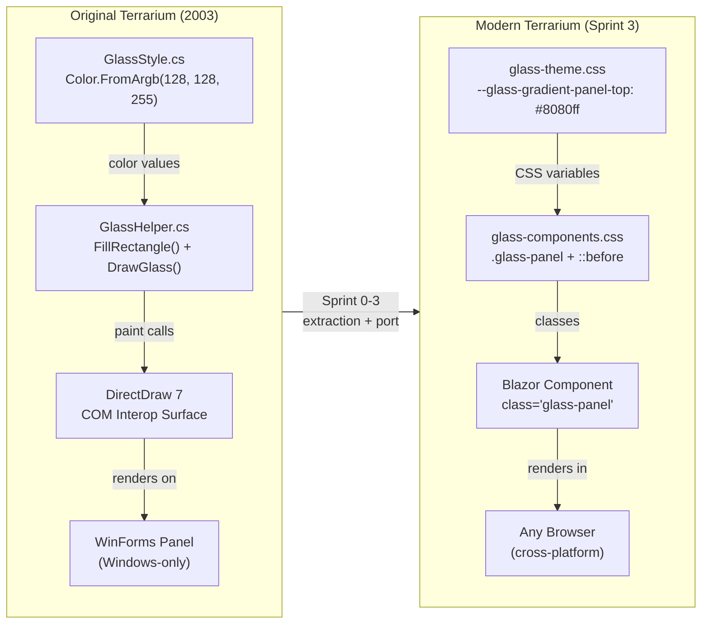
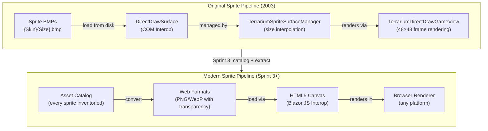
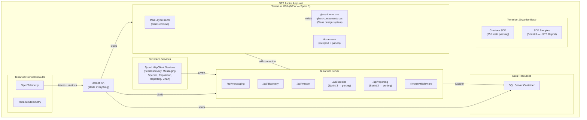

# Journal Entry #4 — First Pixels

> **Date:** Sprint 3 — Web UI Foundation
> **Author:** Beth (Technical Writer)
> **Status:** The Blazor app exists. Glass theming is rendering in a browser. The sprites are being cataloged. Species registration is porting. And for the first time since 2003, someone looked at a screen and said "that's Terrarium."

---

Three sprints of invisible work. Solution structures. Configuration systems. Heartbeat protocols. OpenTelemetry pipelines. All of it mattered. None of it was visible.

Sprint 3 is where that changes.

This is the sprint where the project stops being a library and becomes an application. Where CSS tokens become rendered pixels. Where a `<div class="glass-panel">` in a browser window makes someone who remembers 2003 feel something.

Seven issues closed in Sprint 2. Configuration ported. SignalR hub created. PeerDiscovery live. 256 tests passing. That was the foundation under the foundation. Now we build the thing people actually *see*.

Let's talk about first pixels.

---

## The Sprint 2 Scorecard

Before we get into the visual stories, here's where Sprint 2 left us:

| Metric | Count |
|--------|-------|
| Issues closed | 7 |
| Tests passing | 256 |
| GameConfig → IOptions | ✅ |
| PeerDiscovery heartbeat | ✅ |
| SignalR hub (thin layer) | ✅ |
| Watson error reporting | ✅ |
| OpenTelemetry + Aspire dashboard | ✅ |
| Configuration tests + coverage | ✅ |
| Triple-R typo (`Terrraium2010.sln`) | Immortal |

That's the invisible foundation. Server accepts requests. Database starts in a container. Telemetry flows. Configuration binds. The heartbeat beats. Now we give it a face.

---

## First Pixels: The Blazor App Exists

There's a moment in every web project where you stop writing libraries and start writing an application. Where `dotnet run` opens something in a browser. Where you see layout, color, text rendered on screen instead of test output in a terminal.

Sprint 3 is that moment.

Skyler created `Terrarium.Web` — a Blazor Interactive Server project wired into the Aspire AppHost. It's the frontend that will eventually render creatures battling for survival in real time. But right now, right this minute, the important thing is simpler than that:

**It exists. It renders. It looks like Terrarium.**

Here's what the app boots with:

```csharp
// src/Terrarium.Web/Program.cs
var builder = WebApplication.CreateBuilder(args);

builder.AddServiceDefaults();

builder.Services.AddRazorComponents()
    .AddInteractiveServerComponents();

builder.Services.AddSignalR();

var app = builder.Build();

app.UseStaticFiles();
app.UseAntiforgery();

app.MapDefaultEndpoints();

app.MapRazorComponents<App>()
    .AddInteractiveServerRenderMode();

app.Run();
```

Twelve meaningful lines. Service defaults from Aspire. Razor components with interactive server rendering. SignalR ready for when creatures need real-time updates. Static files for the Glass CSS. Default endpoints for health checks. That's the entire startup.

Compare this to the original Terrarium client startup — a WinForms `Main()` method that initialized DirectDraw surfaces, loaded COM interop assemblies, registered custom performance counters, parsed XML configuration files, and spun up a custom TCP networking stack before a single pixel appeared.

We get the same "app is running" moment with twelve lines and `dotnet run`.

---

## The Component Architecture: A Game UI in Razor

Skyler didn't just scaffold a blank page. The component architecture mirrors the original Terrarium window layout — viewport, creature panel, ecosystem status bar, message log. Every panel from the 2003 WinForms client has a Blazor component equivalent:

```razor
@* src/Terrarium.Web/Components/Pages/Home.razor *@
@page "/"

<PageTitle>.NET Terrarium</PageTitle>

<div class="terrarium-home">
    <EcosystemStatus />

    <div class="terrarium-home__content">
        <div class="terrarium-chrome__viewport">
            <TerrariumViewport />
        </div>

        <aside class="terrarium-chrome__sidebar">
            <CreaturePanel />
            <MessageLog />
        </aside>
    </div>
</div>
```

Four components. Four responsibilities. Each one maps to a panel in the original game window:

| Blazor Component | Original WinForms Control | Purpose |
|-----------------|--------------------------|---------|
| `<EcosystemStatus />` | Status bar + LED indicators | Population counts, tick rate, connection state |
| `<TerrariumViewport />` | `TerrariumDirectDrawGameView` | The world — creatures moving, eating, fighting |
| `<CreaturePanel />` | Properties panel | Selected creature details, stats, lineage |
| `<MessageLog />` | Message ticker | System messages, creature events, death notices |

The viewport is a placeholder right now — it'll get Canvas rendering when the engine port lands in later sprints. But the *structure* is right. The component boundaries are right. And when those components fill in with real functionality, the layout won't change. That's the value of getting the architecture right early.

### The Layout: Glass Chrome in Blazor

The `MainLayout.razor` wraps everything in the Glass chrome — the same window frame aesthetic that made Terrarium instantly recognizable:

```razor
@* src/Terrarium.Web/Components/Layout/MainLayout.razor *@
@inherits LayoutComponentBase

<div class="terrarium-chrome terrarium-app">
    <header class="glass-titlebar">
        <div class="glass-titlebar__icon">
            
        </div>
        <div class="glass-titlebar__title">.NET Terrarium</div>
    </header>

    <div class="terrarium-chrome__body">
        @Body
    </div>

    <footer class="glass-statusbar">
        <div class="glass-statusbar__section">
            <span class="glass-led glass-led--idle"></span>
        </div>
        <div class="glass-statusbar__section" style="flex:1;">
            Ready
        </div>
    </footer>
</div>
```

Title bar at the top. Status bar with LED indicator at the bottom. Body content in between. The `.terrarium-chrome` class provides the outer frame — the dark border, the gradient background, the Glass sheen. The `.glass-titlebar` renders the blue-to-dark-blue header that every Terrarium player remembers. The `.glass-led--idle` is the green status light that pulsed in the corner of the original app.

This isn't a modern UI that *references* the original. It's a faithful port of the Glass UI framework to CSS. Every gradient stop, every border color, every shadow offset traces back to a `Color.FromArgb()` call in the legacy C# code.

---

## Glass Goes to the Browser: CSS Tokens Become Real

Jesse's been building toward this moment since Sprint 0. Every `Color.FromArgb()` extracted. Every gradient mapped. Every border width measured. Sprint 0 produced `glass-theme.css` — 153 lines of CSS custom properties. Sprint 3 is where those tokens become pixels.

The token system is deliberate and traceable:

```css
/* glass-theme.css — every value traces to legacy C# source */
:root {
  /* GlassStyle.cs → panel field */
  --glass-gradient-panel-top:    #8080ff;  /* Color.FromArgb(128, 128, 255) */
  --glass-gradient-panel-bottom: #000060;  /* Color.FromArgb(0, 0, 96) */

  /* GlassButton.cs → Normal state */
  --glass-gradient-button-top:    #606060;  /* Color.FromArgb(96, 96, 96) */
  --glass-gradient-button-bottom: #202020;  /* Color.FromArgb(32, 32, 32) */

  /* GlassHelper.cs → Glass overlay rendering */
  --glass-overlay-start: rgba(255, 255, 255, 0.25);
  --glass-overlay-end:   rgba(255, 255, 255, 0.0);

  /* The signature look: white text with black shadow */
  --glass-color-foreground:    #ffffff;
  --glass-color-text-shadow:   #000000;
}
```

And the component CSS that consumes them:

```css
/* glass-components.css — every class maps to a legacy WinForms control */

.glass-panel {
  position: relative;
  background: linear-gradient(
    180deg,
    var(--glass-gradient-panel-top) 0%,
    var(--glass-gradient-panel-bottom) 100%
  );
  border: var(--glass-border);
  color: var(--glass-color-foreground);
  overflow: hidden;
}

/* The glass overlay — the top-half sheen that made Terrarium Terrarium */
.glass-panel::before {
  content: "";
  position: absolute;
  inset: 0 0 50% 0;
  background: linear-gradient(
    180deg,
    var(--glass-overlay-start) 0%,
    var(--glass-overlay-end) 100%
  );
  pointer-events: none;
  z-index: 1;
}
```

That `::before` pseudo-element is the magic. The original Terrarium used `GlassHelper.FillRectangle` to paint a semi-transparent white-to-transparent gradient over the top half of every panel. That's what made the "glass" effect — a subtle sheen that caught the light on gradient panels. Jesse reproduced it with four lines of CSS. No JavaScript. No Canvas. No WebGL. Just a pseudo-element with a gradient.

The component catalog now includes every major Glass control:

| CSS Class | Legacy Source | What It Does |
|-----------|--------------|-------------|
| `.glass-panel` | `GlassPanel.cs` | Gradient panel with glass overlay sheen |
| `.glass-panel--sunk` | `GlassPanel.cs` (inverted) | Inverted gradient — used for content areas |
| `.glass-button` | `GlassButton.cs` | Pill-shaped gradient button with hover/pressed states |
| `.glass-titlebar` | `GlassTitleBar.cs` | Window title bar with icon and text |
| `.glass-label` | `GlassLabel.cs` | Bold white text with black drop shadow |
| `.glass-led` | `TerrariumLed.cs` | Status indicator light (idle/waiting/failed) |
| `.glass-statusbar` | `StatusBar.cs` | Bottom status strip |
| `.terrarium-chrome` | `TerrariumForm.cs` | Outer game window frame |

Every class. Every state. Every variant. All traceable to a specific C# source file in the legacy `Client/Glass/` directory. This isn't a "inspired by" design system — it's a pixel-faithful port.

### The CSS Architecture

Jesse established the naming convention early: `--glass-{category}-{element}-{modifier}` for tokens, BEM for components. That decision from Sprint 0 is paying off now. When Skyler needs a panel gradient, she doesn't guess at colors — she uses `var(--glass-gradient-panel-top)`. When she needs a button, it's `.glass-button`. When the button is pressed, it's `.glass-button:active`. The convention is self-documenting.

Here's the full flow from legacy C# to modern browser:



From COM interop on a single Windows machine to CSS in any browser on any platform. Same colors. Same gradients. Same glass sheen. Different decade.

---

## The Sprites: Terrarium's Visual Soul

This is Brady's #1 visual directive, and he was emphatic about it:

> *"Use ALL original imagery — people who know .NET Terrarium should recognize it immediately."*

The sprites are Terrarium. The ants. The beetles. The scorpions. The spiders. The inchworms. The little plants growing on the terrain. Every creature that ever competed in the ecosystem had a sprite — a set of animation frames on a BMP sprite sheet, loaded via DirectDraw, rendered at 48×48 pixels with transparency keying.

### How Sprites Worked in 2003

The original rendering system is a marvel of early .NET engineering. Here's the pipeline:

```csharp
// Client/Renderer/Classes/Engine/TerrariumSpriteSurfaceManager.cs
// Load all BMP sprite sheets matching a creature's skin family
var bmps = Directory.GetFiles(GameConfig.MediaDirectory, key + "*.bmp");
for (var i = 0; i < bmps.Length; i++)
{
    DirectDrawSpriteSurface dds = new DirectDrawSpriteSurface(
        Path.GetFileNameWithoutExtension(bmps[i]),
        bmps[i],
        xFrames,     // horizontal animation frames per row
        yFrames      // rows — one per action type (idle/move/attack/eat/die)
    );
}
```

Each creature skin family had multiple BMP files — one per supported size. The naming convention was `{SkinFamily}{Size}.bmp`. A beetle at size 24 loaded `Beetle24.bmp`. At size 36, `Beetle36.bmp`. The system supported 49 different creature sizes (1 through 48 pixels), though most skins only shipped a handful of sizes with the engine interpolating between them.

The sprite sheets were structured as grids:

```csharp
// Client/Renderer/Classes/DirectX/DirectDrawSpriteSurface.cs
// Calculate frame dimensions from sheet size
animationFrames = xFrames;  // frames per row (typically 10)
animationTypes = yFrames;   // rows for different actions

frameHeight = ddsurface.Rect.Bottom / animationTypes;
frameWidth = ddsurface.Rect.Right / animationFrames;
```

Ten animation frames per action. Multiple action rows — idle, moving, attacking, eating, dying. Each frame 48×48 pixels. Transparency via a color key on the DirectDraw surface. The engine grabbed individual frames with calculated source rectangles:

```csharp
// Extract a single frame from the sprite sheet
spriteRect.Top = yFrame * frameHeight;
spriteRect.Left = xFrame * frameWidth;
spriteRect.Bottom = spriteRect.Top + frameHeight;
spriteRect.Right = spriteRect.Left + frameWidth;
```

This is a proper sprite engine. It handles animation progression, action state mapping, size interpolation, and transparency — all through DirectDraw 7 COM interop, all on Windows, all in .NET 1.0.

### The Catalog Sprint

Jesse is cataloging every sprite asset from the original codebase. Every BMP. Every GIF. Every terrain tile. Every animation frame. This isn't just file management — it's archaeology.

The original sprites live embedded in the client rendering code, loaded by naming convention from a media directory. They're not in the repository as standalone assets — they were distributed as part of the Terrarium installer. Finding them means tracing every `Directory.GetFiles()` call, every skin family enumeration, every size variant.

The skin families tell the story of Terrarium's ecosystem:

```csharp
// OrganismBase skin enumerations — the creature catalog
public enum AnimalSkinFamily
{
    Ant,
    Beetle,
    Inchworm,
    Scorpion,
    Spider,
    // ... every creature that ever lived in the ecosystem
}

public enum PlantSkinFamily
{
    Plant,
    // Terrain tiles, food sources
}
```

Each entry in that enum is a sprite sheet. Multiple BMP files per entry. Multiple sizes per creature. Ten frames per action per size. The total asset count is significant — and every one of them needs to make the journey from DirectDraw BMP to web-renderable format.

Brady's directive is clear: recognition is the goal. If someone who played Terrarium in 2003 sees the web version and *doesn't* immediately recognize the creatures, we've failed. The sprites aren't decoration — they're identity.



The catalog is the bridge. Before we can render sprites in a browser, we need to know exactly what sprites exist, in what sizes, with what animation frames. Jesse's building that catalog now — and it's the kind of work that doesn't show up in demos but makes everything else possible.

---

## Species Registration: The Heart of the Ecosystem

If sprites are the soul, species registration is the heart. Without it, there's no ecosystem. It's the endpoint that answers the fundamental question: "I wrote a creature. How do I get it into the world?"

Here's how it worked. You wrote a class that inherited from `Animal` or `Plant`. You decorated it with attributes — `[Carnivore]`, `[MatureSize(26)]`, `[AnimalSkin(AnimalSkinFamily.Beetle)]`. You compiled it into a DLL. And then the Terrarium client called the server's species registration endpoint to upload your assembly and register your creature in the global ecosystem.

Gus is porting those endpoints from the original ASMX service. Here's what the original looked like:

```csharp
// Server/Website/App_Code/Species/AddSpecies.asmx.cs — the original
[WebMethod]
public SpeciesServiceStatus Add(
    string name, string version, string type,
    string author, string email,
    string assemblyFullName, byte[] assemblyCode)
{
    if (name == null || version == null || type == null)
        return SpeciesServiceStatus.VersionIncompatible;

    // Content filtering — keep the ecosystem family-friendly
    bool nameInappropriate = WordFilter.RunQuickWordFilter(name);
    bool authInappropriate = WordFilter.RunQuickWordFilter(author);

    // Throttling — 5-minute cooldown per IP, 24-hour daily limit
    bool allow = !Throttle.Throttled(
        Context.Request.ServerVariables["REMOTE_ADDR"].ToString(),
        "AddSpecies5MinuteThrottle");

    // Database insertion via stored procedure
    using (SqlConnection myConnection =
        new SqlConnection(ServerSettings.SpeciesDsn))
    {
        SqlCommand mySqlCommand = new SqlCommand(
            "TerrariumInsertSpecies", myConnection);
        mySqlCommand.CommandType = CommandType.StoredProcedure;
        // Name, Version, Type, Author, Email, Extinct, DateAdded...
        mySqlCommand.ExecuteNonQuery();

        // Save the compiled assembly to disk
        SaveAssembly(assemblyCode, version, name + ".dll");
    }
}
```

A `[WebMethod]` that accepts a compiled assembly as a `byte[]`, validates the name against a word filter, throttles submissions, inserts into SQL via stored procedure, and saves the DLL to disk. That's the entire species registration pipeline. SOAP envelope in, creature in the world.

### The Modern Species Service

The service contract is already defined and the client-side implementation is wired:

```csharp
// src/Terrarium.Services/Interfaces/ISpeciesService.cs
public interface ISpeciesService
{
    Task<SpeciesServiceStatus> AddAsync(
        string name, string version, string type,
        string author, string email,
        string assemblyFullName, byte[] assemblyCode,
        CancellationToken cancellationToken = default);

    Task<IReadOnlyList<SpeciesInfo>> GetAllSpeciesAsync(
        string version, string filter,
        CancellationToken cancellationToken = default);

    Task<IReadOnlyList<SpeciesInfo>> GetExtinctSpeciesAsync(
        string version, string filter,
        CancellationToken cancellationToken = default);

    Task<byte[]> GetSpeciesAssemblyAsync(
        string name, string version,
        CancellationToken cancellationToken = default);

    Task<byte[]> ReintroduceSpeciesAsync(
        string name, string version, Guid peerGuid,
        CancellationToken cancellationToken = default);

    Task<IReadOnlyList<string>> GetBlacklistedSpeciesAsync(
        CancellationToken cancellationToken = default);
}
```

Six methods. The full species lifecycle — register, browse, download, reintroduce, blacklist. Every method async with cancellation support. Every return type strongly typed — no `DataSet`, no SOAP, no XML.

And the client that calls it:

```csharp
// src/Terrarium.Services/Clients/SpeciesServiceClient.cs
public sealed class SpeciesServiceClient(HttpClient httpClient)
    : ISpeciesService
{
    public async Task<SpeciesServiceStatus> AddAsync(
        string name, string version, string type,
        string author, string email,
        string assemblyFullName, byte[] assemblyCode,
        CancellationToken cancellationToken = default)
    {
        var payload = new
        {
            name, version, type, author, email,
            assemblyFullName,
            assemblyCode = Convert.ToBase64String(assemblyCode)
        };

        var response = await httpClient.PostAsJsonAsync(
            "species", payload, cancellationToken);
        response.EnsureSuccessStatusCode();
        return await response.Content
            .ReadFromJsonAsync<SpeciesServiceStatus>(cancellationToken);
    }
}
```

Primary constructor injection. `PostAsJsonAsync`. Base64-encoded assembly bytes. `ReadFromJsonAsync<T>`. The ceremony-to-substance ratio has dropped by an order of magnitude.

Here's the migration in one view:

```mermaid
sequenceDiagram
    participant Dev as Creature Developer
    participant Client as Terrarium Client
    participant API as Terrarium Server
    participant DB as SQL Server
    participant Disk as Assembly Storage

    Note over Dev,Disk: Species Registration Flow

    Dev->>Dev: Write class MyBeetle : Animal
    Dev->>Dev: Compile to MyBeetle.dll

    rect rgb(60, 60, 100)
        Note over Client,Disk: Legacy (2003) — SOAP/ASMX
        Client->>API: SOAP Envelope<br/>[WebMethod] Add(byte[] assembly)
        API->>API: WordFilter.RunQuickWordFilter(name)
        API->>API: Throttle.Throttled(IP, 5min)
        API->>DB: EXEC TerrariumInsertSpecies
        API->>Disk: SaveAssembly(bytes, name.dll)
        API-->>Client: SpeciesServiceStatus (SOAP XML)
    end

    rect rgb(40, 80, 60)
        Note over Client,Disk: Modern (Sprint 3) — REST/JSON
        Client->>API: POST /api/species<br/>JSON { assembly: base64 }
        API->>API: Validation + throttle middleware
        API->>DB: Dapper + stored procedure
        API->>Disk: Assembly storage (configurable)
        API-->>Client: SpeciesServiceStatus (JSON)
    end
```



Same stored procedures underneath. Same validation logic. Same throttling concept. But the transport is JSON over HTTP instead of `DataSet` over SOAP. The client is a typed `HttpClient` instead of a WSDL-generated proxy. The assembly bytes are Base64 in JSON instead of binary in a SOAP envelope.

The reporting endpoints follow the same pattern. Population data — creature counts, birth rates, death rates, species diversity — flows from clients to the server for ecosystem-wide statistics. The original used `DataSet` payloads with stored procedure insertions. The modern version uses typed models and Dapper. The data is the same. The plumbing is lighter.

---

## SDK Samples: Teaching Developers to Build Creatures

Here's an uncomfortable truth about developer tools: the best SDK in the world is useless without samples. You can document every API, annotate every parameter, write the most beautiful type system ever conceived — and developers will still go looking for "show me a working example."

Hank is porting the SDK samples to .NET 10, and this work is foundational for the developer experience. The creature API is the reason Terrarium exists. The samples are how people learn it.

Here's what a creature looks like. This is a SimpleHerbivore — the "Hello, World" of Terrarium:

```csharp
// The Terrarium creature developer experience
[Carnivore(false)]
[MatureSize(26)]
[AnimalSkin(AnimalSkinFamily.Beetle)]
[MaximumEnergyPoints(50)]
[EatingSpeedPoints(10)]
[AttackDamagePoints(0)]
[DefendDamagePoints(0)]
[CamouflagePoints(50)]
[EyesightPoints(50)]
public class SimpleHerbivore : Animal
{
    protected override void Initialize()
    {
        Load += Loaded;
        Idle += MyIdleEvent;
    }

    void Loaded(object sender, LoadEventArgs e)
    {
        // Verify targets, restore state
    }

    void MyIdleEvent(object sender, IdleEventArgs e)
    {
        // The main loop: scan, eat, reproduce, move
        if (CanReproduce)
            BeginReproduction(new AnimalGenome());

        var organisms = Scan();
        foreach (OrganismState org in organisms)
        {
            if (org is PlantState && WithinEatingRange(org))
            {
                BeginEating(org);
                return;
            }
        }

        // Nothing nearby? Wander.
        var randomVector = new MovementVector(
            new Point(random.Next(World.Width),
                      random.Next(World.Height)),
            2);
        BeginMoving(randomVector);
    }
}
```

That's the entire creature. Attributes define the traits — 100 points distributed across energy, speed, attack, defense, camouflage, eyesight. Tradeoffs everywhere. Want better eyesight? Sacrifice attack damage. Want faster eating? Give up camouflage. The point allocation system is the game design, and it's elegant.

The behavior is event-driven. `Load` fires when the creature enters the world. `Idle` fires every tick. In `Idle`, you scan for nearby organisms, make decisions, and take actions. `BeginEating`, `BeginMoving`, `BeginReproduction`, `BeginAttacking` — all async operations that complete on the next tick. The creature doesn't control the world. The world calls the creature. That's the contract.

Hank's job is making this work on .NET 10. The `Animal` base class lives in `Terrarium.OrganismBase` — the 91 files Mike ported in Sprint 0. The samples reference it. The attribute system works. The event model works. What needs updating is the project structure, the target framework, the NuGet references, and the build experience.

The samples include three archetypes:

| Sample | Strategy | What It Teaches |
|--------|---------|----------------|
| **SimpleHerbivore** | Scan → find plants → eat → reproduce | Basic creature lifecycle, event model |
| **SimpleCarnivore** | Scan → attack prey → eat corpses → reproduce | Combat system, target tracking |
| **Plant** | Passive — grows, reproduces, gets eaten | The food chain foundation |

These aren't just code samples. They're the onboarding ramp. A developer's first experience with Terrarium should be: clone a sample, change the attributes, compile, deploy, watch your creature live or die. If that flow doesn't work, nothing else matters.

---

## What This Sprint Proves

Sprint 0 proved structure. Sprint 1 proved the server could serve. Sprint 2 proved the infrastructure was sound. Sprint 3 proves something different:

**This project is real. It has a face. It renders in a browser. It looks like Terrarium.**

There's a psychological inflection point in every project where it stops being "we're building something" and becomes "here's what we built." The Glass chrome in a browser. The title bar with the Terrarium icon. The status LED pulsing in the corner. The creature panel waiting for creatures. The viewport waiting for a world.

It's not done. The viewport is a placeholder. The creature panel is empty. The sprites are being cataloged, not rendered. The species endpoint is being ported, not deployed. But the shape is right. The structure is right. The *feeling* is right.

And the feeling matters. When Brady says "people who know .NET Terrarium should recognize it immediately" — that recognition starts here. It starts with the Glass chrome. It starts with the blue-to-dark-blue gradient. It starts with the white text with black drop shadow. It starts with the glass sheen across the top half of every panel.

The developers who played Terrarium in 2003 will see this and know exactly what it is.

---

## The Migration Topology: Sprint 3

Here's where everything sits after three sprints of visible progress:



The architecture is filling in. The web project exists. The server has endpoints. The services layer connects them. The SDK compiles. The samples are porting. The Aspire AppHost orchestrates all of it.

Three sprints ago, we had a solution file and a plan. Now we have a running application with a Glass-themed UI, six API endpoint groups, typed service clients, OpenTelemetry flowing to a dashboard, 256 tests passing, and the creature registration pipeline taking shape.

---

## What's Next

Sprint 4 is where rendering begins. The viewport placeholder becomes a real Canvas. The creature sprites move from catalog to screen. The species endpoint goes live, and the first creature enters the browser ecosystem.

We've gone from invisible libraries to visible application. Next, we go from static layout to living world.

The Glass chrome is in the browser. The species registration is in the pipeline. The sprite catalog is being built. The SDK samples are compiling on .NET 10. Every sprint narrows the gap between "project" and "product."

And somewhere in the original codebase, a `DirectDrawSpriteSurface` wrapping a COM interop handle wrapping a 48×48 BMP with transparency keying is about to become an HTML5 Canvas draw call in a browser.

Progress.

---

*Next entry: Sprint 4 — Rendering. The viewport wakes up.*

*— Beth*
