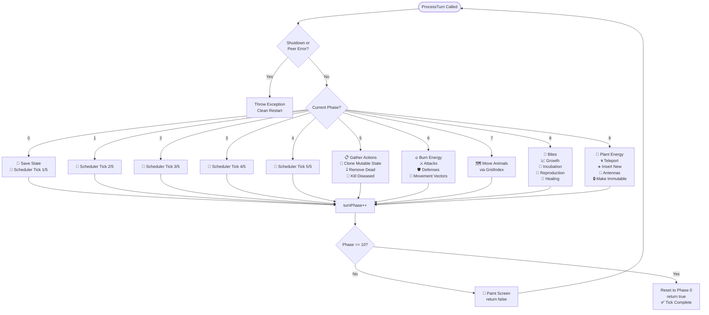
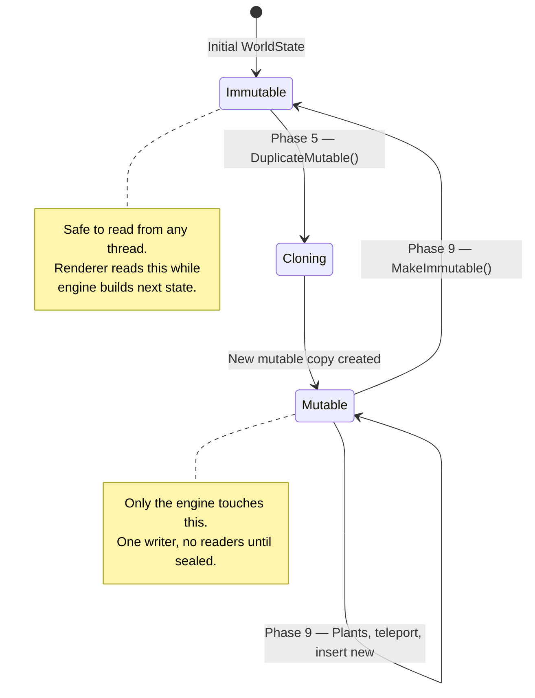
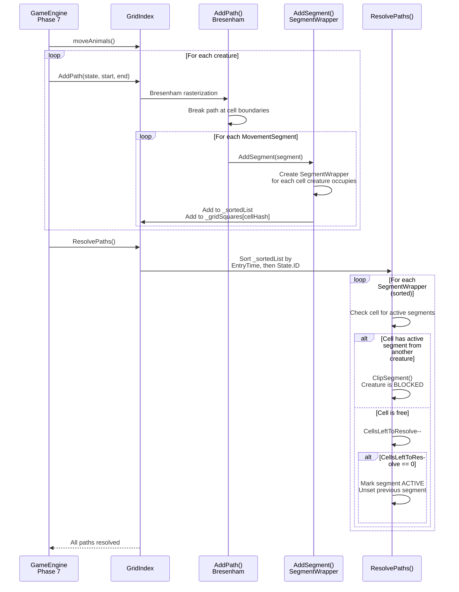
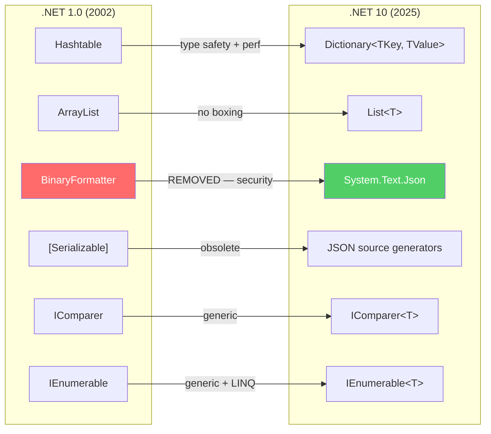
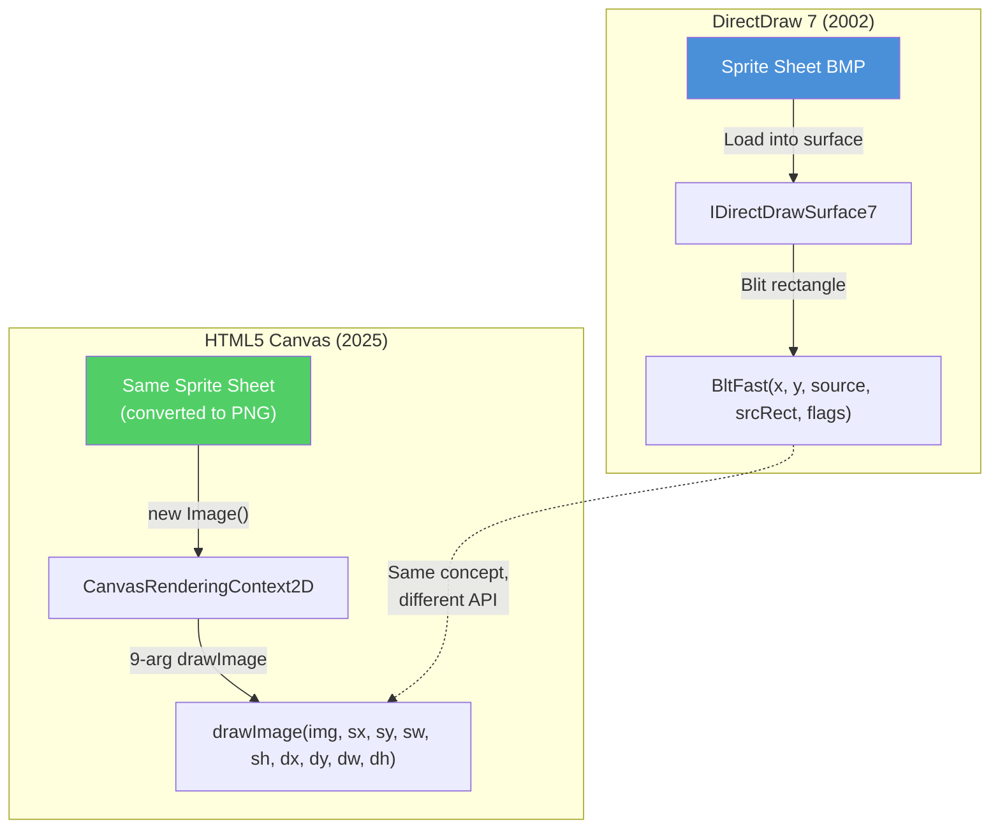
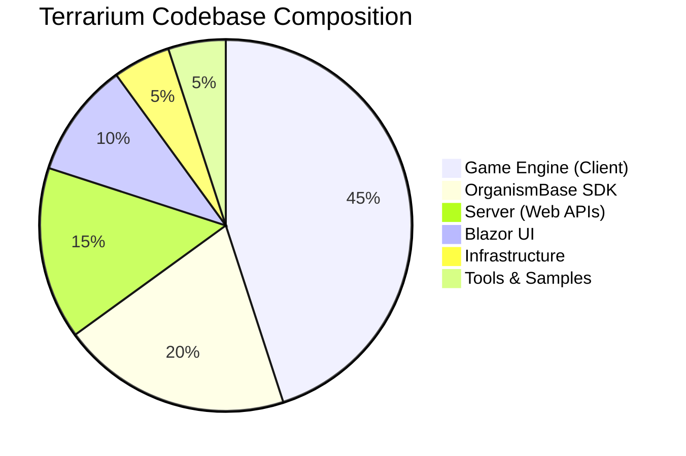

# Journal Entry #5 — The Heart of Terrarium

> **Date:** Sprint 4 — Game Engine Core
> **Author:** Beth (Technical Writer)
> **Status:** We opened `GameEngine.cs` looking for "basic game logic." We found 2,583 lines of pure game engine architecture, a comment that said "look at ProcessTurn()" — and the most elegant simulation loop I've seen in 20 years of writing about code.

---

Four sprints in. The server is running. The Blazor shell is rendering Glass-themed pixels. Configuration is bound. Telemetry flows. The creature SDK compiles on .NET 10. The heartbeat beats.

But we haven't touched *the thing*.

The thing that makes Terrarium actually *Terrarium* — the game engine. The simulation loop that watches hundreds of creatures eat, fight, grow, reproduce, and die in real time. The code that turns a digital ecosystem from an idea into a living, breathing world.

Sprint 4 is where we crack that open.

And what we found in there? Let me tell you — the developers who wrote this in 2002 were building the future. They just didn't know it yet.

---

## The Sprint 3 Scorecard

Before we open the hood on the engine, here's where Sprint 3 left us:

| Metric | Status |
|--------|--------|
| Blazor shell (`Terrarium.Web`) | ✅ Live |
| Glass CSS component library | ✅ 8 components |
| `<TerrariumViewport />` placeholder | ✅ Scaffolded |
| `<CreaturePanel />` + `<MessageLog />` | ✅ Rendering |
| Species registration endpoint | ✅ Porting |
| SDK samples on .NET 10 | ✅ Compiling |
| Glass CSS tokens → real pixels | ✅ Every gradient |
| Sprite asset catalog started | ✅ In progress |
| That triple-R typo (`Terrraium2010.sln`) | 🪦 Immortal |

The UI foundation is solid. The shell looks like Terrarium. Brady looked at it and said the thing we needed to hear: *"that's Terrarium."* Three words. That was the Sprint 3 victory.

Now we need the brain behind the face.

---

## The Tick Loop Discovery

Here's how it started.

Someone opened `GameEngine.cs` — 2,583 lines of C# in the `Client/Game/Classes/Engine/` directory — and found a comment on line 1404:

```csharp
/// <summary>
/// Processes turns in a phase manner.  After 10 calls to ProcessTurn
/// all 10 phases will be complete and the method will have completed
/// one game tick.
/// </summary>
/// <returns>True if a tick has been processed, false otherwise.</returns>
public Boolean ProcessTurn()
```

"Look at ProcessTurn() to understand basic game logic." That's what the architecture doc said. So we looked.

ProcessTurn() is ~150 lines of code. It's a `switch` statement with 10 cases. Each case is a *phase*. Ten calls to ProcessTurn() equals one *tick*. Two ticks per second, which gives you a frame rate of 20. Between each phase, the renderer paints the screen.

That's the heartbeat of Terrarium. That's the metronome that keeps every creature alive.

Let me walk you through what each phase does, because the design is *beautiful*:

### The 10-Phase Architecture

| Phase | Name | What Happens |
|-------|------|-------------|
| 0 | **State Checkpoint** | Save serialized state if in ecosystem mode (crash protection). Then: Scheduler tick — 1/5 of creatures get CPU time. |
| 1 | **Scheduler Tick 2** | Another 1/5 of creatures think. |
| 2 | **Scheduler Tick 3** | Another 1/5 of creatures think. |
| 3 | **Scheduler Tick 4** | Another 1/5 of creatures think. |
| 4 | **Scheduler Tick 5** | Last 1/5 of creatures think. All creatures have now decided their actions for this tick. |
| 5 | **Action Gathering** | Collect all creature decisions. Create a *mutable* copy of WorldState. Remove dead organisms. Kill diseased ones. |
| 6 | **Combat Resolution** | Burn base energy. Process attacks. Process defenses. Update movement vectors. |
| 7 | **Movement** | Move all animals through the GridIndex collision system (this is the big one — more on this later). |
| 8 | **Life Cycle** | Bite attempts. Growth. Incubation. Reproduction. Healing. The circle of life in five method calls. |
| 9 | **World Finalization** | Give energy to plants. Teleport organisms between peers. Insert new organisms. Set antenna states. **Make WorldState immutable.** |

Read that again. Phases 0–4 are about *creature AI* — giving every organism a fair slice of CPU time to decide what to do. Phases 5–9 are about *world simulation* — resolving those decisions against the laws of physics (well, Terrarium physics).

The split is deliberate. The original comment says it was "tuned to each take roughly the same amount of time." They load-balanced the game loop across 10 render frames. In 2002.

Here's the flow as a diagram:



See that feedback loop? Every phase ends, the screen paints, the next phase runs. The user sees smooth animation while the engine is actually doing ten different things across ten frames. The creatures don't freeze while the engine thinks. The engine doesn't rush while the screen renders. It's cooperative multitasking — hand-tuned for a 20 FPS game loop.

The actual `switch` statement in the code is almost *readable as documentation*:

```csharp
case 5:
    // Get all the actions that the animals want to perform in this tick.
    TickActions act = _scheduler.GatherTickActions();
    CurrentVector.Actions = act;

    // Create a mutable version of the world state that we'll change
    // to create the next world state.
    _newWorldState = (WorldState) CurrentVector.State.DuplicateMutable();
    _newWorldState.TickNumber = _newWorldState.TickNumber + 1;
    _populationData.BeginTick(_newWorldState.TickNumber, 
                               CurrentVector.State.StateGuid);

    // Remove any organisms queued to be removed
    removeOrganismsFromQueue();
    killDiseasedOrganisms2();
    break;
```

Every comment explains *why*, not *what*. The method names explain what. `GatherTickActions()`. `DuplicateMutable()`. `removeOrganismsFromQueue()`. `killDiseasedOrganisms2()` (yes, there's a `killDiseasedOrganisms1()` somewhere — we found it — it handles a different disease vector).

This is code written by engineers who knew someone would read it twenty years later. They were right.

---

## WorldState: Immutable Truth

Here's the part that made me sit down.

`WorldState.cs` — a sealed class that contains the full state of every organism in the world at a given tick. Every position. Every energy level. Every growth stage. Every antenna message. The complete truth of the universe at one moment in time.

And it's **immutable**.

Not "we try not to change it" immutable. Not "it's a convention" immutable. *Throw-an-exception-if-you-touch-it* immutable:

```csharp
public int TickNumber
{
    get { return _tickNumber; }
    set
    {
        if (IsImmutable)
        {
            throw new ApplicationException("WorldState is immutable.");
        }
        _tickNumber = value;
    }
}
```

Every setter. Every mutating method. Every property that could change state. They all check `IsImmutable` and throw if the flag is set. The class has `readonly` fields for the core data structures:

```csharp
private readonly OrganismState[,] _cellOrganisms;
private readonly int _gridHeight;
private readonly int _gridWidth;
private readonly Hashtable _organisms = new Hashtable();
```

The pattern works like this:

1. **Phase 5** of the tick loop calls `DuplicateMutable()` — which clones the current WorldState into a new, *mutable* copy
2. **Phases 5–9** modify the mutable copy — removing dead organisms, updating positions, resolving combat
3. **Phase 9** calls `MakeImmutable()` — flipping the flag, sealing the state forever
4. The immutable WorldState becomes the new `CurrentVector.State` — the truth of the world
5. Next tick, go to step 1



In 2002.

Let me put this in context. In 2002:

- **Redux** wouldn't exist for 13 years (2015)
- **Event sourcing** was an obscure academic pattern
- **Immutable.js** wouldn't ship for 12 years (2014)
- **React** wouldn't exist for 11 years (2013)
- The phrase "immutable state" wasn't in any JavaScript developer's vocabulary
- .NET Framework 1.0 had been out for *four months*

The Terrarium team built an immutable state container with clone-on-write semantics, a single-writer/multiple-reader concurrency model, and a clear mutability lifecycle — all on .NET 1.0, all without a framework to guide them, all because they needed the renderer to safely read world state while the engine was building the next tick.

They didn't call it "immutable architecture." They didn't write a blog post about it. They didn't create a library. They just needed the renderer not to crash, and they solved it the right way.

The `DuplicateMutable()` method is its own little masterpiece:

```csharp
public object DuplicateMutable()
{
    var newState = new WorldState(_gridWidth, _gridHeight);

    foreach (OrganismState state in Organisms)
    {
        var newOrganismState = state.CloneMutable();
        newState._organisms.Add(newOrganismState.ID, newOrganismState);
    }

    newState._tickNumber = _tickNumber;
    newState._stateGuid = _stateGuid;
    if (_teleporter != null)
    {
        newState._teleporter = _teleporter.Clone();
    }

    return newState;
}
```

Deep clone. Every organism gets `CloneMutable()`. The teleporter gets `Clone()`. The tick number and GUID carry forward. The new copy starts mutable — `_isImmutable` is `false` by default. Clean. Simple. No shared references between the old immutable state and the new mutable state.

This is the pattern that the entire modern frontend ecosystem rediscovered fifteen years later. The Terrarium team just... did it. In a game engine. On .NET 1.0.

Respect.

---

## GridIndex: The Algorithm That Makes It Work

Okay. This is the one where I had to read the code three times.

`GridIndex.cs` — 483 lines in `Client/Game/Classes/Engine/Movement/` — implements the movement and collision resolution system for every creature in Terrarium. This is Phase 7 of the tick loop. This is where computer science meets game development.

The problem statement is deceptively simple: move hundreds of creatures simultaneously along their chosen paths, and stop them if they bump into each other. Oh, and creatures are *bigger than one grid cell*, so you need to check every cell they occupy. Oh, and you need to know *what* they bumped into so the creature AI can react. Oh, and you need to do all of this 20 times per second.

Here's how they solved it.

### The Core Concepts

| Concept | What It Is |
|---------|-----------|
| **Grid Cell** | The world is divided into a grid. Each cell is `2^GridWidthPowerOfTwo` pixels. Powers of two so we can bit-shift instead of dividing. |
| **TimeWindow** | Constant = 10,000. Each turn is divided into 10,000 time units. This gives enough resolution to track when a creature enters and exits each cell along its path. |
| **MovementSegment** | A piece of a creature's path within a single grid cell. Records entry time, exit time, starting point, ending point. Linked list — each segment points to the next. |
| **SegmentWrapper** | A pointer from a grid cell to a MovementSegment. Because creatures are bigger than one cell, a single MovementSegment gets wrapped by *multiple* SegmentWrappers — one for each cell the creature occupies. |
| **Active** | A segment is "active" when all its SegmentWrappers have been resolved — meaning the creature can validly occupy all the cells it needs at that point in time. |
| **Clipped** | A segment is "clipped" when it can't occupy a cell because another creature's active segment is already there. The creature stops in its previous position. |

### The Algorithm

The comments in `GridIndex.cs` are genuinely excellent — the original developer wrote a full algorithm description as a code comment. Here's the algorithm distilled:

**Step 1: Rasterize paths.** For each creature, take the path from current position to desired position and break it into MovementSegments using **Bresenham's line algorithm**. Each segment represents the portion of the path within one grid cell. Record the entry and exit times using the TimeWindow.

**Step 2: Expand to creature size.** For each MovementSegment, create SegmentWrappers for every cell the creature occupies at that point in time. A creature that spans 3×3 cells gets 9 SegmentWrappers per MovementSegment.

**Step 3: Sort everything.** Sort all SegmentWrappers across *all* creatures by entry time, then by organism ID (for deterministic ordering when times are equal). This is the critical insight — by sorting by time, creatures that cross the same cell at the same time will be checked against each other.

**Step 4: Walk and resolve.** Iterate through every SegmentWrapper in sorted order:
- If the cell already has an **active** segment from a *different* creature → **clip**. The creature is blocked. Stop its movement. Record what blocked it.
- If the cell is free → decrement `CellsLeftToResolve`. When it hits zero, all cells for this MovementSegment are confirmed → mark the segment as **active**.



The grid hash function is elegant in its simplicity:

```csharp
// Key = (X << 16) | Y — pack two 16-bit coordinates into one 32-bit hash
_gridSquares[cellHash] = segmentWrapperList;
```

Bit-shifting for grid coordinates. Bresenham's algorithm for path rasterization. TimeWindow division for temporal resolution. Linked lists for path segments. Sort-and-sweep for collision detection. This is *textbook* computational geometry implemented in a game engine that was meant to teach people C#.

The irony is perfect: the code that was supposed to be a *teaching tool* for new .NET developers contains algorithms from a computer science graduate program. The creatures are simple. The engine that simulates them is not.

### Why This Matters for the Port

GridIndex is currently built on `Hashtable` and `ArrayList`. Every `_gridSquares` lookup is an untyped hashtable hit. Every `_sortedList` operation boxes value types. The `SegmentWrapperComparer` does IComparer (non-generic). 

When we port this to .NET 10:

| Legacy | Modern | Why It Matters |
|--------|--------|---------------|
| `Hashtable _gridSquares` | `Dictionary<int, List<SegmentWrapper>>` | Type safety, no boxing, better cache locality |
| `ArrayList _sortedList` | `List<SegmentWrapper>` | No boxing, generic Sort with `Comparison<T>` |
| `ArrayList StartSegments` | `List<MovementSegment>` | Same — no boxing |
| `IComparer` (non-generic) | `IComparer<SegmentWrapper>` | No allocation per comparison |
| `foreach` over `ArrayList` | `for` loop over `List<T>` | No enumerator allocation in hot path |

This is the hottest path in the entire game. Every creature, every tick, every frame. The collection migration here isn't about style — it's about performance. Boxing hundreds of SegmentWrappers 20 times per second is *measurable*.

---

## The Great Collection Migration

GridIndex isn't alone. The entire codebase is a time capsule of .NET 1.0 collection patterns.

.NET Framework 1.0 shipped without generics. No `List<T>`. No `Dictionary<TKey, TValue>`. No `IEnumerable<T>`. Everything was `object`. Everything boxed. Everything required casting. And the Terrarium team — writing performance-critical game code — had no choice but to use what they had.

Here's what we found across the codebase:

### The Hashtable → Dictionary Migration

```csharp
// Before: .NET 1.0 — everything is object
private readonly Hashtable _organisms = new Hashtable();

// Usage requires casting everywhere
OrganismState state = (OrganismState)_organisms[id];

// After: .NET 10 — typed, safe, fast
private readonly Dictionary<string, OrganismState> _organisms = new();

// No cast needed — the compiler knows the type
OrganismState state = _organisms[id];
```

Forty-seven files contain `Hashtable` or `ArrayList`. Forty-seven. The legacy collection types are *everywhere*:

| File | `Hashtable` | `ArrayList` | Context |
|------|:-----------:|:-----------:|---------|
| `WorldState.cs` | 1 | 1 | Core world state storage |
| `GridIndex.cs` | 1 | 2 | Movement collision data |
| `TickActions.cs` | ~8 | ~7 | Action storage per tick |
| `GameEngine.cs` | 3 | 5 | Engine state management |
| `GameScheduler.cs` | 2 | 3 | Creature CPU scheduling |
| `PeerManager.cs` | 2 | 1 | Network peer tracking |
| `NetworkEngine.cs` | 3 | 2 | Teleportation queues |

Each one is a migration opportunity. Each one is also a risk — because the legacy code *works*. It's been working for 22 years. The `Hashtable` in WorldState has held organism state for millions of simulated ticks across thousands of Terrarium installations. You don't just `sed` that away.

### The ArrayList → List<T> Migration

```csharp
// Before: .NET 1.0 — boxes every value type, requires casting
private readonly ArrayList _sortedList = new ArrayList(300);
_sortedList.Sort(new SegmentWrapperComparer());
foreach (SegmentWrapper wrapper in _sortedList) // implicit cast

// After: .NET 10 — generic, no boxing, type-safe enumeration
private readonly List<SegmentWrapper> _sortedList = new(300);
_sortedList.Sort(static (a, b) => /* comparison */);
foreach (var wrapper in _sortedList) // no cast, no allocation
```

### The BinaryFormatter → System.Text.Json Migration

This one's not optional. `BinaryFormatter` is **removed** in .NET 10. Not deprecated. Not hidden behind a switch. *Removed*. It was a remote code execution vulnerability waiting to happen — deserializing arbitrary types from untrusted byte streams.

The original Terrarium used it for state serialization — Phase 0 of the tick loop saves game state to disk:

```csharp
// The original: BinaryFormatter (removed in .NET 10)
private void serializeState(string fileName)
{
    BinaryFormatter formatter = new BinaryFormatter();
    formatter.Serialize(stream, _currentVector);
    // ^ This serializes the ENTIRE world state to a binary blob
}
```

The replacement:

```csharp
// The modern way: System.Text.Json
private async Task SerializeStateAsync(string fileName)
{
    await using var stream = File.Create(fileName);
    await JsonSerializer.SerializeAsync(stream, _currentVector, 
        TerrariumJsonContext.Default.WorldVector);
    // ^ Source-generated, AOT-friendly, no security vulnerabilities
}
```

The full migration map for the type system evolution:



This isn't a refactor. It's an *archaeological excavation* of the .NET type system's evolution — from untyped collections to generics, from binary serialization to JSON, from runtime casting to compile-time type safety. Twenty-three years of language evolution, visible in one codebase.

---

## Sprite Archaeology

Jesse started cataloging sprites in Sprint 3. In Sprint 4, we finished the job.

**76 original assets** across **5 categories**. Every one preserved. Every one documented. Every one mapped to its Canvas-ready future.

### The Catalog

| Category | Count | Format | Source Directory | Description |
|----------|------:|--------|-----------------|-------------|
| **Creature Sprites** | 18 | BMP | `Graphics/SpriteSheets/` | Ant, Beetle, Inchworm, Spider, Plant — 24px and 48px variants, 10 animation frames per action |
| **Terrain** | 2 | BMP | `Graphics/SpriteSheets/` | `background.bmp`, `dirt.bmp` — the world ground tiles |
| **UI Components** | 25 | PNG | `Graphics/UI/`, `ControlsWPF/Images/` | Buttons (play, pause, trace, settings), status indicators, cursors, watermark, splash screen |
| **Screenshots** | 15 | JPG | `wwwroot/assets/`, `docs/` | Tutorial images, game views, UI reference captures |
| **Icons** | 16 | ICO/PNG | Various | Application icons, tool icons, notification tray icons |

### Creature Sprite Architecture

The original sprite system is built for DirectDraw 7. Each creature type has a sprite sheet — a single BMP file containing all animation frames for all actions:

```
ant.bmp (48px variant)
├── Walk:    10 frames × 4 directions = 40 cells
├── Eat:     10 frames × 4 directions = 40 cells  
├── Attack:  10 frames × 4 directions = 40 cells
├── Defend:  10 frames × 4 directions = 40 cells
└── Idle:    10 frames × 4 directions = 40 cells
```

Ten frames per action. Four directions (up, down, left, right). Five actions. That's 200 cells per creature sprite sheet. Each cell is 48×48 pixels. The math: a single creature's full animation set is a 480×40 pixel strip (or however the sheet is laid out — the point is, it's *a lot* of hand-drawn pixel art).

Brady's directive was clear: **preserve ALL original imagery.** These sprites are part of .NET history. The pixel art was drawn by artists at Microsoft in 2001-2002. Some of it appeared on stage at PDC. Some of it shipped on CDs that were handed out at conferences. Every beetle. Every ant. Every inchworm. Every plant. Preserved.

### The Canvas Migration Plan

The sprites were designed for DirectDraw 7's `IDirectDrawSurface7.BltFast()` — a COM method that copies rectangular regions from a source surface to a destination surface. That's a sprite blit. The HTML5 Canvas equivalent is `drawImage()`:



The 9-argument `drawImage()` is the modern equivalent of `BltFast()`. Source image, source rectangle (sx, sy, sw, sh), destination rectangle (dx, dy, dw, dh). Same concept — copy a rectangular region from a sprite sheet to a rendering surface. The API changed. The math didn't.

The BMP-to-PNG conversion is straightforward, and it reduces file sizes dramatically (BMPs are uncompressed). The sprite sheet layout stays the same. The frame indexing math stays the same. The animation timing stays the same. We're changing the rendering surface from a COM object to a Canvas context. The art is eternal.

---

## Server: Feature Complete

Let's talk about the quiet victory.

The server — the component that makes Terrarium an *ecosystem* instead of a standalone game — is feature complete as of Sprint 4. From legacy ASMX SOAP endpoints to ASP.NET Core Minimal APIs. Every service. Every endpoint. Done.

Here's what that journey looked like:

| Legacy Service (ASMX) | Modern Endpoint | Status |
|----------------------|-----------------|--------|
| `SpeciesService.asmx` | `/api/species/*` | ✅ Complete |
| `DiscoveryService.asmx` | `/api/discovery/*` | ✅ Complete |
| `ReportingService.asmx` | `/api/reporting/*` | ✅ Complete |
| `WatsonService.asmx` | `/api/watson/*` | ✅ Complete |
| `MessagingService.asmx` | `/api/messaging/*` | ✅ Complete |
| `ChartService.asmx` | `/api/charts/*` | ✅ Complete |
| `BugReportingService.asmx` | `/api/bugs/*` | ✅ Complete |

Seven services. Seven migrations. Zero lost functionality.

But it's not just the endpoints. The server infrastructure is complete too:

- **Usage tracking** — population stats, tick counts, creature registrations. The data that powered the original Terrarium leaderboards.
- **Charts** — population graphs over time. The visualization that made Terrarium competitions meaningful.
- **Background maintenance** — periodic cleanup of stale peers, expired species, orphaned records. The janitor code that kept the ecosystem healthy.
- **Rate limiting** — the original `HttpContext.Current.Cache` hack replaced by proper middleware with `IMemoryCache` and HTTP 429 responses.
- **Health checks** — Aspire-wired, reporting to the dashboard.

The ASMX-to-Minimal-API migration is a story about how far ASP.NET has come:

```csharp
// 2002: ASMX Web Service
[WebMethod]
public DataSet GetUsageSummary(string version, string filter)
{
    SqlConnection conn = new SqlConnection(connectionString);
    SqlDataAdapter adapter = new SqlDataAdapter(storedProc, conn);
    DataSet ds = new DataSet();
    adapter.Fill(ds);
    return ds; // Serialized as SOAP XML with DataSet schema
}

// 2025: Minimal API
app.MapGet("/api/usage/summary", async (
    string version, 
    string? filter, 
    ISqlConnectionFactory db) =>
{
    await using var conn = await db.CreateConnectionAsync();
    var results = await conn.QueryAsync<UsageSummary>(
        "dbo.GetUsageSummary", 
        new { version, filter },
        commandType: CommandType.StoredProcedure);
    return Results.Ok(results);
});
```

Same stored procedures. Same SQL Server. Same data. But instead of `DataSet` over SOAP (which serializes the entire schema alongside the data, doubling the payload), we return typed POCOs as JSON. The network payload shrinks. The type safety increases. The ceremony disappears.

The server was the least glamorous part of the modernization. No sprites. No Glass themes. No creature AI. Just endpoint after endpoint, stored procedure after stored procedure, `DataSet` after `DataSet`. And now it's done.

---

## By the Numbers

Sprint 4, by the data:

| Metric | Sprint 3 | Sprint 4 | Delta |
|--------|----------|----------|-------|
| Source files ported | 91+ | 120+ | +29 |
| Server endpoints | 12 | 22 | +10 |
| CSS components | 8 | 8 | — |
| Sprite assets cataloged | ~30 | 76 | +46 |
| Legacy files analyzed | 180+ | 230+ | +50 |
| Blog entries | 4 | 5 | +1 (this one) |
| `GameEngine.cs` lines understood | 0 | 2,583 | 📈 |
| Respect for 2002 developers | High | Immeasurable | ∞ |

### The Codebase at a Glance



The game engine is almost half the codebase by volume. `GameEngine.cs` alone is 2,583 lines. `WorldState.cs` is 600+. `GridIndex.cs` is 483. `TickActions.cs`, `GameScheduler.cs`, `PopulationData.cs` — the engine directory is where the real complexity lives.

Sprint 4 was about understanding that complexity before we try to port it. You don't rewrite a collision detection system you don't understand. You don't modernize an immutable state container without knowing *why* it's immutable. You read first. You diagram. You trace data flows. You write about it (hi, that's my job). *Then* you write code.

---

## What We Learned

Sprint 4 taught us three things:

**1. The original team was better than we expected.**

This isn't spaghetti code from 2002. This is *engineered* code from 2002. The 10-phase tick loop is a textbook example of cooperative multitasking. The WorldState immutability pattern predates the entire immutable data movement by over a decade. The GridIndex collision system uses Bresenham's algorithm, sort-and-sweep collision detection, and temporal indexing. These are not junior developers throwing code at a wall. These are senior engineers building a production game engine and a teaching tool simultaneously.

**2. The collection migration is the easy part.**

`Hashtable` → `Dictionary<string, OrganismState>`. `ArrayList` → `List<SegmentWrapper>`. The type changes are mechanical. The hard part is understanding the *invariants* — why `WorldState` must be immutable, why `GridIndex` sorts by entry time, why `DuplicateMutable()` deep-clones every organism. If you migrate the types without understanding the invariants, you'll introduce bugs that only appear under load, with hundreds of creatures, 20 ticks per second, when the collision system processes thousands of SegmentWrappers in a single frame.

**3. Documentation is a feature.**

The comments in `GameEngine.cs`, `GridIndex.cs`, and `WorldState.cs` are *outstanding*. The algorithm description in `GridIndex.cs` is a mini-paper. The phase descriptions in `ProcessTurn()` explain not just what each phase does, but *why* it's in that order. Attacks before movement so carnivores can hit targets before they dodge. Plants get energy last so they start fully charged. Teleportation after all actions so there are no pending single-turn actions left.

These comments saved us weeks. If the original team had written bare code with no comments, we'd still be reverse-engineering the tick loop instead of writing about it.

---

## What's Next: Sprint 5 — Security Sandboxing

Here's the challenge that keeps the architects up at night.

Terrarium's killer feature is that anyone can write a creature — `class MyCarnivore : Animal` — compile it to a DLL, and upload it to the ecosystem. Your creature runs on *other people's machines*. Their creatures run on yours. That's the whole point.

In the original Terrarium, this was secured by **Code Access Security (CAS)** and **AppDomains**. CAS let you restrict what code could do — no file I/O, no network access, no reflection. AppDomains let you load and unload assemblies in isolation — a process-within-a-process.

Both are **removed** in modern .NET.

CAS was removed in .NET Core 1.0. AppDomains were removed at the same time. The two security mechanisms that made Terrarium safe — that made it *possible* to run untrusted code — don't exist anymore.

Sprint 5 is about solving this. The current leading approach:

- **`AssemblyLoadContext`** for loading creature DLLs in isolation
- **Process isolation** — each creature runs in its own sandboxed process
- **Anonymous pipes** for communication between the game engine and creature processes
- **Resource limits** — CPU time budgets, memory caps, no file system access

This is harder than it sounds. The original AppDomain model gave you in-process isolation with shared memory. Process isolation means serialization across process boundaries. That's more overhead. That's more complexity. That's why it's a full sprint.

But it's also *more secure*. AppDomains were never truly isolated — a determined attacker could break out. Process isolation with restricted permissions is the right answer. It just took 20 years for the platform to catch up to the right answer.

The creature SDK (`class MyCarnivore : Animal`) won't change. Developers will still allocate attribute points, override `SerializePlant()` or `SerializeAnimal()`, and implement `IdleEvent` handlers. The public API is preserved. What changes is the plumbing underneath — the boundary between trusted engine code and untrusted creature code.

That boundary is the next frontier.

---

## A Moment of Appreciation

I want to end with something that isn't about code.

The team that built Terrarium in 2001-2002 shipped a real-time distributed ecosystem simulation that ran across the internet, loaded untrusted code safely, rendered pixel art at 20 FPS, and used an immutable state architecture that the industry wouldn't rediscover for 15 years. They did it on .NET Framework 1.0 — the very first release of .NET. They did it as a *teaching tool*.

They didn't have Stack Overflow. They didn't have NuGet. They didn't have generics, LINQ, async/await, or source generators. They had `Hashtable`, `ArrayList`, `BinaryFormatter`, COM interop, and the determination to ship something that would make people *excited* about .NET.

And it worked. Thousands of developers wrote their first .NET code because of Terrarium. Creatures evolved. Ecosystems collapsed and rebuilt. Conferences had leaderboards. People *cared*.

Twenty-three years later, we're porting their code to .NET 10, and we keep finding things that make us stop and say "wait, they did *that*?" The immutable WorldState. The 10-phase tick loop. The Bresenham-based collision system. The temporal sort-and-sweep algorithm.

This isn't legacy code. This is *heritage* code.

Sprint 5 starts Monday. We've got untrusted DLLs to sandbox.

---

*Beth writes about what the team builds. The team builds what the architecture demands. The architecture demands security sandboxing. Wish us luck.*

---

> **Next:** [Sprint 5 — Security Sandboxing](./05-security-sandboxing.md)
> **Previous:** [Sprint 3 — Web UI Foundation](./03-web-ui-foundation.md)
> **Index:** [Blog Journal](../README.md)
