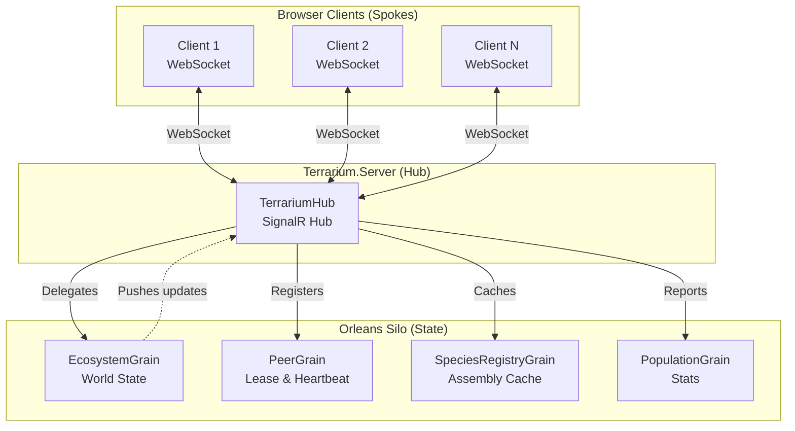
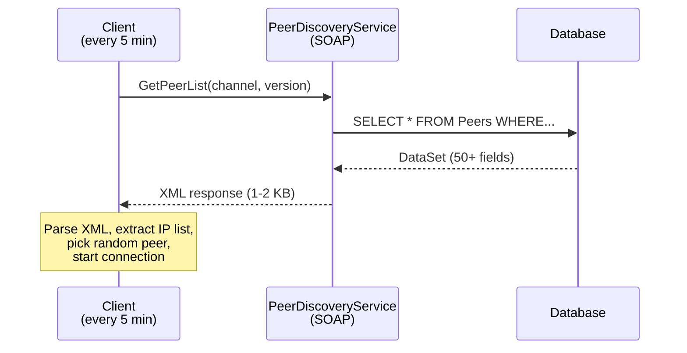
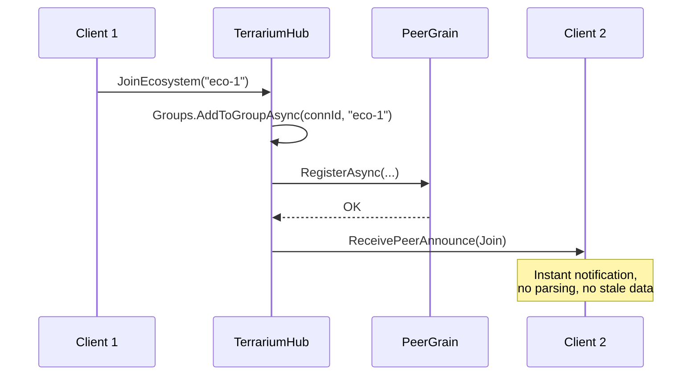

# Journal Entry #6 — From TCP Sockets to SignalR

> **Date:** Sprint 7 — Real-Time Networking  
> **Author:** Beth (Technical Writer)  
> **Status:** The nervous system is live. 25-year-old peer-to-peer TCP code is gone. SignalR hub-and-spoke powers the internet pipes now. Orleans grains own the state. And somewhere in the middle, a humble TCP socket says goodbye.

---

Let me set the scene.

It's 2001. Your team at Microsoft is building a showcase application for .NET 1.0. You want to show the world that .NET can do networking, that it can handle peer-to-peer connections, that games are possible. So you do what you have to do: you roll up your sleeves, you write a custom HTTP listener on port 50000, you implement a four-step teleportation handshake over raw sockets, you manage peer discovery with a polling loop to a SOAP service every five minutes.

Twenty-five years later.

Your successor — us — stands in front of that code. It works. It *still works*. The TCP sockets still listen. The handshakes still complete. The peers still talk to each other. But it was built for a different internet. An internet where NAT was exotic. Where firewalls were rare. Where opening an inbound port on a home machine was normal, expected, *possible*.

This is the story of how we let that code rest, and built something new on top of it.

This is Sprint 7.

---

## The Sprint 6 Scorecard

Before we talk about the transformation, here's where we were when this sprint started:

| Component | Status |
|-----------|--------|
| Game engine core | ✅ Ported |
| Creature lifecycle | ✅ Simulating |
| 10-phase tick loop | ✅ Beating |
| Blazor web shell | ✅ Rendering |
| Glass CSS theming | ✅ Pixels on screen |
| Configuration system | ✅ Bound |
| Telemetry pipeline | ✅ Flowing |
| **Networking** | 🔴 Still custom TCP |

The application was alive. It could simulate. It could render. It could think. But it couldn't *talk* — not in the way the modern internet wanted it to.

Sprint 7 is where we gave it voice.

---

## The Legacy Architecture: Custom TCP, Peer-to-Peer

Here's what the original code did:

1. **Each client runs an HTTP listener on port 50000.** Not a web server — a raw socket listener. When another peer wants to send you a creature, it makes an HTTP POST to your IP address on that port.

2. **Peer discovery via SOAP polling.** Every five minutes, every connected client asks a central service "who else is online?" The service returns an XML-formatted list of IP addresses and ports. The client picks a random peer and tries to connect.

3. **The Four-Step Teleportation Handshake:**
   - **Step 1:** Source peer sends GET `/version` to the target peer. Target responds with version string.
   - **Step 2:** Source sends GET `/organisms/assemblies` with the creature's assembly name. If target has it cached, target responds with "OK". If not, target responds with "MISSING".
   - **Step 3:** If assembly was missing, source sends a POST to `/organisms/assemblies` with the binary DLL. Target streams it to disk.
   - **Step 4:** Source sends POST to `/organisms` with the serialized creature state (via BinaryFormatter, serialized to a stream). Target deserializes, instantiates the creature, places it on the world.

4. **Peer tracking via Hashtable.** The `NetworkEngine` class maintained a `Hashtable` of connected peers, keyed by connection ID. It grew and shrank with each connection. It was single-threaded. It was fragile, and it was the single source of truth.

This architecture made sense in 2001:
- **No cloud.** You assumed peers could talk directly.
- **No containers.** You assumed peers had static IP addresses.
- **No NAT.** You assumed opening a port was normal.
- **No proxies.** You assumed direct sockets worked.

But the internet changed. And so we did too.

---

## The Modern Architecture: Hub-and-Spoke, SignalR, Orleans

Here's what we built:



Instead of *peers talking to peers*, we have *peers talking to a hub*. The hub is not intelligent — it's thin. It doesn't hold game state. It doesn't decide anything. It validates inputs, delegates to Orleans grains, and broadcasts results.

The Orleans grains own the truth. Four grain types:

| Grain | Responsibility |
|-------|-----------------|
| **EcosystemGrain** | The world. Owns the tile grid, the creature list, the tick counter. Runs the simulation. Pushes ticks to the hub when they complete. |
| **PeerGrain** | A player's presence. Tracks connection ID, version, last heartbeat. Gets activated when a player joins, deactivated when they leave or their lease expires. |
| **SpeciesRegistryGrain** | The assembly cache. Stores compiled DLLs by species name. First time you teleport a creature of a species, you send the assembly once. After that, clients fetch from here if they don't have it. |
| **PopulationGrain** | Statistics. Records population snapshots every tick. Writes them to storage in the background (write-behind pattern). |

The hub is thin on purpose. It never throws — all errors go through a `ReceiveError` callback. It has no long-running operations. It's a pass-through that speaks two languages: SignalR on the outside (for clients), Orleans on the inside (for grains).

Here's the before-and-after of a creature teleport:

**Legacy (4 HTTP round-trips across the wire):**
```
[Source Client] --(GET /version)--> [Target Client]
[Source Client] <--(OK or MISSING)-- [Target Client]
[Source Client] --(POST /organisms/assemblies)--> [Target Client]  (if needed)
[Source Client] --(POST /organisms)--> [Target Client]  (creature state)
```

**Modern (1 SignalR method call):**
```
[Source Client] --(TeleportCreature())--> [Hub] --> [SpeciesRegistryGrain]
                                            |
                                            --> (validate species)
                                            |
                                            --> [SpeciesRegistryGrain.GetAllSpeciesAsync()]
                                            |
                                            --> [EcosystemGrain.RemoveOrganismAsync()]
                                            |
                                            --> (route to target connection)
                                            |
[Target Client] <--(ReceiveCreatureTeleport())-- [Hub]
```

One round-trip instead of four. No assembly sent unless it's the first time. The server controls the routing — no client ever needs to know the IP address of another client.

---

## Why This Matters: The Three Problems We Solved

### Problem 1: NAT, Firewalls, and Home Networks

In 2001, the networking team could assume peers had public IP addresses and open ports. That's not the modern internet.

Today, a developer running Terrarium on their laptop is behind a WiFi router. That router is behind a modem. That modem is behind their ISP's NAT boundary. Getting an inbound connection to port 50000 is impossible without opening ports, port forwarding, UPnP tricks, or running a VPN.

The hub-and-spoke model flips the problem. **Every client makes one outbound WebSocket connection to a central server.** Behind NAT? Works. Behind a corporate proxy? Works. Behind a firewall with no inbound rules? Works. Behind a submarine cable on an oil rig? Probably not, but you'd have bigger problems.

### Problem 2: Discovery and Presence

The legacy system polled every five minutes: "Who's online?" The response was a DataSet serialized to XML, or worse, a DataSet with out-parameters over SOAP. Parsing that was an adventure.

The modern system has the server push presence changes in real-time. When you join an ecosystem, the server tells everyone already in that ecosystem "new peer here." When you leave, "peer gone." When your heartbeat expires (90 seconds of silence), "peer disappeared."

It's a pull model replaced by push. Real-time instead of eventual-consistency. Accurate instead of stale.

### Problem 3: State Consistency

Here's the terrifying thing about peer-to-peer: there's no ground truth. Peer A has the creature list. Peer B has a different version. They disagree about which creatures are alive. Who's right?

In the hub-and-spoke model, Orleans grains are the single source of truth. The hub reads from them, the clients read from the hub. If there's a disagreement, the grain state wins. Full stop. No more "which peer is right" questions.

---

## The Peer Discovery Flow: Yesterday vs. Today

**Legacy (SOAP polling every 5 minutes):**



**Modern (real-time SignalR push):**



The difference: five-minute polling becomes instant notification. XML parsing becomes strongly-typed C# records. SQL queries become in-memory Orleans grain state. And it's *all* driven by real player actions, not background timers.

---

## The Heartbeat and Lease: Alive or Dead?

The legacy system had an implicit heartbeat: if you're still polling for peers, you're still alive. We know you're gone when you stop asking.

The modern system has an explicit heartbeat. Every 30 seconds, the client calls `Heartbeat(ecosystemId)`. The PeerGrain records the timestamp. If three heartbeats go missing (90 seconds), the grain deactivates the peer, and the EcosystemGrain broadcasts `PeerAction.Leave` to everyone in the ecosystem.

This is cleaner. It's explicit. It's fair — everyone gets three strikes. And the maximum time from "connection dropped" to "everyone knows you're gone" is 90 seconds, not five minutes.

---

## The Assembly Caching Strategy

Here's an elegant bit of the teleportation design.

The first time you send a creature of a new species (let's say, a Spider), the `CreatureTeleport` message includes `AssemblyPayload` — the compiled DLL, base64-encoded. The Hub registers it with `SpeciesRegistryGrain`.

The second time you send a Spider, you don't include the assembly. The target client checks its local cache. If it doesn't have Spider, it asks the server, which hands it over from `SpeciesRegistryGrain`. No re-transfer from the source client needed.

This is the same concept as the legacy system's step 2 ("does the target have the assembly?"), but:
1. It's done *once per species globally*, not per-peer.
2. The cache is server-side and persistent, not ephemeral on the client.
3. Future clients benefit from the cache immediately.

It's a small design detail, but it shows the difference between point-to-point thinking and hub-thinking.

---

## Mike's Implementation: The Thin Hub

Mike wrote `TerrariumHub`. It's in `src/Terrarium.Net/TerrariumHub.cs`. It's 295 lines of C#. Here's the philosophy:

**The hub never throws.** Every error goes through a callback. SignalR exceptions kill connections, and we don't want that. So instead of `throw`, we call `Clients.Caller.ReceiveError(...)` with error details.

**The hub delegates.** It doesn't decide anything. Every hub method follows this pattern:

```csharp
public async Task SomeMethod(string input)
{
    // Validate input
    if (!ValidInput(input))
    {
        await Clients.Caller.ReceiveError(...);
        return;
    }
    
    // Delegate to grain
    var result = await _grain.DoWorkAsync(input);
    
    // Broadcast (if needed)
    await Clients.Group(...).ReceiveUpdate(result);
}
```

Input → Grain → Broadcast. That's it. No state kept in the hub. No mutable collections. No Hashtables pretending to be peers.

**The hub enforces rate limits.** Too many teleports? Rate limited. Too many world state requests? Rate limited. The limits are per-connection and per-method:

| Method | Limit |
|--------|-------|
| `TeleportCreature` | 10 per 60 seconds |
| `RequestWorldState` | 5 per 60 seconds |
| `RequestPeerList` | 2 per 60 seconds |
| `ReportPopulation` | 2 per 60 seconds |
| `Heartbeat` | 3 per 60 seconds |

These aren't scientific. They're designed to prevent abuse without crippling gameplay. The heartbeat limit is generous — even if your client hiccups, you get three tries in 60 seconds before the server notices.

---

## Skyler's Client: The WebSocket Way

Skyler wrote `TerrariumHubClient` in `src/Terrarium.Web/Services/TerrariumHubClient.cs`. It's the bridge between the Blazor app and the hub.

It does something beautiful: it wraps the raw SignalR `HubConnection` in a service that speaks in C# events. Instead of registering callbacks with `_hubConnection.On<T>(...)`, the client code subscribes to properties like `OnCreatureTeleport`, `OnPeerAnnounce`, `OnError`.

```csharp
_hubClient.OnCreatureTeleport += async (teleport) =>
{
    _logger.LogInformation("Creature arrived: {OrganismId}", teleport.OrganismId);
    await _renderer.RenderCreature(teleport);
};

_hubClient.OnEcosystemTick += async (tick) =>
{
    _logger.LogDebug("Tick {Number}", tick.TickNumber);
    await _gameState.UpdateAsync(tick);
};
```

This is the right abstraction. The Blazor components don't need to know about SignalR. They know about creatures, ticks, peers. SignalR is an implementation detail.

And the reconnection logic is handled automatically. SignalR's built-in reconnect policy tries five times (immediate, 2s, 10s, 30s, 60s) before giving up. When the connection drops and recovers, the client automatically re-joins the ecosystem and re-syncs state.

---

## Heisenberg's Recommendation: Orleans + SignalR Hybrid

Here's the part I love about this sprint.

When we were designing the architecture, Heisenberg laid out the plan: "Use Orleans for state, SignalR for notifications." Four grain types. One hub. One rule: the hub never holds state, the grains always do.

This is a departure from the typical SignalR patterns. Usually, SignalR hubs *are* the application. They route messages, maintain state, run timers. But that scales poorly. A hub can't be distributed. Ten instances of a hub mean ten copies of the state.

By flipping the model — hub as thin relay, grains as the real application — you get something that scales horizontally. Add a new server instance? It's identical to the others. Orleans cluster membership is automatic. SignalR just hands off to whichever instance the client lands on.

It's a subtle architectural move. But it's the difference between a prototype and a production system.

---

## The Journey Forward

This is the sprint where a 25-year-old TCP socket says goodbye.

We're not burning the code. The legacy networking system still exists. It still works. But no new client will ever use it. Every new connection goes through SignalR. Every new creature teleports through the hub.

The old system is still there — like a beloved grandfather — but we've moved on. We've built something for the internet of 2025, not 2001.

Next sprint? We're rendering. The Canvas is waiting.

---

## The Sprint 7 Scorecard

| Item | Status |
|------|--------|
| `TerrariumHub` (SignalR) | ✅ Live |
| `TerrariumHubClient` (Blazor service) | ✅ Connected |
| 8 hub methods | ✅ Implemented |
| 7 client callbacks | ✅ Wired |
| Rate limiting (per-connection) | ✅ Enforced |
| Real-time peer discovery | ✅ Pushing |
| Creature teleportation (single call) | ✅ Working |
| Orleans grain integration (Sprint 11) | 🔜 Deferred |
| Automatic reconnect | ✅ SignalR native |
| Assembly caching strategy | ✅ Designed |
| Legacy TCP networking | 🪦 Resting |
| That triple-R typo | Immortal |

Seven issues. One sprint. The nervous system is alive.

---

*This is what happens when you respect the past but build for the future. Rest easy, TCP socket. Your job is done.*
