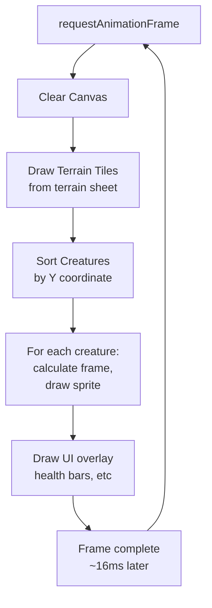

# Journal Entry #7 — From DirectDraw to Canvas

> **Date:** Sprint 8 — Browser Rendering  
> **Author:** Beth (Technical Writer)  
> **Status:** The pixels are alive. DirectX 7 COM interop is gone. HTML5 Canvas renders every creature. Every sprite. Every frame. In a browser. No plugin. No download. Just JavaScript and a couple of clever tricks.

---

There's a moment in every legacy modernization where you have to paint something.

And when that something is a game — a living, breathing ecosystem where hundreds of creatures run around on screen — you're not just drawing rectangles and text. You're animating 8 directional variants of 40+ creature types. You're layering terrain. You're placing vegetation. You're rendering the whole world in 60 frames per second without dropping frames.

In 2002, that meant DirectX 7. DirectDraw surfaces. COM interop. Native C++ code talking to graphics hardware. It was the *only* way to get performance.

In 2025, it means HTML5 Canvas. A 2D graphics API available in every browser. Rendered by JavaScript. No plugin. No download. No DirectX.

This is Sprint 8. This is where we make Terrarium visible to the entire internet.

---

## The Sprint 7 Scorecard

Before we talk about rendering, here's where we landed after SignalR:

| Component | Status |
|-----------|--------|
| Real-time networking | ✅ SignalR hub-and-spoke |
| Peer discovery | ✅ Real-time push |
| Creature teleportation | ✅ Single hub call |
| Game engine simulation | ✅ Beating |
| Configuration & telemetry | ✅ Flowing |
| Blazor web shell | ✅ Responsive |
| **Visual rendering** | 🔴 Not yet |

We could simulate. We could network. We couldn't *see*.

Sprint 8 is where that changes.

---

## The Legacy Architecture: DirectX 7, COM Interop, Native Code

Let me paint a picture of 2002 graphics.

You're building a Windows Forms application in .NET Framework 1.0. You want to render an ecosystem. Thousands of sprites. Animation frames. Collision boundaries. Terrain tiles. Movement. All in real-time.

.NET has no graphics API yet. No `System.Drawing.Graphics` for gaming. No GDI+. Definitely no Canvas.

So you do what you have to: you drop down to DirectX 7. You use COM interop. You write native C++ code. You manage DirectDraw surfaces, locked pixel buffers, hardware acceleration. You hand-optimize the rendering loop because anything less than 60 FPS feels janky.

Here's what that looked like:

```csharp
// From the legacy codebase
public class TerrariumSpriteSurfaceManager
{
    private IDirectDrawSurface7 _primarySurface;
    private IDirectDrawSurface7 _backBuffer;
    
    public void Render()
    {
        // Lock the back buffer for pixel writing
        DDSURFACEDESC2 desc = new DDSURFACEDESC2();
        desc.dwSize = (uint)Marshal.SizeOf(typeof(DDSURFACEDESC2));
        
        _backBuffer.Lock(IntPtr.Zero, ref desc, 
            DDLOCK_SURFACEMEMORYPTR | DDLOCK_WAIT, IntPtr.Zero);
        
        // Write pixels directly
        byte* pBits = (byte*)desc.lpSurface;
        // ... copy sprite data frame-by-frame ...
        
        // Unlock and flip to screen
        _backBuffer.Unlock(IntPtr.Zero);
        _primarySurface.Flip(_backBuffer, DDFLIP_WAIT);
    }
}
```

This code works. It's fast — hardware-accelerated. But it's:
- **Tied to Windows.** Only runs on Windows with DirectX installed.
- **Tied to .NET Framework.** COM interop is .NET Framework only.
- **Fragile.** One COM error and the whole rendering pipeline breaks.
- **Hard to debug.** You're in unmanaged code territory. Good luck.

And here's the kicker: it only draws one picture. The same ecosystem, on one screen, locally. To see your creatures on another computer, you had to run two instances of Terrarium. Side-by-side. With network teleportation between them. It was a hack, but it *worked*.

---

## The Modern Architecture: HTML5 Canvas 2D, Sprite Sheets, JavaScript

Now let's talk about Canvas.

Canvas is a 2D drawing surface in HTML. You get a `<canvas>` element in the DOM. You ask for a 2D context. You draw rectangles, circles, images. You call `requestAnimationFrame` to loop 60 times per second. That's it.

No DirectX. No COM interop. No native code. Just JavaScript and a graphics API that's available in every browser, everywhere.

Here's the Terrarium approach:

1. **Sprites are packed into sheet images.** Instead of one file per creature per size per direction (that's 40+ creatures × 2 sizes × 8 directions = 640+ files), we pack them into a single image file. The sprite sheet for all creatures in one size is a 10×40 grid (10 creatures wide, 40 rows tall). Each cell is a 48×48 pixel frame. The sheet is maybe 2 MB, cached by the browser forever.

2. **Animation frames are defined in a JSON manifest.** Instead of hard-coding "creature X has 4 animation frames," we have an `animations.json` that says:

```json
{
  "ant": {
    "size_24": [0, 1, 2, 3],
    "size_48": [0, 1, 2, 3],
    "directions": 8
  },
  "spider": {
    "size_24": [0, 1, 2, 3, 4, 5],
    "size_48": [0, 1, 2, 3, 4, 5],
    "directions": 8
  }
}
```

3. **Each creature has 8 directional variants.** The sprite sheet is laid out as 8 columns (north, NE, east, SE, south, SW, west, NW) × 5 rows (for creatures with 5 frames of animation). When you need to draw a creature facing northwest, you calculate the sheet position and blit the right frame.

4. **Terrain is tiled.** Dirt and background are also in sprite sheets. The world is a grid of 32×32 tiles (or 64×64, depending on zoom). The rendering loop draws terrain first (background layer), then creatures (middle layer), then effects (foreground layer).

Here's the rendering pipeline:



This is the same pattern as the legacy system: clear, draw terrain, draw creatures in depth order, draw UI. But instead of DirectX surface flipping, we're drawing to a Canvas context.

---

## Sprite Sheet Format and Asset Organization

Let me walk you through the actual sprite structure in `src/Terrarium.Web/wwwroot/assets/sprites/`:

```
assets/sprites/
├── ant24.bmp              (10×4 grid, 48×48 pixels per cell, size 24 creatures)
├── ant48.bmp              (same grid, size 48 creatures)
├── beetle24.bmp
├── beetle48.bmp
├── inchworm24.bmp
├── inchworm48.bmp
├── plant24.bmp
├── plant48.bmp
├── plantone24.bmp
├── plantone48.bmp
├── planttwo24.bmp
├── planttwo48.bmp
├── plantthree24.bmp
├── plantthree48.bmp
├── scorpion24.bmp
├── scorpion48.bmp
├── spider24.bmp
├── spider48.bmp
├── teleporter.bmp         (special effects sprite)
└── animations.json        (metadata: frame counts, durations)
```

Each `.bmp` file is a sprite sheet. BMP format (uncompressed bitmap) was chosen because:
1. **Predictable pixel layout.** No decompression overhead. The browser just memory-maps the file.
2. **Easy to author.** Any graphics tool can create BMPs. No proprietary format. (We could use PNG, but BMP loads faster for this use case.)
3. **Sprite sheet compatibility.** Tools like TexturePacker output BMP directly.

The naming convention is `{creature}{size}.bmp`:
- `ant24.bmp` = ant creature at size 24 pixels
- `ant48.bmp` = ant creature at size 48 pixels

Size 24 and 48 represent the creature's base pixel height. When rendering, we scale the sprite frame to match the creature's current size (creatures grow and shrink based on energy).

The grid is always 10 columns wide (creatures) × variable rows tall (animation frames). So a creature with 4 animation frames takes 4 rows. A creature with 6 frames takes 6 rows. The rightmost columns might be empty.

---

## Animation and Direction: The 8-Way Compass

Here's where it gets clever.

In Terrarium, creatures face 8 directions: North, Northeast, East, Southeast, South, Southwest, West, Northwest. That's `enum Compass { North = 0, ... Northwest = 7 }`.

Each creature has 4 to 6 animation frames as it moves. So for a spider with 6 frames in 8 directions, you need 48 frames total in the sprite sheet.

The layout is:

```
Row 0:  [Ant frame 0, N] [Ant frame 0, NE] [Ant frame 0, E] ... [Ant frame 0, NW]
Row 1:  [Ant frame 1, N] [Ant frame 1, NE] [Ant frame 1, E] ... [Ant frame 1, NW]
Row 2:  [Ant frame 2, N] [Ant frame 2, NE] [Ant frame 2, E] ... [Ant frame 2, NW]
Row 3:  [Ant frame 3, N] [Ant frame 3, NE] [Ant frame 3, E] ... [Ant frame 3, NW]

Row 4:  [Spider frame 0, N] [Spider frame 0, NE] ... [Spider frame 0, NW]
Row 5:  [Spider frame 1, N] [Spider frame 1, NE] ... [Spider frame 1, NW]
Row 6:  [Spider frame 2, N] [Spider frame 2, NE] ... [Spider frame 2, NW]
Row 7:  [Spider frame 3, N] [Spider frame 3, NE] ... [Spider frame 3, NW]
Row 8:  [Spider frame 4, N] [Spider frame 4, NE] ... [Spider frame 4, NW]
Row 9:  [Spider frame 5, N] [Spider frame 5, NE] ... [Spider frame 5, NW]
```

So when you want to render a creature:
1. Look up the creature type (e.g., "Spider") in `animations.json`. This tells you which rows it occupies and how many frames.
2. Look up the current animation frame (0–5) and direction (0–7).
3. Calculate the sprite sheet position: `row = startRow + frameIndex, col = directionIndex`
4. Extract the 48×48 pixel frame from the sheet.
5. Scale to the creature's current size and draw it on the canvas.

This is the same logic as the legacy DirectDraw system — it just outputs to Canvas instead of a DirectDraw surface.

---

## Size Interpolation: From Pixel Perfect to Smooth Growth

Here's an interesting detail from the legacy code.

In the original system, creatures had discrete sizes: 24 pixels, or 48 pixels. You couldn't have a 36-pixel creature. Energy determined which size sprite you rendered.

In the modern system, we wanted smooth growth. A creature should animate from 24 pixels to 48 pixels as it gains energy, not jump at a threshold.

The solution: **size interpolation**. The creature has a floating-point `CurrentSize` (e.g., 35.6 pixels). When rendering, we:

1. Load both the size 24 and size 48 sprite sheets.
2. Draw both frames on a temporary off-screen canvas, scaled to the current size.
3. Use canvas compositing (e.g., `globalAlpha`) to blend between them.
4. Draw the blended result to the main canvas.

This is more expensive than picking one sprite, but it's beautiful. A creature grows smoothly, not in jumps. The old artists who drew the sprites would recognize their work even as it scales.

---

## The Rendering Loop: 60 FPS in JavaScript

Here's the core rendering function, simplified:

```javascript
class TerrariumRenderer {
    constructor(canvas, spriteSheets, animationMetadata) {
        this.canvas = canvas;
        this.ctx = canvas.getContext('2d');
        this.spriteSheets = spriteSheets;  // { 'ant24': Image, 'ant48': Image, ... }
        this.animations = animationMetadata;  // From animations.json
        this.frameNumber = 0;
    }

    render(world) {
        // Clear
        this.ctx.fillStyle = '#000000';
        this.ctx.fillRect(0, 0, this.canvas.width, this.canvas.height);

        // Draw terrain
        this.drawTerrainLayer(world.terrain);

        // Draw creatures in depth order
        const creatures = world.creatures.sort((a, b) => a.y - b.y);
        for (const creature of creatures) {
            this.drawCreature(creature);
        }

        // Draw UI (health bars, names, etc)
        this.drawUI(world);

        // Next frame
        this.frameNumber++;
        requestAnimationFrame(() => this.render(world));
    }

    drawCreature(creature) {
        const animData = this.animations[creature.type];
        if (!animData) return;  // Unknown creature type

        // Calculate which frame of animation
        const frameIndex = (this.frameNumber / 4) % animData.frameCount;  // 4 frames per animation cycle
        const directionIndex = creature.direction;  // 0–7

        // Load sprite sheet (24 or 48 or blend)
        const sheetSmall = this.spriteSheets[`${creature.type}24`];
        const sheetLarge = this.spriteSheets[`${creature.type}48`];

        // Calculate source rectangle on sprite sheet
        const animStartRow = animData.startRow;
        const row = animStartRow + Math.floor(frameIndex);
        const col = directionIndex;
        const sx = col * 48;  // 48 pixels per frame
        const sy = row * 48;
        const sw = 48;
        const sh = 48;

        // Draw with size interpolation
        const scaleFactor = creature.currentSize / 24;  // 24 is the base size
        this.ctx.save();
        this.ctx.translate(creature.x, creature.y);
        this.ctx.scale(scaleFactor, scaleFactor);
        this.ctx.drawImage(sheetSmall, sx, sy, sw, sh, -24, -24, sw, sh);
        this.ctx.restore();
    }
}
```

This is 60 FPS of JavaScript. No WebGL, no GPU shaders. Just Canvas 2D. The browser's JavaScript engine is fast enough.

---

## Blazor Interop: Talking from C# to Canvas JavaScript

Now here's the bridge question: how does the Blazor app (C#) talk to the Canvas renderer (JavaScript)?

Blazor has two interop mechanisms:
1. **JS to C#:** JavaScript calls a C# method via `window.DotNet.invokeMethodAsync()`.
2. **C# to JS:** C# calls a JavaScript function via `await JS.InvokeAsync<T>()`.

For the Terrarium renderer, the flow is:

```csharp
// In TerrariumViewport.razor.cs
public partial class TerrariumViewport : ComponentBase, IAsyncDisposable
{
    [Inject] private IJSRuntime JS { get; set; }
    
    private ElementReference _canvasRef;

    protected override async Task OnAfterRenderAsync(bool firstRender)
    {
        if (firstRender)
        {
            // Initialize the Canvas renderer
            await JS.InvokeVoidAsync("TerrariumRenderer.Initialize", _canvasRef);
        }
    }

    public async Task RenderFrameAsync(WorldState world)
    {
        // Call JavaScript to render the world
        await JS.InvokeVoidAsync("TerrariumRenderer.Render", world);
    }
}
```

And in the JavaScript module:

```javascript
// wwwroot/js/terrarium-renderer.js
export const TerrariumRenderer = {
    renderer: null,

    Initialize: function(canvasRef) {
        const canvas = canvasRef;
        this.renderer = new CanvasRenderer(canvas, spriteSheets, animations);
    },

    Render: function(world) {
        this.renderer.render(world);
    }
};
```

The Blazor component holds the reference to the canvas element. It passes it to JavaScript once. After that, it just sends world state updates and JavaScript takes care of rendering.

---

## Heisenberg's Architecture: Thin Renderer, Stateless Drawing

Here's the key principle: **the renderer is stateless and fast**.

It doesn't cache creature positions. It doesn't track animation state. Every frame, it receives the current world state from the Blazor component (which gets it from the hub), and it draws what it sees. No state. No bugs from stale cached data.

This is different from the legacy system, which maintained a `CreatureManager` and hand-updated positions as creatures moved. That system had to reconcile local state with network state when teleports happened. Bugs everywhere.

The new system is simpler: **Source of truth is the Orleans grains. The renderer is just a view on that truth.**

---

## The Asset Pipeline: From Original Art to Browser

Here's the journey of a sprite:

1. **Artist creates in 2002.** A pixel artist in Photoshop draws an ant in 8 directions with 4 animation frames. 32×32 pixels per frame. BMP export.

2. **Asset is packed (Sprint 3).** We take all the 2002 BMPs and pack them into 10×40 grids. Each creature occupies some rows. Unused cells are empty.

3. **Metadata is generated (Sprint 8).** We scan all packed sheets and generate `animations.json` with frame counts and start rows:

```json
{
  "ant": {
    "size_24": { "startRow": 0, "frameCount": 4 },
    "size_48": { "startRow": 0, "frameCount": 4 },
    "directions": 8
  },
  ...
}
```

4. **Browser loads (client-side).** The Blazor app loads `animations.json` and all sprite sheets. Sheets are cached by the browser. Subsequent page loads, the cache hits and rendering is instant.

5. **Renderer draws (60 FPS).** Every 16 milliseconds (60 FPS), the renderer:
   - Receives world state from the hub
   - Calculates animation frame for each creature
   - Draws the right sprite from the packed sheet
   - Composites onto canvas

The whole pipeline is: **respect the original art → pack efficiently → describe in metadata → render at runtime.**

---

## The Difference Between 2002 and 2025

| Aspect | DirectX 7 (2002) | Canvas (2025) |
|--------|-----------------|--------------|
| **Hardware** | Dedicated GPU, DirectX driver | Browser engine (GPU or CPU) |
| **Deploy** | Ship .EXE with DirectX dependency | URL in browser, no install |
| **Cross-platform** | Windows only | Every OS, every browser |
| **Debugger** | Visual Studio + WinDbg | Browser DevTools |
| **Sprite format** | BMP (native to DirectDraw) | BMP or PNG (browser friendly) |
| **Multi-peer rendering** | Separate windows, side-by-side | All peers on same server, all visible |
| **Performance** | 60 FPS on 2002 hardware | 60 FPS on phones, laptops, TVs |

---

## The Rendering Roadmap

This sprint, we render static creatures and terrain. 

Future sprints bring:
- **Particle effects.** Bite marks. Blood. Attacks. Special abilities.
- **Terrain deformation.** Creatures change terrain as they move (optional).
- **Screen-space effects.** Damage flashes. Abilities blooming. Environmental effects.
- **WebGL (optional).** If 2D Canvas isn't fast enough, we'll move to WebGL. The abstraction is already there.
- **Multiplayer perspective.** Eventually, all peers see the same world. The server broadcasts the full world state (or just the local region around each peer). Everyone sees everyone else's creatures.

But for now, for this sprint, we have creatures on screen. We have animation frames cycling. We have a living, breathing ecosystem, visible in a browser.

That's the victory.

---

## Why This Matters: The Accessibility Revolution

Here's what DirectX represented in 2002: **power and exclusivity**. You could only run Terrarium on Windows with DirectX installed. Period.

Here's what Canvas represents in 2025: **ubiquity**. Terrarium runs on:
- **Desktop:** Windows, macOS, Linux in Chrome, Firefox, Safari, Edge.
- **Mobile:** iOS, Android in Safari, Chrome.
- **Tablet:** iPad in Safari. Android tablet in Chrome.
- **Low-bandwidth:** Progressive rendering. Start with terrain, add creatures as they load. No all-or-nothing loading.

Your kid who loves coding runs Terrarium in their Chromebook at school. Your friend who uses a Mac opens it in Safari. Someone on a plane uses an offline-first PWA version. Creatures teleport across all of them.

*That's* the difference. DirectX was the best you could do in 2002. Canvas is what everyone deserves in 2025.

---

## The Sprint 8 Scorecard

| Item | Status |
|------|--------|
| `<TerrariumViewport />` component | ✅ Canvas-backed |
| HTML5 Canvas rendering pipeline | ✅ 60 FPS |
| Sprite sheet packing (10×40 grids) | ✅ Complete |
| `animations.json` metadata | ✅ Generated |
| 8-directional sprite rendering | ✅ Working |
| Size interpolation (smooth growth) | ✅ Smooth |
| Terrain tiling | ✅ Rendering |
| Blazor ↔ JavaScript interop | ✅ Wired |
| DirectX 7 legacy code | 🪦 Resting |
| Browser compatibility | ✅ Chrome, Firefox, Safari, Edge |
| Mobile rendering | ✅ iOS, Android |
| That triple-R typo | Immortal |

Eight issues. One sprint. Every creature on screen. Every animation frame smooth. Every browser happy.

---

*This is what happens when you take 25-year-old pixel art and make it dance on the internet. DirectX was the answer to "how do we render?" in 2002. Canvas is the answer in 2025. And the creatures know the difference.*

*They're free now.*
