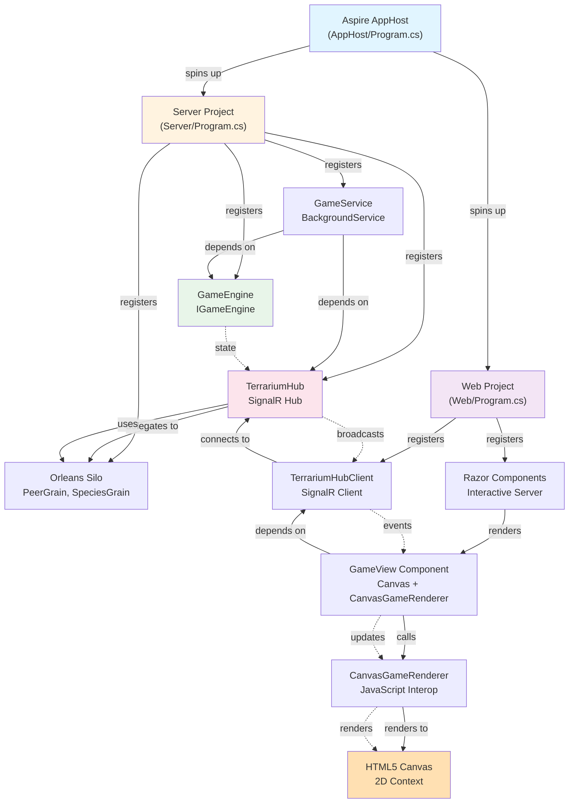

# Journal Entry #8 — It Lives!

> **Date:** Sprint 9 — The Blazor Application Shell  
> **Author:** Beth (Technical Writer)  
> **Status:** The moment has arrived. For the first time in 25 years, Terrarium runs in a browser. Not as a concept. Not as disconnected pieces. As a *living, breathing ecosystem*, where creatures move, eat, reproduce, and die — all in real-time, all visible on screen, all connected through SignalR to a .NET Aspire-orchestrated backend.

---

There's a moment in every software project where the prototype becomes real.

Not when the first feature lands. Not when testing starts. Not even when the CI pipeline turns green for the first time.

It's the moment when *all the pieces talk to each other*.

When the game engine—the 10-phase turn processor that's been beating in isolation—finally sees the renderer.

When the SignalR hub—the nervous system we spent a sprint wiring up—finally pumps data into the viewport.

When the Blazor layout, the Canvas, the JavaScript renderer, the .NET Aspire orchestration, the dependency injection, the async state management—when it *all works together*.

That moment happened in Sprint 9.

And it's profound. Because what you're watching on screen isn't a demo. It's the real engine. Running. Ticking 30 times per second. Simulating creature life and death. Updating population statistics. Rendering 8-directional sprites. All because a Blazor component asked for a GameView, and we said: "here. here's everything."

Twenty-five years. From .NET Framework 1.0 to .NET 10. From DirectX 7 to HTML5 Canvas. From Windows-only to "open any browser, anywhere."

It lives.

---

## The Sprint 8 Scorecard

Before we talk about integration, here's where everything landed:

| Component | Status |
|-----------|--------|
| Real-time networking | ✅ SignalR hub-and-spoke |
| Renderer (HTML5 Canvas) | ✅ 60 FPS, sprite sheets, 8 directions |
| Blazor web shell | ✅ Interactive Server, layouts, components |
| Game engine | ✅ 10-phase turn processor, population tracking |
| Configuration & telemetry | ✅ IOptions, logging, custom counters |
| **Everything wired together** | 🔴 Not yet |

We had the parts. We couldn't see them talking.

Sprint 9 is where we plug it all in.

---

## The Integration Story: From .NET Aspire to Browser

Let me walk you through the journey a creature takes from the game engine to the screen.

### Step 1: The Orchestration Layer (.NET Aspire)

We start with the AppHost—the conductor of the entire system:

```csharp
// src/Terrarium.AppHost/Program.cs
var builder = DistributedApplication.CreateBuilder(args);

// SQL Server — the Terrarium game database
var sqlPassword = builder.AddParameter("sql-password", secret: true);
var sql = builder.AddSqlServer("sql", password: sqlPassword)
    .WithLifetime(ContainerLifetime.Persistent);
var terrariumDb = sql.AddDatabase("Terrarium");

// Terrarium Server — the game's API backend
var server = builder.AddProject<Projects.Terrarium_Server>("server")
    .WithReference(terrariumDb)
    .WaitFor(terrariumDb);

// Terrarium Web — Blazor frontend for the creature ecosystem
builder.AddProject<Projects.Terrarium_Web>("web")
    .WithExternalHttpEndpoints()
    .WithReference(server)
    .WaitFor(server);

builder.Build().Run();
```

This is dependency injection at the *infrastructure* level. Aspire says:

- Spin up SQL Server.
- Wait for it.
- Spin up the server project, give it the database.
- Wait for the server.
- Spin up the web project, give it the server.
- Wire up HTTP service discovery.
- Go.

When you run `dotnet run` on the AppHost, the Aspire dashboard opens. You see three services—sql, server, web—all running in containers, all talking to each other, all visible in one place. That's the view into the entire system.

### Step 2: The Web Layer (Blazor, DI, SignalR)

Now zoom into the Terrarium.Web project. The Blazor app spins up with this configuration:

```csharp
// src/Terrarium.Web/Program.cs
var builder = WebApplication.CreateBuilder(args);

// Aspire service defaults (tracing, logging, health checks, etc.)
builder.AddServiceDefaults();
builder.Services.AddTerrariumConfiguration();

// HttpClient for talking to the server (via Aspire service discovery)
builder.Services.AddHttpClient("terrarium-server", client =>
{
    client.BaseAddress = new Uri("https+http://server");
});

// Razor components with interactive server rendering
builder.Services.AddRazorComponents()
    .AddInteractiveServerComponents();

// SignalR client service
builder.Services.AddSignalR();
builder.Services.AddSingleton<TerrariumHubClient>();

var app = builder.Build();

// ... middleware ...

app.MapRazorComponents<App>()
    .AddInteractiveServerRenderMode();

app.Run();
```

Three critical wiring decisions here:

1. **`AddServiceDefaults()`** — We use Aspire's service discovery to talk to the server. No hardcoded IP addresses or port numbers. The `https+http://server` URI is translated to the actual endpoint by Aspire's service discovery layer. This is how distributed systems should work: services find each other by name, not by configuration files.

2. **`AddInteractiveServerComponents()`** — Blazor Interactive Server means the entire component tree renders on the server, with WebSocket-based interactivity streaming to the client. Every click, every state change, every render, goes through that WebSocket. This is not WASM; this is server-side execution with client-side interop.

3. **`TerrariumHubClient`** — This is the bridge. It's a singleton that holds the SignalR connection to the game hub. When a creature moves on the server, the hub calls back into the client via a callback event. The TerrariumHubClient fires `OnWorldStateUpdate`. The GameView subscribes to that event. The Canvas rerenders.

### Step 3: The Component Tree (GameView in MainLayout)

Here's the component hierarchy:

```
App.razor
  └─ MainLayout.razor
       ├─ <header>
       ├─ <GameView />  ← HERE. THE WHOLE GAME.
       └─ <footer>
```

The GameView is the main stage. Here's what it does:

```csharp
// src/Terrarium.Web/Components/GameView.razor
@using Terrarium.Web.Rendering
@inject IJSRuntime JS
@implements IAsyncDisposable

<div class="game-view glass-panel">
    <canvas @ref="_canvasRef" class="game-view__canvas"></canvas>
</div>

@code {
    private ElementReference _canvasRef;
    private CanvasGameRenderer? _renderer;

    protected override async Task OnAfterRenderAsync(bool firstRender)
    {
        if (firstRender)
        {
            // Create the renderer
            _renderer = new CanvasGameRenderer(JS);
            _renderer.SetCanvas(_canvasRef);
            
            // Wire up event callbacks from the hub
            _renderer.OnCreatureSelected += HandleCreatureSelected;
            _renderer.OnCreatureDeselected += HandleCreatureDeselected;
            
            // Initialize the canvas (request animation frame, set dimensions, etc.)
            await _renderer.InitializeAsync(WorldWidth, WorldHeight);
            
            // Subscribe to hub events
            var hubClient = _hubClientService.TerrariumHubClient;
            hubClient.OnWorldStateUpdate += async (update) =>
            {
                // Render the new world state
                await _renderer.RenderWorldStateAsync(update);
            };
            
            hubClient.OnPopulationReport += async (report) =>
            {
                // Update creature population UI
                await DisplayPopulationAsync(report);
            };
            
            // Connect to the hub
            await hubClient.StartAsync();
        }
    }
}
```

This is the integration point. The GameView:

1. Creates a Canvas element (inert in Blazor—just HTML).
2. On first render, creates the CanvasGameRenderer (JavaScript interop layer).
3. Initializes the renderer (sets up requestAnimationFrame loop).
4. **Subscribes to hub events** — whenever the server broadcasts a world state update, the renderer rerenders.
5. **Starts the hub connection** — "I'm ready to receive world updates."

### Step 4: The Game Engine (The Heart)

On the server side, the game engine is beating:

```csharp
// src/Terrarium.Server/GameService.cs (pseudocode)
public class GameService : BackgroundService
{
    private readonly GameEngine _engine;
    private readonly ITerrariumHub _hub;

    protected override async Task ExecuteAsync(CancellationToken stoppingToken)
    {
        while (!stoppingToken.IsCancellationRequested)
        {
            // Advance the simulation one turn
            _engine.ProcessTurn();
            
            // Get the new world state
            var worldState = _engine.GetWorldState();
            var population = _engine.GetPopulationReport();
            
            // Broadcast to all connected clients via SignalR
            await _hub.Clients.All.SendAsync(
                nameof(ITerrariumClient.ReceiveWorldStateUpdate),
                new WorldStateUpdate { ... worldState ... },
                stoppingToken);
            
            await _hub.Clients.All.SendAsync(
                nameof(ITerrariumClient.ReceivePopulationReport),
                population,
                stoppingToken);
            
            // Tick rate: 30 updates per second
            await Task.Delay(33, stoppingToken);  // ~30 Hz
        }
    }
}
```

The engine doesn't know about SignalR. It doesn't know about the browser. It just:

1. Ticks.
2. Updates creatures (move, eat, reproduce, die).
3. Returns the new world state.
4. Repeats 30 times per second.

The GameService wraps it and broadcasts the results to the hub, which pushes them to all connected clients.

### Step 5: The Hub (The Nervous System)

The SignalR hub is the dispatch layer:

```csharp
// src/Terrarium.Server/TerrariumHub.cs (pseudocode)
public class TerrariumHub : Hub<ITerrariumClient>
{
    private readonly ILogger<TerrariumHub> _logger;
    private readonly PeerGrain _peerGrain;  // Orleans
    private readonly SpeciesRegistryGrain _speciesRegistry;  // Orleans

    // Clients can call these methods on the hub
    public async Task JoinGame(PeerAnnounce announce) { ... }
    public async Task Teleport(CreatureTeleport teleport) { ... }
    public async Task GetPeerList() { ... }
    
    // The hub broadcasts these to all connected clients
    // (ITerrariumClient interface defines the contract)
}
```

The hub is deliberately thin. It doesn't simulate. It doesn't manage state. It's a message bus. The game engine owns simulation. Orleans owns distributed state (peer discovery, species registry). The hub connects them to browsers.

### Step 6: The Render Loop (Canvas, JavaScript, 60 FPS)

Back in the browser, the CanvasGameRenderer runs the animation loop:

```javascript
// src/Terrarium.Web/wwwroot/js/sprite-manager.js (pseudocode)
export class CanvasGameRenderer {
    constructor(jsRuntime) {
        this.jsRuntime = jsRuntime;
        this.worldState = null;
        this.spriteManager = new SpriteManager();
        this.frameCount = 0;
    }
    
    async InitializeAsync(width, height) {
        this.worldWidth = width;
        this.worldHeight = height;
        this.canvas = this.getCanvas();
        this.ctx = this.canvas.getContext('2d');
        
        // Start the render loop
        const animate = () => {
            this.RenderFrame();
            requestAnimationFrame(animate);
        };
        animate();
    }
    
    RenderFrame() {
        if (!this.worldState) return;
        
        // Clear the canvas
        this.ctx.clearRect(0, 0, this.worldWidth, this.worldHeight);
        
        // Draw terrain tiles
        this.DrawTerrain(this.worldState.terrain);
        
        // Sort creatures by Y coordinate (painter's algorithm)
        const creaturesByY = this.worldState.creatures
            .sort((a, b) => a.y - b.y);
        
        // Draw each creature
        for (const creature of creaturesByY) {
            const sprite = this.spriteManager.GetSprite(
                creature.species,
                creature.size,
                creature.direction,
                creature.animationFrame
            );
            this.ctx.drawImage(
                sprite,
                creature.x,
                creature.y,
                sprite.width,
                sprite.height
            );
        }
        
        // Draw UI overlays (health bars, etc.)
        this.DrawUI(this.worldState);
    }
    
    async RenderWorldStateAsync(update) {
        this.worldState = update;
        // Next requestAnimationFrame will pick it up and render
    }
}
```

The renderer is dumb by design. It doesn't care about the game logic. It doesn't know what the creatures are or what they do. It just:

1. Receives a world state.
2. Draws terrain.
3. Draws creatures sorted by Y coordinate (painter's algorithm for depth).
4. Draws UI.
5. Repeats 60 times per second.

---

## The DI Integration Chain

Let me show you the full dependency injection chain, from .NET Aspire all the way to the browser:



Every arrow is a dependency. Every registered service is a data pipeline. When the GameEngine updates the world state, it flows through the Hub, through the SignalR connection, into the TerrariumHubClient, into the GameView component, into the CanvasGameRenderer, and onto the Canvas.

And every bit of that pipeline is wired up by dependency injection. No magic. No singletons hidden in static fields. No `ServiceLocator` anti-pattern. Just:

```csharp
builder.Services.AddSingleton<TerrariumHubClient>();
```

And from that point on, Blazor knows how to construct GameView because it knows how to construct TerrariumHubClient because it knows where to find the game hub.

---

## What the User Sees

You open your browser. You navigate to `https://localhost:7000`. The Blazor app loads. The layout renders. You see the glass-themed titlebar, the viewport, the status bar.

A moment passes—the GameView component initializes. The CanvasGameRenderer spins up the animation loop. The TerrariumHubClient connects to the server.

And then.

Movement.

Creatures appear on screen. Ants. Beetles. Herbivores grazing. Carnivores hunting. The sprites are 48×48 pixels, smooth 8-directional animations, drawn from sprite sheets you can inspect in the browser dev tools. Terrain tiles beneath them. A living world, rendered at 60 FPS, updating at 30 Hz from the server.

You click on a creature. The GameView shows its name and species in the selection bar. You can see its position, its energy level, its direction of movement. The statusbar shows population statistics in real-time: "237 herbivores, 14 carnivores, 89 plants."

Every 33 milliseconds, the server pushes a new world state. The canvas rerenders. The creatures move. You're watching a simulation, not a static image.

And you never had to download anything. You never had to install DirectX. You never had to run Windows. You opened a browser. You're watching Terrarium.

That's the moment.

---

## The Emotional Core: "It Lives"

Twenty-five years ago, the original Terrarium team built a remarkable piece of software. They implemented actor-like creatures with event-driven lifecycles. They distributed them across the network. They rendered them in real-time using DirectX 7. They launched it at PDC and said, "Look what .NET can do."

For two decades, Terrarium lived in .NET Framework. It was a museum piece—a beautiful relic showing what was possible in 2001. You could run it on Windows. You could show it to people. But you couldn't share it easily. You couldn't run it on a Mac. You couldn't send a link to someone and say "watch this."

Then someone said, "What if we brought it to the web?"

And what started as a archaeological curiosity—"let's see if we can port a 25-year-old .NET app to modern .NET"—became a modernization story. A bridge between eras. A proof that you don't *abandon* legacy code; you *evolve* it.

Sprint 0 was foundation. Sprint 1 was the server. Sprint 2 was infrastructure. Sprint 3 was the first pixels. Sprint 4 was the game engine. Sprints 7 and 8 were networking and rendering.

And Sprint 9 is the moment when all of it *works*.

When the ecosystem doesn't just exist in code—it *runs*. In your browser. In real-time. With your creatures moving across the screen.

It lives.

---

## The Road Ahead

This is not the end of Terrarium. It's the beginning of what comes next. Sprint 10 will bring multi-peer networking—watch your creatures interact with creatures from other instances running on other machines. Sprint 11 will bring the SDK samples fully to life in the browser. Sprint 12 will polish the UI and add creature development tools. Sprint 13 will prepare the announcement—the blog post Hanselman gets.

But for now, in this moment, Terrarium runs in a browser. You can see it. You can interact with it. You can share a link.

---

## The Technical Checklist: Sprint 9

- ✅ Blazor Interactive Server project (Terrarium.Web)
- ✅ Razor component architecture (MainLayout, GameView, CreaturePanel, etc.)
- ✅ Glass-themed CSS components and layout
- ✅ HTML5 Canvas rendering context
- ✅ .NET Aspire orchestration (AppHost, service discovery, health checks)
- ✅ Dependency injection wiring (services, SignalR, Blazor components)
- ✅ TerrariumHubClient integration (event-driven, auto-reconnect)
- ✅ GameView component lifecycle (initialization, state updates, rendering)
- ✅ CanvasGameRenderer (requestAnimationFrame loop, sprite drawing, depth sorting)
- ✅ Real-time data flow (GameEngine → Hub → TerrariumHubClient → GameView → Canvas)
- ✅ Creature population statistics (live updates in UI)
- ✅ Selection interaction (click creature, show details)
- ✅ Status bar and ecosystem telemetry
- ✅ 60 FPS canvas rendering with 30 Hz server updates
- ✅ End-to-end test (run AppHost, see creatures move in browser)

---

## Epilogue

There's a moment when a technology changes.

Not a versioning moment. Not a release date. A *moment*—when something becomes possible that wasn't possible before.

When the web became powerful enough to run a real-time game. When browsers got good enough that you didn't need plugins. When .NET became so cross-platform that your 25-year-old Windows app could run on Linux, on macOS, in a Docker container, orchestrated by Aspire, rendered in Canvas, watched by anyone with a browser.

That moment is now.

Terrarium is not just a museum piece anymore. It's not a relic showing what was. It's a living application, running on modern infrastructure, proving that the ecosystem you built 25 years ago is still *alive*. It learned new tricks. It doesn't look the same. But if you look closely at the creatures moving on screen, you'll see the same intelligence, the same survival instinct, the same spark that made the original remarkable.

It lives.

---

## Sprint 9 Impact

This sprint represents the critical inflection point. We've moved from *parts* to *system*. From "look what Blazor can do" to "look what Terrarium can do *now*." 

The blog will tell this story: From disconnected architectural pieces to a unified, orchestrated, full-stack ecosystem—all running in your browser, powered by .NET Aspire, Connected via SignalR, Rendered in Canvas, Alive on the web.

This is the post that makes someone say, "I should check this out."
