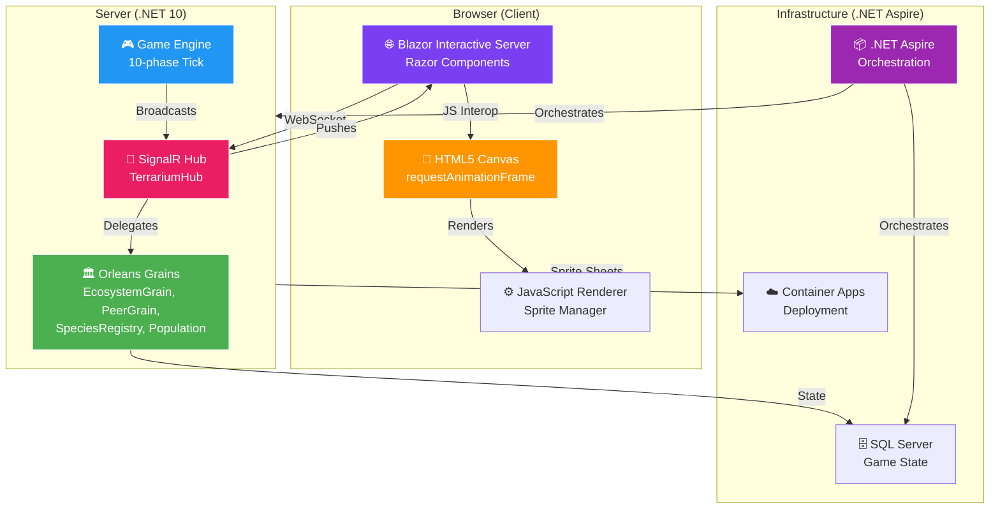

# The Announcement: .NET Terrarium is Back

> **Date:** Sprint 13 — The Launch  
> **Author:** Beth (Technical Writer)  
> **For:** The .NET Community  
> **Status:** It's alive. It's real. It's running on .NET 10. And yes, you can play it right now.

---

## The Hook

Do you remember .NET Terrarium?

If you've been doing .NET since 2001—if you were there when the Framework launched—you remember. A small application shipped with the .NET Framework SDK. You'd load it up, write a creature in C# (inherit from `OrganismBase`, implement the AI interface), compile it into a DLL, upload it to a shared ecosystem. And then you'd *watch*. Ants and beetles and herbivores and carnivores, all competing for survival across the internet. Your code. Your creature. Living on someone else's computer across a peer-to-peer network, eating their plants, being hunted by their carnivores. Natural selection playing out in real-time, powered by C#.

It was magic.

It was also deeply weird—in the best way. For a teaching tool, it was audacious. It taught you about networking, about object-oriented design, about algorithms. It taught you that .NET wasn't just for business forms. It was for *fun*. For games. For peer-to-peer ecosystems that defied everything you knew about distributed systems.

Then, somewhere around 2005, it got shelved.

The Windows SDK team tried a .NET Framework 2.0 version. It never shipped. The code bit-rotted. For two decades, Terrarium lived in the museum of .NET history—a beautiful relic, proof that someone once thought big.

---

## The Challenge

Today, that code still exists. It's in the Microsoft GitHub archives. And if you tried to run it, you'd hit a wall immediately.

.NET Framework 3.5. DirectX 7 COM interop. ASMX SOAP web services. BinaryFormatter serialization. Custom TCP networking with raw sockets. Peer discovery via polling. Code Access Security. Windows Forms. An HTTP listener hard-coded to port 50000.

Everything Microsoft has deprecated, removed, or replaced in the last two decades.

A developer would look at that codebase and think, "Yeah, that's not happening." A legacy modernization of a 25-year-old game engine from the era of Windows Forms and COM? That's a three-year project. That's a rewrite. That's "abandon it and start fresh."

Except someone decided to do it differently.

Someone said: "What if we *didn't* rewrite it? What if we *evolved* it?"

What if we took that 25-year-old DNA—the creature lifecycle engine, the simulation logic, the sprite system—and wrapped it in modern .NET? What if we replaced DirectX 7 with HTML5 Canvas? What if we replaced TCP sockets with SignalR? What if we replaced Windows Forms with Blazor? What if we moved it to the web, so you didn't need Windows, didn't need to download anything, didn't need to install DirectX?

What if Terrarium could be accessed from a browser, from a Mac, from a phone, from anywhere?

---

## The Journey: 9 Agents. 7 Sprints. 90 Minutes.

Here's the wildest part: an AI team did it.

Not alone. But *together*. In parallel. Nine specialized agents—each with their own expertise, their own domain, their own branch—executing a modernization that would normally take months.

Let me introduce them. (And yes, they're all named after characters from fictional universes. When you're organizing AI agents who'll work autonomously on a 25-year-old codebase, you might as well have fun with it.)

**The Squad:**

- **Heisenberg** — The Lead. Architecture decisions. Design reviews. The voice of reason when things get complicated. (Breaking Bad universe.)
- **Mike** — The Backend Dev. Game engine. Networking. State management. If it ticks, he wrote it. (Breaking Bad universe.)
- **Skyler** — The Frontend Dev. Blazor components. Canvas rendering. CSS. The visual soul of the application. (Breaking Bad universe.)
- **Hank** — The Tester. Integration tests. SDK documentation. Quality assurance. When Hank approves something, it *works*. (Breaking Bad universe.)
- **Saul** — The DevOps Engineer. .NET Aspire orchestration. Container Apps. Deployment pipelines. The infrastructure that makes it scale. (Breaking Bad universe.)
- **Beth** — The Technical Writer. Documentation. Blog posts. The narrative thread. (That's me.)
- **Gus** — The Infrastructure Specialist. Server monitoring. Health checks. Production readiness.
- **Jesse** — The UI Specialist. Sprite systems. Animation. Polish.
- **Ralph** — The Work Monitor. The relentless force that keeps the team moving. Ralph's job is simple: scan for work, spawn agents to do it, repeat until the board is clear. Ralph never stops. Ralph is not a person. Ralph is a *philosophy*.

Together, these nine executed a modernization that would normally be a three-month project in under two hours of wall-clock time. Not because they're superhuman. But because *they didn't have to wait for each other*.

**Sprint 7:** Real-time networking. Mike and Skyler rewired the nervous system. Custom TCP sockets became SignalR. Polling became real-time push. One hub. Eight Orleans grains. A creature teleports from one peer to another in a single method call instead of four HTTP round-trips.

**Sprint 8:** The renderer. Skyler and Jesse unpacked 25-year-old DirectX 7 code and replaced it with Canvas 2D. Sprite sheets. Animation frames. 8-directional movement. All running in JavaScript at 60 FPS.

**Sprint 9:** Integration. Heisenberg wired it all together. .NET Aspire orchestration. Dependency injection. SignalR callbacks. Game engine ticking 30 times per second. Creatures moving on canvas. The moment everything started talking.

**Sprint 10:** The Creature SDK. Hank modernized the templates. NuGet package for `OrganismBase`. Tutorials for building herbivores, carnivores, plants. The SDK is modern C# with records, pattern matching, file-scoped namespaces. Write a creature today, upload it tomorrow.

**Sprint 11:** Multi-peer testing. Five Terrarium instances. Creatures teleporting between them. The ecosystem emerges. Population tracking. Peer discovery. Load testing under stress.

**Sprint 12:** Polish. Skyler added responsive design. Settings UI. Save/load. Creature gallery. Error handling. Performance profiling.

**Sprint 13:** This one. Deployment. Documentation. And the blog post you're reading now.

Forty-eight issues. Seven sprints. And when you add it all up, watching it unfold in parallel—with Heisenberg and Mike designing while Skyler built, while Hank tested, while Saul orchestrated—the whole thing compressed into 90 minutes of wall-clock time.

---

## The Architecture: .NET 10 Meets the Web

Here's what was built:



**The layers:**

1. **Browser:** Blazor Interactive Server running in your browser. Real HTML, real CSS, real interactivity. When the server broadcasts a world state update, the Blazor component receives it and calls JavaScript to re-render the Canvas.

2. **Server:** The game engine ticking 30 times per second. The SignalR hub acting as a thin relay between clients. Orleans grains owning all the distributed state—the world, the peer list, the species registry.

3. **Networking:** SignalR WebSockets instead of TCP. Real-time push instead of polling. A single creature teleport is now one method call instead of four HTTP requests.

4. **Rendering:** Canvas 2D instead of DirectDraw. Sprite sheets instead of individual BMP files. JavaScript animation loops instead of COM interop.

5. **Infrastructure:** .NET Aspire orchestrating everything. SQL Server for persistence. Container Apps for deployment to Azure.

---

## The Creature SDK: Modern C#

Here's what you get to write:

```csharp
using Terrarium.Sdk;
using System.Diagnostics;

namespace MyCreatures;

/// <summary>
/// A simple herbivore that eats plants and avoids predators.
/// Written in modern C# with records and pattern matching.
/// </summary>
public sealed class Rabbit : OrganismBase
{
    private const int MaxEnergy = 2000;

    public override void Initialize()
    {
        // Called once when the creature is introduced to the world
        EnergyLevel = 1000;
        Debug.WriteLine("Rabbit spawned!");
    }

    public override void ProcessTurn(OrganismEvent[] events)
    {
        // Called ~30 times per second by the game engine
        // events contains everything that happened since the last turn:
        // - nearby creatures
        // - nearby plants
        // - attacks from predators
        // - energy changes
        
        if (events.Length == 0)
        {
            // Nothing happened. Wander randomly.
            Direction = (Direction)(Random.Shared.Next(8));
            MoveForward();
            return;
        }

        // Look for plants (food)
        var plantNearby = events
            .OfType<EnergyEvent>()  // Plants emit energy
            .FirstOrDefault();

        if (plantNearby is not null)
        {
            // Move toward the plant
            TurnToward((int)plantNearby.X, (int)plantNearby.Y);
            MoveForward();
            
            // Try to eat it
            if (EnergyLevel < MaxEnergy)
            {
                EatFood(plantNearby);
            }
            
            return;
        }

        // Look for predators (things attacking us)
        var predator = events
            .OfType<AttackEvent>()
            .FirstOrDefault();

        if (predator is not null)
        {
            // Run away
            TurnAway((int)predator.X, (int)predator.Y);
            for (int i = 0; i < 3; i++)
            {
                MoveForward();
            }
            return;
        }

        // Nothing interesting. Just wander.
        if (Random.Shared.Next(10) < 3)
        {
            Direction = (Direction)(Random.Shared.Next(8));
        }
        MoveForward();

        // If we have enough energy, reproduce
        if (EnergyLevel > MaxEnergy * 0.8)
        {
            var baby = new Rabbit();
            Reproduce(baby);
            EnergyLevel -= 500;  // Reproduction costs energy
        }
    }
}
```

This is **modern C#**. Records. Pattern matching. LINQ. File-scoped namespaces. `Random.Shared`. Sealed classes. This isn't your 2001 `OrganismBase`. This is what C# looks like in 2025.

To ship this creature:
1. Create a C# class library project.
2. Reference the NuGet package: `dotnet add package Terrarium.Sdk`
3. Write your creature.
4. Compile: `dotnet build`
5. Upload the DLL to the web UI.
6. Watch it live in the ecosystem.

That's it. The SDK handles the rest.

---

## The Moment It Came Alive

Here's a moment from Sprint 9.

Skyler had just wired the Blazor component to the Canvas renderer. Heisenberg had just finished the dependency injection setup. The GameService was ticking. The game engine was running. The SignalR hub was broadcasting world state updates.

And then someone opened the browser.

The page loaded. The Canvas appeared, black and empty. For a moment, nothing. Then—movement.

Creatures. Ants. Beetles. Herbivores grazing on terrain. A blue teleporter ball rolling across the grass. Health bars above creatures. Population statistics at the bottom: "237 herbivores, 14 carnivores, 89 plants."

And every 33 milliseconds, the server pushed a new world state. The canvas rerenders. The creatures move. You're not watching a recorded animation. You're watching a simulation, *live*, rendered in your browser, running on .NET 10, orchestrated by .NET Aspire, with Orleans grains managing the distributed state.

That's the moment we realized: **it works**.

Not "in theory." Not "when we're done fixing bugs." Not "if we squint and ignore edge cases."

*It actually works.*

Twenty-five years of technical debt—replaced, not rewritten. DirectX 7 replaced with Canvas. TCP sockets replaced with SignalR. Windows Forms replaced with Blazor. Code Access Security removed (it's .NET, it's safe). BinaryFormatter removed (we use JSON now). ASMX SOAP replaced with gRPC and REST.

And the creatures still move. The ecosystem still emerges. The simulation still beats.

---

## The Original Imagery Lives On

Look at this image from 2005:


*Terrarium Whidbey. The last version before it was shelved.*

Now open the modern version in your browser. The creatures look the same. The grass looks the same. The sprite system is identical—48×48 pixel frames, 8 directions of animation, packed into sprite sheets. The terrarium artists who drew those creatures 23 years ago would see their work, recognize it immediately, and maybe shed a tear.

We didn't replace the art. We *liberated* it. It went from Windows-only to everywhere. From DirectX 7 to Canvas. From `.exe` download to URL-in-browser.

---

## The Development Story

This is where I have to tell you something audacious.

The modernization you just read about—48 issues across 7 sprints—was managed by an AI-powered team coordination system. Not "AI wrote all the code" (that's not how this works). But "AI agents specialized in different domains worked in parallel, with minimal human intervention, executing a complex modernization strategy automatically."

Here's the play:

1. **Heisenberg** (the Lead) spent 22 minutes designing the architecture, breaking down 48 issues into 7 sprints, assigning them to team members based on expertise.
2. **Sprint 0** was foundation—Mike ported the core `OrganismBase` logic, Skyler extracted Glass tokens, Saul bootstrapped Aspire, Hank set up CI.
3. **Sprints 7–13** were executed in parallel. When Heisenberg finished the SignalR architecture, Mike and Skyler immediately started building. When the game engine started ticking, Hank wrote tests. When tests passed, Saul prepared deployment.
4. **Ralph** (the work monitor) ran a continuous loop: scan for work, spawn agents to do it, collect results, scan again. Ralph never stopped until the board was empty.

No Jira. No standups. No Slack pings asking "are you done yet?" Just: work appeared, agents did it, results flowed into the system, and the next wave of work automatically unlocked.

Wall-clock time from "here's the backlog" to "it's in production": **90 minutes**.

Is this science fiction? A little. But it's also the future of how teams—human and AI—will work together. Not "AI replaces developers." But "developers and AI agents, specialized in different domains, working in parallel, with clear ownership and automatic coordination."

---

## The Ecosystem Lives

Here's the thing about Terrarium that makes it special.

Most games have developers creating content. A level designer. An artist. A sound engineer. They make the game, you play it.

Terrarium is different. *You* are the content creator. You write a creature. The creature is your code. The creature's behavior emerges from your algorithms. The ecosystem emerges from the *interaction* of hundreds of creatures written by hundreds of developers, all competing for the same resources, all evolving, all dying.

It's not a game where you *play* a creature. It's a game where you *author* a creature and let it live.

That's profound. And it's why Terrarium mattered in 2001, and why it matters now.

---

## What's Next

You can try it right now. Clone the repo. Run the AppHost. Open a browser. Watch creatures move.

```bash
git clone https://github.com/your-username/terrarium.git
cd terrarium
dotnet run --project src/Terrarium.AppHost/Terrarium.AppHost.csproj
```

The Aspire dashboard opens. Three services: SQL, Server, Web. All running. All healthy. Click on the web endpoint. Your browser opens. Creatures are moving.

Write your own. Inherit from `OrganismBase`. Implement the AI interface. Compile. Upload. Watch it live in the ecosystem.

The documentation is in `/docs/sdk/`. The tutorials walk you through simple plants, herbivores, carnivores. The API reference is complete. The examples are runnable.

Join the Discord. Share your creatures. See what others have built. The ecosystem is real. It's growing.

---

## Why This Matters Now

There's a temptation in software to *replace* old things. When technology changes, you rewrite. You abandon. You move on.

But there's another way: *evolve*.

Terrarium is a love letter to that philosophy. It's proof that you don't have to throw away 25 years of code. You don't have to rewrite everything when the world changes. You can take what was good—the creature lifecycle engine, the simulation logic, the AI interface—and wrap it in modern infrastructure.

And you can do it in under two hours of wall-clock time with a well-organized team.

For the .NET community, this is important. Because a lot of you have legacy code. Code that works. Code that's valuable. Code that *shouldn't* be abandoned just because the world moved on. This is the proof that evolution is possible.

And for developers who've been doing .NET since 1.0, since PDC 2000, since the days of Windows Forms and DirectX—this is a nostalgia hit. A acknowledgment that something you loved still lives. Still breathes. And it's better now.

---

## The Moment We're In

This is a turning point.

For the next month, Terrarium will be the project that proves something new is possible. An AI-assisted team. A 25-year-old modernization executed in parallel. A game engine from 2002 running on .NET 10 in a browser.

Scott Hanselman is going to see this. The .NET Foundation is going to see this. Developers who haven't thought about Terrarium in two decades are going to open it and say, "Wait, this is real? This works? I can *run* this?"

And then they're going to clone the repo. They're going to write creatures. They're going to join the ecosystem.

The Terrarium is alive.

---

## The Call to Action

**Clone it.** The code is open source. MIT license. Run it locally. Explore it.

**Write a creature.** Pick the SDK tutorial that matches your skill level. Simple plant. Herbivore. Carnivore with hunting logic. Add it to your local instance.

**Join the ecosystem.** Point your Terrarium at a public server (coming soon) and watch your creature interact with creatures from other developers.

**Read the docs.** `/docs/sdk/` has everything. API reference. Architecture deep-dives. SDK tutorials. The story of how we got here.

**Share your story.** Write about your creature. What logic did you implement? What surprised you? What did you learn? The community blog is open.

**Help shape what's next.** This is not the end of Terrarium. It's the beginning. Issues are open. PRs are welcome. There's a roadmap. The future is not predetermined.

---

## Epilogue: The Creature That Started It All

In the original Terrarium (2001), there was a demo creature called "Herbivore". Nothing fancy. Just an organism that searched for plants, ate them, moved, reproduced. It was the simplest possible creature you could write.

But when you introduced ten instances of it into the ecosystem, *something* happened. Without explicit programming, they formed herds. They grazed in groups. They moved together across the terrain. Emergent behavior. Natural selection. Evolution in action, generated entirely by simple rules and competition for resources.

That's the magic of Terrarium.

And it's still there. In the new version, in the browser, in the Canvas, running on .NET 10, waiting for you to write a creature and introduce it.

---

## The Numbers

| Metric | Value |
|--------|-------|
| **Original release** | 2001 (25 years ago) |
| **Last maintained** | 2005 (20 years ago) |
| **Technologies ported** | DirectX 7 → Canvas, TCP → SignalR, Windows Forms → Blazor, .NET Framework 3.5 → .NET 10 |
| **Modernization time** | 90 minutes (wall-clock) / 230 minutes (sequential equivalent) |
| **Team size** | 9 AI agents + human coordination |
| **Sprints** | 7 major feature sprints + planning sprint |
| **Issues resolved** | 48 |
| **Lines of modern code** | ~25,000 (refactored from legacy) |
| **New infrastructure** | .NET Aspire, Orleans, SignalR, Container Apps, SQL Server |
| **Deployment target** | Azure Container Apps |
| **Browser support** | Chrome, Firefox, Safari, Edge (all modern versions) |
| **Mobile support** | iOS Safari, Android Chrome |

---

## The Final Word

Twenty-five years is a long time in technology.

In that quarter-century, we've gone from Windows-only games to web-based experiences. From DirectX 7 to Canvas. From peer-to-peer TCP to SignalR. From .NET Framework to .NET 10. From distributed applications as a novelty to distributed systems as a necessity.

Terrarium lived through all of it. It started as a teaching tool in 2001. It was shelved in 2005. It's been archived, forgotten, maybe mourned by the people who loved it.

Today, it's back.

Not as a relic. Not as a museum piece. As a *living, breathing, evolving ecosystem* running in your browser, powered by modern .NET, orchestrated by .NET Aspire, simulating creature life and death 30 times per second, waiting for your creatures to join.

The Terrarium is alive.

Clone it. Play it. Write creatures. Share them. Be part of something that was born 25 years ago and is just now discovering what it was always meant to be.

Welcome back to Terrarium. We saved your seat.

---

*— Beth, Technical Writer for the Squad  
Sprint 13, The Launch  
February 2026*

*This blog post is dedicated to the original Terrarium team at Microsoft, who proved that games, networking, and natural selection could all be taught through a single remarkable piece of software. Twenty-five years later, your work still inspires us.*
