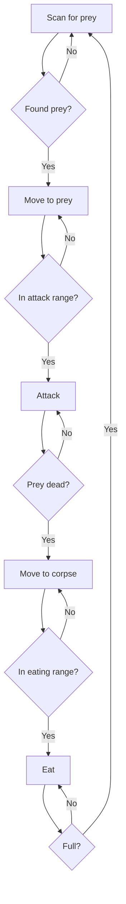

# Tutorial 3: Creating a Carnivore

> **New to Terrarium?** Start with the [Getting Started Guide](../getting-started.md) for a 10-minute quickstart!

Carnivores are predatory animals that hunt, kill, and eat other animals. They're the most complex organisms in Terrarium, requiring careful coordination of scanning, targeting, attacking, and eating behaviors.

## Overview

Carnivores must:
- Hunt other animals (not their own species)
- Attack and kill prey before eating
- Manage the attack → kill → eat cycle
- Balance aggression with energy management
- Reproduce to sustain their population

## Complete Carnivore Example

```csharp
using System;
using System.Collections;
using System.Drawing;
using System.IO;
using OrganismBase;

[assembly: OrganismClass("MyCreatures.RedScorpion.RedScorpion")]
[assembly: AuthorInformation("Your Name", "your.email@example.com")]

namespace MyCreatures.RedScorpion;

/// <summary>
/// An aggressive carnivore that hunts, kills, and eats other animals.
/// Strategy: High attack damage + speed for pursuit and takedown.
/// </summary>
[Carnivore(true)]                     // Carnivore
[MatureSize(30)]
[AnimalSkin(AnimalSkinFamily.Scorpion)]
[MarkingColor(KnownColor.Red)]
// 100 points distributed for hunting
[MaximumEnergyPoints(0)]
[EatingSpeedPoints(0)]
[AttackDamagePoints(52)]              // High damage
[DefendDamagePoints(0)]
[MaximumSpeedPoints(28)]              // Fast pursuit
[CamouflagePoints(0)]
[EyesightPoints(20)]                  // Moderate vision
public class RedScorpion : Animal
{
    private AnimalState? targetAnimal;

    protected override void Initialize()
    {
        Load += LoadEvent;
        Idle += IdleEvent;
    }

    private void LoadEvent(object sender, LoadEventArgs e)
    {
        try
        {
            // Verify target still exists
            if (targetAnimal != null)
            {
                targetAnimal = (AnimalState?)LookFor(targetAnimal);
            }
        }
        catch (Exception exc)
        {
            WriteTrace(exc.ToString());
        }
    }

    private void IdleEvent(object sender, IdleEventArgs e)
    {
        try
        {
            // Priority 1: Reproduce when possible
            if (CanReproduce)
                BeginReproduction(null);

            // Priority 2: Let current actions complete
            if (IsAttacking || IsMoving || IsEating)
                return;

            // Priority 3: Find new target if needed
            if (targetAnimal == null)
                FindNewTarget();

            if (targetAnimal != null)
            {
                if (targetAnimal.IsAlive)
                {
                    // Attack living prey
                    if (WithinAttackingRange(targetAnimal))
                    {
                        BeginAttacking(targetAnimal);
                    }
                    else
                    {
                        MoveToTarget();
                    }
                }
                else
                {
                    // Eat dead prey
                    if (WithinEatingRange(targetAnimal))
                    {
                        if (CanEat)
                            BeginEating(targetAnimal);
                    }
                    else
                    {
                        MoveToTarget();
                    }
                }
            }
            else
            {
                // No target - conserve energy
                StopMoving();
            }
        }
        catch (Exception exc)
        {
            WriteTrace(exc.ToString());
        }
    }

    private void FindNewTarget()
    {
        try
        {
            ArrayList foundOrganisms = Scan();

            foreach (OrganismState organismState in foundOrganisms)
            {
                // Only target animals of different species
                if (organismState is AnimalState animal && !IsMySpecies(organismState))
                {
                    targetAnimal = animal;
                    return;
                }
            }
        }
        catch (Exception exc)
        {
            WriteTrace(exc.ToString());
        }
    }

    private void MoveToTarget()
    {
        try
        {
            if (targetAnimal == null)
                return;

            BeginMoving(new MovementVector(targetAnimal.Position, Species.MaximumSpeed));
        }
        catch (Exception exc)
        {
            WriteTrace(exc.ToString());
        }
    }

    public override void SerializeAnimal(MemoryStream m) { }
    public override void DeserializeAnimal(MemoryStream m) { }
}
```

## Carnivore-Specific Attributes

### The Carnivore Flag

```csharp
[Carnivore(true)]  // This is a carnivore
```

Setting `[Carnivore(true)]` changes everything:
- **Lifespan**: 2x longer than herbivores of the same size
- **Diet**: Can only eat dead animals (not plants)
- **Attack**: Always allowed to attack other animals
- **Defense multiplier**: 2x for attack and defense calculations

### Characteristic Strategy for Carnivores

Carnivores need **attack damage and speed** to be effective hunters:

**Balanced Hunter** (like our example):
```csharp
[AttackDamagePoints(52)]   // High damage to kill quickly
[MaximumSpeedPoints(28)]   // Fast enough to catch prey
[EyesightPoints(20)]       // Find prey from distance
```

**Ambush Predator**:
```csharp
[AttackDamagePoints(60)]   // Maximum damage
[CamouflagePoints(30)]     // Hide and wait
[EyesightPoints(10)]       // Minimal vision
```

**Pack Hunter** (needs coordination):
```csharp
[AttackDamagePoints(35)]   // Moderate damage
[MaximumSpeedPoints(40)]   // Very fast
[DefendDamagePoints(15)]   // Some defense
[EyesightPoints(10)]       // Minimal vision
```

**Tank**:
```csharp
[AttackDamagePoints(40)]   // Good damage
[DefendDamagePoints(40)]   // High defense
[MaximumEnergyPoints(20)]  // Energy reserves
```

## The Hunt Cycle

Carnivores follow a specific sequence:



## Attacking

### Checking Attack Range

```csharp
bool inRange = WithinAttackingRange(targetAnimal);
```

Attack range is **slightly larger** than eating range (1 unit radius).

### Starting an Attack

```csharp
if (WithinAttackingRange(targetAnimal))
{
    BeginAttacking(targetAnimal);
}
```

**Requirements**:
- Target must be an `AnimalState`
- Target must be within range
- You must be able to attack (see `CanAttack()`)

### CanAttack() Rules

```csharp
bool canAttack = CanAttack(targetAnimal);
```

For **carnivores**: Always returns `true` (you can always attack)

For **herbivores**: Only returns `true` if:
- You were previously attacked by that animal, OR
- Your energy state is Hungry or worse (self-defense)

### Attack Damage

Damage per attack is calculated from:
- Your `AttackDamagePoints`
- Your mature size
- The `CarnivoreAttackDefendMultiplier` (2x for carnivores)

```csharp
// Base damage formula (simplified):
int damage = (baseInflictedDamage + (AttackDamagePoints * multiplier)) * (Radius / matureSize);
```

### Tracking Attack Status

```csharp
bool attacking = IsAttacking;  // Currently attacking?
```

## Eating Dead Animals

### Eating Rules for Carnivores

Carnivores can **only** eat dead animals:

```csharp
if (!targetAnimal.IsAlive && CanEat && WithinEatingRange(targetAnimal))
{
    BeginEating(targetAnimal);
}
```

**Restrictions**:
- Cannot eat living animals (must kill first)
- Cannot eat plants
- Cannot eat their own species (checked via `IsMySpecies()`)
- Must be hungry (`CanEat` = true)
- Must be within eating range

### Corpse Management

Dead animals remain in the world for a limited time:

```csharp
int rotTicks = targetAnimal.RotTicks;
```

After `EngineSettings.TimeToRot` ticks (60), corpses disappear. Plan accordingly!

## Target Management

### Finding Valid Targets

```csharp
private void FindNewTarget()
{
    ArrayList foundOrganisms = Scan();

    foreach (OrganismState organism in foundOrganisms)
    {
        if (organism is AnimalState animal && !IsMySpecies(organism))
        {
            targetAnimal = animal;
            return;  // Take first valid target
        }
    }
}
```

### IsMySpecies Check

```csharp
bool sameSpecies = IsMySpecies(organismState);
```

**Never attack your own species!** This check is critical:
- Returns `true` if the organism is the same species
- Prevents fratricide
- Required for sustainable populations

### Refreshing Target State

```csharp
// In LoadEvent:
if (targetAnimal != null)
{
    targetAnimal = (AnimalState?)LookFor(targetAnimal);
    
    // targetAnimal is now null if:
    // - It died and rotted away
    // - It moved out of range
    // - It's hidden by camouflage
}
```

## Advanced Targeting Strategies

### Prioritize Weakest Prey

```csharp
private void FindNewTarget()
{
    ArrayList foundOrganisms = Scan();
    AnimalState? weakestPrey = null;
    double lowestHealth = 1.0;

    foreach (OrganismState organism in foundOrganisms)
    {
        if (organism is AnimalState animal && 
            !IsMySpecies(organism) && 
            animal.IsAlive)
        {
            double health = 1.0 - animal.PercentInjured;
            if (health < lowestHealth)
            {
                lowestHealth = health;
                weakestPrey = animal;
            }
        }
    }

    targetAnimal = weakestPrey;
}
```

### Prioritize Closest Prey

```csharp
private void FindNewTarget()
{
    ArrayList foundOrganisms = Scan();
    AnimalState? closestPrey = null;
    double shortestDistance = double.MaxValue;

    foreach (OrganismState organism in foundOrganisms)
    {
        if (organism is AnimalState animal && 
            !IsMySpecies(organism) && 
            animal.IsAlive)
        {
            double distance = DistanceTo(animal);
            if (distance < shortestDistance)
            {
                shortestDistance = distance;
                closestPrey = animal;
            }
        }
    }

    targetAnimal = closestPrey;
}
```

### Avoid Strong Prey

```csharp
private void FindNewTarget()
{
    ArrayList foundOrganisms = Scan();

    foreach (OrganismState organism in foundOrganisms)
    {
        if (organism is AnimalState animal && 
            !IsMySpecies(organism) && 
            animal.IsAlive)
        {
            // Only attack if they're smaller or weaker
            if (animal.Radius <= State.Radius)
            {
                targetAnimal = animal;
                return;
            }
        }
    }
}
```

## Carnivore Event Patterns

### Attack Completed Event

```csharp
protected override void Initialize()
{
    Load += LoadEvent;
    Idle += IdleEvent;
    AttackCompleted += AttackCompletedEvent;
}

private void AttackCompletedEvent(object sender, AttackCompletedEventArgs e)
{
    // Attack just finished
    // Check if prey is dead
    if (targetAnimal != null && !targetAnimal.IsAlive)
    {
        WriteTrace("Kill confirmed!");
    }
}
```

### Eat Completed Event

```csharp
private void EatCompletedEvent(object sender, EatCompletedEventArgs e)
{
    // Finished eating
    // Look for next target
    targetAnimal = null;
}
```

### Attacked Event

```csharp
private void AttackedEvent(object sender, AttackedEventArgs e)
{
    // You were attacked!
    AnimalState attacker = e.Attacker;
    
    // Strategy: Fight back or flee?
    if (State.Radius > attacker.Radius)
    {
        // Bigger - fight back
        if (CanAttack(attacker))
        {
            targetAnimal = attacker;
        }
    }
    else
    {
        // Smaller - run away
        StopMoving();
        // Calculate escape vector (opposite direction from attacker)
        // ...
    }
}
```

## Common Carnivore Mistakes

### Trying to Eat Living Prey

```csharp
// ❌ Wrong - cannot eat living animals
if (WithinEatingRange(targetAnimal))
{
    BeginEating(targetAnimal);  // Throws exception if alive!
}

// ✅ Correct - check if dead first
if (!targetAnimal.IsAlive && WithinEatingRange(targetAnimal))
{
    BeginEating(targetAnimal);
}
```

### Attacking Your Own Species

```csharp
// ❌ Wrong - causes population collapse
private void FindNewTarget()
{
    ArrayList foundOrganisms = Scan();
    foreach (OrganismState organism in foundOrganisms)
    {
        if (organism is AnimalState animal)
        {
            targetAnimal = animal;  // Might be same species!
            return;
        }
    }
}

// ✅ Correct - check species
private void FindNewTarget()
{
    ArrayList foundOrganisms = Scan();
    foreach (OrganismState organism in foundOrganisms)
    {
        if (organism is AnimalState animal && !IsMySpecies(organism))
        {
            targetAnimal = animal;
            return;
        }
    }
}
```

### Not Handling Dead Targets

```csharp
// ❌ Wrong - attacks corpses
private void IdleEvent(object sender, IdleEventArgs e)
{
    if (targetAnimal != null && WithinAttackingRange(targetAnimal))
    {
        BeginAttacking(targetAnimal);  // Wastes energy on corpses!
    }
}

// ✅ Correct - check if alive
private void IdleEvent(object sender, IdleEventArgs e)
{
    if (targetAnimal != null)
    {
        if (targetAnimal.IsAlive && WithinAttackingRange(targetAnimal))
        {
            BeginAttacking(targetAnimal);
        }
        else if (!targetAnimal.IsAlive && WithinEatingRange(targetAnimal))
        {
            BeginEating(targetAnimal);
        }
    }
}
```

### Ignoring Action State

```csharp
// ❌ Wrong - interrupts actions
private void IdleEvent(object sender, IdleEventArgs e)
{
    if (targetAnimal != null)
    {
        BeginMoving(new MovementVector(targetAnimal.Position, 2));
    }
}

// ✅ Correct - check action state
private void IdleEvent(object sender, IdleEventArgs e)
{
    // Let current actions complete
    if (IsAttacking || IsMoving || IsEating)
        return;

    if (targetAnimal != null)
    {
        BeginMoving(new MovementVector(targetAnimal.Position, 2));
    }
}
```

## Balancing Your Carnivore

### Energy Economics

Carnivores face unique challenges:
- Hunting costs energy (movement + attacks)
- Prey must be killed before eating
- Corpses rot after 60 ticks
- Failed hunts waste significant energy

**Strategies**:
1. **Efficient killing**: High attack damage ends hunts quickly
2. **Target selection**: Prioritize weak or small prey
3. **Opportunistic eating**: Scavenge corpses from other predators
4. **Energy reserves**: Some `MaximumEnergyPoints` helps survive lean periods

### Population Balance

Too many carnivores = prey extinction = carnivore starvation

Monitor your population:
- 1 carnivore per 5-10 herbivores is typical
- If prey is scarce, reduce reproduction
- If prey is abundant, reproduce more

## Testing Your Carnivore

1. Build your project
2. Introduce plants first
3. Introduce herbivores (they need food to survive)
4. Wait for herbivore population to stabilize
5. Introduce **one** carnivore
6. Watch the food chain in action!

## Strategy Variations

### Patient Ambusher

```csharp
[Carnivore(true)]
[AttackDamagePoints(70)]   // One-hit kills
[CamouflagePoints(30)]     // Hide effectively
[MaximumSpeedPoints(0)]    // Doesn't chase

// Strategy: Hide and wait for prey to wander close
```

### Endurance Hunter

```csharp
[Carnivore(true)]
[AttackDamagePoints(30)]   // Moderate damage
[MaximumSpeedPoints(40)]   // Very fast
[MaximumEnergyPoints(30)]  // Long chases

// Strategy: Outlast prey through sustained pursuit
```

### Glass Cannon

```csharp
[Carnivore(true)]
[AttackDamagePoints(80)]   // Maximum damage
[MaximumSpeedPoints(20)]   // Some speed
[DefendDamagePoints(0)]    // No defense

// Strategy: Strike first, strike hard, avoid counterattacks
```

## Next Steps

Congratulations! You've completed the core creature tutorials. You now know how to create:
- ✅ Plants (producers)
- ✅ Herbivores (primary consumers)
- ✅ Carnivores (secondary consumers)

### Advanced Topics

- **State Serialization**: Preserve data between game saves
- **Antennas**: Communicate with other organisms
- **Defense**: Respond to attacks strategically
- **Genetic Algorithms**: Evolve better creatures over generations
- **Pack Behavior**: Coordinate with organisms of your species

## Reference

- [Animal Class API Documentation](../api/animal.md)
- [AnimalState API Documentation](../api/state.md#animalstate)
- [Attack and Defense Mechanics](../api/combat.md)
- [Energy and Metabolism](../api/energy.md)
